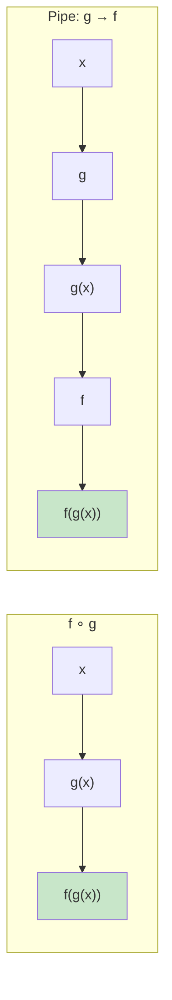

# Function Composition

Function composition is the process of combining two or more functions to produce a new function. In mathematics, composition is written as `(f ∘ g)(x) = f(g(x))`. In programming, it's the fundamental mechanism for building complex behavior from simple, focused functions.

## The Power of Composition

Small, pure functions are easy to write, test, and reason about. Composition lets you combine them into powerful pipelines.

```python
from typing import Callable, List, TypeVar, Any
from functools import reduce

A = TypeVar("A")
B = TypeVar("B")
C = TypeVar("C")

# Manual composition
def compose2(f: Callable[[B], C], g: Callable[[A], B]) -> Callable[[A], C]:
    """Compose two functions: (f ∘ g)(x) = f(g(x))"""
    def composed(x: A) -> C:
        return f(g(x))
    return composed

def add_one(x: int) -> int:
    return x + 1

def double(x: int) -> int:
    return x * 2

# Compose: add_one after double
add_one_after_double = compose2(add_one, double)
print(add_one_after_double(5))  # double(5) + 1 = 11

# Compose: double after add_one
double_after_add_one = compose2(double, add_one)
print(double_after_add_one(5))  # (5 + 1) * 2 = 12
```



## Building a Compose Utility

```python
from typing import Callable, Any
from functools import reduce

# Composes right-to-left: compose(f, g, h)(x) => f(g(h(x)))
def compose(*funcs: Callable) -> Callable:
    if not funcs:
        return lambda x: x
    if len(funcs) == 1:
        return funcs[0]

    def composed(x: Any) -> Any:
        result = x
        for func in reversed(funcs):
            result = func(result)
        return result

    return composed

# Pipes left-to-right: pipe(f, g, h)(x) => h(g(f(x)))
def pipe(*funcs: Callable) -> Callable:
    if not funcs:
        return lambda x: x
    if len(funcs) == 1:
        return funcs[0]

    def piped(x: Any) -> Any:
        result = x
        for func in funcs:
            result = func(result)
        return result

    return piped

# Using compose
def add_one(x: int) -> int:
    return x + 1

def double(x: int) -> int:
    return x * 2

def square(x: int) -> int:
    return x ** 2

# compose: square(double(add_one(x)))
composed = compose(square, double, add_one)
print(composed(3))  # square(double(add_one(3))) => square(double(4)) => square(8) => 64

# pipe: add_one(x) -> double -> square
piped = pipe(add_one, double, square)
print(piped(3))  # add_one(3)=4 -> double(4)=8 -> square(8)=64
```

> [!NOTE]
> `compose` applies functions right-to-left (mathematical convention), while `pipe` applies left-to-right (Unix pipeline convention). In Python, pipe is often more readable.

## Point-Free Style

**Point-free style** (also called tacit programming) defines functions without explicitly mentioning their arguments.

```python
from typing import Callable, List
from functools import partial

# POINTFUL: arguments are explicit
def double_all_pt(numbers: List[int]) -> List[int]:
    return list(map(lambda x: x * 2, numbers))

# POINT-FREE: no explicit arguments
double_all_pf = partial(list, map(lambda x: x * 2))

# More practical example:

# POINTFUL style
def get_adult_names_pt(users: List[dict]) -> List[str]:
    adults = filter(lambda u: u["age"] >= 18, users)
    names = map(lambda u: u["name"], adults)
    return list(names)

# POINT-FREE style
def is_adult(user: dict) -> bool:
    return user["age"] >= 18

def get_name(user: dict) -> str:
    return user["name"]

get_adult_names_pf = lambda users: list(map(get_name, filter(is_adult, users)))

users = [
    {"name": "Alice", "age": 25},
    {"name": "Bob", "age": 17},
    {"name": "Charlie", "age": 30},
]

print(get_adult_names_pt(users))  # ["Alice", "Charlie"]
print(get_adult_names_pf(users))  # ["Alice", "Charlie"]
```

> [!WARNING]
> Point-free style can harm readability when overused. Use it when the pipeline is clear and the named intermediate functions are reusable. Don't force point-free — it's a tool, not a rule.

## Real-World Data Pipelines

```python
from typing import List, Dict, Any, Callable
from functools import reduce
import json

# Sample data: log entries
log_entries = [
    {"timestamp": "2025-01-15T10:30:00", "level": "ERROR", "service": "auth", "message": "Connection refused"},
    {"timestamp": "2025-01-15T10:31:00", "level": "INFO", "service": "api", "message": "Request served"},
    {"timestamp": "2025-01-15T10:32:00", "level": "ERROR", "service": "db", "message": "Timeout exceeded"},
    {"timestamp": "2025-01-15T10:33:00", "level": "WARN", "service": "auth", "message": "Rate limit nearing"},
    {"timestamp": "2025-01-15T10:34:00", "level": "ERROR", "service": "auth", "message": "Authentication failed"},
]

# Individual transformation functions
def filter_by_level(level: str) -> Callable:
    def filter_fn(entries: List[Dict[str, Any]]) -> List[Dict[str, Any]]:
        return [e for e in entries if e["level"] == level]
    return filter_fn

def filter_by_service(service: str) -> Callable:
    def filter_fn(entries: List[Dict[str, Any]]) -> List[Dict[str, Any]]:
        return [e for e in entries if e["service"] == service]
    return filter_fn

def group_by(field: str) -> Callable:
    def group_fn(entries: List[Dict[str, Any]]) -> Dict[str, List[Dict[str, Any]]]:
        result: Dict[str, List[Dict[str, Any]]] = {}
        for e in entries:
            key = e[field]
            if key not in result:
                result[key] = []
            result[key].append(e)
        return result
    return group_fn

def count_values(field: str) -> Callable:
    def count_fn(entries: List[Dict[str, Any]]) -> Dict[str, int]:
        result: Dict[str, int] = {}
        for e in entries:
            key = e[field]
            result[key] = result.get(key, 0) + 1
        return result
    return count_fn

def sort_results(by: str, reverse: bool = False) -> Callable:
    def sort_fn(items: list) -> list:
        return sorted(items, key=lambda x: x[by] if isinstance(x, dict) else x, reverse=reverse)
    return sort_fn

# Compose a pipeline
def pipeline(*stages: Callable) -> Callable:
    def run(data: Any) -> Any:
        result = data
        for stage in stages:
            result = stage(result)
        return result
    return run

# Pipeline: filter errors → group by service → count per service
error_analysis = pipeline(
    filter_by_level("ERROR"),
    count_values("service"),
    sort_results(by="value", reverse=True),
)

print(error_analysis(log_entries))
# {'auth': 2, 'db': 1}

# Pipeline: filter auth service → group by level → count
auth_analysis = pipeline(
    filter_by_service("auth"),
    count_values("level"),
)

print(auth_analysis(log_entries))
# {'ERROR': 2, 'WARN': 1}
```



```mermaid
sequenceDiagram
    participant Data as Raw Logs
    participant Stage1 as Filter Level
    participant Stage2 as Filter Service
    participant Stage3 as Group By
    participant Stage4 as Count
    participant Output as Result

    Data->>Stage1: all entries
    Stage1->>Stage1: keep ERROR level
    Stage1->>Stage2: filtered entries
    Stage2->>Stage2: keep auth service
    Stage2->>Stage3: filtered entries
    Stage3->>Stage3: group by service
    Stage3->>Stage4: grouped dict
    Stage4->>Stage4: count per group
    Stage4->>Output: counter dict
    note over Stage1,Stage4: Each stage is a pure, testable function
```

## Composing with Decorators

```python
from typing import Callable, Any, List
from functools import wraps
import time

# Decorators are function composition!
def uppercase(func: Callable) -> Callable:
    @wraps(func)
    def wrapper(*args: Any, **kwargs: Any) -> str:
        result = func(*args, **kwargs)
        return result.upper() if isinstance(result, str) else result
    return wrapper

def exclaim(func: Callable) -> Callable:
    @wraps(func)
    def wrapper(*args: Any, **kwargs: Any) -> str:
        result = func(*args, **kwargs)
        return f"{result}!" if isinstance(result, str) else result
    return wrapper

# Compose decorators: exclaim ∘ uppercase
@exclaim
@uppercase
def greet(name: str) -> str:
    return f"Hello, {name}"

print(greet("Alice"))  # "HELLO, ALICE!"

# Timing composition
def timed(func: Callable) -> Callable:
    @wraps(func)
    def wrapper(*args: Any, **kwargs: Any) -> Any:
        start = time.perf_counter()
        result = func(*args, **kwargs)
        elapsed = time.perf_counter() - start
        print(f"{func.__name__} took {elapsed:.6f}s")
        return result
    return wrapper

def logged(func: Callable) -> Callable:
    @wraps(func)
    def wrapper(*args: Any, **kwargs: Any) -> Any:
        print(f"→ {func.__name__}({args!r}, {kwargs!r})")
        result = func(*args, **kwargs)
        print(f"← {result!r}")
        return result
    return wrapper

@timed
@logged
def slow_square(n: int) -> int:
    sum(i * i for i in range(100000))
    return n * n

slow_square(5)
```

## Composing Functions with Different Types

```python
from typing import Callable, List, Any, Optional
from functools import reduce

# Function that extracts a field
def pluck(field: str) -> Callable[[dict], Any]:
    def pluck_fn(item: dict) -> Any:
        return item[field]
    return pluck_fn

# Function that filters
def where(predicate: Callable[[Any], bool]) -> Callable[[List], List]:
    def where_fn(items: List) -> List:
        return list(filter(predicate, items))
    return where_fn

# Function that transforms each item
def each(transform: Callable[[Any], Any]) -> Callable[[List], List]:
    def each_fn(items: List) -> List:
        return list(map(transform, items))
    return each_fn

# Function that sorts
def order_by(key_fn: Callable, reverse: bool = False) -> Callable[[List], List]:
    def order_fn(items: List) -> List:
        return sorted(items, key=key_fn, reverse=reverse)
    return order_fn

# Function that takes the first N
def take(n: int) -> Callable[[List], List]:
    def take_fn(items: List) -> List:
        return items[:n]
    return take_fn

# Compose them together
def compose_pipeline(*stages: Callable) -> Callable[[Any], Any]:
    def pipeline(data: Any) -> Any:
        result = data
        for stage in stages:
            result = stage(result)
        return result
    return pipeline

data = [
    {"name": "Alice", "score": 85, "age": 25},
    {"name": "Bob", "score": 72, "age": 17},
    {"name": "Charlie", "score": 91, "age": 30},
    {"name": "Diana", "score": 95, "age": 22},
    {"name": "Eve", "score": 60, "age": 28},
]

# Pipeline: filter adults → sort by score descending → take top 3 → extract names
top_students = compose_pipeline(
    where(lambda u: u["age"] >= 18),
    order_by(pluck("score"), reverse=True),
    take(3),
    each(pluck("name")),
)

print(top_students(data))  # ["Diana", "Charlie", "Alice"]

# Equivalent imperative:
def top_students_imperative(users: List[dict]) -> List[str]:
    adults = [u for u in users if u["age"] >= 18]
    sorted_adults = sorted(adults, key=lambda u: u["score"], reverse=True)
    top_3 = sorted_adults[:3]
    return [u["name"] for u in top_3]
```

## The Compose Function with Reduce

```python
from typing import Callable, Any
from functools import reduce

# Elegant compose using reduce
def compose(*funcs: Callable) -> Callable:
    """Compose functions right-to-left using reduce."""
    return reduce(lambda f, g: lambda x: f(g(x)), funcs)

def pipe(*funcs: Callable) -> Callable:
    """Pipe functions left-to-right using reduce."""
    return reduce(lambda f, g: lambda x: g(f(x)), funcs)

# Math-style composition: (f ∘ g ∘ h)(x)
def add(x: int) -> int:
    return x + 2

def mul(x: int) -> int:
    return x * 3

def sub(x: int) -> int:
    return x - 1

# compose: sub(mul(add(x))) — right-to-left
f = compose(sub, mul, add)
print(f(5))  # (5 + 2) * 3 - 1 = 20

# pipe: add(x) → mul → sub — left-to-right
g = pipe(add, mul, sub)
print(g(5))  # (5 + 2) * 3 - 1 = 20

# Composition with identity
def identity(x: Any) -> Any:
    return x

# compose(f, identity) == f
h = compose(add, identity)
print(h(5))  # 7 — same as add(5)

# pipe(identity, f) == f
k = pipe(identity, add)
print(k(5))  # 7 — same as add(5)
```

## Chaining with Method Cascading

Some libraries provide chainable methods that compose naturally.

```python
from typing import List, Any

class Query:
    def __init__(self, data: List[dict]):
        self._data = data

    def where(self, predicate) -> "Query":
        return Query(list(filter(predicate, self._data)))

    def select(self, *fields: str) -> "Query":
        return Query([
            {k: v for k, v in item.items() if k in fields}
            for item in self._data
        ])

    def order_by(self, key: str, reverse: bool = False) -> "Query":
        return Query(
            sorted(self._data, key=lambda x: x[key], reverse=reverse)
        )

    def limit(self, n: int) -> "Query":
        return Query(self._data[:n])

    def execute(self) -> List[dict]:
        return self._data

data = [
    {"name": "Alice", "score": 85, "age": 25, "city": "NYC"},
    {"name": "Bob", "score": 72, "age": 17, "city": "LA"},
    {"name": "Charlie", "score": 91, "age": 30, "city": "NYC"},
    {"name": "Diana", "score": 95, "age": 22, "city": "SF"},
]

result = (
    Query(data)
    .where(lambda u: u["age"] >= 18)
    .order_by("score", reverse=True)
    .limit(2)
    .select("name", "score")
    .execute()
)
print(result)
# [{'name': 'Diana', 'score': 95}, {'name': 'Charlie', 'score': 91}]
```

## Error Handling in Composed Functions

```python
from typing import Callable, Any, Optional, Tuple
from functools import reduce

# Safe compose with error handling
class ComposeError(Exception):
    pass

def safe_compose(*funcs: Callable) -> Callable:
    def composed(x: Any) -> Any:
        result = x
        for func in reversed(funcs):
            try:
                result = func(result)
            except Exception as e:
                raise ComposeError(f"Error in {func.__name__}: {e}") from e
        return result
    return composed

# Maybe pattern for safe computation
def maybe(func: Callable) -> Callable:
    def wrapped(x: Optional[Any]) -> Optional[Any]:
        if x is None:
            return None
        try:
            return func(x)
        except Exception:
            return None
    return wrapped

safe_parse_int = maybe(int)
safe_sqrt = maybe(lambda x: x ** 0.5)
safe_format = maybe(lambda x: f"Result: {x:.2f}")

safe_calc = pipe(safe_parse_int, safe_sqrt, safe_format)

print(safe_calc("16"))      # "Result: 4.00"
print(safe_calc("hello"))   # None (parse error swallowed)
print(safe_calc("-4"))      # None (sqrt error swallowed)
```

## Composing Async Functions

```python
from typing import Callable, Any
from functools import reduce
import asyncio

async def fetch_user(user_id: int) -> dict:
    await asyncio.sleep(0.01)
    return {"id": user_id, "name": f"User {user_id}"}

async def enrich_profile(user: dict) -> dict:
    await asyncio.sleep(0.01)
    return {**user, "role": "member", "level": user["id"] % 3 + 1}

async def format_response(user: dict) -> str:
    await asyncio.sleep(0.01)
    return f"{user['name']} (Level {user['level']}, {user['role']})"

def compose_async(*funcs: Callable) -> Callable:
    async def composed(x: Any) -> Any:
        result = x
        for func in reversed(funcs):
            result = await func(result)
        return result
    return composed

async def main():
    pipeline = compose_async(format_response, enrich_profile, fetch_user)
    result = await pipeline(42)
    print(result)  # "User 42 (Level 1, member)"

asyncio.run(main())
```

## Comparison: Compose vs Pipe vs Chaining

| Aspect | Compose (R→L) | Pipe (L→R) | Method Chaining |
|--------|---------------|------------|-----------------|
| **Direction** | Right-to-left | Left-to-right | Left-to-right |
| **Syntax** | `compose(f, g)(x)` | `pipe(f, g)(x)` | `x.f().g()` |
| **Readability** | Math convention | Pipeline convention | OOP convention |
| **Error tracking** | Harder (reversed) | Easier (sequential) | Easy (per method) |
| **Pythonicity** | Less Pythonic | More Pythonic | Very Pythonic |
| **Function source** | Standalone functions | Standalone functions | Methods on object |

## Practice Exercises

1. Implement `compose` that accepts any number of functions and composes them right-to-left. Test it with `add_one`, `double`, and `square`.

2. Write a `pipe` function and create a pipeline that:
   - Takes a list of strings
   - Converts to lowercase
   - Removes duplicates (preserving order)
   - Sorts alphabetically
   - Joins with `", "`

3. Point-free style: Refactor the following to use point-free style with named helper functions:
   ```python
   result = sorted(
       map(lambda x: x.upper(),
           filter(lambda s: len(s) > 3, words)),
       reverse=True
   )
   ```

4. Create a `compose_with_logging` utility that logs each function call with its input and output. Use it to debug a multi-step pipeline.

5. Build a data pipeline for processing orders:
   - Load orders (list of dicts)
   - Filter paid orders
   - Apply shipping cost
   - Group by region
   - Calculate total per region
   - Sort by total descending

6. Implement a `safe_pipe` variant that catches exceptions at each stage and returns `(result, error_message)` tuples.

7. Use method chaining to build a `StringProcessor` class with methods `strip()`, `capitalize()`, `remove_punctuation()`, and `truncate(n)`, each returning a new instance.

8. Given multiple composing functions, explain what this produces:
   ```python
   f = lambda x: x + 2
   g = lambda x: x * 3
   h = pipe(f, g, f)
   print(h(5))
   ```

## Summary

- **Function composition** combines simple functions into complex pipelines
- **Compose** applies right-to-left (mathematical); **pipe** applies left-to-right (practical)
- **Point-free style** omits explicit arguments; use when it improves clarity
- **Decorators** are a form of function composition
- **Method chaining** provides fluent API composition
- **Error handling** in pipelines requires explicit strategies (Maybe, Result types)
- Each composed function should do one thing well — composition creates the complex behavior
- Composed pipelines are testable at every stage

> [!SUCCESS]
> Function composition is the superpower that turns small, focused functions into expressive, maintainable programs. Combined with immutability and pure functions, composition lets you build complex systems from simple, verified building blocks.
