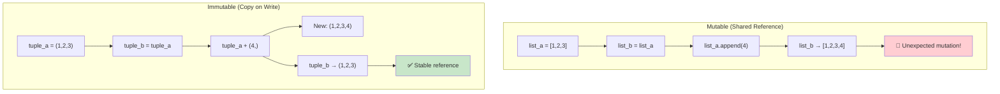
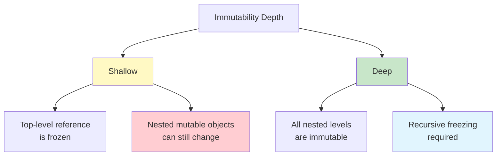

# Immutability in Practice

Immutability is a cornerstone of functional programming. When data cannot be changed, programs become easier to reason about, test, and parallelize. This lesson covers practical techniques for working with immutable data in Python.

## Why Immutability Matters

Mutable state is the source of countless bugs, especially in multi-threaded or complex systems. Immutability eliminates entire categories of errors.

```python
from typing import List, Dict, Any, Tuple
from copy import deepcopy
import threading
import time

# MUTABLE — race condition waiting to happen
class BankAccountMutable:
    def __init__(self, balance: float):
        self.balance = balance

    def withdraw(self, amount: float) -> None:
        if self.balance >= amount:
            # Thread switch here causes race condition!
            self.balance -= amount
            return True
        return False

# IMMUTABLE — thread safe by design
class BankAccountImmutable:
    def __init__(self, balance: float):
        self._balance = balance

    @property
    def balance(self) -> float:
        return self._balance

    def withdraw(self, amount: float) -> Tuple["BankAccountImmutable", bool]:
        if self._balance >= amount:
            return BankAccountImmutable(self._balance - amount), True
        return self, False

# Demonstrate alias bug with mutable data
def alias_bug_demo() -> None:
    original: List[int] = [1, 2, 3]
    alias = original         # Both reference the same list
    original.append(4)       # Oops — alias is also modified!
    print(alias)             # [1, 2, 3, 4] — unexpected!

    # With immutability, this can't happen
    original_tuple = (1, 2, 3)
    alias_tuple = original_tuple
    # original_tuple += (4,)  # Would create a NEW tuple
    print(alias_tuple)       # (1, 2, 3) — unchanged

alias_bug_demo()
```



## Python's Built-In Immutable Types

Python provides several immutable types out of the box.

```python
from typing import Tuple, FrozenSet

# tuple — immutable sequence
point = (3, 4)
# point[0] = 5  # TypeError!

# str — immutable text
name = "Alice"
# name[0] = "B"  # TypeError!
name_upper = name.upper()  # Returns new string
print(name)       # "Alice" — unchanged
print(name_upper) # "ALICE"

# int, float, bool — immutable by nature
x = 5
# x is a reference to an integer object
# 5 is immutable; x = 6 creates a new binding

# frozenset — immutable set
frozen = frozenset([1, 2, 3])
# frozen.add(4)  # AttributeError!

# bytes — immutable byte sequence
data = b"hello"
# data[0] = 104  # TypeError!

# Named tuple — immutable record
from collections import namedtuple

Point = namedtuple("Point", ["x", "y", "z"])
pt = Point(1, 2, 3)
print(pt.x)     # 1
print(pt.y)     # 2
# pt.x = 5      # AttributeError!

# Named tuple with defaults
from typing import NamedTuple

class Student(NamedTuple):
    name: str
    grade: float
    active: bool = True

s = Student("Alice", 85.5)
print(s.name)    # "Alice"
print(s.grade)   # 85.5
# s.grade = 90   # AttributeError!
```

> [!NOTE]
> NamedTuple and `@dataclass(frozen=True)` are the most practical ways to create immutable data structures in Python. They provide immutability, readability, and minimal boilerplate.

## Frozen Dataclasses

```python
from dataclasses import dataclass
from typing import List, Tuple

@dataclass(frozen=True)
class Product:
    id: int
    name: str
    price: float
    tags: Tuple[str, ...]

p = Product(1, "Laptop", 1200.0, ("electronics", "computers"))
# p.price = 1100.0  # FrozenInstanceError!
print(p)

# Copy with changes
from dataclasses import replace

p_discounted = replace(p, price=1100.0)
print(p_discounted.price)  # 1100.0
print(p.price)             # 1200.0 — original unchanged

@dataclass(frozen=True)
class Order:
    id: int
    customer: str
    items: Tuple[Product, ...]
    total: float

    def apply_discount(self, rate: float) -> "Order":
        new_total = self.total * (1 - rate)
        return replace(self, total=round(new_total, 2))

    def add_item(self, product: Product) -> "Order":
        new_items = self.items + (product,)
        new_total = self.total + product.price
        return replace(self, items=new_items, total=round(new_total, 2))

order = Order(
    id=1001,
    customer="Alice",
    items=(p,),
    total=1200.0,
)

discounted = order.apply_discount(0.1)
expanded = order.add_item(Product(2, "Mouse", 25.0, ("accessories",)))

print(f"Original: ${order.total}")         # $1200.0
print(f"Discounted: ${discounted.total}")  # $1080.0
print(f"Expanded: ${expanded.total}")      # $1225.0
```

## Avoiding Mutation in Practice

```python
from typing import List, Dict, Any, Set
from copy import deepcopy

# BAD: Mutating arguments
def add_score_bad(scores: List[int], new_score: int) -> None:
    scores.append(new_score)  # modifies the caller's list!

# GOOD: Return new collection
def add_score_good(scores: List[int], new_score: int) -> List[int]:
    return scores + [new_score]  # or list(scores) + [new_score]

original = [85, 90, 78]
# add_score_bad(original, 95)  # Would mutate!
result = add_score_good(original, 95)
print(original)  # [85, 90, 78] — unchanged
print(result)    # [85, 90, 78, 95]

# BAD: Removing from list while iterating
def remove_low_scores_bad(scores: List[int]) -> None:
    for s in scores:         # BUG: modifying during iteration
        if s < 60:
            scores.remove(s)

# GOOD: Create new list
def remove_low_scores_good(scores: List[int]) -> List[int]:
    return [s for s in scores if s >= 60]

# BAD: Mutating dictionary in place
def update_user_bad(user: Dict[str, Any], changes: Dict[str, Any]) -> None:
    user.update(changes)

# GOOD: Return new dictionary
def update_user_good(user: Dict[str, Any], changes: Dict[str, Any]) -> Dict[str, Any]:
    return {**user, **changes}

user = {"id": 1, "name": "Alice", "score": 85}
updated = update_user_good(user, {"score": 90, "level": "advanced"})
print(user)     # {"id": 1, "name": "Alice", "score": 85}
print(updated)  # {"id": 1, "name": "Alice", "score": 90, "level": "advanced"}
```

## Deep vs Shallow Immutability

```python
from typing import List, Dict, Any
from copy import deepcopy

# Shallow immutability: the outer container is immutable,
# but nested mutable objects can still be changed
@dataclass(frozen=True)
class ShallowImmutable:
    data: List[int]  # The list reference is frozen, but the list contents are mutable!

s = ShallowImmutable([1, 2, 3])
# s.data is protected (can't reassign)
# But the list itself is mutable:
# s.data.append(4)  # WORKS! — mutates the list inside an "immutable" object!

# True deep immutability: everything inside is also immutable
@dataclass(frozen=True)
class DeepImmutable:
    data: Tuple[int, ...]  # Tuple is truly immutable

d = DeepImmutable((1, 2, 3))
# d.data[0] = 99  # TypeError!

# Ensuring deep immutability in nested structures
@dataclass(frozen=True)
class Address:
    street: str
    city: str
    zip_code: str

@dataclass(frozen=True)
class Person:
    name: str
    age: int
    address: Address  # All fields are immutable types

    def move(self, new_address: Address) -> "Person":
        return replace(self, address=new_address)

addr = Address("123 Main St", "Springfield", "12345")
person = Person("Alice", 30, addr)

new_addr = Address("456 Oak Ave", "Shelbyville", "67890")
moved_person = person.move(new_addr)

print(person.address.street)        # "123 Main St"
print(moved_person.address.street)  # "456 Oak Ave"

# For deeply nested dicts: use a library like pyrsistent
# or convert to frozen dataclasses
def deep_freeze(d: Dict[str, Any]) -> Tuple[Tuple[str, Any], ...]:
    """Recursively convert dict to immutable structure."""
    return tuple(
        (k, deep_freeze(v) if isinstance(v, dict) else v)
        for k, v in d.items()
    )

nested = {"a": {"b": {"c": 1}}}
frozen = deep_freeze(nested)
print(frozen)  # (('a', (('b', (('c', 1),)),)),)
```



## Working with `pyrsistent` (Persistent Data Structures)

```python
# pyrsistent provides efficient immutable data structures.
# Install: pip install pyrsistent
try:
    from pyrsistent import pvector, pmap, pset, freeze, thaw
    PYR_INSTALLED = True
except ImportError:
    PYR_INSTALLED = False
    print("Install pyrsistent: pip install pyrsistent")

if PYR_INSTALLED:
    # Persistent vector — like a list
    v1 = pvector([1, 2, 3])
    v2 = v1.append(4)           # New vector with 4 added
    v3 = v2.set(0, 99)          # New vector with index 0 changed
    v4 = v3.remove(2)           # New vector without element at index 2

    print(v1)     # pvector([1, 2, 3])
    print(v2)     # pvector([1, 2, 3, 4])
    print(v3)     # pvector([99, 2, 3, 4])

    # Structural sharing — old versions remain valid and share memory
    assert v2[3] == 4
    assert v1[2] == 3

    # Persistent map — like a dict
    m1 = pmap({"name": "Alice", "score": 85})
    m2 = m1.set("score", 90)    # New map with updated score
    m3 = m2.remove("name")      # New map without name

    print(m1)  # pmap({'name': 'Alice', 'score': 85})
    print(m2)  # pmap({'name': 'Alice', 'score': 90})

    # Structural sharing
    assert m1["name"] == m2["name"]  # Same object in memory!

    # Transform multiple keys at once
    m4 = m1.transform(
        ["score"], 95,
        ["level"], "advanced"
    )
    print(m4)  # pmap({'name': 'Alice', 'score': 95, 'level': 'advanced'})

    # Convert native types to persistent
    data = {"users": [{"name": "Alice"}, {"name": "Bob"}]}
    persistent = freeze(data)
    print(persistent)
    # pmap({'users': pvector([pmap({'name': 'Alice'}), pmap({'name': 'Bob'})])})

    # Convert back
    native = thaw(persistent)
    print(native)
    # {'users': [{'name': 'Alice'}, {'name': 'Bob'}]}
```

## Immutable Data Patterns for Real Apps

```python
from typing import List, Dict, Any, Optional, Callable
from dataclasses import dataclass, replace
from functools import reduce

# Pattern 1: Reducer pattern (like Redux)
@dataclass(frozen=True)
class AppState:
    count: int = 0
    users: Tuple[Dict[str, Any], ...] = ()
    loading: bool = False

def reducer(state: AppState, action: Dict[str, Any]) -> AppState:
    action_type = action.get("type")

    if action_type == "INCREMENT":
        return replace(state, count=state.count + 1)
    elif action_type == "DECREMENT":
        return replace(state, count=state.count - 1)
    elif action_type == "ADD_USER":
        return replace(state, users=state.users + (action["user"],))
    elif action_type == "SET_LOADING":
        return replace(state, loading=action["loading"])
    return state

state = AppState()
state = reducer(state, {"type": "INCREMENT"})
state = reducer(state, {"type": "ADD_USER", "user": {"name": "Alice"}})
state = reducer(state, {"type": "SET_LOADING", "loading": True})
print(state)
# AppState(count=1, users=({'name': 'Alice'},), loading=True)

# Pattern 2: Builder pattern
@dataclass(frozen=True)
class QueryBuilder:
    table: str = ""
    fields: Tuple[str, ...] = ()
    where_clauses: Tuple[Tuple[str, str, Any], ...] = ()
    order_by_field: str = ""
    order_desc: bool = False
    limit_count: Optional[int] = None

    def from_table(self, table: str) -> "QueryBuilder":
        return replace(self, table=table)

    def select(self, *fields: str) -> "QueryBuilder":
        return replace(self, fields=fields)

    def where(self, field: str, op: str, value: Any) -> "QueryBuilder":
        return replace(self, where_clauses=self.where_clauses + ((field, op, value),))

    def order_by(self, field: str, desc: bool = False) -> "QueryBuilder":
        return replace(self, order_by_field=field, order_desc=desc)

    def limit(self, count: int) -> "QueryBuilder":
        return replace(self, limit_count=count)

    def build(self) -> str:
        parts = [f"SELECT {', '.join(self.fields) if self.fields else '*'}"]

        if self.table:
            parts.append(f"FROM {self.table}")

        if self.where_clauses:
            conditions = [
                f"{f} {o} {v!r}" if isinstance(v, str) else f"{f} {o} {v}"
                for f, o, v in self.where_clauses
            ]
            parts.append(f"WHERE {' AND '.join(conditions)}")

        if self.order_by_field:
            direction = "DESC" if self.order_desc else "ASC"
            parts.append(f"ORDER BY {self.order_by_field} {direction}")

        if self.limit_count is not None:
            parts.append(f"LIMIT {self.limit_count}")

        return " ".join(parts)

query = (
    QueryBuilder()
    .from_table("users")
    .select("name", "email", "age")
    .where("age", ">", 18)
    .where("active", "=", True)
    .order_by("name")
    .limit(10)
    .build()
)
print(query)
# SELECT name, email, age FROM users WHERE age > 18 AND active = True ORDER BY name ASC LIMIT 10
```

## Defensive Copying

When you must accept or return mutable data, copy it first.

```python
from typing import List, Dict, Any
from copy import deepcopy

class ImmutableWrapper:
    def __init__(self, data: Dict[str, Any]):
        # Defensive copy on input
        self._data = deepcopy(data)

    def get_data(self) -> Dict[str, Any]:
        # Defensive copy on output
        return deepcopy(self._data)

    def get_value(self, key: str) -> Any:
        return deepcopy(self._data.get(key))

# Demonstrating protection
original = {"name": "Alice", "scores": [85, 90, 78]}
wrapper = ImmutableWrapper(original)

# Can't affect wrapper through original
original["name"] = "Bob"
original["scores"].append(100)

retrieved = wrapper.get_data()
retrieved["name"] = "Charlie"  # Can't affect wrapper

print(original)   # {'name': 'Bob', 'scores': [85, 90, 78, 100]}
print(wrapper.get_data())  # {'name': 'Alice', 'scores': [85, 90, 78]}

# Decorator for defensive copying
from functools import wraps

def protect_args(func: Callable) -> Callable:
    @wraps(func)
    def wrapper(*args: Any, **kwargs: Any) -> Any:
        protected_args = [deepcopy(a) for a in args]
        protected_kwargs = {k: deepcopy(v) for k, v in kwargs.items()}
        return func(*protected_args, **kwargs)
    return wrapper

@protect_args
def process_data(data: List[int]) -> List[int]:
    # Even if we mutate internally, caller's data is safe
    data.append(999)
    return [x * 2 for x in data]

data = [1, 2, 3]
result = process_data(data)
print(data)    # [1, 2, 3] — protected!
print(result)  # [1, 2, 3, 999, 2, 4, 6] — includes internal mutation
```

## Immutability and Performance

```python
from typing import List
import time

# Performance characteristics of immutable operations

# BAD: Repeated concatenation creates many intermediate copies
def build_list_bad(n: int) -> List[int]:
    result: List[int] = []
    for i in range(n):
        result = result + [i]  # O(n) each time → O(n²) total
    return result

# GOOD: Build mutable locally, freeze at boundary
def build_list_good(n: int) -> Tuple[int, ...]:
    result: List[int] = []
    for i in range(n):
        result.append(i)       # O(1) amortized
    return tuple(result)       # Freeze at boundary

# Benchmark
n = 10000

start = time.perf_counter()
bad = build_list_bad(n)
bad_time = time.perf_counter() - start

start = time.perf_counter()
good = build_list_good(n)
good_time = time.perf_counter() - start

print(f"Bad (repeated concat): {bad_time:.3f}s")
print(f"Good (build then freeze): {good_time:.3f}s")
print(f"Speedup: {bad_time / good_time:.1f}x")
```

## Immutability Comparison

| Technique | Performance | Memory | Safety | Use Case |
|-----------|-------------|--------|--------|----------|
| **tuple** | Fast read | Low | High | Fixed sequences |
| **NamedTuple** | Fast read | Low | High | Simple records |
| **frozen dataclass** | Fast read | Low | High | Structured data |
| **frozenset** | Fast membership | Medium | High | Unique collections |
| **str** | Fast read | Low | High | Text data |
| **deepcopy** | Slow (O(n)) | High | High | Boundary defense |
| **pyrsistent** | Good (structural sharing) | Medium | High | Large persistent collections |
| **Manual immutability** | Variable | Variable | Variable | Custom scenarios |

## Practice Exercises

1. Refactor this mutable class to be immutable:
   ```python
   class ShoppingCart:
       def __init__(self):
           self.items = []
           self.total = 0.0
       def add_item(self, name, price):
           self.items.append(name)
           self.total += price
   ```

2. Write a function `update_in(d, keys, func)` that takes a nested dict, a list of keys, and a function to apply at the target key. It should return a new dict without mutating the original:
   ```python
   data = {"a": {"b": {"c": 5}}}
   result = update_in(data, ["a", "b", "c"], lambda x: x * 2)
   # result = {"a": {"b": {"c": 10}}}
   # data should be unchanged
   ```

3. Given a list of frozen dataclass `Transaction(id, amount, category)`, write a pipeline that:
   - Filters transactions with amount > 100
   - Groups them by category (returns a frozen dict)
   - Returns total per category as a new frozen dataclass

4. Implement a `Stack` using immutable style. `push` and `pop` should return new stacks; the original should remain unchanged.

5. Create a decorator `@freeze_args` that converts all mutable arguments (lists, dicts, sets) to their immutable equivalents (tuples, frozensets, namedtuples) before passing them to the decorated function.

6. Use `pyrsistent` (or simulate it with tuples) to implement an undo/redo system where each state is a persistent data structure and operations just create new versions.

7. Compare the performance of building a 10,000-element list using: (a) repeated `+` on tuples, (b) building a list then converting to tuple, (c) `pyrsistent.pvector`. Time each.

8. Given this mutable code, refactor to use immutable patterns throughout:
   ```python
   def process_users(users):
       for user in users:
           if user["score"] >= 90:
               user["grade"] = "A"
           elif user["score"] >= 80:
               user["grade"] = "B"
           else:
               user["grade"] = "C"
           if len(user["name"]) > 10:
               user["name"] = user["name"][:10]
       return users
   ```

## Summary

- **Immutability** prevents aliasing bugs, simplifies reasoning, and enables safe concurrency
- Python provides built-in immutable types: `tuple`, `frozenset`, `str`, `bytes`, `int`, `float`
- **NamedTuple** and **frozen dataclasses** are the idiomatic tools for immutable records
- **Structural sharing** in persistent data structures (pyrsistent) gives good performance
- **Defensive copying** protects boundaries between mutable and immutable code
- **Shallow immutability** doesn't protect nested mutable objects
- Prefer immutable by default; use mutable state as a local optimization
- Build mutable locally → freeze at boundaries → process immutably

> [!SUCCESS]
> Immutability isn't just a theoretical ideal — it's a practical tool that eliminates bugs, simplifies testing, and makes your code easier to reason about. In the next lesson, you'll combine immutability with declarative patterns for maximum expressiveness.
