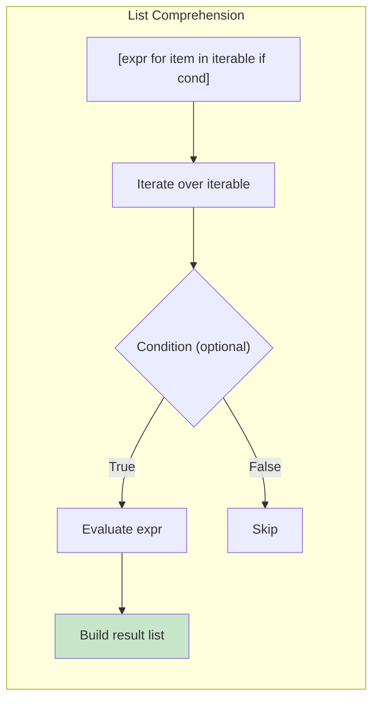
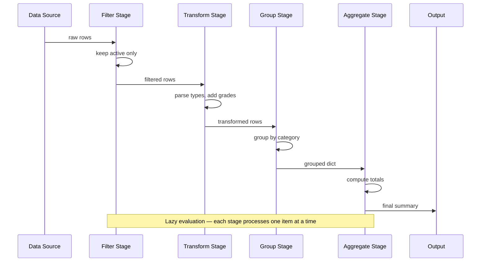

# Declarative Patterns

Declarative programming is about expressing **what** you want to accomplish rather than **how** to accomplish it. Python's comprehensions, generators, and built-in functions make declarative style natural and powerful.

## Comprehensions: Python's Declarative Powerhouse

Comprehensions are the most Pythonic declarative tool. They transform one iterable into another with clear, intent-revealing syntax.

```python
from typing import List, Dict, Set, Any

# List comprehensions
numbers = [1, 2, 3, 4, 5]

# IMPERATIVE
squares_imperative = []
for n in numbers:
    squares_imperative.append(n ** 2)

# DECLARATIVE (list comprehension)
squares = [n ** 2 for n in numbers]
print(squares)  # [1, 4, 9, 16, 25]

# With conditional
evens = [n for n in numbers if n % 2 == 0]
print(evens)  # [2, 4]

# With conditional expression
even_odd = ["even" if n % 2 == 0 else "odd" for n in numbers]
print(even_odd)  # ["odd", "even", "odd", "even", "odd"]

# Nested loops
pairs = [(x, y) for x in range(3) for y in range(3)]
print(pairs)

# Flatten a matrix
matrix = [[1, 2, 3], [4, 5, 6], [7, 8, 9]]
flat = [item for row in matrix for item in row]
print(flat)  # [1, 2, 3, 4, 5, 6, 7, 8, 9]

# Dict comprehensions
squares_dict = {n: n ** 2 for n in range(5)}
print(squares_dict)  # {0: 0, 1: 1, 2: 4, 3: 9, 4: 25}

# Filter and transform in dict
names = ["Alice", "Bob", "Charlie", "Diana"]
name_lengths = {name: len(name) for name in names if len(name) > 3}
print(name_lengths)  # {"Alice": 5, "Charlie": 7, "Diana": 5}

# Set comprehensions
unique_lengths = {len(name) for name in names}
print(unique_lengths)  # {3, 5, 7}
```



## Generator Expressions

Generators produce values lazily — one at a time — which is crucial for large or infinite sequences.

```python
from typing import Generator, List
import sys

# Generator expression (lazy)
numbers = [1, 2, 3, 4, 5]
squares_gen = (n ** 2 for n in numbers)
print(squares_gen)  # <generator object at ...>
print(list(squares_gen))  # [1, 4, 9, 16, 25]

# Memory efficiency: compare list vs generator
big_range = range(1000000)

list_squares = [x ** 2 for x in big_range]    # ~8MB list
gen_squares = (x ** 2 for x in big_range)     # ~56 bytes

print(f"List size: {sys.getsizeof(list_squares):,} bytes")
print(f"Gen size: {sys.getsizeof(gen_squares):,} bytes")

# Generator with yield — more complex logic
def fibonacci(n: int) -> Generator[int, None, None]:
    a, b = 0, 1
    for _ in range(n):
        yield a
        a, b = b, a + b

fib = fibonacci(10)
print(list(fib))  # [0, 1, 1, 2, 3, 5, 8, 13, 21, 34]

# Infinite generator
def count_from(start: int = 0, step: int = 1) -> Generator[int, None, None]:
    current = start
    while True:
        yield current
        current += step

from itertools import islice

first_10 = islice(count_from(0, 3), 10)
print(list(first_10))  # [0, 3, 6, 9, 12, 15, 18, 21, 24, 27]

# Generator pipelines — chain generators
def read_lines() -> Generator[str, None, None]:
    yield "  Hello, World!  "
    yield "Python is great"
    yield "  DECLARATIVE  "

def strip_lines(lines: Generator[str, None, None]) -> Generator[str, None, None]:
    for line in lines:
        yield line.strip()

def lowercase_lines(lines: Generator[str, None, None]) -> Generator[str, None, None]:
    for line in lines:
        yield line.lower()

pipeline = lowercase_lines(strip_lines(read_lines()))
print(list(pipeline))  # ["hello, world!", "python is great", "declarative"]
```

> [!NOTE]
> Generators are single-use. Once exhausted, they yield no more values. If you need to reuse the data, convert to a list or create a new generator.

## Generator Pipeline for Data Processing

```python
from typing import Generator, Dict, Any
import csv
from io import StringIO

csv_data = """name,age,score,active
Alice,25,85,true
Bob,17,72,true
Charlie,30,91,false
Diana,22,95,true
Eve,28,60,true"""

def parse_csv(data: str) -> Generator[Dict[str, str], None, None]:
    reader = csv.DictReader(StringIO(data))
    for row in reader:
        yield row

def filter_active(rows: Generator) -> Generator:
    for row in rows:
        if row.get("active") == "true":
            yield row

def parse_types(rows: Generator) -> Generator:
    for row in rows:
        yield {
            "name": row["name"],
            "age": int(row["age"]),
            "score": float(row["score"]),
            "active": row["active"] == "true",
        }

def filter_adults(rows: Generator) -> Generator:
    for row in rows:
        if row["age"] >= 18:
            yield row

def grade_students(rows: Generator) -> Generator:
    for row in rows:
        if row["score"] >= 90:
            grade = "A"
        elif row["score"] >= 80:
            grade = "B"
        elif row["score"] >= 70:
            grade = "C"
        else:
            grade = "D"
        yield {**row, "grade": grade}

pipeline = grade_students(
    filter_adults(
        parse_types(
            filter_active(
                parse_csv(csv_data)
            )
        )
    )
)

for student in pipeline:
    print(f"{student['name']}: {student['grade']} ({student['score']})")
# Alice: B (85.0), Diana: A (95.0), Eve: D (60.0)
```

> [!WARNING]
> Be careful with infinite generators in pipelines. Always limit them with itertools.islice or risk running forever.

## Expressing Intent with Built-in Functions

```python
from typing import List
from functools import reduce
from itertools import groupby, chain

# Declarative "is there at least one?"
numbers = [1, 2, 3, 4, 5]
has_even = any(n % 2 == 0 for n in numbers)
print(has_even)  # True

# Declarative "are all?"
all_positive = all(n > 0 for n in numbers)
print(all_positive)  # True

# any/all with complex predicates
users = [
    {"name": "Alice", "age": 25, "verified": True},
    {"name": "Bob", "age": 17, "verified": False},
    {"name": "Charlie", "age": 30, "verified": True},
]

all_adults = all(u["age"] >= 18 for u in users)
any_verified = any(u["verified"] for u in users)
print(all_adults, any_verified)  # False True

# max/min with key — declarative selection
words = ["python", "java", "javascript", "rust"]
longest = max(words, key=len)
shortest = min(words, key=len)
print(longest, shortest)  # "javascript" "rust"

# sum with generator
total_scores = sum(u["age"] for u in users)
print(total_scores)  # 72

# zip — parallel iteration
names = ["Alice", "Bob", "Charlie"]
scores = [85, 72, 91]
pairs = list(zip(names, scores))
print(pairs)  # [("Alice", 85), ("Bob", 72), ("Charlie", 91)]

# enumerate — indexed iteration
for idx, name in enumerate(names, start=1):
    print(f"{idx}. {name}")

# sorted with key — declarative ordering
sorted_users = sorted(users, key=lambda u: (-u["age"], u["name"]))
print([u["name"] for u in sorted_users])  # ["Charlie", "Alice", "Bob"]
```

## itertools: Declarative Iterator Tools

```python
from itertools import (
    chain, accumulate,
    takewhile, groupby,
    product, permutations, combinations,
)

# chain — concatenate iterables
combined = list(chain([1, 2], [3, 4], [5, 6]))
print(combined)  # [1, 2, 3, 4, 5, 6]

# accumulate — running total
running = list(accumulate([1, 2, 3, 4, 5]))
print(running)  # [1, 3, 6, 10, 15]

# accumulate with function
running_product = list(accumulate([1, 2, 3, 4, 5], lambda a, b: a * b))
print(running_product)  # [1, 2, 6, 24, 120]

# takewhile — take while predicate is true
taken = list(takewhile(lambda x: x < 10, accumulate(range(100))))
print(taken)  # [0, 1, 3, 6]

# groupby — group consecutive elements
data = [("fruit", "apple"), ("fruit", "banana"), ("color", "red"), ("color", "blue")]
sorted_data = sorted(data, key=lambda x: x[0])
for key, group in groupby(sorted_data, key=lambda x: x[0]):
    print(f"{key}: {[g[1] for g in group]}")

# product — cartesian product
print(list(product([1, 2], ["a", "b"])))
# [(1, "a"), (1, "b"), (2, "a"), (2, "b")]

# permutations
print(list(permutations([1, 2, 3], 2)))

# combinations
print(list(combinations([1, 2, 3], 2)))
```



## Declarative vs Imperative Side-by-Side

```python
from typing import List, Dict, Any

students_data = [
    {"name": "Alice", "scores": [85, 90, 78, 92], "age": 25},
    {"name": "Bob", "scores": [72, 68, 75], "age": 17},
    {"name": "Charlie", "scores": [91, 88, 95, 93], "age": 30},
    {"name": "Diana", "scores": [95, 97], "age": 22},
]

# IMPERATIVE: Compute average scores for adults
def average_scores_imperative(students: List[Dict[str, Any]]) -> Dict[str, float]:
    result = {}
    for s in students:
        if s["age"] >= 18:
            total = 0
            for score in s["scores"]:
                total += score
            avg = total / len(s["scores"])
            result[s["name"]] = round(avg, 2)
    return result

# DECLARATIVE: Same logic as comprehension
def average_scores_declarative(students: List[Dict[str, Any]]) -> Dict[str, float]:
    return {
        s["name"]: round(sum(s["scores"]) / len(s["scores"]), 2)
        for s in students
        if s["age"] >= 18
    }

print(average_scores_imperative(students_data))
print(average_scores_declarative(students_data))

# IMPERATIVE: Flatten and deduplicate
def flatten_unique_imperative(lists: List[List[int]]) -> List[int]:
    result = []
    seen = set()
    for sublist in lists:
        for item in sublist:
            if item not in seen:
                seen.add(item)
                result.append(item)
    return result

# DECLARATIVE: Same logic
def flatten_unique_declarative(lists: List[List[int]]) -> List[int]:
    return list(dict.fromkeys(item for sublist in lists for item in sublist))

nested = [[1, 2, 3], [2, 3, 4], [3, 4, 5]]
print(flatten_unique_imperative(nested))    # [1, 2, 3, 4, 5]
print(flatten_unique_declarative(nested))   # [1, 2, 3, 4, 5]
```

## The Walrus Operator in Comprehensions

The walrus operator (:=) lets you assign and use a value in the same expression.

```python
from typing import List

# Without walrus — recalculates
def get_even_squares_bad(nums: List[int]) -> List[int]:
    return [n ** 2 for n in nums if n ** 2 % 2 == 0]

# With walrus — calculates once
def get_even_squares_good(nums: List[int]) -> List[int]:
    return [sq for n in nums if (sq := n ** 2) % 2 == 0]

print(get_even_squares_good([1, 2, 3, 4, 5]))  # [4, 16]

# Filter with transformation reuse
def process_orders(orders: List[Dict[str, Any]]) -> List[str]:
    return [
        f"{item['name']}: ${item['total']:.2f}"
        for order in orders
        if (item := order.get("item")) and item["total"] > 100
    ]

orders = [
    {"item": {"name": "Laptop", "total": 1200}},
    {"item": {"name": "Mouse", "total": 25}},
    {"item": {"name": "Monitor", "total": 350}},
]
print(process_orders(orders))
```

## Conditional Expressions for Readability

```python
from typing import List, Dict, Any

# BAD: Nested conditional in comprehension (hard to read)
def grade_students_bad(students: List[Dict[str, Any]]) -> List[str]:
    return [
        "A" if s["score"] >= 90 else "B" if s["score"] >= 80 else "C" if s["score"] >= 70 else "D" if s["score"] >= 60 else "F"
        for s in students
    ]

# GOOD: Helper function makes intent clear
def letter_grade(score: float) -> str:
    if score >= 90:
        return "A"
    elif score >= 80:
        return "B"
    elif score >= 70:
        return "C"
    elif score >= 60:
        return "D"
    return "F"

def grade_students_good(students: List[Dict[str, Any]]) -> List[str]:
    return [letter_grade(s["score"]) for s in students]

# Declarative approach with data
def grade_students_data(students: List[Dict[str, Any]]) -> List[Dict[str, Any]]:
    thresholds = [(90, "A"), (80, "B"), (70, "C"), (60, "D")]
    return [
        {
            **s,
            "grade": next(
                (grade for threshold, grade in thresholds if s["score"] >= threshold),
                "F"
            ),
        }
        for s in students
    ]

data = [{"name": "Alice", "score": 85}]
print(grade_students_good(data))      # ["B"]
print(grade_students_data(data))
```

## Declarative Data Validation

```python
from typing import List, Dict, Any, Callable

# Define validation rules declaratively
class Validator:
    def __init__(self, rules: List[Callable]):
        self.rules = rules

    def validate(self, data: Dict[str, Any]) -> List[str]:
        return [
            error
            for rule in self.rules
            if (error := rule(data))
        ]

def required_field(field: str) -> Callable:
    def rule(data: Dict[str, Any]) -> str | None:
        if field not in data or data[field] is None:
            return f"{field} is required"
        return None
    return rule

def min_length(field: str, min_len: int) -> Callable:
    def rule(data: Dict[str, Any]) -> str | None:
        value = data.get(field)
        if isinstance(value, str) and len(value) < min_len:
            return f"{field} must be at least {min_len} characters"
        return None
    return rule

def is_email(field: str) -> Callable:
    def rule(data: Dict[str, Any]) -> str | None:
        value = data.get(field)
        if isinstance(value, str) and "@" not in value:
            return f"{field} must be a valid email"
        return None
    return rule

def range_check(field: str, min_val: float, max_val: float) -> Callable:
    def rule(data: Dict[str, Any]) -> str | None:
        value = data.get(field)
        if isinstance(value, (int, float)) and not (min_val <= value <= max_val):
            return f"{field} must be between {min_val} and {max_val}"
        return None
    return rule

user_validator = Validator([
    required_field("name"),
    required_field("email"),
    min_length("name", 2),
    is_email("email"),
    range_check("age", 18, 120),
])

test_user = {"name": "A", "email": "invalid", "age": 150}
errors = user_validator.validate(test_user)
for err in errors:
    print(f"  - {err}")
```

## Comparison: Imperative vs Declarative

| Aspect | Imperative | Declarative |
|--------|-----------|-------------|
| **Focus** | How to do it | What to achieve |
| **State** | Mutable variables, manual tracking | Immutable data, automatic |
| **Loops** | for/while with manual indexing | Comprehensions, map/filter |
| **Conditionals** | if/elif/else blocks | Filter predicates, conditional expressions |
| **Reuse** | Copy-paste or refactor | Compose small pure functions |
| **Testability** | Test whole block | Test each transformation |
| **Brevity** | Verbose | Concise |
| **Learning curve** | Familiar to beginners | Requires paradigm shift |
| **Parallelization** | Manual (locks, threads) | Often automatic (no shared state) |

## Practice Exercises

1. Rewrite this imperative code using a list comprehension:
   ```python
   result = []
   for x in range(20):
       if x % 3 == 0 or x % 5 == 0:
           result.append(x ** 2)
   ```

2. Use a dict comprehension to swap keys and values in a dictionary. Handle the case where multiple keys map to the same value.

3. Write a generator function that yields the first `n` triangular numbers (T_n = n(n+1)/2). Use itertools.islice to get the first 10.

4. Create a generator pipeline that: reads lines from a list, strips whitespace, filters out empty lines and comments (lines starting with #), and yields cleaned lines.

5. Use any(), all(), and generator expressions to check: (a) if any number in a list is prime, (b) if all strings in a list are palindromes.

6. Implement a simple query builder using declarative chaining (like the Validator pattern above) that builds SQL WHERE clauses from method calls.

7. Given a list of transactions, use groupby and sum to compute total sales per category in a declarative way.

8. Rewrite this function to be purely declarative using comprehensions and built-in functions (no explicit loops):
   ```python
   def process(users):
       result = []
       for u in users:
           completed = [o for o in u["orders"] if o["status"] == "completed"]
           if completed:
               total = sum(o["total"] for o in completed)
               result.append({"name": u["name"], "total": total, "count": len(completed)})
       return sorted(result, key=lambda x: x["total"], reverse=True)
   ```

## Summary

- **Comprehensions** (list, dict, set) are Python's most declarative feature
- **Generator expressions** provide lazy, memory-efficient iteration
- **Generator pipelines** compose lazy transformations without intermediate storage
- **Built-in functions** (any, all, sum, zip, enumerate) express intent directly
- **itertools** provides declarative tools for complex iteration patterns
- The **walrus operator** enables value reuse within comprehensions
- **Validation rules** can be expressed declaratively as composable checks
- Declarative code is more concise, testable, and focused on intent

> [!SUCCESS]
> You've mastered Python's declarative patterns. By expressing intent rather than mechanics, you write code that is shorter, clearer, and less error-prone. Combine these patterns with immutability and composition for maximum benefit.
