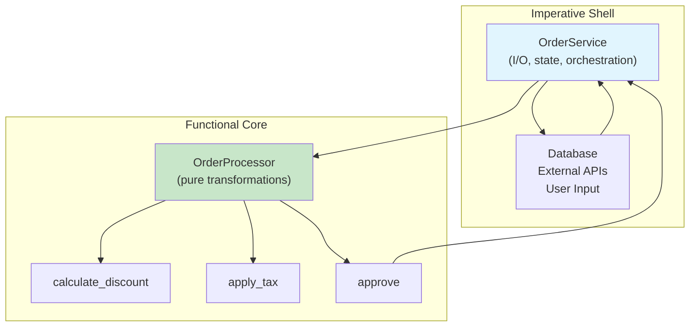
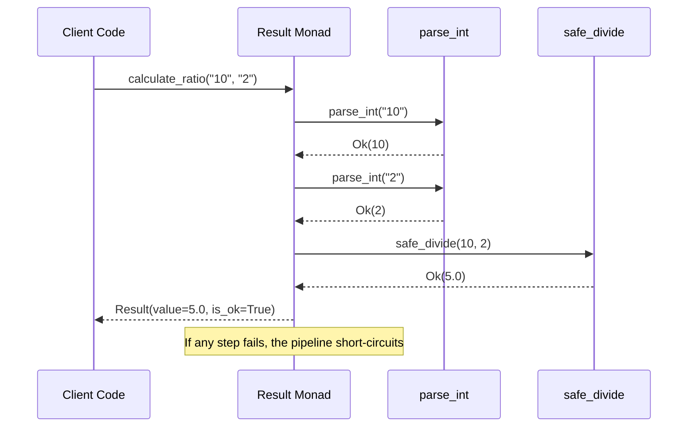

# Functional Python in Real Projects

In real-world Python projects, you rarely go "full functional" or "full OOP." The best codebases combine paradigms pragmatically. This lesson shows how to integrate functional and object-oriented patterns in production Python.

## The Hybrid Approach

Modern Python benefits from both OOP (for structure and state management) and FP (for data transformations and business logic).

```python
from typing import List, Dict, Any, Callable, Optional
from dataclasses import dataclass
from functools import reduce
import json

# The functional core + imperative shell pattern
# OOP provides the shell (structure, I/O, state)
# FP provides the core (business logic, transformations)

@dataclass(frozen=True)
class Order:
    id: int
    customer_id: int
    items: tuple
    total: float
    status: str

# Functional core: pure transformations
class OrderProcessor:
    @staticmethod
    def calculate_discount(order: Order, rate: float) -> Order:
        if rate <= 0 or rate >= 1:
            raise ValueError("Discount rate must be between 0 and 1")
        new_total = order.total * (1 - rate)
        return Order(
            id=order.id,
            customer_id=order.customer_id,
            items=order.items,
            total=round(new_total, 2),
            status=order.status,
        )

    @staticmethod
    def apply_tax(order: Order, tax_rate: float) -> Order:
        new_total = order.total * (1 + tax_rate)
        return Order(
            id=order.id,
            customer_id=order.customer_id,
            items=order.items,
            total=round(new_total, 2),
            status=order.status,
        )

    @staticmethod
    def approve(order: Order) -> Order:
        if order.total > 10000:
            return Order(
                id=order.id,
                customer_id=order.customer_id,
                items=order.items,
                total=order.total,
                status="pending_approval",
            )
        return Order(
            id=order.id,
            customer_id=order.customer_id,
            items=order.items,
            total=order.total,
            status="approved",
        )

# Imperative shell: I/O, orchestration
class OrderService:
    def __init__(self, processor: OrderProcessor):
        self.processor = processor
        self._orders: Dict[int, Order] = {}

    def process_new_order(self, order: Order) -> Order:
        processed = self.processor.approve(order)
        self._orders[processed.id] = processed
        return processed

    def apply_promotion(self, order_id: int, discount_rate: float) -> Optional[Order]:
        if order_id not in self._orders:
            return None
        order = self._orders[order_id]
        discounted = self.processor.calculate_discount(order, discount_rate)
        self._orders[order_id] = discounted
        return discounted
```



## Strategy Pattern with Functions

The Strategy pattern is more elegant with functions than with classes.

```python
from typing import List, Dict, Any, Callable

# OOP Strategy: verbose
class DiscountStrategy:
    def apply(self, total: float) -> float:
        raise NotImplementedError

class NoDiscount(DiscountStrategy):
    def apply(self, total: float) -> float:
        return total

class PercentageDiscount(DiscountStrategy):
    def __init__(self, percent: float):
        self.percent = percent
    def apply(self, total: float) -> float:
        return total * (1 - self.percent)

class LoyaltyDiscount(DiscountStrategy):
    def apply(self, total: float) -> float:
        return total * 0.9 if total > 500 else total

# Functional Strategy: concise
DiscountFn = Callable[[float], float]

no_discount: DiscountFn = lambda total: total

def percentage_discount(percent: float) -> DiscountFn:
    return lambda total: total * (1 - percent)

def loyalty_discount(total: float) -> float:
    return total * 0.9 if total > 500 else total

# Strategy selector
def get_discount_strategy(customer_type: str, amount: float) -> DiscountFn:
    strategies: Dict[str, DiscountFn] = {
        "regular": no_discount,
        "premium": percentage_discount(0.2),
        "vip": percentage_discount(0.3),
    }
    base = strategies.get(customer_type, no_discount)
    if amount > 1000:
        return lambda t: base(t) * 0.95
    return base

class Checkout:
    def __init__(self, discount_strategy: DiscountFn):
        self._discount = discount_strategy

    def calculate(self, items: List[Dict[str, float]]) -> float:
        subtotal = sum(item["price"] * item.get("qty", 1) for item in items)
        return self._discount(subtotal)

strategy = get_discount_strategy("premium", 2000)
checkout = Checkout(strategy)
total = checkout.calculate([{"price": 100, "qty": 5}])
print(f"Total after discount: ${total:.2f}")
```

## Pipeline Pattern in Production

```python
from typing import List, Dict, Any, Callable, TypeVar, Generic
from dataclasses import dataclass, replace
from functools import reduce
import json
from pathlib import Path

T = TypeVar("T")
U = TypeVar("U")

@dataclass
class Pipeline(Generic[T, U]):
    stages: tuple = ()

    def add(self, stage: Callable) -> "Pipeline":
        return Pipeline(self.stages + (stage,))

    def execute(self, data: T) -> U:
        result: Any = data
        for stage in self.stages:
            result = stage(result)
        return result

# Real-world ETL pipeline
def load_csv(path: str) -> List[Dict[str, str]]:
    import csv
    with open(path, "r") as f:
        return list(csv.DictReader(f))

def parse_types(rows: List[Dict[str, str]]) -> List[Dict[str, Any]]:
    return [
        {
            "id": int(r["id"]),
            "name": r["name"].strip(),
            "value": float(r["value"]),
            "active": r["active"].strip().lower() == "true",
        }
        for r in rows
    ]

def filter_active(rows: List[Dict[str, Any]]) -> List[Dict[str, Any]]:
    return [r for r in rows if r["active"]]

def enrich_data(rows: List[Dict[str, Any]]) -> List[Dict[str, Any]]:
    return [
        {
            **r,
            "tier": "premium" if r["value"] > 1000 else "standard",
            "display_name": r["name"].title(),
        }
        for r in rows
    ]

def sort_by_value(rows: List[Dict[str, Any]]) -> List[Dict[str, Any]]:
    return sorted(rows, key=lambda r: r["value"], reverse=True)

# Build the pipeline
etl_pipeline = (
    Pipeline()
    .add(parse_types)
    .add(filter_active)
    .add(enrich_data)
    .add(sort_by_value)
)

# In production, you'd call:
# result = etl_pipeline.execute(load_csv("data.csv"))
# For demo, use mock data:
mock_data = [
    "id,name,value,active",
    "1,Alice,1500,true",
    "2,Bob,500,false",
    "3,Charlie,2000,true",
    "4,Diana,800,true",
].join("\n")

# Simulate loading
def load_mock() -> List[Dict[str, str]]:
    import csv, io
    return list(csv.DictReader(io.StringIO(mock_data)))

result = etl_pipeline.execute(load_mock())
for item in result:
    print(f"{item['display_name']}: ${item['value']} ({item['tier']})")
```

> [!TIP]
> The Pipeline pattern makes each stage independently testable. Each stage is a pure function that can be unit-tested in isolation, then composed into the full pipeline.

## Event Sourcing with Immutable Events

```python
from typing import List, Dict, Any, Callable, Optional
from dataclasses import dataclass, replace
from datetime import datetime, timezone
import json

@dataclass(frozen=True)
class Event:
    type: str
    data: Dict[str, Any]
    timestamp: str = ""

    def __post_init__(self):
        if not self.timestamp:
            object.__setattr__(self, "timestamp",
                datetime.now(timezone.utc).isoformat())

# Event handlers are pure functions
EventHandler = Callable[[Dict[str, Any], Event], Dict[str, Any]]

def handle_user_created(state: Dict[str, Any], event: Event) -> Dict[str, Any]:
    data = event.data
    users = list(state.get("users", []))
    users.append({"id": data["id"], "name": data["name"], "orders": []})
    return {**state, "users": users}

def handle_order_placed(state: Dict[str, Any], event: Event) -> Dict[str, Any]:
    data = event.data
    users = [
        {
            **u,
            "orders": [
                *u["orders"],
                {"id": data["order_id"], "total": data["total"], "status": "placed"},
            ] if u["id"] == data["user_id"] else u["orders"],
        }
        for u in state.get("users", [])
    ]
    return {**state, "users": users}

def handle_payment_received(state: Dict[str, Any], event: Event) -> Dict[str, Any]:
    data = event.data
    users = [
        {
            **u,
            "orders": [
                {
                    **o,
                    "status": "paid" if o["id"] == data["order_id"] else o["status"],
                }
                for o in u["orders"]
            ],
        }
        for u in state.get("users", [])
    ]
    return {**state, "users": users}

class EventStore:
    def __init__(self):
        self._events: List[Event] = []
        self._handlers: Dict[str, EventHandler] = {
            "user_created": handle_user_created,
            "order_placed": handle_order_placed,
            "payment_received": handle_payment_received,
        }

    def append(self, event: Event) -> None:
        self._events.append(event)

    def replay(self, state: Optional[Dict[str, Any]] = None) -> Dict[str, Any]:
        current = state or {}
        for event in self._events:
            handler = self._handlers.get(event.type)
            if handler:
                current = handler(current, event)
        return current

store = EventStore()
store.append(Event("user_created", {"id": 1, "name": "Alice"}))
store.append(Event("user_created", {"id": 2, "name": "Bob"}))
store.append(Event("order_placed", {"user_id": 1, "order_id": 101, "total": 250.0}))
store.append(Event("payment_received", {"order_id": 101}))
store.append(Event("order_placed", {"user_id": 1, "order_id": 102, "total": 50.0}))

state = store.replay()
for user in state["users"]:
    print(f"{user['name']}: {len(user['orders'])} orders")
```

## Functional Testing Patterns

```python
from typing import List, Dict, Any, Callable
import unittest
from unittest.mock import Mock

# Pure function: easy to test
def calculate_bmi(weight_kg: float, height_m: float) -> float:
    if height_m <= 0 or weight_kg <= 0:
        raise ValueError("Height and weight must be positive")
    return round(weight_kg / (height_m ** 2), 1)

def classify_bmi(bmi: float) -> str:
    if bmi < 18.5:
        return "underweight"
    elif bmi < 25:
        return "normal"
    elif bmi < 30:
        return "overweight"
    return "obese"

# Test the pure functions easily
class TestBmiFunctions(unittest.TestCase):
    def test_calculate_bmi(self):
        self.assertEqual(calculate_bmi(70, 1.75), 22.9)

    def test_classify_bmi(self):
        self.assertEqual(classify_bmi(17.0), "underweight")
        self.assertEqual(classify_bmi(22.0), "normal")
        self.assertEqual(classify_bmi(27.0), "overweight")
        self.assertEqual(classify_bmi(32.0), "obese")

    def test_invalid_inputs(self):
        with self.assertRaises(ValueError):
            calculate_bmi(-70, 1.75)
            calculate_bmi(70, 0)

# Property-based testing with hypothesis
try:
    from hypothesis import given, strategies as st

    class TestPropertyBased(unittest.TestCase):
        @given(
            weight=st.floats(min_value=1, max_value=500),
            height=st.floats(min_value=0.5, max_value=2.5),
        )
        def test_bmi_in_range(self, weight: float, height: float):
            bmi = calculate_bmi(weight, height)
            self.assertTrue(10 <= bmi <= 500)

except ImportError:
    pass

# Functional mock pattern: inject dependencies
def process_user_data(
    user_data: Dict[str, Any],
    validator: Callable,
    formatter: Callable,
) -> Dict[str, Any]:
    if not validator(user_data):
        raise ValueError("Invalid user data")
    return formatter(user_data)

# Test with mock functions
class TestUserProcessing(unittest.TestCase):
    def test_valid_user(self):
        validator = Mock(return_value=True)
        formatter = Mock(return_value={"name": "ALICE"})

        result = process_user_data(
            {"name": "alice"},
            validator,
            formatter,
        )
        validator.assert_called_once()
        formatter.assert_called_once()
        self.assertEqual(result, {"name": "ALICE"})

    def test_invalid_user(self):
        validator = Mock(return_value=False)
        formatter = Mock()

        with self.assertRaises(ValueError):
            process_user_data({"name": ""}, validator, formatter)
        formatter.assert_not_called()

if __name__ == "__main__":
    unittest.main()
```

## Error Handling: The Result Pattern

```python
from typing import Generic, TypeVar, Optional, Callable
from dataclasses import dataclass

T = TypeVar("T")
E = TypeVar("E")

@dataclass(frozen=True)
class Result(Generic[T, E]):
    value: Optional[T] = None
    error: Optional[E] = None
    is_ok: bool = True

    @classmethod
    def ok(cls, value: T) -> "Result[T, E]":
        return cls(value=value, error=None, is_ok=True)

    @classmethod
    def fail(cls, error: E) -> "Result[T, E]":
        return cls(value=None, error=error, is_ok=False)

    def map(self, func: Callable[[T], T]) -> "Result[T, E]":
        if self.is_ok:
            try:
                return Result.ok(func(self.value))
            except Exception as e:
                return Result.fail(str(e))
        return self

    def bind(self, func: Callable[[T], "Result[T, E]"]) -> "Result[T, E]":
        if self.is_ok:
            return func(self.value)
        return self

    def unwrap(self) -> T:
        if not self.is_ok:
            raise RuntimeError(f"Called unwrap on error: {self.error}")
        return self.value

# Domain functions using Result
def parse_int(s: str) -> Result[int, str]:
    try:
        return Result.ok(int(s))
    except ValueError:
        return Result.fail(f"Cannot parse '{s}' as integer")

def safe_divide(a: int, b: int) -> Result[float, str]:
    if b == 0:
        return Result.fail("Division by zero")
    return Result.ok(a / b)

# Pipeline using Result
def calculate_ratio(s1: str, s2: str) -> Result[float, str]:
    return (
        parse_int(s1)
        .bind(lambda a: parse_int(s2).map(lambda b: (a, b)))
        .bind(lambda pair: safe_divide(pair[0], pair[1]))
    )

print(calculate_ratio("10", "2"))   # Result(value=5.0, ok=True)
print(calculate_ratio("10", "0"))   # Result(error="Division by zero", ok=False)
print(calculate_ratio("abc", "2"))  # Result(error="Cannot parse 'abc'", ok=False)
```



## Lazy Evaluation with Properties and Caching

```python
from typing import Dict, Any, Callable, Optional
from functools import lru_cache
import time

class LazyProduct:
    def __init__(
        self,
        product_id: int,
        price_data_provider: Callable[[int], Dict[str, Any]],
    ):
        self._id = product_id
        self._price_data_provider = price_data_provider
        self._price_data: Optional[Dict[str, Any]] = None

    @property
    def price_data(self) -> Dict[str, Any]:
        if self._price_data is None:
            self._price_data = self._price_data_provider(self._id)
        return self._price_data

    @property
    def price(self) -> float:
        return self.price_data["price"]

    @property
    def currency(self) -> str:
        return self.price_data.get("currency", "USD")

    @lru_cache(maxsize=1)
    def compute_tax(self, rate: float) -> float:
        return round(self.price * rate, 2)

def fetch_price_data(product_id: int) -> Dict[str, Any]:
    time.sleep(0.5)
    return {"price": 99.99, "currency": "USD", "product_id": product_id}

# Usage
product = LazyProduct(42, fetch_price_data)
print(product.price)  # Triggers fetch
print(product.currency)  # Uses cached data
print(product.compute_tax(0.08))  # Computes and caches
```

## Real-World: Data Analysis Pipeline

```python
from typing import List, Dict, Any, Callable
from dataclasses import dataclass
from functools import reduce
import json

@dataclass(frozen=True)
class AnalysisResult:
    total_revenue: float
    total_orders: int
    avg_order_value: float
    top_category: str
    top_category_revenue: float

def load_orders(path: str) -> List[Dict[str, Any]]:
    with open(path, "r") as f:
        return json.load(f)

def filter_paid(orders: List[Dict[str, Any]]) -> List[Dict[str, Any]]:
    return [o for o in orders if o.get("status") == "paid"]

def enrich_items(orders: List[Dict[str, Any]]) -> List[Dict[str, Any]]:
    return [
        {
            **o,
            "line_total": sum(
                item["price"] * item["qty"]
                for item in o.get("items", [])
            ),
        }
        for o in orders
    ]

def compute_analysis(orders: List[Dict[str, Any]]) -> AnalysisResult:
    if not orders:
        return AnalysisResult(0, 0, 0, "", 0.0)

    total_revenue = sum(o["line_total"] for o in orders)

    total_orders = len(orders)

    avg_order_value = total_revenue / total_orders if total_orders else 0

    category_totals: Dict[str, float] = {}
    for o in orders:
        for item in o.get("items", []):
            cat = item.get("category", "uncategorized")
            category_totals[cat] = category_totals.get(cat, 0) + item["price"] * item["qty"]

    top_category = max(category_totals, key=category_totals.get) if category_totals else ""
    top_revenue = category_totals.get(top_category, 0.0)

    return AnalysisResult(
        total_revenue=round(total_revenue, 2),
        total_orders=total_orders,
        avg_order_value=round(avg_order_value, 2),
        top_category=top_category,
        top_category_revenue=round(top_revenue, 2),
    )

analysis_pipeline = [filter_paid, enrich_items, compute_analysis]

def run_pipeline(data: List[Dict[str, Any]]) -> AnalysisResult:
    return reduce(lambda d, fn: fn(d), analysis_pipeline, data)

mock_orders = [
    {
        "id": 1,
        "status": "paid",
        "items": [
            {"name": "Laptop", "price": 1200, "qty": 1, "category": "electronics"},
            {"name": "Mouse", "price": 25, "qty": 2, "category": "accessories"},
        ],
    },
    {
        "id": 2,
        "status": "paid",
        "items": [
            {"name": "Desk", "price": 450, "qty": 1, "category": "furniture"},
        ],
    },
    {
        "id": 3,
        "status": "pending",
        "items": [
            {"name": "Monitor", "price": 350, "qty": 1, "category": "electronics"},
        ],
    },
]

result = run_pipeline(mock_orders)
print(f"Revenue: ${result.total_revenue}")
print(f"Orders: {result.total_orders}")
print(f"Avg Order: ${result.avg_order_value}")
print(f"Top Category: {result.top_category} (${result.top_category_revenue})")
```

## Comparison: Pure OOP vs Hybrid FP+OOP

| Aspect | Pure OOP | Hybrid FP+OOP |
|--------|---------|---------------|
| **State** | Objects encapsulate mutable state | Immutable data objects, mutable infrastructure |
| **Business logic** | Methods on objects | Pure functions operating on data |
| **Side effects** | Methods can do anything | Isolated to service layer |
| **Testing** | Mock-heavy, state setup needed | Mock-light, test pure functions directly |
| **Composability** | Inheritance hierarchies | Function composition |
| **Reusability** | Through inheritance/mixins | Through pure functions/pipelines |
| **Concurrency** | Locks, race conditions | Shared nothing, safe by default |
| **Error handling** | Exceptions throughout | Result types at boundaries |

## Practice Exercises

1. Refactor a class that mixes I/O and business logic into the functional core + imperative shell pattern. The class currently reads from a file, processes data, and writes results.

2. Implement the Strategy pattern for shipping cost calculation using functions instead of classes. Support "standard", "express", and "overnight" strategies.

3. Build a Result monad-based pipeline that: validates user input, transforms data, saves to a database, and sends a notification. Each step returns a Result.

4. Create a Pipeline class where each stage is logged (input size, output size, execution time) for observability in production.

5. Implement a simple event sourcing system for a todo app: events are created (todo_added, todo_completed, todo_removed) and the state is rebuilt by replaying events.

6. Convert a 50-line OOP class that processes orders into a hybrid design: immutable order dataclass + pure processing functions + a thin service class for state management.

7. Write property-based tests for a pure function `calculate_shipping(items, destination)` using Hypothesis (or manual property checks).

8. Design a functional configuration system where config is an immutable dict that gets transformed through a pipeline of pure functions (env overrides, defaults, validation).

## Summary

- **Hybrid architecture**: functional core + imperative shell is the most pragmatic pattern
- **Strategy pattern** is more concise with functions than class hierarchies
- **Pipeline pattern** creates testable, composable data transformations
- **Event sourcing** works naturally with immutable events and pure reducers
- **Result monad** provides explicit error handling without exceptions
- **Lazy evaluation** with properties and caching improves performance
- Property-based testing and pure functions are a powerful combination
- The goal is not purity but **practicality** — use each paradigm where it shines

> [!SUCCESS]
> You've completed the course on Functional & Declarative Coding! You now have the tools to write Python that is more predictable, testable, and expressive. Remember: the best code uses the right paradigm for the right job — mix FP and OOP pragmatically.
