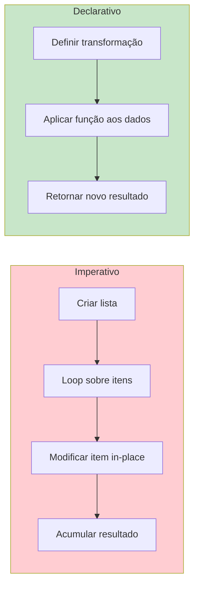
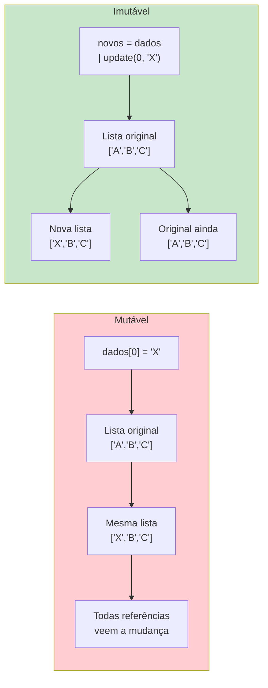
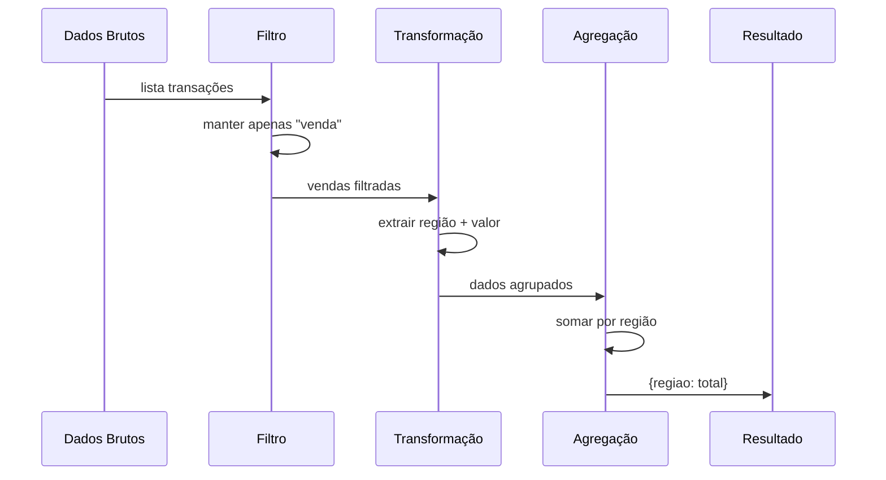
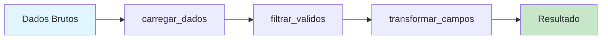

# Conceitos de Programação Funcional

Programação funcional (PF) é um paradigma que trata a computação como a avaliação de funções matemáticas e evita mudanças de estado e dados mutáveis. Esta lição apresenta os conceitos fundamentais que tornam a PF poderosa para construir software previsível, testável e concorrente.

## O Que é Programação Funcional?

Em sua essência, programação funcional trata de construir programas através da composição de funções, onde funções são puras, dados são imutáveis e expressões são preferidas em vez de comandos.

| Aspecto | Imperativo (Como) | Declarativo (O Que) |
|---------|------------------|-------------------|
| **Foco** | Instruções passo a passo | Resultado desejado |
| **Estado** | Variáveis mutáveis | Dados imutáveis |
| **Funções** | Procedimentos com efeitos colaterais | Funções matemáticas puras |
| **Fluxo** | Loops, condicionais | Recursão, funções compostas |
| **Atribuição** | Reatribuir variáveis | Vincular nomes a valores |
| **Paralelismo** | Travamento manual | Seguro por padrão (sem estado compartilhado) |



## Funções Puras

Uma **função pura** sempre produz a mesma saída para a mesma entrada e não tem efeitos colaterais. Ela depende apenas de seus argumentos e retorna um novo valor sem modificar nada fora de seu escopo.

```python
from typing import List, Dict, Any

# IMPURA — muta estado externo
total_vendas = 0

def adicionar_venda_impura(valor: float) -> float:
    global total_vendas
    total_vendas += valor
    print(f"Venda adicionada: {valor}")
    return total_vendas

# PURA — sem efeitos colaterais, determinística
def adicionar_venda_pura(total_atual: float, valor: float) -> float:
    return total_atual + valor

# IMPURA — modifica entrada
def aplicar_desconto_impura(precos: List[float]) -> None:
    for i in range(len(precos)):
        precos[i] *= 0.9

# PURA — retorna nova coleção
def aplicar_desconto_pura(precos: List[float]) -> List[float]:
    return [p * 0.9 for p in precos]

# Exemplo de uso
original = [100.0, 200.0, 300.0]
descontado = aplicar_desconto_pura(original)
print(f"Original: {original}")    # Inalterado
print(f"Descontado: {descontado}")

novo_total = adicionar_venda_pura(1500.0, 250.0)
print(f"Novo total: {novo_total}")  # 1750.0
```

> [!NOTE]
> Funções puras são fundamentalmente mais fáceis de testar, raciocinar e paralelizar. Se uma função é pura, você nunca precisa configurar estado externo antes de testá-la.

## Efeitos Colaterais

Um **efeito colateral** ocorre quando uma função interage com ou modifica o estado do mundo exterior. Na PF, isolamos os efeitos colaterais nas fronteiras do sistema.

```python
from typing import List
import json

# Função com MÚLTIPLOS efeitos colaterais
def processar_dados_ruim(caminho: str) -> None:
    with open(caminho, "r") as f:
        dados = json.load(f)
    for usuario in dados:
        usuario["pontuacao"] = usuario["pontuacao"] * 1.1
    with open(caminho, "w") as f:
        json.dump(dados, f)
    print("Pronto!")

# EFEITOS COLATERAIS ISOLADOS na fronteira
def carregar_json(caminho: str) -> List[dict]:
    with open(caminho, "r") as f:
        return json.load(f)

def aumentar_pontuacoes(usuarios: List[dict], fator: float) -> List[dict]:
    return [
        {**usuario, "pontuacao": usuario["pontuacao"] * fator}
        for usuario in usuarios
    ]

def salvar_json(caminho: str, dados: List[dict]) -> None:
    with open(caminho, "w") as f:
        json.dump(dados, f)

# Núcleo puro, casca imperativa
dados = carregar_json("/tmp/usuarios.json")
atualizados = aumentar_pontuacoes(dados, 1.1)
salvar_json("/tmp/usuarios.json", atualizados)
```

> [!WARNING]
> Funções que lançam exceções também têm efeitos colaterais na forma de interrupção do fluxo de controle. Em PF estrita, erros são tratados através de tipos de retorno como `Either` ou `Optional`.

## Imutabilidade

**Imutabilidade** significa que uma vez que os dados são criados, eles não podem ser alterados. Em vez de modificar dados existentes, você cria novas cópias com as alterações desejadas.

```python
from typing import List, Tuple

# MUTÁVEL — perigoso
class CarrinhoMutavel:
    def __init__(self) -> None:
        self.itens: List[str] = []

    def adicionar_item(self, item: str) -> None:
        self.itens.append(item)

# IMUTÁVEL — seguro
class CarrinhoImutavel:
    def __init__(self, itens: Tuple[str, ...] = ()) -> None:
        self._itens = itens

    @property
    def itens(self) -> Tuple[str, ...]:
        return self._itens

    def adicionar_item(self, item: str) -> "CarrinhoImutavel":
        return CarrinhoImutavel(self._itens + (item,))

    def remover_item(self, item: str) -> "CarrinhoImutavel":
        novos_itens = tuple(i for i in self._itens if i != item)
        return CarrinhoImutavel(novos_itens)

carrinho = CarrinhoImutavel()
carrinho = carrinho.adicionar_item("maçã")
carrinho = carrinho.adicionar_item("banana")
print(carrinho.itens)  # ("maçã", "banana")
```



## Declarativo vs Imperativo

Código declarativo expressa **o que** fazer, enquanto código imperativo expressa **como** fazer.

```python
from typing import List

numeros = [1, 2, 3, 4, 5, 6, 7, 8, 9, 10]

# IMPERATIVO: Passo a passo
def soma_quadrados_pares_imperativo(nums: List[int]) -> int:
    resultado = 0
    for n in nums:
        if n % 2 == 0:
            resultado += n ** 2
    return resultado

# DECLARATIVO: Expressar intenção
def soma_quadrados_pares_declarativo(nums: List[int]) -> int:
    return sum(
        n ** 2
        for n in nums
        if n % 2 == 0
    )

print(soma_quadrados_pares_imperativo(numeros))   # 220
print(soma_quadrados_pares_declarativo(numeros))  # 220
```

## Transparência Referencial

Uma expressão é **transparente referencialmente** se pode ser substituída por seu valor sem alterar o comportamento do programa.

```python
import random

# OPACA — não pode substituir por valor
def rolar_dado() -> int:
    return random.randint(1, 6)

# TRANSPARENTE — sempre mesmo resultado
def somar(a: int, b: int) -> int:
    return a + b

# Pode substituir somar(2, 3) por 5 em qualquer lugar:
resultado1 = somar(2, 3) + somar(2, 3)  # 10
resultado2 = 5 + 5                       # 10
print(resultado1 == resultado2)          # True

# Benefícios: memoização, paralelização, refatoração segura
from functools import lru_cache

@lru_cache(maxsize=128)
def fibonacci(n: int) -> int:
    if n < 2:
        return n
    return fibonacci(n - 1) + fibonacci(n - 2)

print(fibonacci(50))  # 12586269025
```

> [!TIP]
> Transparência referencial é sua licença para refatorar sem medo. Quando toda expressão é transparente, você pode extrair, incluir, reordenar e paralelizar código com certeza matemática.

## Pipeline de Processamento de Dados Declarativo

```python
from typing import List, Dict, Any
from functools import reduce

transacoes = [
    {"id": 1, "valor": 150.0, "tipo": "venda", "regiao": "NA"},
    {"id": 2, "valor": 200.0, "tipo": "reembolso", "regiao": "EU"},
    {"id": 3, "valor": 99.0, "tipo": "venda", "regiao": "NA"},
    {"id": 4, "valor": 300.0, "tipo": "venda", "regiao": "APAC"},
    {"id": 5, "valor": 50.0, "tipo": "venda", "regiao": "NA"},
]

# IMPERATIVO
def processar_vendas_imperativo(transacoes: List[Dict[str, Any]]) -> Dict[str, float]:
    resultado = {}
    for t in transacoes:
        if t["tipo"] != "venda":
            continue
        regiao = t["regiao"]
        if regiao not in resultado:
            resultado[regiao] = 0.0
        resultado[regiao] += t["valor"]
    return resultado

# DECLARATIVO
def processar_vendas_declarativo(transacoes: List[Dict[str, Any]]) -> Dict[str, float]:
    vendas = [t for t in transacoes if t["tipo"] == "venda"]
    regioes = {t["regiao"] for t in vendas}
    return {
        regiao: sum(t["valor"] for t in vendas if t["regiao"] == regiao)
        for regiao in regioes
    }

print(processar_vendas_imperativo(transacoes))
print(processar_vendas_declarativo(transacoes))
```



## Comparando Funções Puras vs Impuras

| Propriedade | Função Pura | Função Impura |
|------------|-------------|---------------|
| **Determinística** | Mesma saída para mesma entrada | Pode diferir a cada chamada |
| **Efeitos colaterais** | Nenhum | I/O, muta estado, aleatório |
| **Testabilidade** | Trivial (sem mocks) | Requer mocks, fixtures |
| **Paralelismo** | Seguro (sem estado compartilhado) | Precisa de locks |
| **Memoizável** | Sim | Não |
| **Composabilidade** | Fácil | Difícil |

## Recursão em vez de Loops

```python
from typing import List

# IMPERATIVO: soma baseada em loop
def somar_lista_imperativo(nums: List[int]) -> int:
    total = 0
    for n in nums:
        total += n
    return total

# FUNCIONAL: soma baseada em recursão
def somar_lista_funcional(nums: List[int]) -> int:
    if not nums:
        return 0
    return nums[0] + somar_lista_funcional(nums[1:])

print(somar_lista_imperativo([1, 2, 3, 4, 5]))  # 15
print(somar_lista_funcional([1, 2, 3, 4, 5]))   # 15
```

> [!WARNING]
> O limite de recursão do Python é ~1000 por padrão. Para recursão profunda, considere soluções iterativas ou use `sys.setrecursionlimit()`.

## Arquitetura de Pipeline

O paradigma funcional leva naturalmente a uma arquitetura de pipeline onde os dados fluem através de uma cadeia de transformações.

```python
from typing import List, Dict, Any, Callable
from functools import reduce

def carregar_dados(dados: List[Dict[str, Any]]) -> List[Dict[str, Any]]:
    return dados

def filtrar_validos(registros: List[Dict[str, Any]]) -> List[Dict[str, Any]]:
    return [r for r in registros if r.get("ativo", False) and r.get("valor", 0) > 0]

def transformar_campos(registros: List[Dict[str, Any]]) -> List[Dict[str, Any]]:
    return [
        {
            "id": r["id"],
            "nome_exibicao": r["nome"].strip().title(),
            "valor_usd": r["valor"] * 1.12,
            "categoria": r["categoria"].upper(),
        }
        for r in registros
    ]

def construir_pipeline(*etapas: Callable) -> Callable:
    return lambda dados: reduce(lambda d, fn: fn(d), etapas, dados)

pipeline = construir_pipeline(
    carregar_dados,
    filtrar_validos,
    transformar_campos,
)

dados_entrada = [
    {"id": 1, "nome": "  alice  ", "valor": 1500.0, "ativo": True, "categoria": "eletrônicos"},
    {"id": 2, "nome": "bob", "valor": -50.0, "ativo": True, "categoria": "alimentos"},
    {"id": 3, "nome": "carlos", "valor": 200.0, "ativo": False, "categoria": "livros"},
]

resultado = pipeline(dados_entrada)
for item in resultado:
    print(f"{item['nome_exibicao']}: ${item['valor_usd']:.2f}")
```



## Exercícios Práticos

1. Converta a seguinte função impura em uma função pura:
   ```python
   taxa_imposto = 0.08
   def calcular_total(produtos):
       total = sum(produtos)
       print(f"Subtotal: {total}")
       return total * (1 + taxa_imposto)
   ```

2. Escreva uma função `aplicar_desconto` que recebe uma lista de preços e uma taxa de desconto, e retorna uma **nova** lista sem modificar a original.

3. Implemente `soma_quadrados_positivos` nos estilos imperativo e declarativo.

4. Identifique todos os efeitos colaterais nesta função e refatore-a:
   ```python
   def processar_pedido(pedido):
       global contador
       pedido["id"] = random.randint(1000, 9999)
       contador += 1
       with open("log.txt", "a") as f:
           f.write(str(pedido))
       return True
   ```

5. Crie um pipeline de processamento de dados usando funções puras.

6. Implemente um `Contador` usando estilo imutável.

7. Refatore o seguinte código imperativo para um pipeline declarativo:
   ```python
   def processar_alunos(alunos):
       resultado = []
       for a in alunos:
           if a["nota"] >= 80:
               resultado.append({"nome": a["nome"], "status": "Aprovado"})
       return resultado
   ```

## Resumo

- **Funções puras** são determinísticas, sem efeitos colaterais e composáveis
- **Imutabilidade** previne mudanças inesperadas de estado
- **Código declarativo** expressa intenção (o que) em vez de mecânica (como)
- **Transparência referencial** permite memoização e refatoração segura
- **Pipelines** compõem transformações puras em fluxos de dados legíveis

> [!SUCCESS]
> Você dominou os conceitos fundamentais da programação funcional. Estes princípios guiarão seu aprendizado de funções de ordem superior, closures, composição e padrões declarativos nas próximas lições.
