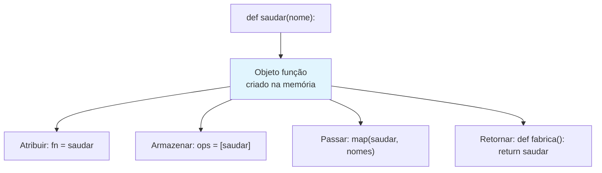
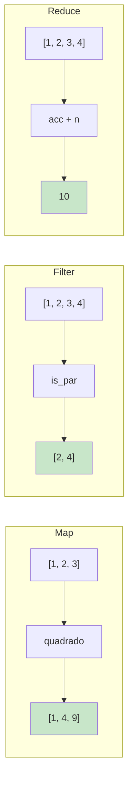

# Funções de Primeira Classe e Ordem Superior

Em Python, funções são **cidadãs de primeira classe** — podem ser atribuídas a variáveis, passadas como argumentos, retornadas de outras funções e armazenadas em estruturas de dados. **Funções de ordem superior** aproveitam isso recebendo funções como argumentos ou retornando funções como resultados.

## Funções São Objetos

Tudo em Python é um objeto, e funções não são exceção.

```python
from typing import Callable, List, Dict

# Funções têm tipo — como qualquer outro objeto
print(type(len))           # <class 'builtin_function_or_method'>

# Funções têm atributos
def saudar(nome: str) -> str:
    """Retorna uma saudação."""
    return f"Olá, {nome}!"

print(saudar.__name__)     # "saudar"
print(saudar.__doc__)      # "Retorna uma saudação."

# Atribuir a uma variável
minha_funcao = saudar
print(minha_funcao("Alice"))  # "Olá, Alice!"

# Armazenar em uma lista
operacoes = [saudar, len, str.upper]
print(operacoes[0]("Bob"))     # "Olá, Bob!"
print(operacoes[1]("olá"))     # 3
print(operacoes[2]("olá"))     # "OLÁ"

# Armazenar em um dicionário
dispacho: Dict[str, Callable] = {
    "saudar": saudar,
    "dobrar": lambda x: x * 2,
}
print(dispacho["dobrar"](5))  # 10
```



## Passando Funções como Argumentos

```python
from typing import List, Callable, TypeVar

T = TypeVar("T")

def transformar_lista(
    itens: List[T],
    fn_transformar: Callable[[T], T]
) -> List[T]:
    return [fn_transformar(item) for item in itens]

def dobrar(x: int) -> int:
    return x * 2

def quadrado(x: int) -> int:
    return x * x

numeros = [1, 2, 3, 4]
print(transformar_lista(numeros, dobrar))    # [2, 4, 6, 8]
print(transformar_lista(numeros, quadrado))  # [1, 4, 9, 16]

# Ordenação personalizada com key
alunos = [
    {"nome": "Alice", "nota": 85},
    {"nome": "Bob", "nota": 72},
    {"nome": "Carlos", "nota": 91},
]
por_nota = sorted(alunos, key=lambda a: a["nota"])
print(por_nota)
```

## A Trindade: Map, Filter, Reduce

### Map — Transformar Cada Elemento

```python
from typing import List, Callable

# map() aplica uma função a cada item de um iterável

# IMPERATIVO
def quadrado_todos_imperativo(nums: List[float]) -> List[float]:
    resultado = []
    for n in nums:
        resultado.append(n ** 2)
    return resultado

# DECLARATIVO com map
def quadrado_todos_map(nums: List[float]) -> List[float]:
    return list(map(lambda n: n ** 2, nums))

# Conversão de temperaturas
celsius = [0, 10, 20, 30, 40]
fahrenheit = list(map(lambda c: c * 9/5 + 32, celsius))
print(fahrenheit)  # [32.0, 50.0, 68.0, 86.0, 104.0]

# Map com múltiplos iteráveis
resultado = list(map(lambda a, b: a + b, [1, 2, 3], [10, 20, 30]))
print(resultado)  # [11, 22, 33]
```

### Filter — Manter Elementos Correspondentes

```python
# filter() mantém itens onde o predicado retorna True

# IMPERATIVO
def pares_imperativo(nums: List[int]) -> List[int]:
    resultado = []
    for n in nums:
        if n % 2 == 0:
            resultado.append(n)
    return resultado

# DECLARATIVO com filter
def pares_filter(nums: List[int]) -> List[int]:
    return list(filter(lambda n: n % 2 == 0, nums))

numeros = [1, 2, 3, 4, 5, 6, 7, 8, 9, 10]
print(pares_filter(numeros))  # [2, 4, 6, 8, 10]

# Filtrando dados complexos
produtos = [
    {"nome": "Notebook", "preco": 1200, "em_estoque": True},
    {"nome": "Mouse", "preco": 25, "em_estoque": False},
    {"nome": "Teclado", "preco": 80, "em_estoque": True},
]

disponivel = lambda p: p["em_estoque"] and p["preco"] < 100
disponiveis = list(filter(disponivel, produtos))
print([p["nome"] for p in disponiveis])  # ["Teclado"]
```

### Reduce — Acumular em um Único Valor

```python
from functools import reduce
from typing import List

# reduce() aplica repetidamente uma função para acumular

# IMPERATIVO
def somar_todos_imperativo(nums: List[int]) -> int:
    total = 0
    for n in nums:
        total += n
    return total

# DECLARATIVO com reduce
def somar_todos_reduce(nums: List[int]) -> int:
    return reduce(lambda acc, n: acc + n, nums, 0)

numeros = [1, 2, 3, 4, 5]
print(somar_todos_reduce(numeros))  # 15

# Reduce com dados complexos
pedidos = [
    {"id": 1, "itens": [{"preco": 10}, {"preco": 20}]},
    {"id": 2, "itens": [{"preco": 30}]},
    {"id": 3, "itens": [{"preco": 15}, {"preco": 25}]},
]

def total_receita(acc: float, pedido: dict) -> float:
    total_pedido = sum(item["preco"] for item in pedido["itens"])
    return acc + total_pedido

receita = reduce(total_receita, pedidos, 0.0)
print(f"Receita total: ${receita}")  # $100.00
```



## Encadeando Map, Filter e Reduce

```python
from functools import reduce
from typing import List, Dict, Any

transacoes = [
    {"id": 1, "valor": 150.0, "tipo": "venda", "regiao": "NA"},
    {"id": 2, "valor": 2000.0, "tipo": "venda", "regiao": "EU"},
    {"id": 3, "valor": 75.0, "tipo": "venda", "regiao": "NA"},
    {"id": 4, "valor": 300.0, "tipo": "reembolso", "regiao": "NA"},
    {"id": 5, "valor": 500.0, "tipo": "venda", "regiao": "NA"},
]

# FUNCIONAL com encadeamento
def calcular_total_funcional(transacoes: List[Dict[str, Any]]) -> float:
    return reduce(
        lambda acc, t: acc + t["valor"],
        filter(
            lambda t: t["tipo"] == "venda" and t["regiao"] == "NA" and t["valor"] > 100,
            transacoes
        ),
        0.0
    )

print(calcular_total_funcional(transacoes))  # 650.0
```

## Aplicação Parcial

`functools.partial` cria uma nova função com alguns argumentos pré-preenchidos.

```python
from functools import partial
from typing import Callable

def potencia(base: float, expoente: float) -> float:
    return base ** expoente

quadrado = partial(potencia, expoente=2)
cubo = partial(potencia, expoente=3)

print(quadrado(5))  # 25
print(cubo(3))      # 27

# Partial para processamento de dados
def formatar_entrada(nome: str, pontuacao: float, precisao: int) -> str:
    return f"{nome}: {pontuacao:.{precisao}f}"

formatar_2dec = partial(formatar_entrada, precisao=2)
print(formatar_2dec("Alice", 85.6789))  # "Alice: 85.68"
```

## Fábricas de Funções

Funções que **retornam** funções são poderosas para criar comportamentos parametrizados.

```python
from typing import Callable, List

# Fábrica de saudações
def criar_saudador(saudacao: str) -> Callable[[str], str]:
    def saudador(nome: str) -> str:
        return f"{saudacao}, {nome}!"
    return saudador

diga_ola = criar_saudador("Olá")
diga_oi = criar_saudador("Oi")
print(diga_ola("Alice"))  # "Olá, Alice!"
print(diga_oi("Bob"))     # "Oi, Bob!"

# Fábrica para chaves de ordenação
def criar_ordenador(chave: str, reverso: bool = False) -> Callable:
    def ordenador(colecao: List[dict]) -> List[dict]:
        return sorted(colecao, key=lambda x: x[chave], reverse=reverso)
    return ordenador

alunos = [
    {"nome": "Alice", "nota": 85},
    {"nome": "Bob", "nota": 92},
    {"nome": "Carlos", "nota": 78},
]

ordenar_por_nota = criar_ordenador("nota")
print(ordenar_por_nota(alunos))
```

## Decorators São Funções de Ordem Superior

```python
from typing import Callable, Any
from functools import wraps
import time

def cronometrar(func: Callable) -> Callable:
    @wraps(func)
    def wrapper(*args: Any, **kwargs: Any) -> Any:
        inicio = time.perf_counter()
        resultado = func(*args, **kwargs)
        decorrido = time.perf_counter() - inicio
        print(f"{func.__name__} levou {decorrido:.4f}s")
        return resultado
    return wrapper

@cronometrar
def calculo_lento(n: int) -> int:
    sum(i ** 2 for i in range(1000000))
    return n * n

print(calculo_lento(5))
```

## Comparação: Map/Filter/Reduce vs Loops

| Aspecto | Loop Imperativo | Funcional (map/filter/reduce) |
|---------|----------------|-------------------------------|
| **Intenção** | Enterrada na mecânica do loop | Expressa no nome da função |
| **Estado** | Variável acumuladora | Pipeline imutável |
| **Reuso** | Reescrever loop cada vez | Compor funções existentes |
| **Teste** | Testar o loop inteiro | Testar cada função independentemente |
| **Paralelismo** | Threading manual | `multiprocessing.Pool.map` |
| **Concisão** | Verboso | Conciso |

## Exercícios Práticos

1. Use `map` para converter temperaturas Celsius para Fahrenheit: `[0, 10, 20, 30, 40]`.

2. Use `filter` para extrair todas as strings com mais de 5 caracteres de `["gato", "elefante", "cachorro", "borboleta"]`.

3. Use `reduce` para calcular o produto de todos os números em uma lista.

4. Encadeie `map`, `filter` e `reduce` para: filtrar pares, elevar ao quadrado, somar os quadrados.

5. Crie uma fábrica de funções `criar_descontador` que recebe um percentual de desconto e retorna uma função que aplica o desconto.

6. Implemente `meu_map`, `meu_filter` e `meu_reduce` do zero usando loops.

7. Use `functools.partial` para criar funções `dobrar`, `triplicar` a partir de uma função `multiplicar`.

8. Use `reduce` para construir um dicionário mapeando nomes de cidades para suas populações.

## Resumo

- **Funções de primeira classe** podem ser atribuídas, passadas e retornadas
- **map** transforma cada elemento de uma coleção
- **filter** mantém elementos que satisfazem um predicado
- **reduce** acumula elementos em um único valor
- **Encadeamento** destas funções cria pipelines expressivas
- **Aplicação parcial** pré-preenche argumentos
- **Fábricas de funções** retornam funções parametrizadas via closures

> [!WARNING]
> Não abuse de `reduce` quando existir uma alternativa mais simples. Use `sum()`, `any()`, `all()`, `max()` para casos comuns e reserve `reduce` para acumulações verdadeiramente personalizadas.
