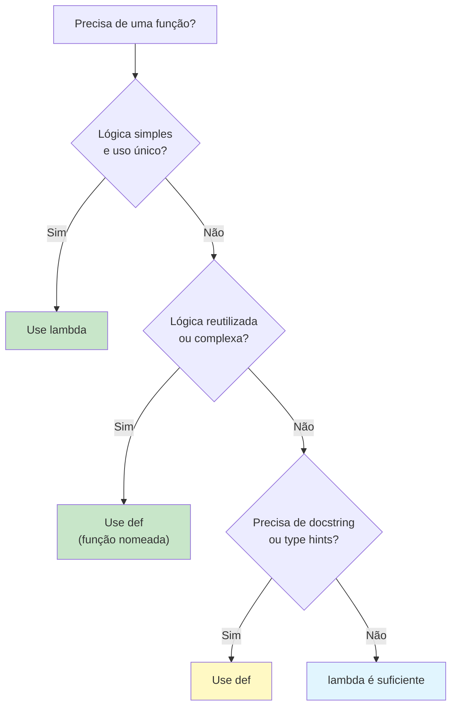
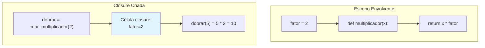

# Funções Lambda e Closures

Funções lambda (funções anônimas) e closures são ferramentas essenciais no kit do programador funcional. Lambdas fornecem definições concisas de funções inline, enquanto closures capturam e lembram o ambiente em que foram criadas.

## Funções Lambda

Uma **função lambda** é uma pequena função anônima definida com a palavra-chave `lambda`. Pode receber qualquer número de argumentos, mas retorna apenas uma expressão.

```python
from typing import Callable, List

# Sintaxe: lambda argumentos: expressão

# Equivalente com função nomeada
def adicionar_um(x: int) -> int:
    return x + 1

# Equivalente com lambda
adicionar_um_lambda = lambda x: x + 1

print(adicionar_um(5))              # 6
print(adicionar_um_lambda(5))       # 6

# Múltiplos argumentos
multiplicar = lambda a, b: a * b
print(multiplicar(3, 4))  # 12

# Argumentos padrão
potencia = lambda base, exp=2: base ** exp
print(potencia(5))     # 25
print(potencia(2, 10)) # 1024

# Uso comum: ordenação com chave personalizada
alunos = [
    {"nome": "Alice", "nota": 85},
    {"nome": "Bob", "nota": 72},
    {"nome": "Carlos", "nota": 91},
]
por_nota = sorted(alunos, key=lambda a: a["nota"], reverse=True)
print([a["nome"] for a in por_nota])
# ["Carlos", "Alice", "Bob"]
```

> [!NOTE]
> O corpo de um lambda é limitado a uma única expressão — você não pode usar statements como `return`, `if`/`elif`/`else` (embora possa usar a expressão ternária) ou loops. Se precisar de mais complexidade, use uma função nomeada.

## Quando Usar Lambdas

```python
from typing import List
from functools import reduce
from collections import defaultdict

# 1. Inline com sorted, max, min
palavras = ["python", "java", "javascript", "c", "rust"]
mais_longa = max(palavras, key=lambda w: len(w))
print(mais_longa)  # "javascript"

# 2. Com map, filter, reduce
numeros = [1, 2, 3, 4, 5]
quadrados = list(map(lambda x: x ** 2, numeros))
pares = list(filter(lambda x: x % 2 == 0, numeros))
produto = reduce(lambda a, b: a * b, numeros)

print(quadrados)  # [1, 4, 9, 16, 25]
print(pares)      # [2, 4]
print(produto)    # 120

# 3. Fábrica em defaultdict
agrupado = defaultdict(lambda: [])
itens = [("fruta", "maçã"), ("fruta", "banana"), ("cor", "vermelho")]
for categoria, valor in itens:
    agrupado[categoria].append(valor)
print(dict(agrupado))
# {"fruta": ["maçã", "banana"], "cor": ["vermelho"]}
```

## Quando NÃO Usar Lambdas

```python
from typing import List, Dict, Any, Tuple

# RUIM: Lambda complexo — difícil de ler
processar_complexo = lambda itens: list(
    filter(lambda x: x["nota"] >= 50,
        sorted(itens, key=lambda x: (-x["nota"], x["nome"])))
)

# BOM: Função nomeada — intenção clara
def processar_itens(itens: List[Dict[str, Any]]) -> List[Dict[str, Any]]:
    def pontuacao_valida(item: Dict[str, Any]) -> bool:
        return item["nota"] >= 50

    def chave_ordenacao(item: Dict[str, Any]) -> Tuple[int, str]:
        return (-item["nota"], item["nome"])

    return list(filter(pontuacao_valida, sorted(itens, key=chave_ordenacao)))
```



## Closures

Uma **closure** é uma função que lembra as variáveis do escopo envolvente mesmo depois que esse escopo terminou sua execução.

```python
from typing import Callable

# Exemplo básico de closure
def criar_multiplicador(fator: int) -> Callable[[int], int]:
    def multiplicador(x: int) -> int:
        return x * fator  # fator é capturado do escopo envolvente
    return multiplicador

dobrar = criar_multiplicador(2)
triplicar = criar_multiplicador(3)

print(dobrar(5))    # 10
print(triplicar(5)) # 15

# A closure captura a variável, não apenas o valor
def criar_contadores():
    contagem = [0]

    def incrementar() -> int:
        contagem[0] += 1
        return contagem[0]

    def resetar() -> None:
        contagem[0] = 0

    return incrementar, resetar

inc, reset = criar_contadores()
print(inc())  # 1
print(inc())  # 2
reset()
print(inc())  # 1
```

## Como Closures Funcionam

```python
from typing import Callable

def externa(msg: str) -> Callable[[], str]:
    def interna() -> str:
        return f"Mensagem: {msg}"
    return interna

fn = externa("Olá, Mundo!")
print(fn())  # "Mensagem: Olá, Mundo!"

# Inspecionando internamente a closure
print(fn.__closure__)
print(fn.__code__.co_freevars)
print(fn.__closure__[0].cell_contents)  # "Olá, Mundo!"

# Múltiplas camadas de closure
def criar_formatador(prefixo: str, sufixo: str) -> Callable[[str], str]:
    def formatador(valor: str) -> str:
        return f"{prefixo}{valor}{sufixo}"
    return formatador

colchetes = criar_formatador("[", "]")
angulares = criar_formatador("<", ">")

print(colchetes("Alice"))  # "[Alice]"
print(angulares("Bob"))    # "<Bob>"
```

> [!WARNING]
> Closures capturam variáveis por referência, não por valor. Se a variável capturada mudar depois que a closure é criada, a closure vê o novo valor. Isso pode causar comportamento surpreendente em loops.

## A Armadilha do Lambda em Loop

```python
from typing import List, Callable

# ERRADO: Todas as closures capturam a mesma variável
def construir_funcoes_errado() -> List[Callable[[], int]]:
    funcs = []
    for i in range(5):
        funcs.append(lambda: i ** 2)
    return funcs

for f in construir_funcoes_errado():
    print(f(), end=" ")  # 16 16 16 16 16

# CORRETO: Capturar o valor atual via argumento padrão
def construir_funcoes_correto() -> List[Callable[[], int]]:
    funcs = []
    for i in range(5):
        funcs.append(lambda x=i: x ** 2)
    return funcs

for f in construir_funcoes_correto():
    print(f(), end=" ")  # 0 1 4 9 16
```

## Closures para Encapsulamento

```python
from typing import Callable, Tuple

# Contador usando closure (sem classe)
def criar_contador(inicio: int = 0) -> Tuple[Callable[[], int], Callable[[], int]]:
    contagem = inicio

    def incrementar() -> int:
        nonlocal contagem
        contagem += 1
        return contagem

    def obter_contagem() -> int:
        return contagem

    return incrementar, obter_contagem

inc, obter = criar_contador(10)
print(inc())  # 11
print(inc())  # 12
print(obter())  # 12

# Conta bancária usando closures
def criar_conta(titular: str, saldo_inicial: float = 0.0) -> dict:
    saldo = saldo_inicial

    def depositar(valor: float) -> float:
        nonlocal saldo
        if valor <= 0:
            raise ValueError("Valor deve ser positivo")
        saldo += valor
        return saldo

    def sacar(valor: float) -> float:
        nonlocal saldo
        if valor <= 0:
            raise ValueError("Valor deve ser positivo")
        if valor > saldo:
            raise ValueError("Saldo insuficiente")
        saldo -= valor
        return saldo

    def info() -> dict:
        return {"titular": titular, "saldo": saldo}

    return {"depositar": depositar, "sacar": sacar, "info": info}

conta = criar_conta("Alice", 1000)
conta["depositar"](500)
conta["sacar"](200)
print(conta["info"]())  # {'titular': 'Alice', 'saldo': 1300}
```



## Decorators São Closures

```python
from typing import Callable, Any
from functools import wraps
import time

def registrar_chamadas(func: Callable) -> Callable:
    @wraps(func)
    def wrapper(*args: Any, **kwargs: Any) -> Any:
        args_str = ", ".join([repr(a) for a in args] + [f"{k}={v!r}" for k, v in kwargs.items()])
        print(f"Chamando: {func.__name__}({args_str})")
        resultado = func(*args, **kwargs)
        print(f"Retornou: {resultado!r}")
        return resultado
    return wrapper

@registrar_chamadas
def somar(a: int, b: int) -> int:
    return a + b

somar(3, 5)
# Chamando: somar(3, 5)
# Retornou: 8

# Decorator com argumentos (fábrica + closure)
def tentar_novamente(max_tentativas: int = 3, espera: float = 0.1) -> Callable:
    def decorator(func: Callable) -> Callable:
        @wraps(func)
        def wrapper(*args: Any, **kwargs: Any) -> Any:
            for tentativa in range(max_tentativas):
                try:
                    return func(*args, **kwargs)
                except Exception as e:
                    if tentativa == max_tentativas - 1:
                        raise
                    time.sleep(espera)
            return None
        return wrapper
    return decorator
```

## Comparação: Funções vs Lambdas

| Aspecto | `def` (Função) | `lambda` |
|---------|---------------|----------|
| **Nome** | Nomeada (obrigatório) | Anônima |
| **Statements** | Múltiplos permitidos | Apenas expressão única |
| **Retorno** | `return` explícito | Implícito (resultado da expressão) |
| **Documentação** | Pode ter docstring | Sem docstring |
| **Type hints** | Suportado | Não suportado |
| **Reuso** | Por nome, em qualquer lugar | Apenas inline |
| **Legibilidade** | Melhor para lógica complexa | Melhor para transformações simples |
| **Debug** | Stack trace mostra nome | Stack trace mostra `<lambda>` |

## Exercícios Práticos

1. Use um lambda com `sorted()` para ordenar uma lista de tuplas `[(1, "z"), (3, "a"), (2, "c")]` pelo segundo elemento.

2. Escreva uma closure `criar_contador(passo)` que cria um contador incrementando pelo passo dado.

3. Corrija o seguinte bug de lambda em loop:
   ```python
   multiplicadores = [lambda x: x * i for i in range(5)]
   ```

4. Crie uma closure `criar_validador_de_senha` que recebe uma senha válida e retorna uma função que verifica se uma senha corresponde.

5. Escreva um decorator `@validar_argumentos` que verifica se todos os argumentos são inteiros positivos.

6. Use um lambda com `filter` para extrair palíndromos de uma lista de strings.

7. Implemente `criar_media` como uma closure que mantém uma média contínua.

8. Crie uma função `criar_comparador(chave, reverso=False)` que retorna um lambda para uso como key em `sorted()`.

## Resumo

- **Funções lambda** fornecem definições de função anônimas e concisas
- Use lambdas para operações simples e únicas; prefira `def` para lógica complexa
- **Closures** capturam variáveis do escopo envolvente por referência
- Closures permitem encapsulamento sem classes (estado privado via `nonlocal`)
- O **bug do lambda em loop** ocorre porque todas as closures compartilham a mesma variável
- **Decorators** são closures que envolvem outras funções

> [!SUCCESS]
> Você agora entende lambdas e closures — a base para composição de funções, aplicação parcial e muitos padrões funcionais avançados.
