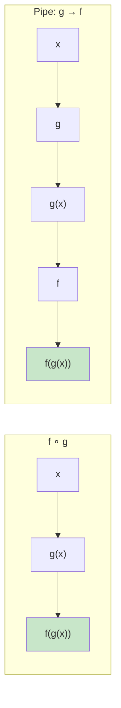
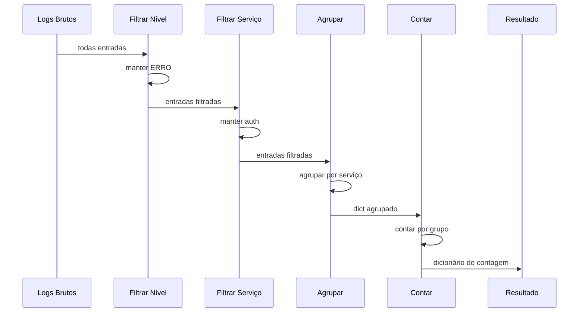

# Composição de Funções

Composição de funções é o processo de combinar duas ou mais funções para produzir uma nova função. Em matemática, a composição é escrita como `(f ∘ g)(x) = f(g(x))`. Em programação, é o mecanismo fundamental para construir comportamento complexo a partir de funções simples e focadas.

## O Poder da Composição

Funções pequenas e puras são fáceis de escrever, testar e raciocinar. A composição permite combiná-las em pipelines poderosas.

```python
from typing import Callable, TypeVar, Any

A = TypeVar("A")
B = TypeVar("B")
C = TypeVar("C")

# Composição manual
def compor2(f: Callable[[B], C], g: Callable[[A], B]) -> Callable[[A], C]:
    """Compõe duas funções: (f ∘ g)(x) = f(g(x))"""
    def composta(x: A) -> C:
        return f(g(x))
    return composta

def adicionar_um(x: int) -> int:
    return x + 1

def dobrar(x: int) -> int:
    return x * 2

# Compor: adicionar_um depois de dobrar
f1 = compor2(adicionar_um, dobrar)
print(f1(5))  # dobrar(5) + 1 = 11

# Compor: dobrar depois de adicionar_um
f2 = compor2(dobrar, adicionar_um)
print(f2(5))  # (5 + 1) * 2 = 12
```



## Construindo um Utilitário de Composição

```python
from typing import Callable, Any

# Compõe da direita para a esquerda: compose(f, g, h)(x) => f(g(h(x)))
def compor(*funcs: Callable) -> Callable:
    if not funcs:
        return lambda x: x
    def composta(x: Any) -> Any:
        resultado = x
        for func in reversed(funcs):
            resultado = func(resultado)
        return resultado
    return composta

# Pipe da esquerda para a direita: pipe(f, g, h)(x) => h(g(f(x)))
def pipe(*funcs: Callable) -> Callable:
    if not funcs:
        return lambda x: x
    def piped(x: Any) -> Any:
        resultado = x
        for func in funcs:
            resultado = func(resultado)
        return resultado
    return piped

def adicionar_um(x: int) -> int:
    return x + 1

def dobrar(x: int) -> int:
    return x * 2

def quadrado(x: int) -> int:
    return x ** 2

composta = compor(quadrado, dobrar, adicionar_um)
print(composta(3))  # quadrado(dobrar(adicionar_um(3))) = 64

piped = pipe(adicionar_um, dobrar, quadrado)
print(piped(3))  # adicionar_um(3)=4 -> dobrar(4)=8 -> quadrado(8)=64
```

> [!NOTE]
> `compor` aplica funções da direita para a esquerda (convenção matemática), enquanto `pipe` aplica da esquerda para a direita (convenção Unix). Em Python, pipe é geralmente mais legível.

## Estilo Point-Free

**Estilo point-free** (também chamado de programação tácita) define funções sem mencionar explicitamente seus argumentos.

```python
from typing import Callable, List
from functools import partial

# POINTFUL: argumentos são explícitos
def dobrar_todos_pt(numeros: List[int]) -> List[int]:
    return list(map(lambda x: x * 2, numeros))

# Exemplo mais prático:

# POINTFUL
def obter_nomes_adultos_pt(usuarios: List[dict]) -> List[str]:
    adultos = filter(lambda u: u["idade"] >= 18, usuarios)
    nomes = map(lambda u: u["nome"], adultos)
    return list(nomes)

# POINT-FREE
def eh_adulto(usuario: dict) -> bool:
    return usuario["idade"] >= 18

def obter_nome(usuario: dict) -> str:
    return usuario["nome"]

obter_nomes_adultos_pf = lambda usuarios: list(map(obter_nome, filter(eh_adulto, usuarios)))

usuarios = [
    {"nome": "Alice", "idade": 25},
    {"nome": "Bob", "idade": 17},
    {"nome": "Carlos", "idade": 30},
]

print(obter_nomes_adultos_pt(usuarios))  # ["Alice", "Carlos"]
print(obter_nomes_adultos_pf(usuarios))  # ["Alice", "Carlos"]
```

> [!WARNING]
> O estilo point-free pode prejudicar a legibilidade quando usado em excesso. Use-o quando o pipeline for claro e as funções intermediárias nomeadas forem reutilizáveis.

## Pipelines de Dados Reais

```python
from typing import List, Dict, Any, Callable

entradas_log = [
    {"timestamp": "2025-01-15T10:30:00", "nivel": "ERRO", "servico": "auth", "msg": "Conexão recusada"},
    {"timestamp": "2025-01-15T10:31:00", "nivel": "INFO", "servico": "api", "msg": "Requisição atendida"},
    {"timestamp": "2025-01-15T10:32:00", "nivel": "ERRO", "servico": "db", "msg": "Timeout excedido"},
    {"timestamp": "2025-01-15T10:33:00", "nivel": "AVISO", "servico": "auth", "msg": "Limite de taxa próximo"},
    {"timestamp": "2025-01-15T10:34:00", "nivel": "ERRO", "servico": "auth", "msg": "Falha de autenticação"},
]

def filtrar_por_nivel(nivel: str) -> Callable:
    def filtrar(entradas: List[Dict[str, Any]]) -> List[Dict[str, Any]]:
        return [e for e in entradas if e["nivel"] == nivel]
    return filtrar

def contar_por_campo(campo: str) -> Callable:
    def contar(entradas: List[Dict[str, Any]]) -> Dict[str, int]:
        resultado = {}
        for e in entradas:
            chave = e[campo]
            resultado[chave] = resultado.get(chave, 0) + 1
        return resultado
    return contar

def ordenar_resultados(por: str, reverso: bool = False) -> Callable:
    def ordenar(itens: list) -> list:
        return sorted(itens, key=lambda x: x[por] if isinstance(x, dict) else x, reverse=reverso)
    return ordenar

def pipeline(*etapas: Callable) -> Callable:
    def executar(dados: Any) -> Any:
        resultado = dados
        for etapa in etapas:
            resultado = etapa(resultado)
        return resultado
    return executar

analise_erros = pipeline(
    filtrar_por_nivel("ERRO"),
    contar_por_campo("servico"),
    ordenar_resultados(por="value", reverso=True),
)

print(analise_erros(entradas_log))
# {'auth': 2, 'db': 1}
```



## Compondo com Decorators

```python
from typing import Callable, Any
from functools import wraps
import time

def maiusculas(func: Callable) -> Callable:
    @wraps(func)
    def wrapper(*args: Any, **kwargs: Any) -> str:
        resultado = func(*args, **kwargs)
        return resultado.upper() if isinstance(resultado, str) else resultado
    return wrapper

def exclamar(func: Callable) -> Callable:
    @wraps(func)
    def wrapper(*args: Any, **kwargs: Any) -> str:
        resultado = func(*args, **kwargs)
        return f"{resultado}!" if isinstance(resultado, str) else resultado
    return wrapper

@exclamar
@maiusculas
def saudar(nome: str) -> str:
    return f"Olá, {nome}"

print(saudar("Alice"))  # "OLÁ, ALICE!"
```

## Compondo Funções com Tipos Diferentes

```python
from typing import Callable, List, Any

def extrair(campo: str) -> Callable[[dict], Any]:
    return lambda item: item[campo]

def filtrar(predicado: Callable) -> Callable[[List], List]:
    return lambda itens: list(filter(predicado, itens))

def cada(transformar: Callable) -> Callable[[List], List]:
    return lambda itens: list(map(transformar, itens))

def ordenar_por(fn_chave: Callable, reverso: bool = False) -> Callable[[List], List]:
    return lambda itens: sorted(itens, key=fn_chave, reverse=reverso)

def pegar(n: int) -> Callable[[List], List]:
    return lambda itens: itens[:n]

def compor_pipeline(*etapas: Callable) -> Callable:
    def pipeline(dados: Any) -> Any:
        resultado = dados
        for etapa in etapas:
            resultado = etapa(resultado)
        return resultado
    return pipeline

dados = [
    {"nome": "Alice", "nota": 85, "idade": 25},
    {"nome": "Bob", "nota": 72, "idade": 17},
    {"nome": "Carlos", "nota": 91, "idade": 30},
    {"nome": "Diana", "nota": 95, "idade": 22},
]

top_alunos = compor_pipeline(
    filtrar(lambda u: u["idade"] >= 18),
    ordenar_por(extrair("nota"), reverso=True),
    pegar(3),
    cada(extrair("nome")),
)

print(top_alunos(dados))  # ["Diana", "Carlos", "Alice"]
```

## Classe Query com Encadeamento

```python
from typing import List, Any

class Query:
    def __init__(self, dados: List[dict]):
        self._dados = dados

    def onde(self, predicado) -> "Query":
        return Query(list(filter(predicado, self._dados)))

    def selecionar(self, *campos: str) -> "Query":
        return Query([
            {k: v for k, v in item.items() if k in campos}
            for item in self._dados
        ])

    def ordenar_por(self, chave: str, reverso: bool = False) -> "Query":
        return Query(
            sorted(self._dados, key=lambda x: x[chave], reverse=reverso)
        )

    def limitar(self, n: int) -> "Query":
        return Query(self._dados[:n])

    def executar(self) -> List[dict]:
        return self._dados

dados = [
    {"nome": "Alice", "nota": 85, "idade": 25},
    {"nome": "Bob", "nota": 72, "idade": 17},
    {"nome": "Carlos", "nota": 91, "idade": 30},
]

resultado = (
    Query(dados)
    .onde(lambda u: u["idade"] >= 18)
    .ordenar_por("nota", reverso=True)
    .limitar(2)
    .selecionar("nome", "nota")
    .executar()
)
print(resultado)
```

## Comparação: Compose vs Pipe vs Encadeamento

| Aspecto | Compose (D→E) | Pipe (E→D) | Encadeamento |
|---------|--------------|------------|--------------|
| **Direção** | Direita para esquerda | Esquerda para direita | Esquerda para direita |
| **Sintaxe** | `compor(f, g)(x)` | `pipe(f, g)(x)` | `x.f().g()` |
| **Legibilidade** | Convenção matemática | Convenção pipeline | Convenção POO |
| **Pythonicidade** | Menos Pythônica | Mais Pythônica | Muito Pythônica |
| **Origem** | Funções avulsas | Funções avulsas | Métodos no objeto |

## Exercícios Práticos

1. Implemente `compor` que aceita qualquer número de funções e as compõe da direita para a esquerda.

2. Escreva uma função `pipe` e crie um pipeline que: recebe uma lista de strings, converte para minúsculas, remove duplicatas, ordena alfabeticamente e junta com ", ".

3. Refatore para estilo point-free com funções auxiliares nomeadas:
   ```python
   resultado = sorted(
       map(lambda x: x.upper(),
           filter(lambda s: len(s) > 3, palavras)),
       reverse=True
   )
   ```

4. Crie um utilitário `compor_com_log` que registra cada chamada de função com entrada e saída.

5. Construa um pipeline de processamento de pedidos: filtrar pagos, aplicar frete, agrupar por região, calcular total por região.

6. Implemente uma variante `pipe_seguro` que captura exceções em cada etapa e retorna tuplas `(resultado, erro)`.

7. Use encadeamento para construir uma classe `ProcessadorTexto` com métodos `strip()`, `capitalizar()`, `remover_pontuacao()`, `truncar(n)`.

8. O que o seguinte código produz?
   ```python
   f = lambda x: x + 2
   g = lambda x: x * 3
   h = pipe(f, g, f)
   print(h(5))
   ```

## Resumo

- **Composição de funções** combina funções simples em pipelines complexas
- **Compose** aplica da direita para a esquerda; **pipe** da esquerda para a direita
- **Estilo point-free** omite argumentos explícitos
- **Decorators** são uma forma de composição de funções
- **Encadeamento de métodos** fornece composição de API fluente
- Cada função composta deve fazer uma coisa bem — a composição cria o comportamento complexo

> [!SUCCESS]
> Composição de funções é o superpoder que transforma funções pequenas e focadas em programas expressivos e sustentáveis.
