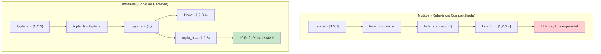

# Imutabilidade na Prática

Imutabilidade é um pilar da programação funcional. Quando os dados não podem ser alterados, os programas se tornam mais fáceis de raciocinar, testar e paralelizar. Esta lição aborda técnicas práticas para trabalhar com dados imutáveis em Python.

## Por Que Imutabilidade Importa

Estado mutável é a fonte de inúmeros bugs, especialmente em sistemas multi-thread ou complexos. A imutabilidade elimina categorias inteiras de erros.

```python
from typing import List, Tuple

# MUTÁVEL — condição de corrida em potencial
class ContaMutavel:
    def __init__(self, saldo: float):
        self.saldo = saldo

    def sacar(self, valor: float) -> bool:
        if self.saldo >= valor:
            self.saldo -= valor
            return True
        return False

# IMUTÁVEL — thread-safe por design
class ContaImutavel:
    def __init__(self, saldo: float):
        self._saldo = saldo

    @property
    def saldo(self) -> float:
        return self._saldo

    def sacar(self, valor: float) -> Tuple["ContaImutavel", bool]:
        if self._saldo >= valor:
            return ContaImutavel(self._saldo - valor), True
        return self, False

# Demonstração de bug de alias
def demonstra_bug_alias() -> None:
    original: List[int] = [1, 2, 3]
    alias = original
    original.append(4)
    print(alias)  # [1, 2, 3, 4] — inesperado!

    # Com imutabilidade, isso não acontece
    original_tuple = (1, 2, 3)
    alias_tuple = original_tuple
    print(alias_tuple)  # (1, 2, 3) — inalterado

demonstra_bug_alias()
```



## Tipos Imutáveis Nativos do Python

```python
from typing import Tuple, NamedTuple
from collections import namedtuple

# tuple — sequência imutável
ponto = (3, 4)

# str — texto imutável
nome = "Alice"

# frozenset — conjunto imutável
congelado = frozenset([1, 2, 3])

# Named tuple — registro imutável
Ponto = namedtuple("Ponto", ["x", "y", "z"])
pt = Ponto(1, 2, 3)
print(pt.x)  # 1

# NamedTuple com type hints
class Aluno(NamedTuple):
    nome: str
    nota: float
    ativo: bool = True

a = Aluno("Alice", 85.5)
print(a.nome)   # "Alice"
```

> [!NOTE]
> NamedTuple e `@dataclass(frozen=True)` são as formas mais práticas de criar estruturas de dados imutáveis em Python.

## Dataclasses Congeladas

```python
from dataclasses import dataclass, replace
from typing import Tuple

@dataclass(frozen=True)
class Produto:
    id: int
    nome: str
    preco: float
    tags: Tuple[str, ...]

p = Produto(1, "Notebook", 1200.0, ("eletrônicos", "computadores"))

# Copiar com alterações
p_descontado = replace(p, preco=1100.0)
print(p_descontado.preco)  # 1100.0
print(p.preco)             # 1200.0 — original inalterado

@dataclass(frozen=True)
class Pedido:
    id: int
    cliente: str
    itens: Tuple[Produto, ...]
    total: float

    def aplicar_desconto(self, taxa: float) -> "Pedido":
        novo_total = self.total * (1 - taxa)
        return replace(self, total=round(novo_total, 2))

    def adicionar_item(self, produto: Produto) -> "Pedido":
        novos_itens = self.itens + (produto,)
        novo_total = self.total + produto.preco
        return replace(self, itens=novos_itens, total=round(novo_total, 2))
```

## Evitando Mutação na Prática

```python
from typing import List, Dict, Any

# RUIM: Mutando argumentos
def adicionar_nota_ruim(notas: List[int], nova_nota: int) -> None:
    notas.append(nova_nota)

# BOM: Retornar nova coleção
def adicionar_nota_bom(notas: List[int], nova_nota: int) -> List[int]:
    return notas + [nova_nota]

original = [85, 90, 78]
resultado = adicionar_nota_bom(original, 95)
print(original)  # [85, 90, 78] — inalterado
print(resultado) # [85, 90, 78, 95]

# RUIM: Mutando dicionário in-place
def atualizar_usuario_ruim(usuario: Dict[str, Any], mudancas: Dict[str, Any]) -> None:
    usuario.update(mudancas)

# BOM: Retornar novo dicionário
def atualizar_usuario_bom(usuario: Dict[str, Any], mudancas: Dict[str, Any]) -> Dict[str, Any]:
    return {**usuario, **mudancas}

usuario = {"id": 1, "nome": "Alice", "nota": 85}
atualizado = atualizar_usuario_bom(usuario, {"nota": 90, "nivel": "avançado"})
print(usuario)     # {"id": 1, "nome": "Alice", "nota": 85}
print(atualizado)  # {"id": 1, "nome": "Alice", "nota": 90, "nivel": "avançado"}
```

## Imutabilidade Profunda vs Superficial

```python
from typing import List, Tuple, Dict, Any
from dataclasses import dataclass, replace

# Imutabilidade superficial
@dataclass(frozen=True)
class ImutavelSuperficial:
    dados: List[int]  # A referência é congelada, mas a lista é mutável!

# A lista interna pode ser modificada:
s = ImutavelSuperficial([1, 2, 3])
s.dados.append(4)  # Funciona! — muta a lista dentro de um objeto "imutável"

# Imutabilidade profunda
@dataclass(frozen=True)
class ImutavelProfundo:
    dados: Tuple[int, ...]  # Tuple é verdadeiramente imutável

d = ImutavelProfundo((1, 2, 3))
# d.dados[0] = 99  # TypeError!

# Estrutura aninhada profundamente imutável
@dataclass(frozen=True)
class Endereco:
    rua: str
    cidade: str
    cep: str

@dataclass(frozen=True)
class Pessoa:
    nome: str
    idade: int
    endereco: Endereco

    def mudar_endereco(self, novo_endereco: Endereco) -> "Pessoa":
        return replace(self, endereco=novo_endereco)
```

## Padrões de Dados Imutáveis para Aplicações Reais

```python
from typing import Tuple, Dict, Any, Optional
from dataclasses import dataclass, replace

# Padrão Reducer (como Redux)
@dataclass(frozen=True)
class EstadoApp:
    contagem: int = 0
    usuarios: Tuple[Dict[str, Any], ...] = ()
    carregando: bool = False

def reducer(estado: EstadoApp, acao: Dict[str, Any]) -> EstadoApp:
    tipo = acao.get("type")
    if tipo == "INCREMENTAR":
        return replace(estado, contagem=estado.contagem + 1)
    elif tipo == "ADICIONAR_USUARIO":
        return replace(estado, usuarios=estado.usuarios + (acao["usuario"],))
    elif tipo == "DEFINIR_CARREGANDO":
        return replace(estado, carregando=acao["carregando"])
    return estado

estado = EstadoApp()
estado = reducer(estado, {"type": "INCREMENTAR"})
estado = reducer(estado, {"type": "ADICIONAR_USUARIO", "usuario": {"nome": "Alice"}})
print(estado)
# EstadoApp(contagem=1, usuarios=({'nome': 'Alice'},), carregando=False)

# Padrão Builder imutável
@dataclass(frozen=True)
class ConstrutorConsulta:
    tabela: str = ""
    campos: Tuple[str, ...] = ()
    onde: Tuple[Tuple[str, str, Any], ...] = ()

    def da_tabela(self, tabela: str) -> "ConstrutorConsulta":
        return replace(self, tabela=tabela)

    def selecionar(self, *campos: str) -> "ConstrutorConsulta":
        return replace(self, campos=campos)

    def condicao(self, campo: str, op: str, valor: Any) -> "ConstrutorConsulta":
        return replace(self, onde=self.onde + ((campo, op, valor),))

    def construir(self) -> str:
        partes = [f"SELECT {', '.join(self.campos) if self.campos else '*'}"]
        if self.tabela:
            partes.append(f"FROM {self.tabela}")
        if self.onde:
            condicoes = [f"{c} {o} {v!r}" for c, o, v in self.onde]
            partes.append(f"WHERE {' AND '.join(condicoes)}")
        return " ".join(partes)

consulta = (
    ConstrutorConsulta()
    .da_tabela("usuarios")
    .selecionar("nome", "email")
    .condicao("idade", ">", 18)
    .construir()
)
print(consulta)
# SELECT nome, email FROM usuarios WHERE idade > 18
```

## Cópia Defensiva

```python
from typing import Dict, Any, Callable
from copy import deepcopy
from functools import wraps

class InvólucroImutável:
    def __init__(self, dados: Dict[str, Any]):
        self._dados = deepcopy(dados)

    def obter_dados(self) -> Dict[str, Any]:
        return deepcopy(self._dados)

    def obter_valor(self, chave: str) -> Any:
        return deepcopy(self._dados.get(chave))

# Decorator para cópia defensiva
def proteger_argumentos(func: Callable) -> Callable:
    @wraps(func)
    def wrapper(*args: Any, **kwargs: Any) -> Any:
        args_protegidos = [deepcopy(a) for a in args]
        kwargs_protegidos = {k: deepcopy(v) for k, v in kwargs.items()}
        return func(*args_protegidos, **kwargs_protegidos)
    return wrapper

@proteger_argumentos
def processar_dados(dados: list) -> list:
    dados.append(999)  # Isso não afeta o chamador
    return [x * 2 for x in dados]

dados = [1, 2, 3]
resultado = processar_dados(dados)
print(dados)     # [1, 2, 3] — protegido!
```

## Imutabilidade e Performance

```python
from typing import List, Tuple
import time

# RUIM: Concatenação repetida cria muitas cópias intermediárias
def construir_lista_ruim(n: int) -> List[int]:
    resultado: List[int] = []
    for i in range(n):
        resultado = resultado + [i]  # O(n) cada vez
    return resultado

# BOM: Construir mutável localmente, congelar na fronteira
def construir_lista_bom(n: int) -> Tuple[int, ...]:
    resultado: List[int] = []
    for i in range(n):
        resultado.append(i)  # O(1) amortizado
    return tuple(resultado)

n = 10000
inicio = time.perf_counter()
ruim = construir_lista_ruim(n)
tempo_ruim = time.perf_counter() - inicio

inicio = time.perf_counter()
bom = construir_lista_bom(n)
tempo_bom = time.perf_counter() - inicio

print(f"Ruim: {tempo_ruim:.3f}s, Bom: {tempo_bom:.3f}s")
```

## Comparação de Imutabilidade

| Técnica | Performance | Memória | Segurança | Uso |
|---------|------------|---------|-----------|-----|
| **tuple** | Leitura rápida | Baixa | Alta | Sequências fixas |
| **NamedTuple** | Leitura rápida | Baixa | Alta | Registros simples |
| **frozen dataclass** | Leitura rápida | Baixa | Alta | Dados estruturados |
| **frozenset** | Associação rápida | Média | Alta | Coleções únicas |
| **str** | Leitura rápida | Baixa | Alta | Texto |
| **deepcopy** | Lenta (O(n)) | Alta | Alta | Defesa de fronteira |

## Exercícios Práticos

1. Refatore esta classe mutável para ser imutável:
   ```python
   class CarrinhoCompras:
       def __init__(self):
           self.itens = []
           self.total = 0.0
       def adicionar_item(self, nome, preco):
           self.itens.append(nome)
           self.total += preco
   ```

2. Escreva `atualizar_em(d, chaves, func)` que retorna um novo dict aninhado sem mutar o original.

3. Crie um pipeline que: filtra transações com valor > 100, agrupa por categoria, retorna total por categoria como dataclass congelada.

4. Implemente uma `Pilha` em estilo imutável. `push` e `pop` retornam novas pilhas.

5. Crie um decorator `@congelar_argumentos` que converte argumentos mutáveis em equivalentes imutáveis.

6. Implemente um sistema de undo/redo onde cada estado é uma estrutura persistente.

7. Compare a performance de construir uma lista de 10000 elementos usando: (a) concatenação de tuplas, (b) lista depois tupla, (c) pvector do pyrsistent.

8. Refatore este código mutável para usar padrões imutáveis:
   ```python
   def processar_usuarios(usuarios):
       for u in usuarios:
           if u["nota"] >= 90: u["nota"] = "A"
           elif u["nota"] >= 80: u["nota"] = "B"
           else: u["nota"] = "C"
       return usuarios
   ```

## Resumo

- **Imutabilidade** previne bugs de alias, simplifica raciocínio e permite concorrência segura
- Python fornece tipos imutáveis nativos: `tuple`, `frozenset`, `str`
- **NamedTuple** e **frozen dataclasses** são as ferramentas idiomáticas
- **Cópia defensiva** protege fronteiras entre código mutável e imutável
- **Imutabilidade superficial** não protege objetos aninhados mutáveis
- Construa mutável localmente → congele na fronteira → processe imutavelmente

> [!SUCCESS]
> Imutabilidade não é apenas um ideal teórico — é uma ferramenta prática que elimina bugs, simplifica testes e torna seu código mais fácil de raciocinar.
