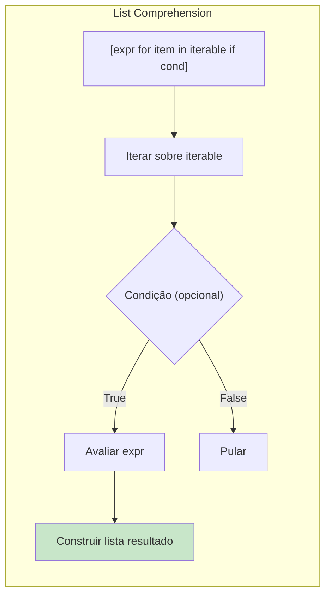
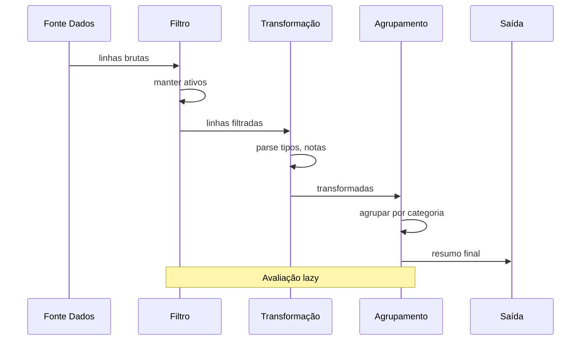

# Padrões Declarativos

Programação declarativa trata de expressar **o que** você quer realizar em vez de **como** realizar. As comprehensions, geradores e funções nativas do Python tornam o estilo declarativo natural e poderoso.

## Comprehensions: O Poder Declarativo do Python

Comprehensions são a ferramenta declarativa mais Pythônica. Elas transformam um iterável em outro com sintaxe clara que revela a intenção.

```python
from typing import List, Dict, Set

# List comprehensions
numeros = [1, 2, 3, 4, 5]

# IMPERATIVO
quadrados_imperativo = []
for n in numeros:
    quadrados_imperativo.append(n ** 2)

# DECLARATIVO (list comprehension)
quadrados = [n ** 2 for n in numeros]
print(quadrados)  # [1, 4, 9, 16, 25]

# Com condicional
pares = [n for n in numeros if n % 2 == 0]
print(pares)  # [2, 4]

# Aninhado
matriz = [[1, 2, 3], [4, 5, 6], [7, 8, 9]]
plano = [item for linha in matriz for item in linha]
print(plano)  # [1, 2, 3, 4, 5, 6, 7, 8, 9]

# Dict comprehensions
quadrados_dict = {n: n ** 2 for n in range(5)}
print(quadrados_dict)  # {0: 0, 1: 1, 2: 4, 3: 9, 4: 25}

# Set comprehensions
nomes = ["Alice", "Bob", "Carlos", "Diana"]
tamanhos_unicos = {len(nome) for nome in nomes}
print(tamanhos_unicos)  # {3, 5, 7}
```



## Expressões Geradoras

Geradores produzem valores lazy — um de cada vez — o que é crucial para sequências grandes ou infinitas.

```python
from typing import Generator
import sys

# Expressão geradora (lazy)
numeros = [1, 2, 3, 4, 5]
quadrados_gen = (n ** 2 for n in numeros)
print(list(quadrados_gen))  # [1, 4, 9, 16, 25]

# Eficiência de memória
faixa = range(1000000)
lista_quadrados = [x ** 2 for x in faixa]   # ~8MB
gen_quadrados = (x ** 2 for x in faixa)     # ~56 bytes
print(f"Lista: {sys.getsizeof(lista_quadrados):,} bytes")
print(f"Gen: {sys.getsizeof(gen_quadrados):,} bytes")

# Gerador com yield
def fibonacci(n: int) -> Generator[int, None, None]:
    a, b = 0, 1
    for _ in range(n):
        yield a
        a, b = b, a + b

print(list(fibonacci(10)))  # [0, 1, 1, 2, 3, 5, 8, 13, 21, 34]

# Gerador infinito
def contar_desde(inicio: int = 0, passo: int = 1) -> Generator[int, None, None]:
    atual = inicio
    while True:
        yield atual
        atual += passo

from itertools import islice
primeiros_10 = islice(contar_desde(0, 3), 10)
print(list(primeiros_10))  # [0, 3, 6, 9, 12, 15, 18, 21, 24, 27]

# Pipelines de geradores
def ler_linhas() -> Generator[str, None, None]:
    yield "  Olá, Mundo!  "
    yield "Python é incrível"
    yield "  DECLARATIVO  "

def strip_linhas(linhas: Generator) -> Generator:
    for linha in linhas:
        yield linha.strip()

def minusculas(linhas: Generator) -> Generator:
    for linha in linhas:
        yield linha.lower()

pipeline = minusculas(strip_linhas(ler_linhas()))
print(list(pipeline))  # ["olá, mundo!", "python é incrível", "declarativo"]
```

> [!NOTE]
> Geradores são de uso único. Uma vez exauridos, não produzem mais valores. Se precisar reutilizar os dados, converta para lista ou crie um novo gerador.

## Pipeline de Processamento com Geradores

```python
from typing import Generator, Dict, Any, List
import csv
from io import StringIO

dados_csv = """nome,idade,nota,ativo
Alice,25,85,true
Bob,17,72,true
Carlos,30,91,false
Diana,22,95,true
Eve,28,60,true"""

def parse_csv(dados: str) -> Generator[Dict[str, str], None, None]:
    reader = csv.DictReader(StringIO(dados))
    for linha in reader:
        yield linha

def filtrar_ativos(linhas: Generator) -> Generator:
    for linha in linhas:
        if linha.get("ativo") == "true":
            yield linha

def parse_tipos(linhas: Generator) -> Generator:
    for linha in linhas:
        yield {
            "nome": linha["nome"],
            "idade": int(linha["idade"]),
            "nota": float(linha["nota"]),
            "ativo": linha["ativo"] == "true",
        }

def filtrar_adultos(linhas: Generator) -> Generator:
    for linha in linhas:
        if linha["idade"] >= 18:
            yield linha

def classificar_notas(linhas: Generator) -> Generator:
    for linha in linhas:
        if linha["nota"] >= 90:
            nota = "A"
        elif linha["nota"] >= 80:
            nota = "B"
        elif linha["nota"] >= 70:
            nota = "C"
        else:
            nota = "D"
        yield {**linha, "nota_letra": nota}

pipeline = classificar_notas(
    filtrar_adultos(
        parse_tipos(
            filtrar_ativos(
                parse_csv(dados_csv)
            )
        )
    )
)

for aluno in pipeline:
    print(f"{aluno['nome']}: {aluno['nota_letra']} ({aluno['nota']})")
```

> [!WARNING]
> Cuidado com geradores infinitos em pipelines. Sempre limite-os com `itertools.islice`.

## Expressando Intenção com Funções Nativas

```python
from typing import List

# any() — "existe pelo menos um?"
numeros = [1, 2, 3, 4, 5]
tem_par = any(n % 2 == 0 for n in numeros)
print(tem_par)  # True

# all() — "todos são?"
todos_positivos = all(n > 0 for n in numeros)
print(todos_positivos)  # True

# any/all com predicados complexos
usuarios = [
    {"nome": "Alice", "idade": 25, "verificado": True},
    {"nome": "Bob", "idade": 17, "verificado": False},
]
todos_adultos = all(u["idade"] >= 18 for u in usuarios)
algum_verificado = any(u["verificado"] for u in usuarios)
print(todos_adultos, algum_verificado)  # False True

# max/min com key
palavras = ["python", "java", "javascript", "rust"]
mais_longa = max(palavras, key=len)
mais_curta = min(palavras, key=len)
print(mais_longa, mais_curta)  # "javascript" "rust"

# sum com gerador
total_idades = sum(u["idade"] for u in usuarios)
print(total_idades)  # 42

# zip — iteração paralela
nomes = ["Alice", "Bob", "Carlos"]
notas = [85, 72, 91]
pares = list(zip(nomes, notas))
print(pares)  # [("Alice", 85), ("Bob", 72), ("Carlos", 91)]
```

## itertools: Ferramentas Declarativas de Iteração

```python
from itertools import (
    chain, accumulate, takewhile,
    groupby, product, permutations,
)

# chain — concatenar iteráveis
combinado = list(chain([1, 2], [3, 4], [5, 6]))
print(combinado)  # [1, 2, 3, 4, 5, 6]

# accumulate — total acumulado
running = list(accumulate([1, 2, 3, 4, 5]))
print(running)  # [1, 3, 6, 10, 15]

# accumulate com função
produto = list(accumulate([1, 2, 3, 4, 5], lambda a, b: a * b))
print(produto)  # [1, 2, 6, 24, 120]

# takewhile — pegar enquanto for verdadeiro
pegos = list(takewhile(lambda x: x < 10, accumulate(range(100))))
print(pegos)  # [0, 1, 3, 6]

# groupby — agrupar elementos consecutivos
dados = [("fruta", "maçã"), ("fruta", "banana"), ("cor", "vermelho")]
ordenados = sorted(dados, key=lambda x: x[0])
for chave, grupo in groupby(ordenados, key=lambda x: x[0]):
    print(f"{chave}: {[g[1] for g in grupo]}")

# product — produto cartesiano
print(list(product([1, 2], ["a", "b"])))
```



## Declarativo vs Imperativo Lado a Lado

```python
from typing import List, Dict, Any

alunos = [
    {"nome": "Alice", "notas": [85, 90, 78], "idade": 25},
    {"nome": "Bob", "notas": [72, 68, 75], "idade": 17},
    {"nome": "Carlos", "notas": [91, 88, 95], "idade": 30},
]

# IMPERATIVO
def media_notas_imperativo(alunos: List[Dict[str, Any]]) -> Dict[str, float]:
    resultado = {}
    for a in alunos:
        if a["idade"] >= 18:
            total = 0
            for nota in a["notas"]:
                total += nota
            media = total / len(a["notas"])
            resultado[a["nome"]] = round(media, 2)
    return resultado

# DECLARATIVO
def media_notas_declarativo(alunos: List[Dict[str, Any]]) -> Dict[str, float]:
    return {
        a["nome"]: round(sum(a["notas"]) / len(a["notas"]), 2)
        for a in alunos
        if a["idade"] >= 18
    }

print(media_notas_imperativo(alunos))
print(media_notas_declarativo(alunos))
```

## Comparação: Imperativo vs Declarativo

| Aspecto | Imperativo | Declarativo |
|---------|-----------|-------------|
| **Foco** | Como fazer | O que alcançar |
| **Estado** | Variáveis mutáveis | Dados imutáveis |
| **Loops** | for/while com índices manuais | Comprehensions, map/filter |
| **Condicionais** | if/elif/else | Predicados de filtro, expressões condicionais |
| **Reuso** | Copiar-colar ou refatorar | Compor funções puras pequenas |
| **Testabilidade** | Testar bloco inteiro | Testar cada transformação |
| **Concisão** | Verboso | Conciso |
| **Paralelização** | Manual (locks) | Frequentemente automática |

## Exercícios Práticos

1. Reescreva usando list comprehension:
   ```python
   resultado = []
   for x in range(20):
       if x % 3 == 0 or x % 5 == 0:
           resultado.append(x ** 2)
   ```

2. Use dict comprehension para inverter chaves e valores de um dicionário.

3. Escreva um gerador que produza os primeiros `n` números triangulares. Use islice para obter os primeiros 10.

4. Crie um pipeline de geradores que: lê linhas de uma lista, remove espaços, filtra linhas vazias e comentários.

5. Use any(), all() e expressões geradoras para verificar: (a) se algum número é primo, (b) se todas as strings são palíndromos.

6. Implemente um construtor de consultas usando encadeamento declarativo.

7. Use groupby e sum para calcular vendas totais por categoria de forma declarativa.

8. Reescreva esta função de forma puramente declarativa:
   ```python
   def processar(usuarios):
       resultado = []
       for u in usuarios:
           completos = [o for o in u["pedidos"] if o["status"] == "completo"]
           if completos:
               total = sum(o["total"] for o in completos)
               resultado.append({"nome": u["nome"], "total": total})
       return sorted(resultado, key=lambda x: x["total"], reverse=True)
   ```

## Resumo

- **Comprehensions** (list, dict, set) são o recurso mais declarativo do Python
- **Expressões geradoras** fornecem iteração lazy e eficiente em memória
- **Pipelines de geradores** compõem transformações lazy sem armazenamento intermediário
- **Funções nativas** (any, all, sum, zip, enumerate) expressam intenção diretamente
- **itertools** fornece ferramentas declarativas para padrões complexos de iteração
- Código declarativo é mais conciso, testável e focado na intenção

> [!SUCCESS]
> Você dominou os padrões declarativos do Python. Ao expressar intenção em vez de mecânica, você escreve código mais curto, mais claro e menos propenso a erros.
