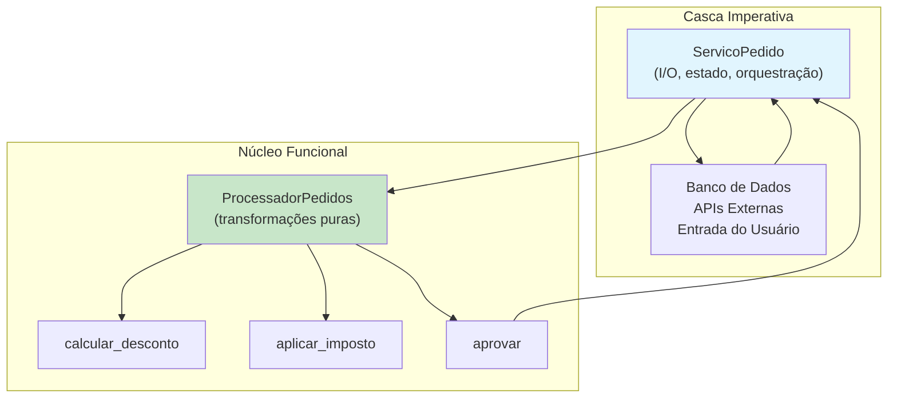
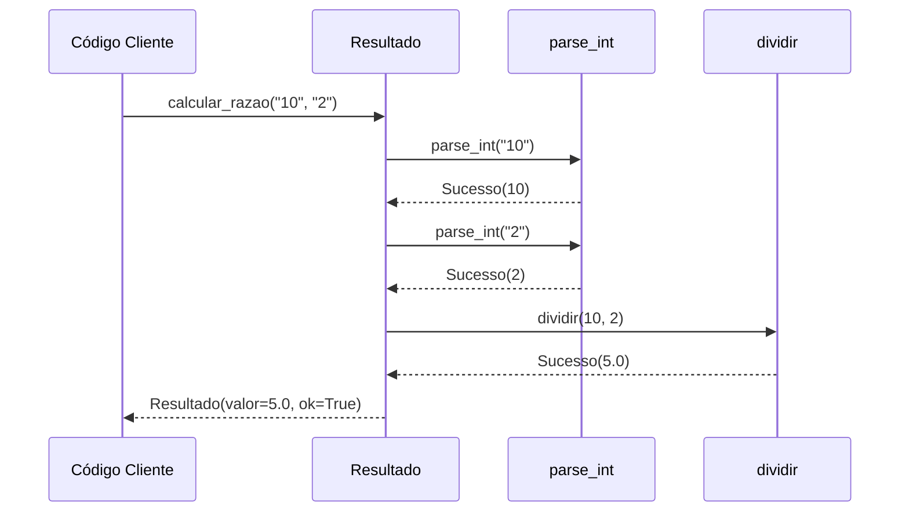

# Python Funcional em Projetos Reais

Em projetos Python reais, raramente você vai "100% funcional" ou "100% POO." Os melhores codebases combinam paradigmas pragmaticamente. Esta lição mostra como integrar padrões funcionais e orientados a objetos em Python de produção.

## A Abordagem Híbrida

O Python moderno se beneficia tanto da POO (para estrutura e gerenciamento de estado) quanto da PF (para transformações de dados e lógica de negócios).

```python
from typing import List, Dict, Any, Optional, Tuple
from dataclasses import dataclass

# Núcleo funcional + casca imperativa
# POO fornece a casca (estrutura, I/O, estado)
# PF fornece o núcleo (lógica de negócios, transformações)

@dataclass(frozen=True)
class Pedido:
    id: int
    cliente_id: int
    itens: tuple
    total: float
    status: str

# Núcleo funcional: transformações puras
class ProcessadorPedidos:
    @staticmethod
    def calcular_desconto(pedido: Pedido, taxa: float) -> Pedido:
        novo_total = pedido.total * (1 - taxa)
        return Pedido(
            id=pedido.id,
            cliente_id=pedido.cliente_id,
            itens=pedido.itens,
            total=round(novo_total, 2),
            status=pedido.status,
        )

    @staticmethod
    def aplicar_imposto(pedido: Pedido, taxa: float) -> Pedido:
        novo_total = pedido.total * (1 + taxa)
        return Pedido(
            id=pedido.id,
            cliente_id=pedido.cliente_id,
            itens=pedido.itens,
            total=round(novo_total, 2),
            status=pedido.status,
        )

    @staticmethod
    def aprovar(pedido: Pedido) -> Pedido:
        if pedido.total > 10000:
            return Pedido(
                id=pedido.id,
                cliente_id=pedido.cliente_id,
                itens=pedido.itens,
                total=pedido.total,
                status="aguardando_aprovacao",
            )
        return Pedido(
            id=pedido.id,
            cliente_id=pedido.cliente_id,
            itens=pedido.itens,
            total=pedido.total,
            status="aprovado",
        )

# Casca imperativa: I/O, orquestração
class ServicoPedido:
    def __init__(self, processador: ProcessadorPedidos):
        self.processador = processador
        self._pedidos: Dict[int, Pedido] = {}

    def processar_novo_pedido(self, pedido: Pedido) -> Pedido:
        processado = self.processador.aprovar(pedido)
        self._pedidos[processado.id] = processado
        return processado

    def aplicar_promocao(self, pedido_id: int, taxa: float) -> Optional[Pedido]:
        if pedido_id not in self._pedidos:
            return None
        pedido = self._pedidos[pedido_id]
        descontado = self.processador.calcular_desconto(pedido, taxa)
        self._pedidos[pedido_id] = descontado
        return descontado
```



## Padrão Strategy com Funções

O padrão Strategy é mais elegante com funções do que com classes.

```python
from typing import Dict, Callable, List

# Strategy POO: verboso
# Strategy Funcional: conciso
DescontoFn = Callable[[float], float]

sem_desconto: DescontoFn = lambda total: total

def desconto_percentual(percentual: float) -> DescontoFn:
    return lambda total: total * (1 - percentual)

def desconto_fidelidade(total: float) -> float:
    return total * 0.9 if total > 500 else total

def obter_estrategia(tipo_cliente: str, valor: float) -> DescontoFn:
    estrategias: Dict[str, DescontoFn] = {
        "regular": sem_desconto,
        "premium": desconto_percentual(0.2),
        "vip": desconto_percentual(0.3),
    }
    base = estrategias.get(tipo_cliente, sem_desconto)
    if valor > 1000:
        return lambda t: base(t) * 0.95
    return base

class Checkout:
    def __init__(self, estrategia: DescontoFn):
        self._desconto = estrategia

    def calcular(self, itens: List[Dict[str, float]]) -> float:
        subtotal = sum(item["preco"] * item.get("qtd", 1) for item in itens)
        return self._desconto(subtotal)

estrategia = obter_estrategia("premium", 2000)
checkout = Checkout(estrategia)
total = checkout.calcular([{"preco": 100, "qtd": 5}])
print(f"Total com desconto: ${total:.2f}")
```

## Pipeline Pattern em Produção

```python
from typing import List, Dict, Any, Callable, TypeVar, Generic
from dataclasses import dataclass
from functools import reduce

T = TypeVar("T")
U = TypeVar("U")

@dataclass
class Pipeline(Generic[T, U]):
    etapas: tuple = ()

    def adicionar(self, etapa: Callable) -> "Pipeline":
        return Pipeline(self.etapas + (etapa,))

    def executar(self, dados: T) -> U:
        resultado: Any = dados
        for etapa in self.etapas:
            resultado = etapa(resultado)
        return resultado

# Pipeline ETL do mundo real
def parse_tipos(linhas: List[Dict[str, str]]) -> List[Dict[str, Any]]:
    return [
        {"id": int(r["id"]), "nome": r["nome"].strip(), "valor": float(r["valor"]), "ativo": True}
        for r in linhas if r.get("ativo", "").lower() == "true"
    ]

def enriquecer(dados: List[Dict[str, Any]]) -> List[Dict[str, Any]]:
    return [
        {**r, "nivel": "premium" if r["valor"] > 1000 else "padrao"}
        for r in dados
    ]

def ordenar_por_valor(dados: List[Dict[str, Any]]) -> List[Dict[str, Any]]:
    return sorted(dados, key=lambda r: r["valor"], reverse=True)

pipeline_etl = (
    Pipeline()
    .adicionar(parse_tipos)
    .adicionar(enriquecer)
    .adicionar(ordenar_por_valor)
)

dados_mock = [
    {"id": "1", "nome": "Alice", "valor": "1500", "ativo": "true"},
    {"id": "2", "nome": "Bob", "valor": "500", "ativo": "false"},
    {"id": "3", "nome": "Carlos", "valor": "2000", "ativo": "true"},
]

resultado = pipeline_etl.executar(dados_mock)
for item in resultado:
    print(f"{item['nome']}: ${item['valor']} ({item['nivel']})")
```

> [!TIP]
> O padrão Pipeline torna cada etapa testável independentemente. Cada etapa é uma função pura que pode ser testada isoladamente.

## Event Sourcing com Eventos Imutáveis

```python
from typing import List, Dict, Any, Callable, Optional
from dataclasses import dataclass, replace
from datetime import datetime, timezone

@dataclass(frozen=True)
class Evento:
    tipo: str
    dados: Dict[str, Any]
    timestamp: str = ""

    def __post_init__(self):
        if not self.timestamp:
            object.__setattr__(self, "timestamp",
                datetime.now(timezone.utc).isoformat())

ManipuladorEvento = Callable[[Dict[str, Any], Evento], Dict[str, Any]]

def manipular_usuario_criado(estado: Dict[str, Any], evento: Evento) -> Dict[str, Any]:
    dados = evento.dados
    usuarios = list(estado.get("usuarios", []))
    usuarios.append({"id": dados["id"], "nome": dados["nome"], "pedidos": []})
    return {**estado, "usuarios": usuarios}

def manipular_pedido_realizado(estado: Dict[str, Any], evento: Evento) -> Dict[str, Any]:
    dados = evento.dados
    usuarios = [
        {
            **u,
            "pedidos": [
                *u["pedidos"],
                {"id": dados["pedido_id"], "total": dados["total"], "status": "realizado"},
            ] if u["id"] == dados["usuario_id"] else u["pedidos"],
        }
        for u in estado.get("usuarios", [])
    ]
    return {**estado, "usuarios": usuarios}

class ArmazenamentoEventos:
    def __init__(self):
        self._eventos: List[Evento] = []
        self._manipuladores: Dict[str, ManipuladorEvento] = {
            "usuario_criado": manipular_usuario_criado,
            "pedido_realizado": manipular_pedido_realizado,
        }

    def adicionar(self, evento: Evento) -> None:
        self._eventos.append(evento)

    def reproduzir(self, estado: Optional[Dict[str, Any]] = None) -> Dict[str, Any]:
        atual = estado or {}
        for evento in self._eventos:
            manipulador = self._manipuladores.get(evento.tipo)
            if manipulador:
                atual = manipulador(atual, evento)
        return atual

armazenamento = ArmazenamentoEventos()
armazenamento.adicionar(Evento("usuario_criado", {"id": 1, "nome": "Alice"}))
armazenamento.adicionar(Evento("pedido_realizado", {"usuario_id": 1, "pedido_id": 101, "total": 250.0}))

estado = armazenamento.reproduzir()
for usuario in estado["usuarios"]:
    print(f"{usuario['nome']}: {len(usuario['pedidos'])} pedido(s)")
```

## Padrão Result para Tratamento de Erros

```python
from typing import Generic, TypeVar, Optional, Callable
from dataclasses import dataclass

T = TypeVar("T")
E = TypeVar("E")

@dataclass(frozen=True)
class Resultado(Generic[T, E]):
    valor: Optional[T] = None
    erro: Optional[E] = None
    ok: bool = True

    @classmethod
    def sucesso(cls, valor: T) -> "Resultado[T, E]":
        return cls(valor=valor, erro=None, ok=True)

    @classmethod
    def falha(cls, erro: E) -> "Resultado[T, E]":
        return cls(valor=None, erro=erro, ok=False)

    def map(self, func: Callable[[T], T]) -> "Resultado[T, E]":
        if self.ok:
            try:
                return Resultado.sucesso(func(self.valor))
            except Exception as e:
                return Resultado.falha(str(e))
        return self

    def bind(self, func: Callable[[T], "Resultado[T, E]"]) -> "Resultado[T, E]":
        if self.ok:
            return func(self.valor)
        return self

def parse_int(s: str) -> Resultado[int, str]:
    try:
        return Resultado.sucesso(int(s))
    except ValueError:
        return Resultado.falha(f"Não foi possível converter '{s}' para inteiro")

def dividir_seguro(a: int, b: int) -> Resultado[float, str]:
    if b == 0:
        return Resultado.falha("Divisão por zero")
    return Resultado.sucesso(a / b)

def calcular_razao(s1: str, s2: str) -> Resultado[float, str]:
    return (
        parse_int(s1)
        .bind(lambda a: parse_int(s2).map(lambda b: (a, b)))
        .bind(lambda par: dividir_seguro(par[0], par[1]))
    )

print(calcular_razao("10", "2"))    # Resultado(valor=5.0, ok=True)
print(calcular_razao("10", "0"))    # Resultado(erro="Divisão por zero", ok=False)
print(calcular_razao("abc", "2"))   # Resultado(erro="Não foi possível...", ok=False)
```



## Pipeline de Análise de Dados

```python
from typing import List, Dict, Any
from dataclasses import dataclass
from functools import reduce

@dataclass(frozen=True)
class ResultadoAnalise:
    receita_total: float
    total_pedidos: int
    valor_medio: float
    top_categoria: str
    receita_top: float

def filtrar_pagos(pedidos: List[Dict[str, Any]]) -> List[Dict[str, Any]]:
    return [p for p in pedidos if p.get("status") == "pago"]

def calcular_totais(pedidos: List[Dict[str, Any]]) -> List[Dict[str, Any]]:
    return [
        {
            **p,
            "total_linha": sum(
                item["preco"] * item["qtd"]
                for item in p.get("itens", [])
            ),
        }
        for p in pedidos
    ]

def analisar(pedidos: List[Dict[str, Any]]) -> ResultadoAnalise:
    if not pedidos:
        return ResultadoAnalise(0, 0, 0, "", 0.0)

    receita = sum(p["total_linha"] for p in pedidos)
    media = receita / len(pedidos)

    cats: Dict[str, float] = {}
    for p in pedidos:
        for item in p.get("itens", []):
            cat = item.get("categoria", "sem_categoria")
            cats[cat] = cats.get(cat, 0) + item["preco"] * item["qtd"]

    top = max(cats, key=cats.get) if cats else ""

    return ResultadoAnalise(
        receita_total=round(receita, 2),
        total_pedidos=len(pedidos),
        valor_medio=round(media, 2),
        top_categoria=top,
        receita_top=round(cats.get(top, 0.0), 2),
    )

pipeline = [filtrar_pagos, calcular_totais, analisar]

pedidos_mock = [
    {"id": 1, "status": "pago", "itens": [
        {"nome": "Notebook", "preco": 1200, "qtd": 1, "categoria": "eletrônicos"},
    ]},
    {"id": 2, "status": "pago", "itens": [
        {"nome": "Mesa", "preco": 450, "qtd": 1, "categoria": "móveis"},
    ]},
    {"id": 3, "status": "pendente", "itens": [
        {"nome": "Monitor", "preco": 350, "qtd": 1, "categoria": "eletrônicos"},
    ]},
]

resultado = reduce(lambda d, fn: fn(d), pipeline, pedidos_mock)
print(f"Receita: ${resultado.receita_total}")
print(f"Pedidos: {resultado.total_pedidos}")
print(f"Médio: ${resultado.valor_medio}")
print(f"Top Categoria: {resultado.top_categoria} (${resultado.receita_top})")
```

## Comparação: POO Pura vs Híbrida PF+POO

| Aspecto | POO Pura | Híbrida PF+POO |
|---------|---------|---------------|
| **Estado** | Objetos encapsulam estado mutável | Dados imutáveis, infraestrutura mutável |
| **Lógica** | Métodos nos objetos | Funções puras operando em dados |
| **Efeitos** | Métodos podem fazer tudo | Isolados na camada de serviço |
| **Teste** | Pesado em mocks | Leve em mocks, testar funções puras |
| **Composição** | Hierarquias de herança | Composição de funções |
| **Concorrência** | Locks, condições de corrida | Sem estado compartilhado |
| **Erros** | Exceções por toda parte | Tipos Result nas fronteiras |

## Exercícios Práticos

1. Refatore uma classe que mistura I/O e lógica de negócios para o padrão núcleo funcional + casca imperativa.

2. Implemente o padrão Strategy para cálculo de frete usando funções em vez de classes. Suporte "padrão", "expresso" e "noturno".

3. Construa um pipeline baseado em Result que: valida entrada do usuário, transforma dados, salva no banco e envia notificação.

4. Crie uma classe Pipeline onde cada etapa é registrada (tamanho da entrada, tamanho da saída, tempo de execução).

5. Implemente um sistema de event sourcing simples para um app de tarefas.

6. Converta uma classe POO de 50 linhas que processa pedidos para um design híbrido.

7. Escreva testes baseados em propriedades para uma função pura `calcular_frete(itens, destino)`.

8. Projete um sistema de configuração funcional onde a config é um dicionário imutável transformado por um pipeline de funções puras.

## Resumo

- **Arquitetura híbrida**: núcleo funcional + casca imperativa é o padrão mais pragmático
- **Padrão Strategy** é mais conciso com funções do que hierarquias de classes
- **Padrão Pipeline** cria transformações de dados testáveis e compostas
- **Event Sourcing** funciona naturalmente com eventos imutáveis e redutores puros
- **Result monad** fornece tratamento de erros explícito sem exceções
- O objetivo não é a pureza, mas a **praticidade** — use cada paradigma onde ele brilha

> [!SUCCESS]
> Você completou o curso de Programação Funcional e Declarativa! Agora você tem as ferramentas para escrever Python mais previsível, testável e expressivo. Lembre-se: o melhor código usa o paradigma certo para o trabalho certo — misture PF e POO pragmaticamente.
