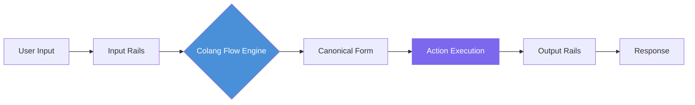
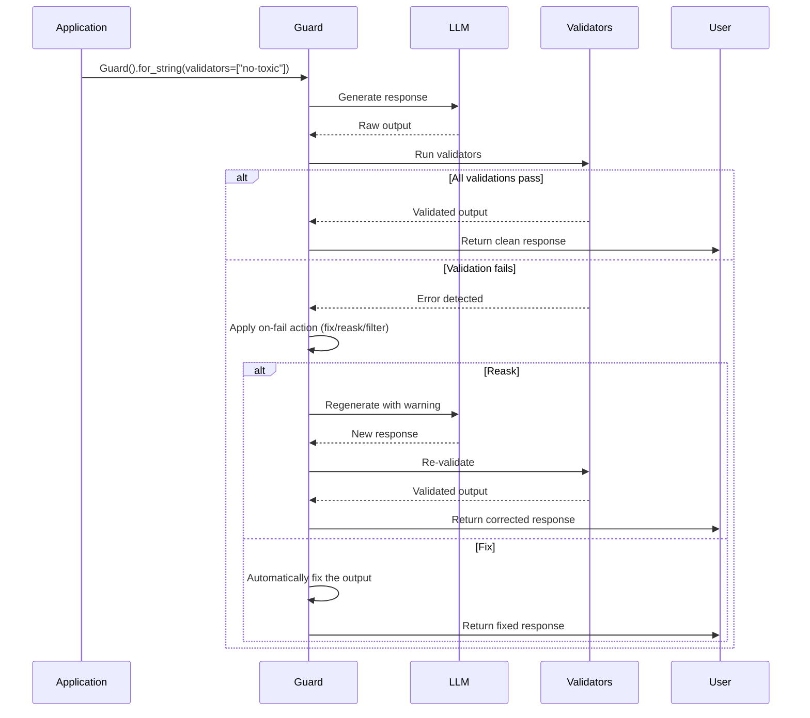

# Implementing Guardrails: NeMo, Guardrails AI and Custom

## NVIDIA NeMo Guardrails

NVIDIA NeMo Guardrails is an open-source toolkit for adding programmable guardrails to LLM-based applications. It uses the **Colang** policy language to define conversational flows and safety constraints.

### Key Concepts

- **Rails**: Named guardrail definitions written in Colang
- **Actions**: Python functions that rails invoke
- **Colang**: A YAML-like DSL for modelling dialogue flows
- **LLMRails**: The runtime that processes user input through the defined rails

### Colang Flow Diagram



The flow engine sits at the center: it parses user input, matches it against Colang flow definitions, executes associated Python actions, and then runs output rails before returning the response.

### Configuration

```yaml
# config.yml — NeMo Guardrails configuration
rails:
  input:
    flows:
      - self_check_input
      - detect_jailbreak
      - check_topic_allowed
  output:
    flows:
      - self_check_output
      - check_factual_consistency
      - validate_format

colang_files:
  - "rails/prompt_injection.co"
  - "rails/topical_rails.co"
  - "rails/safety.co"
  - "rails/formatting.co"

prompt_context:
  system_prompt: "You are a helpful customer service agent."
  max_turns: 10
  max_tokens: 4096
```

### Colang Policy Examples

```
# rails/topical_rails.co — Colang example
define flow topical_guardrail
  user said topic in allowed_topics
  bot express positive confirmation
  bot provide relevant response

define flow topical_guardrail
  user said topic not in allowed_topics
  bot express cannot answer
  bot suggest redirect

# Define allowed topics
define user said topic in allowed_topics
  "topic" in ["product", "pricing", "shipping", "returns"]

define user said topic not in allowed_topics
  "topic" not in ["product", "pricing", "shipping", "returns"]

define bot express cannot answer
  "I'm sorry, I can only answer questions about our products and services."
```

```
# rails/safety.co
define flow self_check_input
  user ...
  bot check for harmful content
  if harmful then bot refuse to respond

define bot check for harmful content
  execute check_harmful_content

define bot refuse to respond
  "I cannot respond to that request."
```

### Python Action for NeMo

```python
# actions/custom_actions.py
from nemoguardrails import RailsConfig
from nemoguardrails import LLMRails

# Load configuration
config = RailsConfig.from_path("config.yml")
rails = LLMRails(config)

# Generate a guarded response
response = rails.generate(
    messages=[{"role": "user", "content": "What is the return policy?"}]
)

print(response)
```

```python
# actions/harmful_content.py
"""Custom action for harmful content detection."""
from typing import Optional

def check_harmful_content(context: dict) -> Optional[str]:
    """
    Called by the Colang flow 'check for harmful content'.
    Returns an error message if harmful, None if safe.
    """
    user_message = context.get("user_message", "")

    # Use a classifier or keyword check
    harmful_keywords = ["bomb", "attack", "illegal drugs", "hack"]
    for keyword in harmful_keywords:
        if keyword in user_message.lower():
            return f"Harmful content detected: {keyword}"

    return None
```

> [!NOTE]
> Colang uses a YAML-like indentation-sensitive syntax. Each `define flow` block represents a conversational path. The `user ...` pattern matches any user message, while `user said ...` matches specific intents. Flows can branch based on conditions, and each branch can execute Python actions or produce bot responses.

---

## Guardrails AI Library

Guardrails AI (guardrails-ai/guardrails) provides a decorator-based approach to define output validators. Unlike NeMo which focuses on dialogue flows, Guardrails AI specializes in output structure and content validation.

### Validation Flow



### Built-in Validator Usage

```python
# guardrails_ai_example.py
from guardrails import Guard
from guardrails.validators import Validator, register_validator

# Use built-in validators
guard = Guard.for_string(
    validators=[
        "no-toxic-language",
        "valid-json",
        "valid-length",
    ]
)
```

### Custom Validator via Decorator

```python
# custom_validator.py
from guardrails.validators import Validator, register_validator

@register_validator("has_min_length", data_type="string")
class MinLengthValidator(Validator):
    """Ensure the response meets a minimum length requirement."""

    def validate(self, value, metadata):
        min_len = metadata.get("min_length", 10)
        if len(value) < min_len:
            raise Exception(
                f"Response too short: {len(value)} < {min_len}"
            )
        return value

    def validate_with_reask(self, value, metadata):
        """Override to provide a reask prompt on failure."""
        try:
            return self.validate(value, metadata)
        except Exception as e:
            suggestion = metadata.get("reask_prompt", "Please provide a more detailed response.")
            raise Exception(f"{e}. {suggestion}")
```

### Applying Guard to an LLM Call

```python
# guard_usage.py
import openai

# Configure the guard
guard = Guard.for_string(
    validators=[
        "no-toxic-language",
        "valid-json",
    ],
    prompt_params={
        "max_tokens": 500,
        "temperature": 0.3,
    }
)

# Make an LLM call with guarding
raw_llm_output = openai.chat.completions.create(
    model="gpt-4",
    messages=[{"role": "user", "content": "Explain RLHF"}]
)

# Validate the output
validated = guard.validate(
    raw_llm_output.choices[0].message.content
)

if validated.validation_passed:
    print("Safe output:", validated.output)
else:
    print("Guardrail blocked:", validated.error)
```

### Guardrails AI Rail Spec (XML)

```xml
<!-- rail_spec.xml -->
<rail version="0.1">
  <input>
    <validator type="length" min="1" max="2000" on-fail="reject"/>
    <validator type="prompt-injection" on-fail="reask"/>
    <validator type="no-toxic-language" on-fail="reject"/>
  </input>

  <output>
    <validator type="no-toxic-language" on-fail="fix"/>
    <validator type="json-schema" on-fail="reask">
      <schema>
        {
          "type": "object",
          "properties": {
            "answer": {"type": "string"},
            "confidence": {"type": "number", "minimum": 0, "maximum": 1}
          },
          "required": ["answer", "confidence"]
        }
      </schema>
    </validator>
    <validator type="valid-length" min="10" max="2000" on-fail="reask"/>
  </output>
</rail>
```

---

## Custom Guardrail Implementation

When off-the-shelf tools do not fit your domain, implement guardrails directly in Python. Custom implementations give you full control over detection logic, logging, and error handling.

```python
# custom_guardrail.py
import re
import json
import logging
from typing import Any, Dict, List, Optional
from datetime import datetime

logging.basicConfig(level=logging.INFO)
logger = logging.getLogger("custom_guardrail")

class PIIRedactionGuardrail:
    """
    Custom guardrail that redacts PII (emails, phones, SSNs)
    from LLM output before returning to the user.
    """

    def __init__(self, mask_token: str = "[REDACTED]"):
        self.mask_token = mask_token
        self.redaction_log: List[Dict] = []
        # Compile regex patterns once for performance
        self.patterns = {
            "email": re.compile(r"[\w\.-]+@[\w\.-]+\.\w+"),
            "phone": re.compile(r"\b\d{3}[-.]?\d{3}[-.]?\d{4}\b"),
            "ssn": re.compile(r"\b\d{3}-\d{2}-\d{4}\b"),
            "credit_card": re.compile(r"\b\d{4}[- ]?\d{4}[- ]?\d{4}[- ]?\d{4}\b"),
        }

    def validate(self, text: str) -> str:
        """Redact all PII patterns from text. Returns cleaned text."""
        for name, pattern in self.patterns.items():
            matches = pattern.findall(text)
            if matches:
                logger.info(f"[GUARDRAIL] Redacted {len(matches)} {name}(s)")
                self.redaction_log.append({
                    "type": name,
                    "count": len(matches),
                    "timestamp": datetime.utcnow().isoformat(),
                })
                text = pattern.sub(self.mask_token, text)
        return text

    def contains_pii(self, text: str) -> bool:
        """Check if text contains any PII without modifying it."""
        return any(
            pattern.search(text)
            for pattern in self.patterns.values()
        )

    def get_stats(self) -> Dict:
        """Return redaction statistics for monitoring."""
        return {
            "total_redactions": len(self.redaction_log),
            "by_type": {
                name: sum(
                    1 for entry in self.redaction_log
                    if entry["type"] == name
                )
                for name in self.patterns
            },
            "recent": self.redaction_log[-10:] if self.redaction_log else [],
        }


class FactualityGuardrail:
    """Check LLM claims against a knowledge base."""

    def __init__(self, knowledge_base: Dict[str, str]):
        self.kb = knowledge_base

    def validate(self, response: str) -> tuple[bool, List[str]]:
        """Check if claims in response exist in knowledge base."""
        violations = []
        # Simple keyword-based fact checking
        for claim, truth in self.kb.items():
            if claim.lower() in response.lower():
                # Verify the response matches known truth
                if truth.lower() not in response.lower():
                    violations.append(
                        f"Claim '{claim}' does not match expected truth: '{truth}'"
                    )
        return len(violations) == 0, violations


# === Usage ===
pii_guard = PIIRedactionGuardrail()
user_input = "Contact me at john@example.com or 555-123-4567. My SSN is 123-45-6789."
safe_output = pii_guard.validate(user_input)
print(safe_output)
# Output: Contact me at [REDACTED] or [REDACTED]. My SSN is [REDACTED].

# Factuality check
kb = {
    "return policy": "30-day return policy with free shipping",
    "shipping time": "3-5 business days",
}
fact_guard = FactualityGuardrail(kb)
is_valid, issues = fact_guard.validate(
    "Our return policy is 60 days with free shipping."
)
print(f"Factuality: {is_valid}, Issues: {issues}")
# Factuality: False, Issues: ["Claim 'return policy' does not match expected truth"]
```

> [!WARNING]
> Regex-based PII redaction is a starting point, not a complete solution. Names, addresses, and context-dependent PII require NLP-based entity recognition (e.g., spaCy NER, Presidio). Regex misses "John called me yesterday" or "I live at 123 Main St." Always combine regex guardrails with model-based classifiers for production.

> [!TIP]
> When implementing custom guardrails, always include a `get_stats()` method for observability. This makes it trivial to integrate guardrails with monitoring dashboards and spot patterns like rising false-positive rates. A guardrail you cannot measure is a guardrail you cannot trust.

---

## Combining Guardrail Systems

In production, you may want to combine NeMo's dialogue management with Guardrails AI's output validation and custom domain logic.

```python
# combined_guardrails.py
"""Example of combining multiple guardrail systems."""
from nemoguardrails import LLMRails
from guardrails import Guard


class HybridGuardrailSystem:
    """
    Combines NeMo (dialogue flow) with Guardrails AI (output validation)
    and custom Python validators.
    """

    def __init__(self, nemo_config_path: str):
        # Layer 1: NeMo for dialogue flow
        self.nemo = LLMRails.from_path(nemo_config_path)

        # Layer 2: Guardrails AI for output validation
        self.guardrails_ai = Guard.for_string(
            validators=["no-toxic-language", "valid-json"],
        )

        # Layer 3: Custom PII redaction
        self.pii = PIIRedactionGuardrail()

    def process(self, user_input: str) -> dict:
        result = {"input": user_input, "guarded": True}

        # Step 1: Run through NeMo
        nemo_response = self.nemo.generate(
            messages=[{"role": "user", "content": user_input}]
        )
        result["nemo_output"] = nemo_response

        # Step 2: PII redaction on raw response
        clean_text = self.pii.validate(nemo_response)

        # Step 3: Guardrails AI validation
        validation = self.guardrails_ai.validate(clean_text)
        result["validation_passed"] = validation.validation_passed

        if validation.validation_passed:
            result["final_output"] = validation.output
        else:
            result["final_output"] = None
            result["error"] = str(validation.error)

        return result


# Usage
system = HybridGuardrailSystem("config.yml")
output = system.process("What is my order status?")
print(output["final_output"])
```

---

## Comparison Table

| Feature                | NeMo Guardrails       | Guardrails AI         | Custom Implementation |
|------------------------|----------------------|-----------------------|-----------------------|
| Language               | Colang + Python      | Python + XML spec     | Pure Python           |
| Input guardrails       | Yes (Colang flows)   | Yes (XML validators)  | You build it          |
| Output guardrails      | Yes (Colang flows)   | Yes (XML validators)  | You build it          |
| Behavioral guardrails  | Yes (dialogue mgmt)  | Limited (no flows)    | You build it          |
| Dialogue management    | Full (multi-turn)    | None                  | You build it          |
| Learning curve         | Medium               | Low                   | High (from scratch)   |
| Built-in validators    | ~20                  | ~50                   | None                  |
| Custom actions         | Python functions     | @register_validator   | Any code              |
| Error recovery         | Re-route flows       | Reask / Fix / Filter  | You build it          |
| Monitoring support     | Built-in logging     | Validation reports    | Manual implementation |
| Deployment complexity  | Moderate             | Simple                | Flexible              |
| Best for               | Complex multi-turn   | Simple output checks  | Domain-specific rules |

---

## Practice Questions

```question
{
  "id": "gr-2-q1",
  "type": "multiple-choice",
  "question": "A development team needs to implement complex multi-turn dialogue policies for a customer service agent that maintains conversation context across multiple exchanges. Which tool is best suited for this task?",
  "options": [
    "Guardrails AI with XML rail specs",
    "Pure Python custom validators",
    "NVIDIA NeMo Guardrails with Colang",
    "Regex-based PII redaction"
  ],
  "correct": 2,
  "explanation": "NeMo Guardrails with Colang is designed for multi-turn dialogue management. It models conversational flows and maintains state across turns, unlike Guardrails AI which focuses on single-turn output validation."
}
```

```question
{
  "id": "gr-2-q2",
  "type": "multiple-choice",
  "question": "In Guardrails AI, how are custom validation rules primarily defined?",
  "options": [
    "Using YAML configuration files",
    "Using a @register_validator decorator on a Python class",
    "Writing Colang flow definitions",
    "Creating SQL database triggers"
  ],
  "correct": 1,
  "explanation": "Guardrails AI uses the @register_validator decorator to register custom Python validator classes. These classes inherit from Validator and implement a validate() method."
}
```

```question
{
  "id": "gr-2-q3",
  "type": "multiple-choice",
  "question": "A developer implements a guardrail using regex patterns to detect phone numbers and email addresses in LLM output. What is the primary limitation of this approach?",
  "options": [
    "Regex patterns are too slow for production use",
    "Regex cannot detect context-dependent PII like names and addresses",
    "Regex patterns cannot be combined with other guardrails",
    "Regex only works on structured data"
  ],
  "correct": 1,
  "explanation": "Regex is fast and effective for structured PII like emails and phone numbers, but it fails to detect unstructured PII like names, addresses, and context-dependent information. For production, combine regex with NLP-based entity recognition."
}
```

```question
{
  "id": "gr-2-q4",
  "type": "multiple-choice",
  "question": "What is the Colang language primarily used for in NVIDIA NeMo Guardrails?",
  "options": [
    "Defining Python action functions",
    "Writing unit tests for guardrail systems",
    "Modeling conversational flows and safety constraints",
    "Configuring cloud deployment settings"
  ],
  "correct": 2,
  "explanation": "Colang is a domain-specific language for modeling conversational flows, safety constraints, and dialogue policies. It defines how the agent should respond in different scenarios."
}
```

```question
{
  "id": "gr-2-q5",
  "type": "multiple-choice",
  "question": "A startup needs to quickly add output validation for JSON formatting and toxic language detection with minimal learning curve. Which approach should they choose?",
  "options": [
    "Build a custom Python guardrail from scratch",
    "Use NVIDIA NeMo Guardrails with Colang",
    "Use Guardrails AI with built-in validators",
    "Use regex validation in a shell script"
  ],
  "correct": 2,
  "explanation": "Guardrails AI has the lowest learning curve with ~50 built-in validators, simple XML specs, and decorator-based custom validators. It is ideal for teams needing quick output validation without complex dialogue management."
}
```

---

> [!SUCCESS]
> ## Key Takeaways
> - NVIDIA NeMo Guardrails uses Colang for dialogue-level policy definition and supports input, output, and behavioral rails with multi-turn conversation management.
> - Guardrails AI offers a decorator-based validator system with XML rail specs and ~50 built-in validators; best for output structure validation.
> - Custom guardrails in Python give you full control but require you to reimplement logging, composition, and error handling from scratch.
> - Regex-based guardrails are fast but brittle; combine them with model-based classifiers for robust protection.
> - Always log guardrail decisions — every redaction, rejection, and pass — for audit and improvement.
> - Choose the simplest tool that meets your requirements; over-engineering guardrails creates maintenance burden.
> - In production, consider hybrid approaches that combine NeMo for dialogue flow, Guardrails AI for output validation, and custom code for domain-specific rules.
> - Measure guardrail effectiveness with precision, recall, and F1 metrics against a labeled test set to catch regressions.
