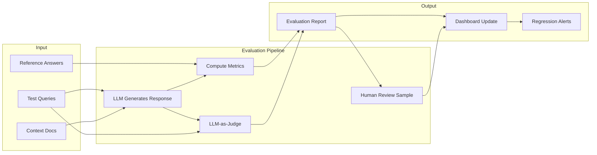
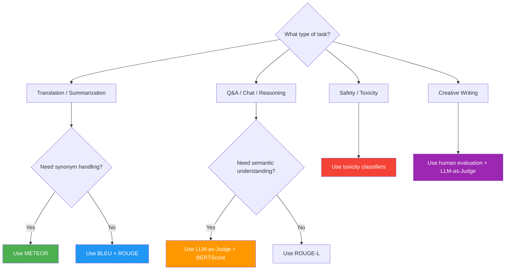

# Evaluation Frameworks for LLM Outputs

## What to Evaluate

LLM output quality is multi-dimensional. These are the five core axes:

| Dimension     | What It Measures                                    | Example Failure                | Detection Method             |
|---------------|-----------------------------------------------------|--------------------------------|------------------------------|
| Correctness   | Factual accuracy against a ground truth             | "Paris is the capital of Italy"| KB lookup, verified sources  |
| Relevance     | Whether the output addresses the user's query       | Answering tomorrow's weather when asked about today | Embedding similarity |
| Groundedness  | Whether claims are supported by provided context     | Hallucinating citations        | Context overlap scoring      |
| Safety        | Absence of toxic, biased, or harmful content         | Generating hateful speech      | Toxicity classifiers         |
| Fluency       | Grammatical and stylistic quality                   | Fragmented or incoherent prose | Perplexity, grammar checkers |

> [!WARNING]
> Correctness alone is not sufficient. A response can be factually correct but irrelevant, unsafe, or ungrounded. Always evaluate across multiple dimensions. A 100% correct answer that is toxic or off-topic is still a failure.

---

## Evaluation Pipeline

Evaluation should be a systematic, repeatable process. The following pipeline shows how data flows through an evaluation system:



---

## Metric Selection Decision Tree

Choosing the right evaluation metric depends on your use case:



---

## Evaluation Datasets

A high-quality evaluation dataset is the foundation of any evaluation framework. Invest time in creating a representative, well-annotated dataset.

```json
{
  "dataset": "customer-support-eval",
  "version": "1.0",
  "created": "2026-01-15",
  "total_examples": 500,
  "distribution": {
    "password_reset": 100,
    "refund_status": 100,
    "shipping_inquiry": 100,
    "product_question": 100,
    "complaint": 100
  },
  "examples": [
    {
      "id": "cs-001",
      "query": "How do I reset my password?",
      "context": "User is on the login page and forgot credentials.",
      "reference": "Click 'Forgot Password' on the login screen, enter your email, and follow the reset link.",
      "expected_tools": ["send_reset_email"],
      "tags": ["password", "authentication"],
      "difficulty": "easy"
    },
    {
      "id": "cs-002",
      "query": "What is my refund status?",
      "context": "User ordered item #ORD-4521 on March 10. The item was delivered on March 15 and returned on March 18.",
      "reference": "Your refund for order ORD-4521 is being processed and will appear in 5-7 business days.",
      "expected_tools": ["check_refund_status"],
      "tags": ["refund", "order-status"],
      "difficulty": "medium"
    },
    {
      "id": "cs-003",
      "query": "I want to speak to a manager right now!",
      "context": "User is angry about a delayed order.",
      "reference": "I understand your frustration. Let me escalate this to our support team who will contact you within 2 hours.",
      "expected_tools": ["escalate_to_human"],
      "tags": ["escalation", "angry-user"],
      "difficulty": "hard"
    }
  ]
}
```

### Creating an Evaluation Dataset Programmatically

```python
# create_eval_dataset.py
import json
import random
from typing import List, Dict

class EvalDatasetBuilder:
    """Build evaluation datasets from templates."""

    def __init__(self):
        self.examples = []

    def add_example(
        self,
        query: str,
        context: str = "",
        reference: str = "",
        expected_tools: List[str] = None,
        tags: List[str] = None,
        difficulty: str = "medium",
    ) -> "EvalDatasetBuilder":
        example = {
            "id": f"ex-{len(self.examples) + 1:04d}",
            "query": query,
            "context": context,
            "reference": reference,
            "expected_tools": expected_tools or [],
            "tags": tags or [],
            "difficulty": difficulty,
        }
        self.examples.append(example)
        return self

    def save(self, path: str):
        dataset = {
            "dataset": "custom-eval",
            "version": "1.0",
            "total_examples": len(self.examples),
            "examples": self.examples,
        }
        with open(path, "w") as f:
            json.dump(dataset, f, indent=2)
        print(f"Saved {len(self.examples)} examples to {path}")


# === Usage ===
builder = EvalDatasetBuilder()
builder.add_example(
    query="What is your return policy?",
    reference="We offer 30-day returns with free shipping.",
    expected_tools=["lookup_policy"],
    tags=["returns", "policy"],
    difficulty="easy",
)
builder.add_example(
    query="I was charged twice for the same order!",
    reference="I apologize for the inconvenience. Let me investigate the duplicate charge.",
    expected_tools=["check_charges", "issue_refund"],
    tags=["billing", "complaint"],
    difficulty="hard",
)
builder.save("eval_dataset.json")
```

---

## Automated Evaluation Metrics

### BLEU (Bilingual Evaluation Understudy)

Measures n-gram precision between generated and reference text. Range: 0–1. Originally designed for machine translation.

```python
# bleu_example.py
from nltk.translate.bleu_score import (
    sentence_bleu,
    corpus_bleu,
    SmoothingFunction,
)

# Individual sentence score
reference = "the cat sat on the mat".split()
candidate = "the cat sat on a rug".split()

# Use smoothing for short sentences
smoothie = SmoothingFunction().method4
score = sentence_bleu([reference], candidate, smoothing_function=smoothie)
print(f"BLEU score: {score:.3f}")
# BLEU score: ~0.586 (3/4 unigrams match, 2/3 bigrams match)

# Corpus-level BLEU
references = [
    ["the cat sat on the mat".split()],
    ["the dog ran in the park".split()],
]
candidates = [
    "the cat sat on a rug".split(),
    "a dog runs in a park".split(),
]
corpus_score = corpus_bleu(references, candidates, smoothing_function=smoothie)
print(f"Corpus BLEU: {corpus_score:.3f}")
```

### ROUGE (Recall-Oriented Understudy for Gisting Evaluation)

Measures recall of n-grams and longest common subsequences. Common variants: ROUGE-1 (unigrams), ROUGE-2 (bigrams), ROUGE-L (longest common subsequence).

```python
# rouge_example.py
from rouge_score import rouge_scorer

scorer = rouge_scorer.RougeScorer(
    ["rouge1", "rouge2", "rougeL"],
    use_stemmer=True  # handles walked/walking etc.
)

reference = "The quick brown fox jumps over the lazy dog"
candidate = "A quick brown fox jumped over a lazy dog"

scores = scorer.score(reference, candidate)
for metric, result in scores.items():
    print(f"{metric}: P={result.precision:.3f} R={result.recall:.3f} F1={result.fmeasure:.3f}")
# ROUGE-1: P=0.875 R=0.778 F1=0.824
# ROUGE-2: P=0.571 R=0.500 F1=0.533
# ROUGE-L: P=0.875 R=0.778 F1=0.824
```

### METEOR (Metric for Evaluation of Translation with Explicit ORdering)

Extends BLEU by incorporating recall, stemming, synonym matching, and word order.

```python
# meteor_example.py
from nltk.translate.meteor_score import meteor_score

reference = "the cat sat on the mat"
candidate = "a cat sits on a rug"

score = meteor_score([reference], candidate)
print(f"METEOR score: {score:.3f}")
# METEOR score: ~0.642 (benefits from synonym and stemming matching)
```

### BERTScore

Leverages pre-trained BERT embeddings to compute semantic similarity between candidate and reference — captures meaning even when wording differs completely.

```python
# bertscore_example.py
from bert_score import score as bertscore

# List of candidate and reference strings
candidates = [
    "The cat is sitting on the mat",
    "The weather is nice today",
]
references = [
    "A cat sits on a rug",
    "It is sunny outside",
]

# Compute BERTScore
P, R, F1 = bertscore(
    candidates,
    references,
    model_type="microsoft/deberta-xlarge-mnli",
    lang="en",
    verbose=True,
)

for i, (p, r, f) in enumerate(zip(P, R, F1)):
    print(f"Example {i + 1}: P={p:.3f} R={r:.3f} F1={f:.3f}")
# BERTScore captures that "cat sitting on mat" ≈ "cat sits on rug" semantically,
# even with zero n-gram overlap on some tokens.
```

### Limitations of N-Gram Metrics

- BLEU and ROUGE correlate poorly with human judgment for creative or open-ended tasks
- METEOR improves on synonym handling but still misses semantic meaning entirely
- None detect hallucinations, toxicity, or factual accuracy directly
- All require reference texts, which are expensive to produce at scale
- All are vulnerable to stylistic differences — a perfectly valid paraphrase may score poorly

---

## LLM-as-Judge

Use a strong LLM (e.g., GPT-4, Claude) to evaluate another LLM's outputs. This approach captures semantic quality that n-gram metrics miss. It is especially valuable for open-ended tasks where reference answers do not exist.

```python
# llm_as_judge.py
import json
from openai import OpenAI

client = OpenAI()

def judge_output(
    query: str,
    generated: str,
    context: str = "",
    rubric: dict = None,
) -> dict:
    """
    Evaluate generated output using an LLM judge.

    Args:
        query: Original user query
        generated: LLM-generated response to evaluate
        context: Optional context provided to the LLM
        rubric: Scoring criteria

    Returns:
        dict with scores, reasoning, and overall verdict
    """
    if rubric is None:
        rubric = {
            "correctness": "Is every claim factually accurate?",
            "relevance": "Does the response directly address the query?",
            "groundedness": "Are claims supported by provided context?",
            "helpfulness": "Does the response actually help the user?",
        }

    rubric_text = "\n".join(
        f"- {dim}: {desc}"
        for dim, desc in rubric.items()
    )

    judge_prompt = f"""You are an expert evaluator of AI assistant responses.

## Scoring Rubric
{rubric_text}

## User Query
{query}

{'## Context' + context if context else ''}

## Generated Response
{generated}

## Task
Score the response on a scale of 1-5 for each dimension.
Provide a brief justification for each score.
Output JSON with keys: "scores" (dict), "reasoning" (str), "overall_score" (float).
"""

    response = client.chat.completions.create(
        model="gpt-4",
        messages=[{"role": "user", "content": judge_prompt}],
        response_format={"type": "json_object"},
        temperature=0.0,  # deterministic for reproducibility
    )
    return json.loads(response.choices[0].message.content)


# === Usage ===
result = judge_output(
    query="Explain quantum entanglement in simple terms",
    generated="Quantum entanglement is a phenomenon where two particles become linked so that measuring one instantly affects the other, no matter how far apart they are.",
    rubric={
        "correctness": "Is the physics explanation accurate?",
        "clarity": "Is the explanation accessible to a beginner?",
        "conciseness": "Is the response free of unnecessary detail?",
    },
)
print(json.dumps(result, indent=2))
# Example output:
# {
#   "scores": {"correctness": 5, "clarity": 4, "conciseness": 5},
#   "reasoning": "...",
#   "overall_score": 4.7
# }
```

> [!TIP]
> When using LLM-as-judge, set `temperature=0` for deterministic scoring and use `response_format={"type": "json_object"}` to get structured output. Always validate the judge's reasoning for a sample of cases to detect judge-model bias (e.g., favoring longer responses, or favoring its own style).

---

## BERTScore for Semantic Similarity

BERTScore computes token-level similarity using contextual embeddings. Unlike n-gram metrics, it can recognize paraphrases and semantically equivalent statements.

```python
# semantic_evaluation.py
import torch
from bert_score import BERTScorer

class SemanticEvaluator:
    """
    Evaluate LLM outputs using BERTScore for semantic similarity
    and an LLM judge for qualitative dimensions.
    """

    def __init__(self, model_type="microsoft/deberta-xlarge-mnli"):
        self.scorer = BERTScorer(
            model_type=model_type,
            lang="en",
            device="cuda" if torch.cuda.is_available() else "cpu",
        )

    def compute_similarity(self, candidates: list, references: list) -> dict:
        """Compute BERTScore metrics."""
        P, R, F1 = self.scorer.score(candidates, references)
        return {
            "precision": P.mean().item(),
            "recall": R.mean().item(),
            "f1": F1.mean().item(),
            "individual_scores": [
                {"precision": p.item(), "recall": r.item(), "f1": f.item()}
                for p, r, f in zip(P, R, F1)
            ],
        }


# Usage
evaluator = SemanticEvaluator()
scores = evaluator.compute_similarity(
    candidates=["The feline rests upon the floor covering"],
    references=["The cat sits on the rug"],
)
print(f"Semantic similarity (F1): {scores['f1']:.3f}")
# Despite zero word overlap, BERTScore captures the semantic equivalence
```

---

## Human Evaluation

Automated metrics are not a substitute for human judgment, especially for subjective dimensions like tone and helpfulness.

| Approach        | Cost per 1000 | Speed per 1000 | Consistency | Best For                 |
|----------------|---------------|----------------|-------------|--------------------------|
| N-gram metrics | ~$0.01        | Seconds        | High        | Translation, summarization |
| BERTScore      | ~$1.00        | Minutes        | High        | Semantic similarity       |
| LLM-as-judge   | ~$5.00        | Minutes        | Medium      | Open-ended QA, reasoning  |
| Human eval     | ~$500         | Hours-Days     | Low         | Safety, brand voice, UX   |

### Designing a Human Evaluation Rubric

```python
# human_eval_rubric.py
human_rubric = {
    "accuracy": {
        "description": "Are all factual claims correct?",
        "scale": [
            (1, "Multiple factual errors"),
            (2, "One significant error"),
            (3, "Minor inaccuracies"),
            (4, "All claims accurate"),
            (5, "Perfect accuracy with citations"),
        ],
    },
    "helpfulness": {
        "description": "Does this response actually solve the user's problem?",
        "scale": [
            (1, "Completely unhelpful / off-topic"),
            (2, "Partially addresses the query"),
            (3, "Addresses most aspects"),
            (4, "Fully addresses the query"),
            (5, "Exceeds expectations with additional value"),
        ],
    },
    "tone": {
        "description": "Is the tone appropriate for the context?",
        "scale": [
            (1, "Rude, aggressive, or inappropriate"),
            (2, "Impersonal or robotic"),
            (3, "Neutral and professional"),
            (4, "Friendly and warm"),
            (5, "Perfectly calibrated to user's emotional state"),
        ],
    },
}
```

---

## Comparison Table

| Metric     | Type        | Measures        | Range    | Strengths                      | Weaknesses                     | Best Use Case          |
|-----------|-------------|-----------------|----------|--------------------------------|--------------------------------|------------------------|
| BLEU      | N-gram      | Precision       | 0–1      | Fast, deterministic            | Ignores recall, semantics      | Machine translation    |
| ROUGE     | N-gram      | Recall          | 0–1      | Good for summarization         | Ignores fluency, order         | Summarization          |
| METEOR    | N-gram+syn  | F-score         | 0–1      | Synonym handling, stem, order  | Complexity, still surface-level| Translation, captioning|
| BERTScore | Embedding   | Semantic F1     | 0–1      | Captures paraphrases, meaning  | GPU required, slower           | Semantic similarity    |
| LLM-as-judge | Model   | Semantic quality| 1–5      | Captures nuance, customizable  | Expensive, biased by judge     | Open-ended QA, chat    |
| Human     | Manual      | All dimensions  | Subjective| Gold standard for quality      | Slow, expensive, inconsistent  | Safety, brand, UX      |

---

## Practice Questions

```question
{
  "id": "gr-3-q1",
  "type": "multiple-choice",
  "question": "A response receives a high BLEU score but users report it is unhelpful. What is the most likely explanation?",
  "options": [
    "BLEU measures n-gram precision which misses semantic quality and relevance",
    "BLEU penalizes long responses too heavily",
    "The reference text was too short",
    "BLEU only works for translation tasks"
  ],
  "correct": 0,
  "explanation": "BLEU measures n-gram precision — how many words/word-sequences overlap with a reference. It does not measure semantic quality, factual accuracy, or relevance to the user's question."
}
```

```question
{
  "id": "gr-3-q2",
  "type": "multiple-choice",
  "question": "A team wants to evaluate whether an LLM's claims are supported by the provided context documents. Which evaluation dimension does this target?",
  "options": [
    "Correctness",
    "Relevance",
    "Groundedness",
    "Fluency"
  ],
  "correct": 2,
  "explanation": "Groundedness measures whether the LLM's claims are supported by the provided context. A response can be factually correct but ungrounded if it uses facts not present in the given context."
}
```

```question
{
  "id": "gr-3-q3",
  "type": "multiple-choice",
  "question": "An evaluation team has 10,000 production conversations but budget to evaluate only 1,000. What sampling strategy is recommended?",
  "options": [
    "Random sampling of 1,000 conversations",
    "Stratified sampling across conversation categories",
    "Selecting the first 1,000 conversations chronologically",
    "Having an LLM select the most interesting conversations"
  ],
  "correct": 1,
  "explanation": "Stratified sampling ensures all conversation categories are proportionally represented. Random sampling may miss rare but important categories, while chronological sampling may miss seasonal patterns."
}
```

```question
{
  "id": "gr-3-q4",
  "type": "multiple-choice",
  "question": "A development team uses GPT-4 to score another LLM's outputs on a 1-5 scale. What is a known drawback of this LLM-as-judge approach?",
  "options": [
    "It is slower than human evaluation",
    "It introduces cost and bias from the judge model",
    "It cannot be automated",
    "It only works for factual correctness"
  ],
  "correct": 1,
  "explanation": "LLM-as-judge introduces cost per evaluation and is subject to judge-model biases such as preferring longer responses, favoring its own style, or position bias (preferring certain answer positions in the prompt)."
}
```

```question
{
  "id": "gr-3-q5",
  "type": "multiple-choice",
  "question": "A team is evaluating a summarization system and needs a metric that considers recall, stemming, and synonym matching. Which metric should they use?",
  "options": [
    "BLEU",
    "ROUGE",
    "METEOR",
    "LLM-as-judge"
  ],
  "correct": 2,
  "explanation": "METEOR combines recall-focused n-gram matching with stemming and synonym handling. ROUGE considers recall but not synonyms, while BLEU focuses on precision without recall or synonym handling."
}
```

---

## Continuous Evaluation Workflow

```python
# run_eval_pipeline.py
"""Automated evaluation pipeline combining multiple metrics."""
import json
from typing import List, Dict


class EvalPipeline:
    """Run multiple evaluation methods and aggregate results."""

    def __init__(self, dataset_path: str):
        with open(dataset_path) as f:
            self.dataset = json.load(f)["examples"]

    def run_all(self) -> Dict:
        """Run all evaluation methods on the dataset."""
        results = {
            "total": len(self.dataset),
            "by_metric": {},
            "examples": [],
        }

        for example in self.dataset:
            # Simulate generating a response from your LLM
            generated = self._generate_response(example["query"])

            # Compute n-gram metrics
            bleu = self._compute_bleu(example["reference"], generated)
            rouge = self._compute_rouge(example["reference"], generated)

            # LLM-as-judge evaluation
            judge_result = self._llm_judge(
                example["query"], generated, example["context"]
            )

            example_result = {
                "id": example["id"],
                "bleu": bleu,
                "rouge": rouge,
                "judge_scores": judge_result,
            }
            results["examples"].append(example_result)

        # Aggregate
        results["by_metric"]["avg_bleu"] = sum(
            e["bleu"] for e in results["examples"]
        ) / len(results["examples"])

        return results

    def _generate_response(self, query: str) -> str:
        # Placeholder — in production, call your LLM here
        return f"Response to: {query}"

    def _compute_bleu(self, reference: str, generated: str) -> float:
        from nltk.translate.bleu_score import sentence_bleu, SmoothingFunction
        smoothie = SmoothingFunction().method4
        return sentence_bleu(
            [reference.split()], generated.split(),
            smoothing_function=smoothie
        )

    def _compute_rouge(self, reference: str, generated: str) -> Dict:
        from rouge_score import rouge_scorer
        scorer = rouge_scorer.RougeScorer(["rougeL"], use_stemmer=True)
        result = scorer.score(reference, generated)
        return {
            "precision": result["rougeL"].precision,
            "recall": result["rougeL"].recall,
            "f1": result["rougeL"].fmeasure,
        }

    def _llm_judge(self, query: str, generated: str, context: str) -> Dict:
        # Placeholder — in production, call GPT-4/Claude
        return {
            "correctness": 4,
            "relevance": 5,
            "overall": 4.5,
        }
```

---

> [!SUCCESS]
> ## Key Takeaways
> - Evaluate LLM outputs across five dimensions: correctness, relevance, groundedness, safety, and fluency.
> - N-gram metrics (BLEU, ROUGE, METEOR) are fast but surface-level; they miss semantics and hallucinations.
> - BERTScore captures semantic similarity using embeddings; it detects paraphrases that n-gram metrics miss.
> - LLM-as-judge captures semantic quality but introduces cost and judge-model bias; use temperature=0 for reproducibility.
> - Human evaluation is the gold standard but scales poorly; use it strategically for subjective dimensions.
> - A representative evaluation dataset is more important than a large one; invest in quality annotation with stratified sampling.
> - Combine multiple evaluation methods — no single metric tells the full story. Use n-gram metrics for speed, BERTScore for semantics, and LLM-as-judge for nuanced quality.
> - Automate the evaluation pipeline to run on every release, tracking trends over time and alerting on regressions.
