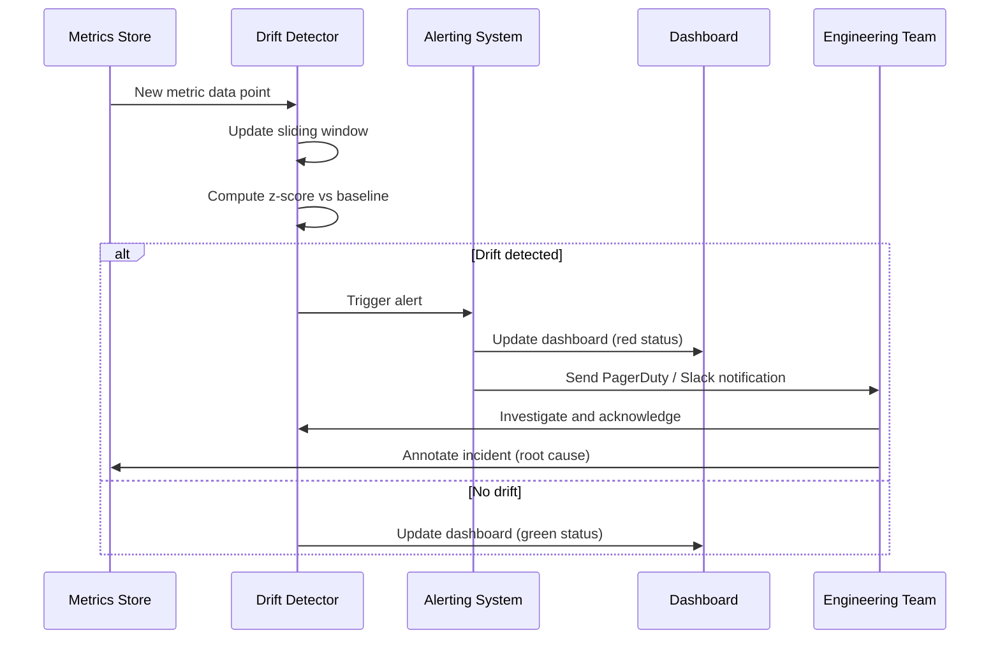
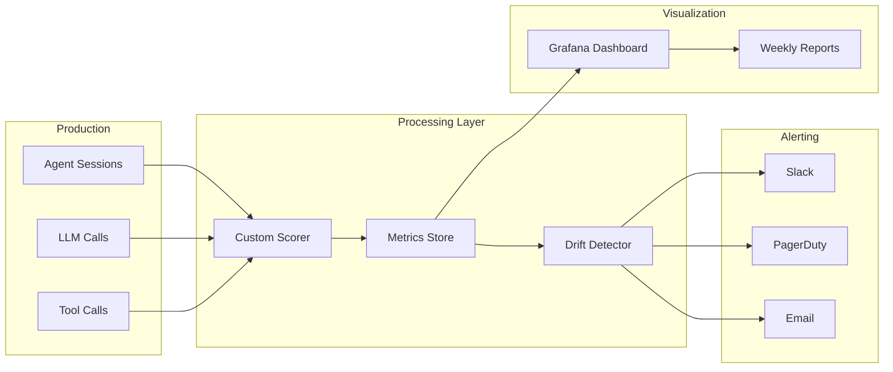

# Scoring, Metrics and Continuous Monitoring

## Defining Custom Metrics

Generic metrics (BLEU, ROUGE) rarely capture what matters for your specific agent. You need **custom success criteria** that reflect your domain's requirements. A customer support agent cares about resolution rate; a code generation agent cares about compilation success.

```python
# scoring.py
from typing import Dict, List, Any
import time


class AgentScorer:
    """
    Compute custom success metrics for an agentic system.

    Each scoring function returns a dict with:
        - score (float): 0.0 to 1.0
        - details (dict): breakdown of sub-scores
        - timestamp (float): epoch seconds
    """

    def __init__(self, config: Dict[str, Any]):
        self.task_completed_weight = config.get(
            "task_completed_weight", 0.4
        )
        self.tool_efficiency_weight = config.get(
            "tool_efficiency_weight", 0.2
        )
        self.response_time_weight = config.get(
            "response_time_weight", 0.2
        )
        self.safety_score_weight = config.get(
            "safety_score_weight", 0.2
        )

    def score_task_completion(
        self, expected: List[str], actual: List[str]
    ) -> Dict[str, Any]:
        """
        Compute F1 score for expected vs actual task outcomes.

        Args:
            expected: List of task outcomes that should have occurred
            actual: List of task outcomes that did occur

        Returns:
            dict with score and details
        """
        expected_set = set(expected)
        actual_set = set(actual)

        true_positives = len(expected_set & actual_set)
        false_positives = len(actual_set - expected_set)
        false_negatives = len(expected_set - actual_set)

        precision = true_positives / (true_positives + false_positives) \
            if (true_positives + false_positives) > 0 else 0.0
        recall = true_positives / (true_positives + false_negatives) \
            if (true_positives + false_negatives) > 0 else 0.0
        f1 = 2 * (precision * recall) / (precision + recall) \
            if (precision + recall) > 0 else 0.0

        return {
            "score": f1,
            "details": {
                "precision": precision,
                "recall": recall,
                "f1": f1,
                "true_positives": true_positives,
                "false_positives": false_positives,
                "false_negatives": false_negatives,
            },
            "timestamp": time.time(),
        }

    def score_tool_efficiency(
        self,
        tool_calls: List[Dict[str, Any]],
        max_allowed_calls: int = 10,
    ) -> Dict[str, Any]:
        """
        Score based on how efficiently the agent uses tools.

        Fewer tool calls = higher score, up to a limit.
        """
        total_calls = len(tool_calls)
        if total_calls == 0:
            return {"score": 1.0, "details": {"calls": 0}, "timestamp": time.time()}

        efficiency = max(0.0, 1.0 - (total_calls / max_allowed_calls))
        return {
            "score": efficiency,
            "details": {
                "total_calls": total_calls,
                "max_allowed": max_allowed_calls,
                "unique_tools": len({c["tool_name"] for c in tool_calls}),
            },
            "timestamp": time.time(),
        }

    def score_response_time(
        self, response_time_ms: float, threshold_ms: float = 5000
    ) -> Dict[str, Any]:
        """Score based on response time relative to a threshold."""
        if response_time_ms <= threshold_ms:
            return {
                "score": 1.0,
                "details": {"response_time_ms": response_time_ms},
                "timestamp": time.time(),
            }

        penalty = (response_time_ms - threshold_ms) / threshold_ms
        score = max(0.0, 1.0 - penalty)
        return {
            "score": score,
            "details": {
                "response_time_ms": response_time_ms,
                "penalty": penalty,
            },
            "timestamp": time.time(),
        }

    def compute_overall(
        self, sub_scores: Dict[str, float]
    ) -> Dict[str, Any]:
        """Compute weighted overall score from sub-scores."""
        overall = (
            sub_scores.get("task_completion", 0.0) * self.task_completed_weight
            + sub_scores.get("tool_efficiency", 0.0) * self.tool_efficiency_weight
            + sub_scores.get("response_time", 0.0) * self.response_time_weight
            + sub_scores.get("safety", 0.0) * self.safety_score_weight
        )
        return {
            "overall_score": round(overall, 3),
            "weights": {
                "task_completion": self.task_completed_weight,
                "tool_efficiency": self.tool_efficiency_weight,
                "response_time": self.response_time_weight,
                "safety": self.safety_score_weight,
            },
            "sub_scores": sub_scores,
            "timestamp": time.time(),
        }


# === Usage ===
scorer = AgentScorer({
    "task_completed_weight": 0.5,
    "tool_efficiency_weight": 0.3,
    "response_time_weight": 0.1,
    "safety_score_weight": 0.1,
})

task = scorer.score_task_completion(
    expected=["refund_processed", "email_sent"],
    actual=["refund_processed", "email_sent", "sms_sent"],
)
eff = scorer.score_tool_efficiency([
    {"tool_name": "search"},
    {"tool_name": "db_lookup"},
])
rt = scorer.score_response_time(3200)
overall = scorer.compute_overall({
    "task_completion": task["score"],
    "tool_efficiency": eff["score"],
    "response_time": rt["score"],
    "safety": 0.95,
})
print(f"Overall: {overall['overall_score']}")
```

> [!TIP]
> Weight selection should be driven by business priorities, not intuition. Analyze production logs to identify which metrics correlate with user satisfaction, retention, and support ticket volume. Start with equal weights and adjust based on data.

---

## Tracking Metrics Over Time

Store scores in a time-series database to track trends, detect regressions, and power dashboards.

```python
# metrics_store.py
import sqlite3
import json
from datetime import datetime, timezone
from typing import List, Tuple, Optional


class MetricsStore:
    """Store and retrieve agent metrics over time."""

    def __init__(self, db_path: str = "metrics.db"):
        self.conn = sqlite3.connect(db_path)
        self._init_db()

    def _init_db(self):
        self.conn.execute("""
            CREATE TABLE IF NOT EXISTS agent_metrics (
                id INTEGER PRIMARY KEY AUTOINCREMENT,
                session_id TEXT NOT NULL,
                metric_name TEXT NOT NULL,
                score REAL NOT NULL,
                details TEXT,
                recorded_at TEXT NOT NULL
            )
        """)
        self.conn.execute("""
            CREATE INDEX IF NOT EXISTS idx_metric_name
            ON agent_metrics(metric_name, recorded_at)
        """)
        self.conn.execute("""
            CREATE INDEX IF NOT EXISTS idx_recorded_at
            ON agent_metrics(recorded_at)
        """)
        self.conn.commit()

    def record(
        self,
        session_id: str,
        metric_name: str,
        score: float,
        details: dict = None,
    ):
        self.conn.execute(
            "INSERT INTO agent_metrics "
            "(session_id, metric_name, score, details, recorded_at) "
            "VALUES (?, ?, ?, ?, ?)",
            (
                session_id,
                metric_name,
                score,
                json.dumps(details) if details else None,
                datetime.now(timezone.utc).isoformat(),
            ),
        )
        self.conn.commit()

    def get_daily_average(
        self, metric_name: str, days: int = 7
    ) -> List[Tuple[str, float]]:
        cursor = self.conn.execute("""
            SELECT DATE(recorded_at) as day, AVG(score) as avg_score
            FROM agent_metrics
            WHERE metric_name = ?
              AND recorded_at >= DATE('now', ?)
            GROUP BY day
            ORDER BY day
        """, (metric_name, f"-{days} days"))
        return cursor.fetchall()

    def get_recent_scores(
        self, metric_name: str, limit: int = 100
    ) -> List[Tuple[float, str]]:
        cursor = self.conn.execute("""
            SELECT score, recorded_at
            FROM agent_metrics
            WHERE metric_name = ?
            ORDER BY recorded_at DESC
            LIMIT ?
        """, (metric_name, limit))
        return cursor.fetchall()

    def get_metric_summary(
        self, metric_name: str, days: int = 7
    ) -> dict:
        """Compute summary statistics for a metric."""
        cursor = self.conn.execute("""
            SELECT
                AVG(score) as mean,
                MIN(score) as min,
                MAX(score) as max,
                COUNT(*) as count
            FROM agent_metrics
            WHERE metric_name = ?
              AND recorded_at >= DATE('now', ?)
        """, (metric_name, f"-{days} days"))
        row = cursor.fetchone()
        if row and row[3] > 0:
            return {
                "metric": metric_name,
                "mean": round(row[0], 3),
                "min": round(row[1], 3),
                "max": round(row[2], 3),
                "count": row[3],
            }
        return {"metric": metric_name, "error": "No data available"}
```

---

## Drift Detection

Monitor for performance degradation over time. Drift detection alerts you when the agent's quality metrics deviate significantly from their historical baseline.

```python
# drift_detector.py
import statistics
from typing import List, Tuple, Optional


class DriftDetector:
    """
    Detect when metric scores drift outside acceptable bounds.

    Uses a sliding window to compare recent performance against
    a baseline period. Employs z-score testing for statistical
    significance.
    """

    def __init__(
        self,
        window_size: int = 100,
        std_dev_threshold: float = 2.0,
        min_baseline_size: int = 30,
    ):
        self.window_size = window_size
        self.std_dev_threshold = std_dev_threshold
        self.min_baseline_size = min_baseline_size

    def check_drift(
        self, baseline: List[float], recent: List[float]
    ) -> Tuple[bool, float]:
        """
        Check if recent scores have drifted from baseline.

        Args:
            baseline: Historical scores (reference distribution)
            recent: Most recent scores

        Returns:
            (is_drifted: bool, z_score: float)
        """
        if len(baseline) < self.min_baseline_size:
            return False, 0.0

        baseline_mean = statistics.mean(baseline)
        baseline_stdev = statistics.stdev(baseline) if len(baseline) > 1 else 1.0
        recent_mean = statistics.mean(recent) if recent else baseline_mean

        # Two-sample z-test
        standard_error = baseline_stdev / (len(recent) ** 0.5)
        if standard_error == 0:
            return False, 0.0

        z_score = (baseline_mean - recent_mean) / standard_error
        is_drifted = abs(z_score) > self.std_dev_threshold

        return is_drifted, z_score

    def check_trend_drift(
        self, scores: List[float], lookback: int = 20
    ) -> Tuple[bool, float]:
        """
        Check if the most recent scores show a significant trend.

        Uses simple linear regression slope to detect gradual drift
        that a z-test might miss.
        """
        if len(scores) < lookback * 2:
            return False, 0.0

        recent = scores[-lookback:]
        earlier = scores[-(lookback * 2):-lookback]

        recent_mean = statistics.mean(recent)
        earlier_mean = statistics.mean(earlier)

        # If recent is significantly lower, flag drift
        drop = (earlier_mean - recent_mean) / earlier_mean
        is_drifted = drop > 0.1  # 10% drop threshold
        return is_drifted, drop

    def alert_if_drifted(
        self,
        metric_name: str,
        baseline: List[float],
        recent: List[float],
    ) -> Optional[str]:
        """Return an alert message if drift is detected, else None."""
        is_drifted, z_score = self.check_drift(baseline, recent)
        if is_drifted:
            return (
                f"[ALERT] Metric '{metric_name}' drifted "
                f"(z-score: {z_score:.2f}, "
                f"recent mean: {statistics.mean(recent):.3f}, "
                f"baseline mean: {statistics.mean(baseline):.3f})"
            )
        return None
```

---

## Drift Detection Sequence



> [!WARNING]
> Drift detection requires sufficient data to establish a reliable baseline. Do not set alerting thresholds until you have at least 100 data points per metric. Premature thresholds cause alert fatigue from false positives. Start with a threshold of 3.0 and tighten to 2.0 as you gain confidence.

> [!IMPORTANT]
> Define SLIs (Service Level Indicators), SLOs (Service Level Objectives), and SLAs (Service Level Agreements) for your agent:
> - **SLI**: The actual metric you measure (e.g., "task completion score")
> - **SLO**: The target threshold (e.g., "task completion score >= 0.85 over a 30-day window")
> - **SLA**: The commitment to users (e.g., "99.9% of requests meet the SLO")
> Without these definitions, you cannot objectively decide whether a drift alert requires immediate action or routine investigation.

---

## Alert Configuration

```yaml
# alerts_config.yml
alerts:
  task_completion:
    metric: "task_completion"
    type: "drift"
    baseline_window_days: 30
    recent_window_count: 50
    z_score_threshold: 2.5
    channels: ["slack", "pagerduty"]
    severity: "critical"
    description: "Task completion rate has dropped significantly"
    runbook: "https://runbooks.internal/agent-drift"

  response_time:
    metric: "response_time"
    type: "threshold"
    threshold_ms: 8000
    evaluation_window_minutes: 15
    channels: ["slack"]
    severity: "warning"
    description: "Average response time exceeds 8 seconds"
    runbook: "https://runbooks.internal/slow-responses"

  safety_violations:
    metric: "safety"
    type: "count"
    threshold: 5
    evaluation_window_hours: 24
    channels: ["slack", "pagerduty", "email"]
    severity: "critical"
    description: "More than 5 safety violations in 24 hours"
    runbook: "https://runbooks.internal/safety-incident"

  cost_per_session:
    metric: "cost"
    type: "threshold"
    threshold_usd: 0.50
    evaluation_window_days: 1
    channels: ["slack"]
    severity: "info"
    description: "Average cost per session exceeds $0.50"
```

### Implementing Alerts in Python

```python
# alert_manager.py
import smtplib
import json
import requests
from typing import Dict, List, Optional


class AlertManager:
    """Send alerts through multiple channels."""

    def __init__(self, config_path: str):
        with open(config_path) as f:
            self.config = json.load(f)

    def send_alert(
        self, alert_name: str, message: str, severity: str = "warning"
    ):
        """Send alert through all configured channels."""
        alert_config = self.config["alerts"].get(alert_name)
        if not alert_config:
            print(f"No config for alert: {alert_name}")
            return

        channels = alert_config.get("channels", ["slack"])

        if "slack" in channels:
            self._send_slack(message, severity)
        if "pagerduty" in channels:
            self._send_pagerduty(message, severity)
        if "email" in channels:
            self._send_email(message, severity)

    def _send_slack(self, message: str, severity: str):
        """Send alert to Slack webhook."""
        color = "#ff0000" if severity == "critical" else "#ffa500"
        payload = {
            "attachments": [{
                "color": color,
                "text": message,
                "footer": "Agent Monitoring System",
            }]
        }
        requests.post(
            self.config["slack_webhook_url"],
            json=payload,
            timeout=10,
        )

    def _send_pagerduty(self, message: str, severity: str):
        """Send alert to PagerDuty."""
        payload = {
            "routing_key": self.config["pagerduty_routing_key"],
            "event_action": "trigger",
            "payload": {
                "summary": message[:120],
                "severity": severity,
                "source": "agent-monitoring",
            },
        }
        requests.post(
            "https://events.pagerduty.com/v2/enqueue",
            json=payload,
            timeout=10,
        )

    def _send_email(self, message: str, severity: str):
        """Send alert via email."""
        # Implementation depends on email provider
        pass
```

---

## Continuous Monitoring Pipeline



---

## Dashboards

A real-time dashboard visualizes agent health at a glance. Below is a minimal example using a JSON-based dashboard config that could feed into Grafana, Streamlit, or a custom web app.

```yaml
# dashboard_config.yml
dashboard:
  title: "Agent Production Health"
  refresh_interval_seconds: 60
  time_range_days: 7

  panels:
    - title: "Task Success Rate (7d)"
      metric: "task_completion"
      aggregation: "avg"
      chart_type: "timeseries"
      alert_threshold: 0.80
      description: "Percentage of tasks completed successfully"

    - title: "Avg Response Time (7d)"
      metric: "response_time"
      aggregation: "avg"
      chart_type: "timeseries"
      alert_threshold: 5000
      unit: "ms"
      description: "Average response time in milliseconds"

    - title: "Tool Call Count"
      metric: "tool_efficiency"
      aggregation: "sum"
      chart_type: "bar"
      description: "Total number of tool calls per day"

    - title: "Safety Violations"
      metric: "safety"
      aggregation: "count"
      chart_type: "gauge"
      alert_threshold: 5
      description: "Number of safety violations detected"

    - title: "Cost Per Session (7d)"
      metric: "cost"
      aggregation: "avg"
      chart_type: "timeseries"
      alert_threshold: 0.50
      unit: "USD"

    - title: "Active Sessions"
      metric: "sessions"
      aggregation: "count"
      chart_type: "stat"
      description: "Currently active agent sessions"
```

> [!WARNING]
> Alert fatigue is a real danger. If every minor metric fluctuation generates a notification, your team will begin ignoring alerts. Follow these rules:
> 1. Only alert on metrics that have a well-established baseline (at least 100 data points)
> 2. Use severity levels — only "critical" alerts go to PagerDuty; "warning" goes to Slack
> 3. Implement hysteresis: a metric must breach threshold for N consecutive windows before alerting
> 4. Review alert effectiveness monthly — prune alerts that never fire or always fire

---

## Continuous Evaluation Pipeline (CI/CD)

Automate evaluation as part of your CI/CD and production data pipelines.

```yaml
# .github/workflows/eval-pipeline.yml
name: Daily Evaluation

on:
  schedule:
    - cron: "0 6 * * *"  # every day at 06:00 UTC
  workflow_dispatch:  # allow manual trigger

jobs:
  evaluate:
    runs-on: ubuntu-latest
    steps:
      - uses: actions/checkout@v4
      - run: pip install -r requirements.txt

      - name: Run evaluation on yesterday's production logs
        run: python scripts/run_evaluation.py \
          --input s3://prod-logs/$(date -d 'yesterday' +%Y/%m/%d)/ \
          --output s3://eval-results/

      - name: Check for drift
        run: python scripts/detect_drift.py \
          --metrics-db s3://eval-results/metrics.db \
          --output alert.json

      - name: Send alerts if needed
        run: python scripts/send_alerts.py --input alert.json

      - name: Deploy dashboard update
        run: python scripts/update_dashboard.py \
          --input s3://eval-results/ \
          --dashboard-id prod-agent-health
        env:
          GRAFANA_API_KEY: ${{ secrets.GRAFANA_API_KEY }}
```

---

## Comparison Table: Metric Types

| Metric Category     | Examples                          | Measurement        | Source            | Alert Priority | Trend Significance |
|---------------------|-----------------------------------|--------------------|-------------------|----------------|--------------------|
| Accuracy           | Task completion, F1 score         | Per-session        | LLM output eval   | Critical       | Direct quality     |
| Latency            | Response time, TTFT               | Per-call           | Application logs  | High           | User experience    |
| Cost               | Cost per session, token count     | Per-call           | Billing API       | Medium         | Budget management  |
| Safety             | Toxicity score, PII violations    | Per-response       | Guardrail system   | Critical       | Compliance risk    |
| Engagement         | Session length, retention rate    | Per-user           | Analytics          | Low            | Product health     |
| Reliability        | Error rate, timeout rate          | Per-call           | Monitoring         | High           | System stability   |

---

## Comparison Table: Monitoring Components

| Component              | Purpose                         | Frequency        | Tooling                    | Dependencies          |
|------------------------|---------------------------------|------------------|----------------------------|-----------------------|
| Custom scoring         | Task-specific success criteria  | Per session      | Python, domain logic       | Labeled ground truth  |
| Metrics store          | Persistent time-series data     | Per session      | SQLite, PostgreSQL, InfluxDB| DB connection         |
| Drift detection        | Identify performance regression | Daily            | Statistical tests, ML      | Baseline data         |
| Alerting               | Notify on threshold breach      | Real-time        | PagerDuty, Slack, email    | Metric pipeline       |
| Dashboard              | Visualize agent health          | Real-time        | Grafana, Streamlit, Metabase| Metrics store        |
| Evaluation pipeline    | Automated batch eval            | Daily / release  | GitHub Actions, Airflow    | Test dataset          |
| Incident tracking      | Root cause and resolution log   | Per incident     | Jira, Linear, PagerDuty    | Alert system          |

---

## Practice Questions

```question
{
  "id": "gr-5-q1",
  "type": "multiple-choice",
  "question": "A team notices the average task completion score dropped from 0.92 to 0.73 over 3 days. According to the lesson, what is the first diagnostic step?",
  "options": [
    "Immediately roll back the latest deployment",
    "Investigate the sub-scores to identify which dimension caused the drop",
    "Increase the alert threshold to 0.70",
    "Retrain the LLM model"
  ],
  "correct": 1,
  "explanation": "Before taking action, investigate sub-scores (precision, recall, specific failure categories) to identify which dimension caused the drop. Jumping to rollback or retraining without diagnosis wastes time and may not fix the actual problem."
}
```

```question
{
  "id": "gr-5-q2",
  "type": "multiple-choice",
  "question": "A metrics store records scores in a time-series database. What is the primary purpose of storing these metrics over time?",
  "options": [
    "To generate invoices for customers",
    "To track trends, detect regressions, and power dashboards",
    "To replace the need for human evaluation",
    "To comply with data retention laws only"
  ],
  "correct": 1,
  "explanation": "Time-series metric storage enables trend analysis, regression detection (via drift detection), and real-time dashboard visualization. Compliance is a secondary concern, not the primary purpose."
}
```

```question
{
  "id": "gr-5-q3",
  "type": "multiple-choice",
  "question": "A team sets up drift detection with a z-score threshold of 2.0 and a window of 100 data points. What should they ensure before relying on these alerts?",
  "options": [
    "The LLM model is the latest version",
    "There are at least 100 data points to establish a reliable baseline",
    "The dashboard has at least 5 panels",
    "The alerting system sends notifications via email"
  ],
  "correct": 1,
  "explanation": "Drift detection requires a statistically significant baseline. The lesson recommends at least 100 data points per metric before setting alerting thresholds. Without this, alerts will be unreliable due to high variance in small samples."
}
```

```question
{
  "id": "gr-5-q4",
  "type": "multiple-choice",
  "question": "A dashboard has a panel showing 'Safety Violations' as a count. Which chart type is recommended for this metric in the lesson?",
  "options": [
    "Timeseries",
    "Bar chart",
    "Gauge",
    "Pie chart"
  ],
  "correct": 2,
  "explanation": "A gauge chart is recommended for count-based metrics like safety violations because it provides an at-a-glance status indicator (green/yellow/red) against a threshold, rather than showing historical trends."
}
```

```question
{
  "id": "gr-5-q5",
  "type": "multiple-choice",
  "question": "A continuous evaluation pipeline runs daily at 06:00 UTC. What is the most appropriate trigger for this pipeline?",
  "options": [
    "A git push to main branch",
    "A scheduled cron job",
    "Manual trigger only",
    "A pull request approval"
  ],
  "correct": 1,
  "explanation": "A scheduled cron job is appropriate for daily evaluation of production data that accumulates over time. Git push triggers would run too frequently (every commit) and are better suited for unit/integration tests."
}
```

---

> [!SUCCESS]
> ## Key Takeaways
> - Generic metrics are insufficient; define custom scoring functions that capture task-specific success criteria with configurable weights driven by business priorities.
> - Store metrics in a time-series database to track trends, detect regressions, and power dashboards.
> - Drift detection uses statistical tests (z-score, sliding window, trend analysis) to identify performance degradation automatically and reliably.
> - Alerting thresholds must be set after establishing a reliable baseline (at least 100 data points) to avoid alert fatigue.
> - Define SLIs, SLOs, and SLAs to objectively measure and communicate agent performance.
> - A continuous evaluation pipeline runs daily or per-release, scoring production sessions, checking for drift, and updating dashboards.
> - Dashboards provide at-a-glance health monitoring; combine chart types (timeseries, bar, gauge, stat) for clarity and quick decision-making.
> - Every component — scoring, storage, drift detection, alerting, dashboards — must be defined before production launch.
> - Use severity levels and hysteresis in alerting to prevent alert fatigue and focus your team on genuine issues.
