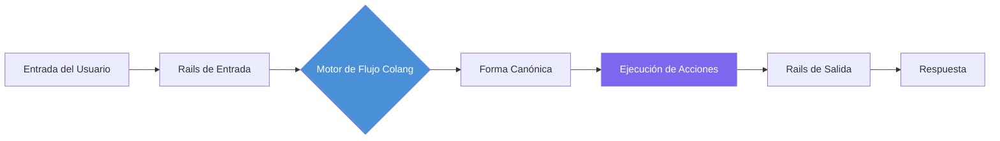
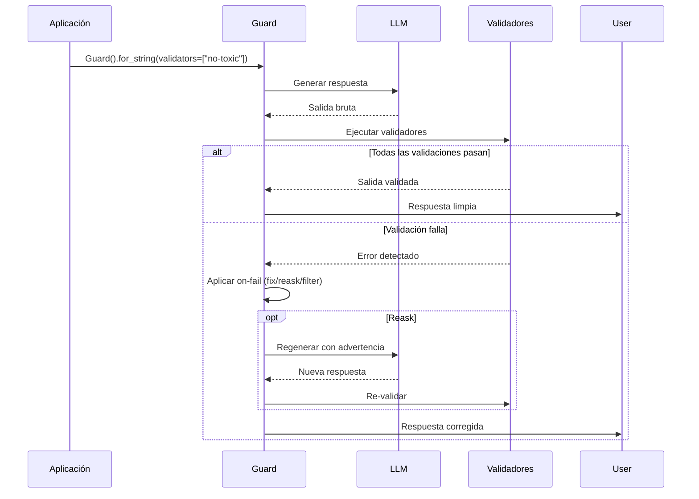

# Implementando Guardrails: NeMo, Guardrails AI y Personalizados

## NVIDIA NeMo Guardrails

NVIDIA NeMo Guardrails es un kit de herramientas open-source para añadir guardrails programables a aplicaciones basadas en LLM. Usa el lenguaje de política **Colang** para definir flujos conversacionales y restricciones de seguridad.

### Conceptos Clave

- **Rails**: Definiciones de guardrails nombradas escritas en Colang
- **Actions**: Funciones Python que los rails invocan
- **Colang**: DSL estilo YAML para modelar flujos de diálogo
- **LLMRails**: El runtime que procesa la entrada del usuario a través de los rails definidos

### Diagrama de Flujo Colang



El motor de flujo está en el centro: analiza la entrada del usuario, la compara con las definiciones de flujo Colang, ejecuta las acciones Python asociadas, y luego ejecuta los rails de salida antes de devolver la respuesta.

### Configuración

```yaml
# config.yml
rails:
  input:
    flows:
      - self_check_input
      - detect_jailbreak
      - check_topic_allowed
  output:
    flows:
      - self_check_output
      - check_factual_consistency
      - validate_format

colang_files:
  - "rails/prompt_injection.co"
  - "rails/topical_rails.co"
  - "rails/safety.co"
  - "rails/formatting.co"

prompt_context:
  system_prompt: "Eres un agente de servicio al cliente útil."
  max_turns: 10
  max_tokens: 4096
```

### Ejemplos de Políticas Colang

```
# rails/topical_rails.co
define flow topical_guardrail
  user said topic in allowed_topics
  bot express positive confirmation
  bot provide relevant response

define flow topical_guardrail
  user said topic not in allowed_topics
  bot express cannot answer
  bot suggest redirect

define user said topic in allowed_topics
  "topic" in ["producto", "precio", "envío", "devoluciones"]

define bot express cannot answer
  "Lo siento, solo puedo responder preguntas sobre nuestros productos y servicios."
```

```
# rails/safety.co
define flow self_check_input
  user ...
  bot check for harmful content
  if harmful then bot refuse to respond

define bot check for harmful content
  execute check_harmful_content

define bot refuse to respond
  "No puedo responder a esa solicitud."
```

### Acción Python para NeMo

```python
from nemoguardrails import RailsConfig, LLMRails

config = RailsConfig.from_path("config.yml")
rails = LLMRails(config)

response = rails.generate(
    messages=[{"role": "user", "content": "¿Cuál es la política de devolución?"}]
)
print(response)
```

```python
# actions/harmful_content.py
from typing import Optional

def check_harmful_content(context: dict) -> Optional[str]:
    """Verifica contenido dañino. Retorna mensaje de error si se detecta algo."""
    user_message = context.get("user_message", "")
    harmful_keywords = ["bomba", "ataque", "drogas ilegales", "hackear"]
    for keyword in harmful_keywords:
        if keyword in user_message.lower():
            return f"Contenido dañino detectado: {keyword}"
    return None
```

> [!NOTE]
> Colang usa sintaxis sensible a la indentación similar a YAML. Cada bloque `define flow` representa una ruta conversacional. El patrón `user ...` coincide con cualquier mensaje del usuario, mientras que `user said ...` coincide con intenciones específicas. Los flujos pueden ramificarse según condiciones.

---

## Guardrails AI Library

Guardrails AI (guardrails-ai/guardrails) proporciona un enfoque basado en decoradores para definir validadores de salida. A diferencia de NeMo que se centra en flujos de diálogo, Guardrails AI se especializa en validación de estructura y contenido de salida.

### Flujo de Validación



### Validador Personalizado

```python
from guardrails.validators import Validator, register_validator

@register_validator("has_min_length", data_type="string")
class MinLengthValidator(Validator):
    """Verifica que la respuesta cumpla con una longitud mínima."""

    def validate(self, value, metadata):
        min_len = metadata.get("min_length", 10)
        if len(value) < min_len:
            raise Exception(f"Respuesta demasiado corta: {len(value)} < {min_len}")
        return value

    def validate_with_reask(self, value, metadata):
        try:
            return self.validate(value, metadata)
        except Exception as e:
            sugerencia = metadata.get("reask_prompt", "Proporcione una respuesta más detallada.")
            raise Exception(f"{e}. {sugerencia}")
```

### Uso con LLM

```python
import openai
from guardrails import Guard

guard = Guard.for_string(validators=["no-toxic-language", "valid-json"])

raw = openai.chat.completions.create(
    model="gpt-4",
    messages=[{"role": "user", "content": "Explica RLHF"}]
)

validated = guard.validate(raw.choices[0].message.content)

if validated.validation_passed:
    print("Salida segura:", validated.output)
else:
    print("Guardrail bloqueó:", validated.error)
```

### Especificación Rail (XML)

```xml
<!-- rail_spec.xml -->
<rail version="0.1">
  <input>
    <validator type="length" min="1" max="2000" on-fail="reject"/>
    <validator type="prompt-injection" on-fail="reask"/>
  </input>

  <output>
    <validator type="no-toxic-language" on-fail="fix"/>
    <validator type="json-schema" on-fail="reask">
      <schema>
        {
          "type": "object",
          "properties": {
            "answer": {"type": "string"},
            "confidence": {"type": "number"}
          }
        }
      </schema>
    </validator>
  </output>
</rail>
```

---

## Implementación Personalizada de Guardrails

Cuando las herramientas comerciales no se ajustan a su dominio, implemente guardrails directamente en Python.

```python
# custom_guardrail.py
import re
import logging
from typing import Dict, List
from datetime import datetime

logging.basicConfig(level=logging.INFO)
logger = logging.getLogger("custom_guardrail")

class PIIRedactionGuardrail:
    """
    Guardrail personalizado que redacta PII (correos, teléfonos, SSN)
    de la salida del LLM antes de devolverla al usuario.
    """

    def __init__(self, mask_token: str = "[REDACTED]"):
        self.mask_token = mask_token
        self.redaction_log: List[Dict] = []
        self.patterns = {
            "email": re.compile(r"[\w\.-]+@[\w\.-]+\.\w+"),
            "phone": re.compile(r"\b\d{3}[-.]?\d{3}[-.]?\d{4}\b"),
            "ssn": re.compile(r"\b\d{3}-\d{2}-\d{4}\b"),
            "credit_card": re.compile(r"\b\d{4}[- ]?\d{4}[- ]?\d{4}[- ]?\d{4}\b"),
        }

    def validate(self, text: str) -> str:
        """Redacta todos los patrones PII del texto."""
        for name, pattern in self.patterns.items():
            matches = pattern.findall(text)
            if matches:
                logger.info(f"[GUARDRAIL] Redactó {len(matches)} {name}(s)")
                self.redaction_log.append({
                    "type": name, "count": len(matches),
                    "timestamp": datetime.utcnow().isoformat(),
                })
                text = pattern.sub(self.mask_token, text)
        return text

    def contains_pii(self, text: str) -> bool:
        return any(pattern.search(text) for pattern in self.patterns.values())

    def get_stats(self) -> Dict:
        return {
            "total_redactions": len(self.redaction_log),
            "by_type": {name: sum(1 for e in self.redaction_log if e["type"] == name) for name in self.patterns},
            "recent": self.redaction_log[-10:] if self.redaction_log else [],
        }


# Uso
pii_guard = PIIRedactionGuardrail()
safe = pii_guard.validate("Contacto: juan@email.com o 555-123-4567")
print(safe)
# Output: Contacto: [REDACTED] o [REDACTED]

print(pii_guard.get_stats())
```

> [!WARNING]
> La redacción de PII basada en regex es un punto de partida, no una solución completa. Nombres, direcciones y PII dependientes de contexto requieren reconocimiento de entidades basado en NLP (spaCy NER, Presidio). Combine siempre guardrails regex con clasificadores basados en modelos para producción.

> [!TIP]
> Al implementar guardrails personalizados, incluya siempre un método `get_stats()` para observabilidad. Esto facilita la integración con dashboards de monitoreo y la detección de patrones como tasas crecientes de falsos positivos.

---

## Combinando Sistemas de Guardrails

```python
# combined_guardrails.py
from nemoguardrails import LLMRails
from guardrails import Guard

class HybridGuardrailSystem:
    """
    Combina NeMo (flujo de diálogo) con Guardrails AI (validación de salida)
    y validadores Python personalizados.
    """

    def __init__(self, nemo_config_path: str):
        # Capa 1: NeMo para flujo de diálogo
        self.nemo = LLMRails.from_path(nemo_config_path)

        # Capa 2: Guardrails AI para validación de salida
        self.guardrails_ai = Guard.for_string(
            validators=["no-toxic-language", "valid-json"],
        )

        # Capa 3: Redacción PII personalizada
        self.pii = PIIRedactionGuardrail()

    def process(self, user_input: str) -> dict:
        result = {"input": user_input, "guarded": True}

        # Paso 1: Ejecutar NeMo
        nemo_response = self.nemo.generate(
            messages=[{"role": "user", "content": user_input}]
        )

        # Paso 2: Redacción PII
        clean_text = self.pii.validate(nemo_response)

        # Paso 3: Validación Guardrails AI
        validation = self.guardrails_ai.validate(clean_text)
        result["validation_passed"] = validation.validation_passed

        if validation.validation_passed:
            result["final_output"] = validation.output
        else:
            result["final_output"] = None
            result["error"] = str(validation.error)

        return result
```

---

## Tabla Comparativa

| Característica        | NeMo Guardrails   | Guardrails AI     | Implementación Personalizada |
|------------------------|-------------------|-------------------|------------------------------|
| Lenguaje              | Colang + Python   | Python + XML      | Python puro                  |
| Guardrails entrada    | Sí (flujos)       | Sí (validadores)  | Tú construyes                |
| Guardrails salida     | Sí (flujos)       | Sí (validadores)  | Tú construyes                |
| Guardrails comportamiento | Sí (gestión diálogo) | Limitado     | Tú construyes                |
| Gestión de diálogo    | Completa (multiturno) | Ninguna      | Tú construyes                |
| Curva de aprendizaje  | Media             | Baja              | Alta (desde cero)            |
| Validadores nativos   | ~20               | ~50               | Ninguno                      |
| Acciones personalizadas| Funciones Python | @register_validator | Cualquier código           |
| Recuperación de errores| Re-enrutar flujos| Reask/Fix/Filter  | Tú construyes                |
| Mejor para            | Multiturno complejo| Validación simple | Reglas de dominio específico |

---

## Preguntas de Práctica

```question
{
  "id": "gr-2-q1",
  "type": "multiple-choice",
  "question": "Un equipo necesita implementar políticas de diálogo multiturno complejas para un agente de atención al cliente que mantiene contexto entre intercambios. ¿Qué herramienta es más adecuada?",
  "options": [
    "Guardrails AI con especificaciones XML",
    "Validadores Python personalizados",
    "NVIDIA NeMo Guardrails con Colang",
    "Redacción de PII basada en regex"
  ],
  "correct": 2,
  "explanation": "NeMo Guardrails con Colang está diseñado para gestión de diálogo multiturno, modelando flujos conversacionales y manteniendo estado entre turnos."
}
```

```question
{
  "id": "gr-2-q2",
  "type": "multiple-choice",
  "question": "En Guardrails AI, ¿cómo se definen las reglas de validación personalizadas principalmente?",
  "options": [
    "Usando archivos de configuración YAML",
    "Usando un decorador @register_validator en una clase Python",
    "Escribiendo definiciones de flujo Colang",
    "Creando disparadores SQL"
  ],
  "correct": 1,
  "explanation": "Guardrails AI usa el decorador @register_validator para registrar clases validadoras Python que heredan de Validator e implementan validate()."
}
```

```question
{
  "id": "gr-2-q3",
  "type": "multiple-choice",
  "question": "Un desarrollador implementa un guardrail con regex para detectar números de teléfono y correos electrónicos en la salida del LLM. ¿Cuál es la limitación principal?",
  "options": [
    "Regex es demasiado lento para producción",
    "Regex no detecta PII dependiente de contexto como nombres y direcciones",
    "Regex no se puede combinar con otros guardrails",
    "Regex solo funciona con datos estructurados"
  ],
  "correct": 1,
  "explanation": "Regex es rápido para PII estructurada pero falla en PII no estructurada como nombres y direcciones. Para producción, combine regex con reconocimiento de entidades basado en NLP."
}
```

```question
{
  "id": "gr-2-q4",
  "type": "multiple-choice",
  "question": "¿Para qué se usa principalmente el lenguaje Colang en NVIDIA NeMo Guardrails?",
  "options": [
    "Definir funciones de acción Python",
    "Escribir pruebas unitarias para sistemas de guardrails",
    "Modelar flujos conversacionales y restricciones de seguridad",
    "Configurar ajustes de despliegue en la nube"
  ],
  "correct": 2,
  "explanation": "Colang es un lenguaje de dominio específico para modelar flujos conversacionales, restricciones de seguridad y políticas de diálogo."
}
```

```question
{
  "id": "gr-2-q5",
  "type": "multiple-choice",
  "question": "Una startup necesita agregar rápidamente validación de salida para formato JSON y detección de lenguaje tóxico con mínima curva de aprendizaje. ¿Qué enfoque elegir?",
  "options": [
    "Construir un guardrail Python desde cero",
    "Usar NVIDIA NeMo Guardrails con Colang",
    "Usar Guardrails AI con validadores nativos",
    "Usar validación regex en un script shell"
  ],
  "correct": 2,
  "explanation": "Guardrails AI tiene la curva de aprendizaje más baja con ~50 validadores nativos, especificaciones XML simples y validadores basados en decoradores."
}
```

---

> [!SUCCESS]
> ## Conclusiones Clave
> - NVIDIA NeMo Guardrails usa Colang para políticas de diálogo con gestión de conversaciones multiturno.
> - Guardrails AI ofrece validadores basados en decoradores con ~50 validadores nativos; mejor para validación de estructura de salida.
> - Guardrails personalizados en Python dan control total pero requieren implementar logging, composición y manejo de errores.
> - Los guardrails basados en regex son rápidos pero frágiles; combínelos con clasificadores basados en modelos.
> - Considere enfoques híbridos combinando NeMo para flujo de diálogo, Guardrails AI para validación de salida y código personalizado para reglas de dominio.
> - Evalúe la eficacia de los guardrails con precisión, recall y F1.
