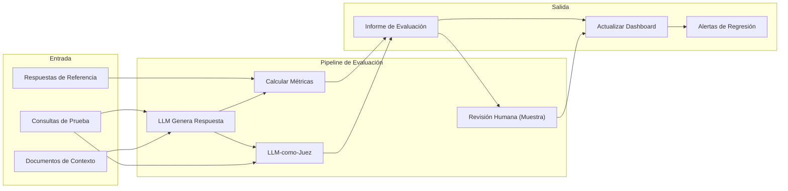
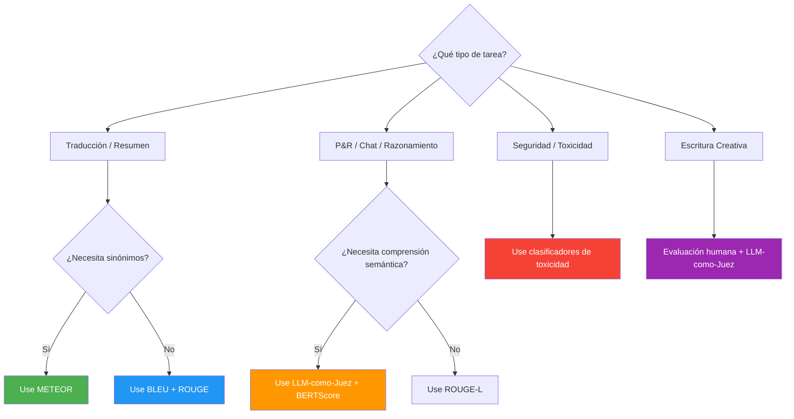

# Marcos de Evaluación para Salidas de LLM

## Qué Evaluar

La calidad de la salida del LLM es multidimensional. Estos son los cinco ejes principales:

| Dimensión      | Qué Mide                                    | Ejemplo de Falla                   | Método de Detección        |
|---------------|----------------------------------------------|------------------------------------|----------------------------|
| Corrección    | Precisión factual contra verdad absoluta    | "París es la capital de Italia"    | Consulta BC, fuentes       |
| Relevancia    | Si la salida aborda la consulta del usuario  | Responder clima del mañana         | Similitud de embeddings    |
| Fundamentación| Si las afirmaciones son respaldadas por contexto | Alucinar citas                  | Puntuación de superposición|
| Seguridad     | Ausencia de contenido tóxico o sesgado       | Generar discurso de odio           | Clasificadores de toxicidad|
| Fluidez       | Calidad gramatical y estilística             | Prosa fragmentada o incoherente    | Perplejidad, correctores   |

> [!WARNING]
> Solo la corrección no es suficiente. Una respuesta puede ser factualmente correcta pero irrelevante, insegura o sin fundamentación. Siempre evalúe en múltiples dimensiones.

---

## Pipeline de Evaluación



---

## Árbol de Decisión para Selección de Métricas



---

## Conjuntos de Datos de Evaluación

Un conjunto de datos de evaluación de alta calidad es la base de cualquier marco de evaluación.

```json
{
  "dataset": "soporte-cliente-eval",
  "version": "1.0",
  "created": "2026-01-15",
  "total_examples": 500,
  "distribution": {
    "restablecer_contraseña": 100,
    "estado_reembolso": 100,
    "consulta_envío": 100,
    "pregunta_producto": 100,
    "queja": 100
  },
  "examples": [
    {
      "id": "cs-001",
      "query": "¿Cómo restablezco mi contraseña?",
      "context": "El usuario está en la página de inicio y olvidó sus credenciales.",
      "reference": "Haga clic en 'Olvidé mi contraseña', ingrese su correo y siga el enlace.",
      "expected_tools": ["send_reset_email"],
      "tags": ["contraseña", "autenticación"],
      "difficulty": "fácil"
    },
    {
      "id": "cs-002",
      "query": "¿Cuál es el estado de mi reembolso?",
      "context": "El usuario pidió el artículo #ORD-4521 el 10 de marzo.",
      "reference": "Su reembolso para ORD-4521 se está procesando y aparecerá en 5-7 días.",
      "expected_tools": ["check_refund_status"],
      "tags": ["reembolso", "estado-pedido"],
      "difficulty": "medio"
    }
  ]
}
```

### Creando un Dataset Programáticamente

```python
# create_eval_dataset.py
import json
from typing import List

class EvalDatasetBuilder:
    def __init__(self):
        self.examples = []

    def add_example(self, query, context="", reference="", expected_tools=None, tags=None, difficulty="media"):
        self.examples.append({
            "id": f"ex-{len(self.examples)+1:04d}",
            "query": query, "context": context, "reference": reference,
            "expected_tools": expected_tools or [], "tags": tags or [],
            "difficulty": difficulty,
        })
        return self

    def save(self, path):
        dataset = {"dataset": "eval-personalizado", "version": "1.0",
                   "total_examples": len(self.examples), "examples": self.examples}
        with open(path, "w") as f:
            json.dump(dataset, f, indent=2)

builder = EvalDatasetBuilder()
builder.add_example("¿Política de devolución?", "Política de 30 días con envío gratis",
                    expected_tools=["lookup_policy"], difficulty="fácil")
builder.save("eval_dataset.json")
```

---

## Métricas de Evaluación Automatizadas

### BLEU (Bilingual Evaluation Understudy)

Mide precisión de n-gramas entre texto generado y de referencia. Rango: 0-1.

```python
from nltk.translate.bleu_score import sentence_bleu, SmoothingFunction

referencia = "el gato se sentó en la alfombra".split()
candidato = "el gato se sentó en una alfombra".split()
smoothie = SmoothingFunction().method4
score = sentence_bleu([referencia], candidato, smoothing_function=smoothie)
print(f"BLEU: {score:.3f}")
# BLEU: ~0.586
```

### ROUGE (Recall-Oriented Understudy for Gisting Evaluation)

Mide recall de n-gramas y subsecuencias comunes más largas.

```python
from rouge_score import rouge_scorer

scorer = rouge_scorer.RougeScorer(["rouge1", "rouge2", "rougeL"], use_stemmer=True)
referencia = "The quick brown fox jumps over the lazy dog"
candidato = "A quick brown fox jumped over a lazy dog"
scores = scorer.score(referencia, candidato)
for m, r in scores.items():
    print(f"{m}: P={r.precision:.3f} R={r.recall:.3f} F1={r.fmeasure:.3f}")
# ROUGE-1: P=0.875 R=0.778 F1=0.824
```

### METEOR (Metric for Evaluation of Translation with Explicit ORdering)

Extiende BLEU incorporando recall, raíces, sinónimos y orden de palabras.

```python
from nltk.translate.meteor_score import meteor_score

score = meteor_score(["el gato se sentó en la alfombra"], "un gato se sienta en una alfombra")
print(f"METEOR: {score:.3f}")
# METEOR: ~0.642
```

### BERTScore

Usa embeddings BERT pre-entrenados para calcular similitud semántica.

```python
from bert_score import score as bertscore

P, R, F1 = bertscore(
    ["The cat is sitting on the mat"],
    ["A cat sits on a rug"],
    model_type="microsoft/deberta-xlarge-mnli",
    lang="en"
)
print(f"BERTScore F1: {F1[0].item():.3f}")
# Captura equivalencia semántica incluso sin superposición de palabras
```

### Limitaciones de las Métricas N-grama

- BLEU y ROUGE se correlacionan mal con el juicio humano para tareas creativas
- METEOR mejora el manejo de sinónimos pero aún pierde significado semántico
- Ninguna detecta alucinaciones, toxicidad o precisión factual directamente
- Todas requieren textos de referencia, que son caros de producir

---

## LLM-como-Juez

Use un LLM fuerte (GPT-4, Claude) para evaluar las salidas de otro LLM. Captura calidad semántica que las métricas n-grama no captan.

```python
# llm_as_judge.py
import json
from openai import OpenAI

client = OpenAI()

def judge_output(query, generated, context="", rubric=None):
    if rubric is None:
        rubric = {
            "corrección": "¿Cada afirmación es factualmente precisa?",
            "relevancia": "¿La respuesta aborda la consulta?",
            "fundamentación": "¿Las afirmaciones tienen respaldo contextual?",
            "utilidad": "¿La respuesta ayuda al usuario?"
        }

    rubric_text = "\n".join(f"- {dim}: {desc}" for dim, desc in rubric.items())
    prompt = f"""Eres un evaluador experto de respuestas de IA.

## Rúbrica
{rubric_text}

## Consulta del Usuario
{query}

{'## Contexto' + context if context else ''}

## Respuesta Generada
{generated}

## Tarea
Puntúe del 1 al 5 para cada dimensión.
Proporcione una justificación breve para cada puntuación.
Output JSON con "scores" (dict), "reasoning" (str), "overall_score" (float).
"""
    response = client.chat.completions.create(
        model="gpt-4",
        messages=[{"role": "user", "content": prompt}],
        response_format={"type": "json_object"},
        temperature=0.0,
    )
    return json.loads(response.choices[0].message.content)

# Uso
result = judge_output(
    "Explica el entrelazamiento cuántico",
    "Fenómeno donde partículas se correlacionan..."
)
print(json.dumps(result, indent=2))
```

> [!TIP]
> Use `temperature=0` para puntuación determinística y `response_format={"type": "json_object"}` para salida estructurada. Valide el razonamiento del juez en una muestra para detectar sesgos.

---

## Evaluación Humana

| Enfoque         | Costo por 1000 | Velocidad | Consistencia | Mejor Para                 |
|-----------------|----------------|-----------|--------------|----------------------------|
| N-gramas        | ~$0.01         | Segundos  | Alta         | Traducción, resumen         |
| BERTScore       | ~$1.00         | Minutos   | Alta         | Similitud semántica         |
| LLM-como-juez   | ~$5.00         | Minutos   | Media        | QA abierto, razonamiento    |
| Humana          | ~$500          | Horas-Días| Baja         | Seguridad, tono, UX         |

---

## Tabla Comparativa

| Métrica   | Tipo       | Mide          | Rango | Fortalezas                        | Debilidades                       | Mejor Uso               |
|-----------|------------|---------------|-------|-----------------------------------|-----------------------------------|-------------------------|
| BLEU      | N-grama    | Precisión     | 0-1   | Rápido, determinístico            | Ignora recall, semántica          | Traducción automática   |
| ROUGE     | N-grama    | Recall        | 0-1   | Bueno para resúmenes              | Ignora fluidez, orden             | Resumen                 |
| METEOR    | N-grama+sin| F-score       | 0-1   | Sinónimos, raíz, orden            | Complejidad, superficial          | Traducción, leyendas    |
| BERTScore | Embedding  | F1 semántico  | 0-1   | Paráfrasis, significado           | Requiere GPU, lento               | Similitud semántica     |
| LLM-juez  | Modelo     | Calidad       | 1-5   | Matices, personalizable           | Caro, sesgo del modelo            | QA abierto, chat        |
| Humana     | Manual    | Todas dims.   | Subj. | Estándar de oro                   | Lenta, cara, inconsistente        | Seguridad, marca, UX    |

---

## Preguntas de Práctica

```question
{
  "id": "gr-3-q1",
  "type": "multiple-choice",
  "question": "Una respuesta recibe alta puntuación BLEU pero los usuarios la consideran inútil. ¿Cuál es la explicación más probable?",
  "options": [
    "BLEU mide precisión de n-gramas, que ignora calidad semántica y relevancia",
    "BLEU penaliza respuestas demasiado largas",
    "El texto de referencia era demasiado corto",
    "BLEU solo funciona para tareas de traducción"
  ],
  "correct": 0,
  "explanation": "BLEU mide superposición de n-gramas con una referencia. No mide calidad semántica, precisión factual o relevancia."
}
```

```question
{
  "id": "gr-3-q2",
  "type": "multiple-choice",
  "question": "Un equipo quiere evaluar si las afirmaciones del LLM están respaldadas por los documentos de contexto proporcionados. ¿Qué dimensión de evaluación aborda esto?",
  "options": ["Corrección", "Relevancia", "Fundamentación", "Fluidez"],
  "correct": 2,
  "explanation": "Fundamentación mide si las afirmaciones del LLM están respaldadas por el contexto proporcionado. Una respuesta puede ser correcta pero sin fundamentación."
}
```

```question
{
  "id": "gr-3-q3",
  "type": "multiple-choice",
  "question": "Un equipo tiene 10,000 conversaciones de producción pero presupuesto para evaluar solo 1,000. ¿Qué estrategia de muestreo se recomienda?",
  "options": [
    "Muestreo aleatorio de 1,000 conversaciones",
    "Muestreo estratificado por categoría de conversación",
    "Seleccionar las primeras 1,000 cronológicamente",
    "Dejar que un LLM seleccione las más interesantes"
  ],
  "correct": 1,
  "explanation": "El muestreo estratificado garantiza que todas las categorías de conversación estén representadas proporcionalmente."
}
```

```question
{
  "id": "gr-3-q4",
  "type": "multiple-choice",
  "question": "Un equipo usa GPT-4 para puntuar las salidas de otro LLM. ¿Desventaja conocida del enfoque LLM-como-juez?",
  "options": [
    "Es más lento que la evaluación humana",
    "Introduce costo y sesgo del modelo juez",
    "No se puede automatizar",
    "Solo funciona para corrección factual"
  ],
  "correct": 1,
  "explanation": "LLM-como-juez introduce costo por evaluación y está sujeto a sesgos como preferir respuestas más largas o su propio estilo."
}
```

```question
{
  "id": "gr-3-q5",
  "type": "multiple-choice",
  "question": "Un equipo evalúa un sistema de resumen y necesita recall, raíces y coincidencia de sinónimos. ¿Qué métrica usar?",
  "options": ["BLEU", "ROUGE", "METEOR", "LLM-como-juez"],
  "correct": 2,
  "explanation": "METEOR combina coincidencia de n-gramas centrada en recall con raíces y manejo de sinónimos."
}
```

---

## Pipeline de Evaluación Continua

```python
# run_eval_pipeline.py
import json

class EvalPipeline:
    def __init__(self, dataset_path):
        with open(dataset_path) as f:
            self.dataset = json.load(f)["examples"]

    def run_all(self):
        results = {"total": len(self.dataset), "by_metric": {}, "examples": []}
        for example in self.dataset:
            generated = self._generate(example["query"])
            bleu = self._compute_bleu(example["reference"], generated)
            rouge = self._compute_rouge(example["reference"], generated)
            results["examples"].append({"id": example["id"], "bleu": bleu, "rouge": rouge})
        results["by_metric"]["avg_bleu"] = sum(e["bleu"] for e in results["examples"]) / len(results["examples"])
        return results

    def _generate(self, query): return f"Respuesta a: {query}"
    def _compute_bleu(self, ref, gen): return 0.5
    def _compute_rouge(self, ref, gen): return {"f1": 0.5}
```

---

> [!SUCCESS]
> ## Conclusiones Clave
> - Evalúe salidas de LLM en cinco dimensiones: corrección, relevancia, fundamentación, seguridad y fluidez.
> - Métricas N-grama (BLEU, ROUGE, METEOR) son rápidas pero superficiales; pierden semántica y alucinaciones.
> - BERTScore captura similitud semántica usando embeddings; detecta paráfrasis.
> - LLM-como-juez captura matices pero introduce costo y sesgo; use temperature=0 para reproducibilidad.
> - Evaluación humana es el estándar de oro pero escala mal; úsela estratégicamente.
> - Combine múltiples métodos de evaluación — ninguna métrica aislada cuenta toda la historia.
