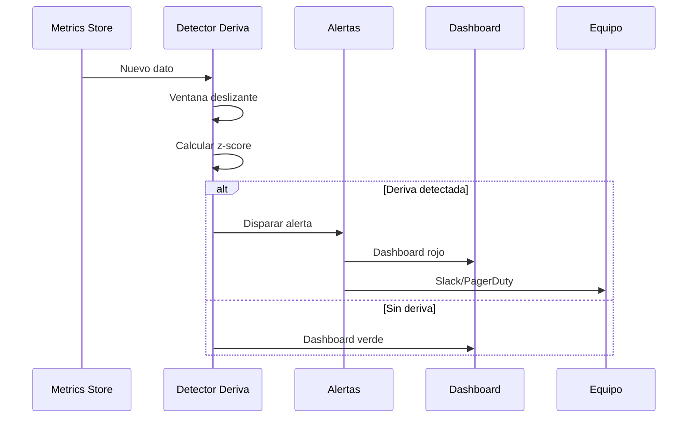
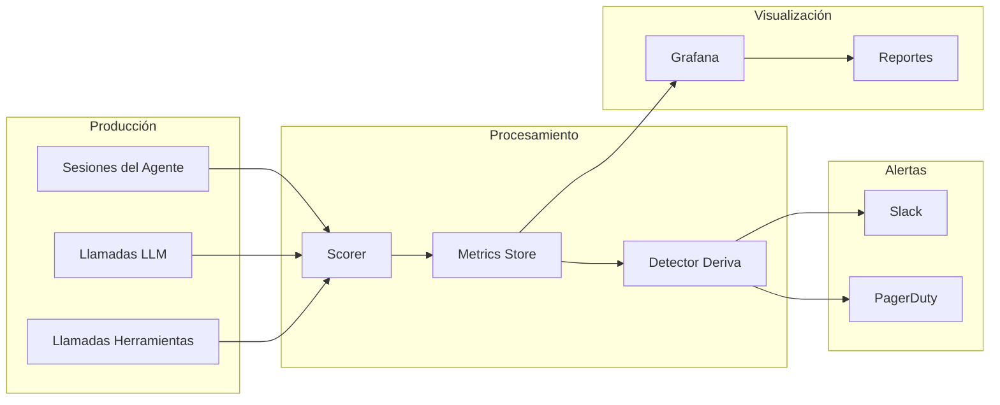

# Puntuación, Métricas y Monitoreo Continuo

## Definiendo Métricas Personalizadas

Las métricas genéricas (BLEU, ROUGE) rara vez capturan lo que importa para su agente específico. Necesita **criterios de éxito personalizados** que reflejen los requisitos de su dominio. Un agente de soporte al cliente se preocupa por la tasa de resolución; un agente de generación de código se preocupa por la compilación exitosa.

```python
# scoring.py
from typing import Dict, List, Any
import time

class AgentScorer:
    """
    Calcula métricas de éxito personalizadas para un sistema agentivo.
    """

    def __init__(self, config: Dict[str, Any]):
        self.task_completed_weight = config.get("task_completed_weight", 0.4)
        self.tool_efficiency_weight = config.get("tool_efficiency_weight", 0.2)
        self.response_time_weight = config.get("response_time_weight", 0.2)
        self.safety_score_weight = config.get("safety_score_weight", 0.2)

    def score_task_completion(self, expected: List[str], actual: List[str]) -> Dict[str, Any]:
        """F1 entre resultados esperados y reales."""
        esp_set, act_set = set(expected), set(actual)
        tp = len(esp_set & act_set)
        fp = len(act_set - esp_set)
        fn = len(esp_set - act_set)
        precision = tp / (tp + fp) if (tp + fp) > 0 else 0
        recall = tp / (tp + fn) if (tp + fn) > 0 else 0
        f1 = 2*precision*recall/(precision+recall) if (precision+recall) > 0 else 0
        return {"score": f1, "details": {"precision": precision, "recall": recall, "f1": f1, "tp": tp, "fp": fp, "fn": fn}, "timestamp": time.time()}

    def score_tool_efficiency(self, tool_calls: List[Dict], max_calls: int = 10) -> Dict:
        total = len(tool_calls)
        if total == 0:
            return {"score": 1.0, "details": {"calls": 0}, "timestamp": time.time()}
        efficiency = max(0.0, 1.0 - (total / max_calls))
        return {"score": efficiency, "details": {"total_calls": total, "max_allowed": max_calls, "unique_tools": len({c["tool_name"] for c in tool_calls})}, "timestamp": time.time()}

    def score_response_time(self, rt_ms: float, threshold_ms: float = 5000) -> Dict:
        if rt_ms <= threshold_ms:
            return {"score": 1.0, "details": {"rt_ms": rt_ms}, "timestamp": time.time()}
        score = max(0.0, 1.0 - ((rt_ms - threshold_ms) / threshold_ms))
        return {"score": score, "details": {"rt_ms": rt_ms, "penalty": (rt_ms-threshold_ms)/threshold_ms}, "timestamp": time.time()}

    def compute_overall(self, sub: Dict[str, float]) -> Dict:
        overall = (sub.get("task", 0)*self.task_completed_weight +
                   sub.get("tools", 0)*self.tool_efficiency_weight +
                   sub.get("rt", 0)*self.response_time_weight +
                   sub.get("safety", 0)*self.safety_score_weight)
        return {"overall_score": round(overall, 3), "weights": {"task_completion": self.task_completed_weight, "tool_efficiency": self.tool_efficiency_weight, "response_time": self.response_time_weight, "safety": self.safety_score_weight}, "sub_scores": sub, "timestamp": time.time()}


# Uso
scorer = AgentScorer({"task_completed_weight": 0.5, "safety_score_weight": 0.2, "tool_efficiency_weight": 0.2, "response_time_weight": 0.1})
task = scorer.score_task_completion(["reembolso_procesado", "email_enviado"], ["reembolso_procesado", "email_enviado", "sms_enviado"])
eff = scorer.score_tool_efficiency([{"tool_name": "search"}, {"tool_name": "db_lookup"}])
rt = scorer.score_response_time(3200)
overall = scorer.compute_overall({"task": task["score"], "tools": eff["score"], "rt": rt["score"], "safety": 0.95})
print(f"Overall: {overall['overall_score']}")
```

> [!TIP]
> La selección de pesos debe guiarse por prioridades de negocio, no por intuición. Analice logs de producción para identificar qué métricas se correlacionan con satisfacción del usuario y retención.

---

## Almacenando Métricas en el Tiempo

```python
# metrics_store.py
import sqlite3, json
from datetime import datetime, timezone
from typing import List, Tuple

class MetricsStore:
    """Almacena y recupera métricas del agente a lo largo del tiempo."""

    def __init__(self, db_path: str = "metrics.db"):
        self.conn = sqlite3.connect(db_path)
        self._init_db()

    def _init_db(self):
        self.conn.execute("""
            CREATE TABLE IF NOT EXISTS agent_metrics (
                id INTEGER PRIMARY KEY AUTOINCREMENT,
                session_id TEXT NOT NULL,
                metric_name TEXT NOT NULL,
                score REAL NOT NULL,
                details TEXT,
                recorded_at TEXT NOT NULL
            )
        """)
        self.conn.execute("CREATE INDEX IF NOT EXISTS idx_metric ON agent_metrics(metric_name, recorded_at)")
        self.conn.commit()

    def record(self, session_id: str, metric_name: str, score: float, details: dict = None):
        self.conn.execute(
            "INSERT INTO agent_metrics (session_id, metric_name, score, details, recorded_at) VALUES (?, ?, ?, ?, ?)",
            (session_id, metric_name, score, json.dumps(details) if details else None, datetime.now(timezone.utc).isoformat())
        )
        self.conn.commit()

    def get_daily_average(self, metric_name: str, days: int = 7) -> List[Tuple[str, float]]:
        cursor = self.conn.execute("""
            SELECT DATE(recorded_at) as day, AVG(score) as avg
            FROM agent_metrics
            WHERE metric_name = ? AND recorded_at >= DATE('now', ?)
            GROUP BY day ORDER BY day
        """, (metric_name, f"-{days} days"))
        return cursor.fetchall()

    def get_metric_summary(self, metric_name: str, days: int = 7) -> dict:
        cursor = self.conn.execute("""
            SELECT AVG(score), MIN(score), MAX(score), COUNT(*)
            FROM agent_metrics
            WHERE metric_name = ? AND recorded_at >= DATE('now', ?)
        """, (metric_name, f"-{days} days"))
        row = cursor.fetchone()
        if row and row[3] > 0:
            return {"metric": metric_name, "mean": round(row[0], 3), "min": round(row[1], 3), "max": round(row[2], 3), "count": row[3]}
        return {"metric": metric_name, "error": "Sin datos"}
```

---

## Detección de Deriva (Drift)

```python
# drift_detector.py
import statistics
from typing import List, Tuple, Optional

class DriftDetector:
    """
    Detecta cuando las puntuaciones de métricas se desvían de límites aceptables.
    Usa ventana deslizante y prueba z-score.
    """

    def __init__(self, window_size: int = 100, std_dev_threshold: float = 2.0, min_baseline: int = 30):
        self.window_size = window_size
        self.std_dev_threshold = std_dev_threshold
        self.min_baseline = min_baseline

    def check_drift(self, baseline: List[float], recent: List[float]) -> Tuple[bool, float]:
        if len(baseline) < self.min_baseline:
            return False, 0.0
        b_mean = statistics.mean(baseline)
        b_std = statistics.stdev(baseline) if len(baseline) > 1 else 1.0
        r_mean = statistics.mean(recent) if recent else b_mean
        error_est = b_std / (len(recent) ** 0.5)
        if error_est == 0:
            return False, 0.0
        z = (b_mean - r_mean) / error_est
        return abs(z) > self.std_dev_threshold, z

    def check_trend_drift(self, scores: List[float], lookback: int = 20) -> Tuple[bool, float]:
        if len(scores) < lookback * 2:
            return False, 0.0
        reciente = scores[-lookback:]
        anterior = scores[-(lookback*2):-lookback]
        caida = (statistics.mean(anterior) - statistics.mean(reciente)) / statistics.mean(anterior)
        return caida > 0.1, caida

    def alert_if_drifted(self, metric: str, baseline: List[float], recent: List[float]) -> Optional[str]:
        drifted, z = self.check_drift(baseline, recent)
        if drifted:
            return (f"[ALERTA] Métrica '{metric}' derivó "
                    f"(z-score: {z:.2f}, reciente: {statistics.mean(recent):.3f}, "
                    f"base: {statistics.mean(baseline):.3f})")
        return None
```

### Secuencia de Detección de Deriva



> [!WARNING]
> La detección de deriva requiere datos suficientes para establecer una línea base confiable. No configure umbrales hasta tener al menos 100 puntos por métrica. Umbrales prematuros causan fatiga de alertas.

> [!IMPORTANT]
> Defina SLIs (Indicadores de Nivel de Servicio), SLOs (Objetivos de Nivel de Servicio) y SLAs (Acuerdos de Nivel de Servicio):
> - **SLI**: La métrica real que mide (ej: "puntuación de tarea completada")
> - **SLO**: El umbral objetivo (ej: "puntuación >= 0.85 en ventana de 30 días")
> - **SLA**: El compromiso con usuarios (ej: "99.9% de solicitudes cumplen SLO")

---

## Configuración de Alertas

```yaml
# alerts_config.yml
alerts:
  task_completion:
    metric: "task_completion"
    type: "drift"
    baseline_window_days: 30
    recent_window_count: 50
    z_score_threshold: 2.5
    channels: ["slack", "pagerduty"]
    severity: "critical"
    description: "La tasa de finalización de tareas ha caído significativamente"

  response_time:
    metric: "response_time"
    type: "threshold"
    threshold_ms: 8000
    evaluation_window_minutes: 15
    channels: ["slack"]
    severity: "warning"
    description: "Tiempo de respuesta promedio excede 8 segundos"

  safety_violations:
    metric: "safety"
    type: "count"
    threshold: 5
    evaluation_window_hours: 24
    channels: ["slack", "pagerduty"]
    severity: "critical"
    description: "Más de 5 violaciones de seguridad en 24 horas"
```

### Gestor de Alertas en Python

```python
# alert_manager.py
import json, requests

class AlertManager:
    def __init__(self, config_path: str):
        with open(config_path) as f:
            self.config = json.load(f)

    def send_alert(self, alert_name: str, message: str, severity: str = "warning"):
        alert_config = self.config["alerts"].get(alert_name)
        if not alert_config:
            return
        channels = alert_config.get("channels", ["slack"])
        if "slack" in channels:
            self._send_slack(message, severity)
        if "pagerduty" in channels:
            self._send_pagerduty(message, severity)

    def _send_slack(self, message: str, severity: str):
        color = "#ff0000" if severity == "critical" else "#ffa500"
        requests.post(self.config["slack_webhook_url"],
                      json={"attachments": [{"color": color, "text": message}]},
                      timeout=10)

    def _send_pagerduty(self, message: str, severity: str):
        requests.post("https://events.pagerduty.com/v2/enqueue",
                      json={"routing_key": self.config["pagerduty_routing_key"],
                            "event_action": "trigger",
                            "payload": {"summary": message[:120], "severity": severity, "source": "agent-monitoring"}},
                      timeout=10)
```

---

## Pipeline de Monitoreo Continuo



---

## Paneles (Dashboards)

```yaml
# dashboard_config.yml
dashboard:
  title: "Salud del Agente en Producción"
  refresh_interval_seconds: 60
  time_range_days: 7

  panels:
    - title: "Tasa de Éxito (7d)"
      metric: "task_completion"
      aggregation: "avg"
      chart_type: "timeseries"
      alert_threshold: 0.80

    - title: "Tiempo de Respuesta (7d)"
      metric: "response_time"
      aggregation: "avg"
      chart_type: "timeseries"
      alert_threshold: 5000
      unit: "ms"

    - title: "Llamadas a Herramientas"
      metric: "tool_efficiency"
      aggregation: "sum"
      chart_type: "bar"

    - title: "Violaciones de Seguridad"
      metric: "safety"
      aggregation: "count"
      chart_type: "gauge"
      alert_threshold: 5

    - title: "Costo por Sesión"
      metric: "cost"
      aggregation: "avg"
      chart_type: "timeseries"
      alert_threshold: 0.50
      unit: "USD"
```

> [!WARNING]
> La fatiga de alertas es un peligro real. Siga estas reglas: (1) alerte solo en métricas con línea base establecida, (2) use niveles de severidad — solo "critical" va a PagerDuty, (3) implemente histéresis, (4) revise efectividad mensualmente.

---

## Pipeline de Evaluación Continua (CI/CD)

```yaml
# .github/workflows/eval-pipeline.yml
name: Evaluación Diaria

on:
  schedule:
    - cron: "0 6 * * *"
  workflow_dispatch:

jobs:
  evaluate:
    runs-on: ubuntu-latest
    steps:
      - uses: actions/checkout@v4
      - run: pip install -r requirements.txt
      - name: Evaluar logs de producción de ayer
        run: python scripts/run_evaluation.py --input s3://prod-logs/$(date -d 'yesterday' +%Y/%m/%d)/ --output s3://eval-results/
      - name: Detectar deriva
        run: python scripts/detect_drift.py --metrics-db s3://eval-results/metrics.db --output alert.json
      - name: Enviar alertas
        run: python scripts/send_alerts.py --input alert.json
      - name: Actualizar dashboard
        run: python scripts/update_dashboard.py --input s3://eval-results/
```

---

## Tabla Comparativa: Tipos de Métricas

| Categoría       | Ejemplos                        | Medición     | Fuente           | Prioridad |
|-----------------|---------------------------------|--------------|------------------|-----------|
| Precisión       | Tarea completada, F1            | Por sesión   | Evaluación LLM   | Crítica   |
| Latencia        | Tiempo de respuesta, TTFT      | Por llamada  | Logs aplicación  | Alta      |
| Costo           | Costo por sesión, tokens        | Por llamada  | API facturación  | Media     |
| Seguridad       | Toxicidad, violaciones PII      | Por respuesta| Guardrails       | Crítica   |
| Compromiso      | Duración sesión, retención      | Por usuario  | Analítica        | Baja      |
| Confiabilidad   | Tasa de error, timeout          | Por llamada  | Monitoreo        | Alta      |

---

## Preguntas de Práctica

```question
{
  "id": "gr-5-q1",
  "type": "multiple-choice",
  "question": "Un equipo nota que la puntuación promedio de finalización de tareas cayó de 0.92 a 0.73 en 3 días. ¿Cuál es el primer paso diagnóstico?",
  "options": [
    "Reverter inmediatamente el último despliegue",
    "Investigar las sub-puntuaciones para identificar qué dimensión causó la caída",
    "Aumentar el umbral de alerta a 0.70",
    "Reentrenar el modelo LLM"
  ],
  "correct": 1,
  "explanation": "Antes de actuar, investigue sub-puntuaciones para identificar qué dimensión causó la caída. Revertir o reentrenar sin diagnóstico desperdicia tiempo."
}
```

```question
{
  "id": "gr-5-q2",
  "type": "multiple-choice",
  "question": "Un almacén de métricas registra puntuaciones en una base de datos de series temporales. ¿Propósito principal?",
  "options": [
    "Generar facturas para clientes",
    "Rastrear tendencias, detectar regresiones y alimentar paneles",
    "Reemplazar la necesidad de evaluación humana",
    "Cumplir leyes de retención de datos"
  ],
  "correct": 1,
  "explanation": "El almacenamiento de series temporales permite análisis de tendencias, detección de regresiones y paneles en tiempo real."
}
```

```question
{
  "id": "gr-5-q3",
  "type": "multiple-choice",
  "question": "Un equipo configura detección de deriva con z-score 2.0 y ventana de 100 puntos. ¿Qué deben asegurar antes de confiar en las alertas?",
  "options": [
    "El LLM es la última versión",
    "Hay al menos 100 puntos de datos para línea base confiable",
    "El panel tiene al menos 5 gráficos",
    "Las alertas llegan por email"
  ],
  "correct": 1,
  "explanation": "La detección de deriva requiere una línea base estadísticamente significativa. La lección recomienda al menos 100 puntos por métrica."
}
```

```question
{
  "id": "gr-5-q4",
  "type": "multiple-choice",
  "question": "Un panel muestra 'Violaciones de Seguridad' como un conteo. ¿Tipo de gráfico recomendado?",
  "options": ["Serie temporal", "Barras", "Gauge", "Pastel"],
  "correct": 2,
  "explanation": "El gráfico gauge proporciona un indicador visual de estado (verde/amarillo/rojo) contra un umbral, ideal para métricas de conteo."
}
```

```question
{
  "id": "gr-5-q5",
  "type": "multiple-choice",
  "question": "Un pipeline de evaluación continua se ejecuta diariamente a las 06:00 UTC. ¿Mejor gatillo?",
  "options": ["Git push a main", "Cron job", "Solo manual", "Aprobación de PR"],
  "correct": 1,
  "explanation": "Un cron job es apropiado para evaluación diaria de datos de producción que se acumulan. Git push ejecutaría demasiado frecuente."
}
```

---

> [!SUCCESS]
> ## Conclusiones Clave
> - Defina funciones de puntuación personalizadas con pesos configurables orientados por prioridades de negocio.
> - Almacene métricas en base de datos de series temporales para tendencias y detección de regresiones.
> - La detección de deriva usa tests estadísticos (z-score, ventana deslizante, tendencia).
> - Establezca línea base confiable (mínimo 100 puntos) antes de umbrales de alerta.
> - Defina SLIs, SLOs y SLAs para medir rendimiento objetivamente.
> - Use severidades (critical/warning/info) e histéresis para evitar fatiga de alertas.
> - Todo componente debe definirse antes del lanzamiento a producción.
