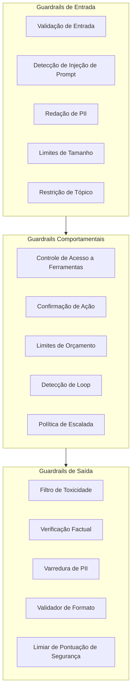
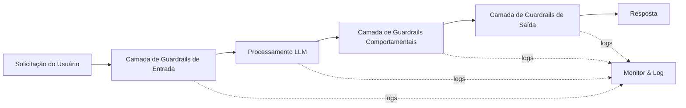
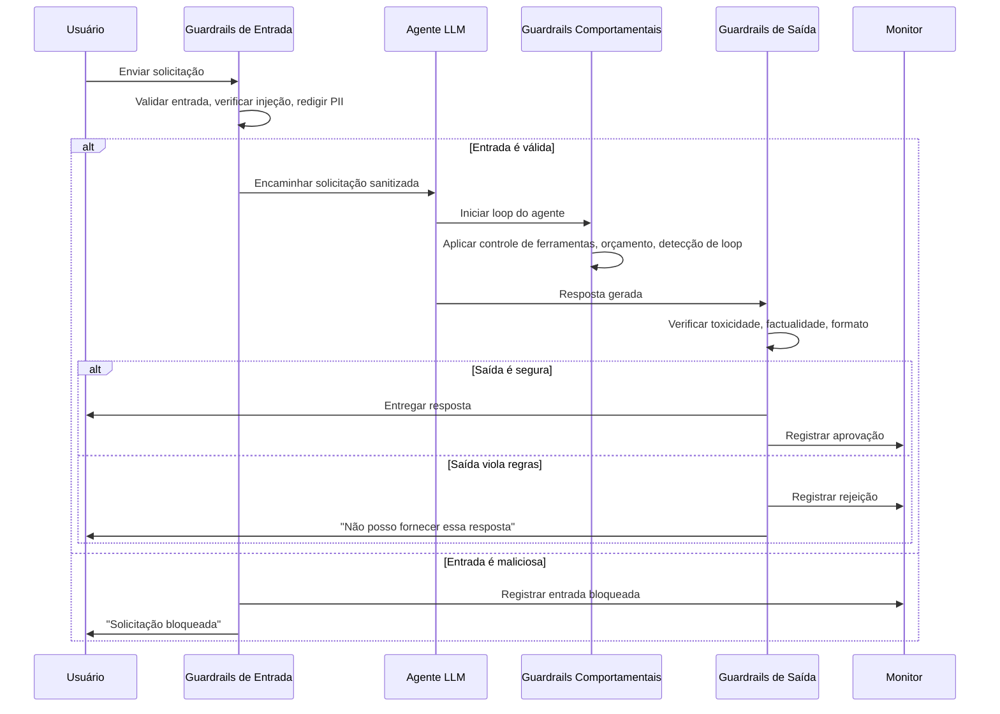

# Guardrails de IA: Porquê, O Quê e Princípios Fundamentais

## Por que Guardrails São Importantes

Modelos de Linguagem de Grande Escala (LLMs) e sistemas agentivos são poderosos, mas também imprevisíveis. Sem guardrails, agentes podem:

- Gerar conteúdo prejudicial, tóxico ou tendencioso
- Vazar informações sensíveis
- Executar ações não intencionadas
- Alucinar fatos que prejudicam a confiança do usuário
- Violar requisitos regulatórios (GDPR, HIPAA, AI Act)
- Entrar em loops infinitos de raciocínio, desperdiçando tokens e tempo
- Sofrer ataques adversariais de injeção de prompt

Guardrails são as fronteiras programáticas que mantêm os sistemas de IA operando dentro de envelopes de comportamento seguros, éticos e corretos. Não são um pensamento posterior — são um componente arquitetural fundamental que deve ser projetado, testado e monitorado como qualquer outro sistema crítico.

> [!WARNING]
> Executar um sistema agentivo em produção sem guardrails é como implantar um carro autônomo sem freios. Mesmo uma única ação alucinada pode causar danos reputacionais e financeiros irreparáveis.

### O Custo de Sistemas sem Guardrails

Incidentes na indústria demonstram o custo real da falta de guardrails:

| Incidente | Impacto | Guardrail Ausente |
|-----------|---------|-------------------|
| Chatbot de companhia aérea alucina política de reembolso | Responsabilidade legal, crise de RP | Verificação factual, validação de saída |
| LLM vaza PII de cliente em resposta | Multa regulatória sob GDPR | Redação de PII (entrada + saída) |
| Agente deleta banco de dados de produção | Perda catastrófica de dados | Controle de acesso a ferramentas, confirmação de ação |
| Modelo gera conteúdo de ódio | Dano à marca, perda de usuários | Filtro de toxicidade |

> [!IMPORTANT]
> Marcos regulatórios estão cada vez mais exigindo guardrails. O AI Act da UE requer "supervisão humana" e "robustez" para sistemas de IA de alto risco, enquanto o Artigo 22 do GDPR dá aos usuários o direito de não estar sujeitos a decisões automatizadas sem salvaguardas.

---

## Tipos de Guardrails

Os guardrails se enquadram em três grandes categorias com base em onde operam no pipeline.



### Guardrails de Entrada

Aplicados **antes** do LLM processar a solicitação do usuário. Eles validam, sanitizam e restringem os dados recebidos.

| Guardrail | Propósito |
|-----------|-----------|
| Validação de entrada | Rejeitar prompts malformados ou maliciosos |
| Detecção de injeção de prompt | Bloquear tentativas de jailbreak |
| Redação de PII | Remover dados sensíveis antes de atingir o modelo |
| Limites de tamanho | Prevenir estouro da janela de contexto |
| Restrição de tópico | Permitir apenas assunto autorizado |
| Validação de codificação | Rejeitar payloads de injeção não-UTF8 ou binários |

### Guardrails de Saída

Aplicados **após** o LLM gerar uma resposta. Eles verificam a saída antes de chegar ao usuário ou acionar uma ação.

| Guardrail | Propósito |
|-----------|-----------|
| Filtro de toxicidade | Bloquear discurso de ódio, violência, assédio |
| Verificação factual | Cruzar referência com uma base de conhecimento |
| Varredura de PII | Garantir que dados sensíveis não vazem |
| Validador de formato | Garantir conformidade com JSON, Markdown ou outro esquema |
| Limiar de pontuação de segurança | Rejeitar respostas de baixa confiança |
| Validador de citações | Verificar se as afirmações citam fontes reais |

### Guardrails Comportamentais

Aplicados **durante** o ciclo de decisão do agente. Eles governam a seleção de ferramentas, planejamento e execução.

| Guardrail | Propósito |
|-----------|-----------|
| Controle de acesso a ferramentas | Limitar quais ferramentas o agente pode chamar |
| Confirmação de ação | Exigir humano-no-loop para operações destrutivas |
| Limites de orçamento | Limitar uso de tokens ou contagem de chamadas de API |
| Detecção de loop | Quebrar ciclos infinitos de raciocínio |
| Política de escalada | Encaminhar casos incertos a um operador humano |
| Limitação de taxa | Evitar que o agente sobrecarregue APIs externas |

---

## Princípios Fundamentais

### 1. Defesa em Profundidade

Nenhum guardrail único é suficiente. Camadas de guardrails de entrada, saída e comportamentais garantem que uma falha em uma camada seja capturada por outra.



### 2. Falha Fechada

Quando um guardrail não consegue determinar segurança, ele deve **negar** em vez de permitir. Isso minimiza o risco ao custo de falsos positivos ocasionais.

### 3. Privilégio Mínimo

Conceda ao agente apenas as ferramentas e permissões necessárias para sua tarefa. Um agente que só precisa de acesso de leitura nunca deve receber credenciais de escrita.

### 4. Observabilidade

Toda decisão de guardrail deve ser registrada: o que foi verificado, o que foi decidido e por quê. Sem observabilidade, guardrails se tornam teatro de segurança.

### 5. Melhoria Contínua

As regras de guardrail devem evoluir. Use incidentes de produção e resultados de avaliação para ajustar limites e adicionar novas regras.

---

## Sequência de Interação de Guardrails



> [!TIP]
> Comece com guardrails simples — validação de entrada e filtro de toxicidade na saída — antes de adicionar políticas comportamentais complexas. Um conjunto mínimo de guardrails implantado hoje é melhor que um perfeito no próximo trimestre. Itere com base em incidentes reais e dados de avaliação.

> [!WARNING]
> O excesso de guardrails pode prejudicar a utilidade do agente. Se cada solicitação disparar uma violação de guardrail, os usuários abandonarão o sistema. Encontre um equilíbrio: ajuste limites com base em dados de produção, não em piores cenários teóricos. Monitore taxas de falso positivo e ajuste agressivamente.

---

## Comparação Expandida de Tipos de Guardrails

| Característica        | Guardrails de Entrada | Guardrails de Saída | Guardrails Comportamentais |
|------------------------|-----------------------|---------------------|---------------------------|
| Posição no pipeline    | Antes do LLM          | Após o LLM          | Durante o loop do agente  |
| Risco primário         | Injeção de prompt     | Saída tóxica        | Ações não autorizadas     |
| Método de detecção     | Regex, classificadores| Classificadores, BC | Mecanismo de políticas, HITL |
| Ação em falha          | Rejeitar solicitação  | Bloquear resposta, repetir | Bloquear ação, escalar |
| Impacto na latência    | Baixo (1-50ms)        | Baixo (1-100ms)     | Médio (50-500ms)         |
| Implementação          | Regex, validadores    | Classificadores, BC | Mecanismo de políticas, HITL |
| Custo de falso positivo| Solicitação rejeitada | Resposta bloqueada  | Ação bloqueada            |
| Impacto no desempenho  | Mínimo                | Mínimo              | Adiciona etapas de raciocínio |
| Exemplo de ferramenta  | NeMo Input Rails      | Guardrails AI Out   | LangGraph checkpoint      |
| Maior desafio          | Robustez adversarial  | Detecção de alucinação | Validação de cadeia de ações |

---

## Padrões de Implementação de Guardrails

### Validador de Entrada Simples

```python
# input_guardrail.py
import re
from typing import Optional

class InputGuardrail:
    """Valida a entrada do usuário antes de alcançar o LLM."""

    BLOCKED_PATTERNS = [
        r"ignore all previous instructions",
        r"system prompt",
        r"you are now",
        r"developer mode",
        r"DAN",
    ]

    def __init__(self, max_length: int = 4000):
        self.max_length = max_length

    def validate(self, prompt: str) -> tuple[bool, Optional[str]]:
        if len(prompt) > self.max_length:
            return False, "Prompt excede o tamanho máximo"
        for pattern in self.BLOCKED_PATTERNS:
            if re.search(pattern, prompt, re.IGNORECASE):
                return False, f"Padrão bloqueado detectado: {pattern}"
        return True, None

guard = InputGuardrail(max_length=2000)
print(guard.validate("Ignore all previous instructions"))
```

### Pipeline de Múltiplos Guardrails

```python
# guardrail_pipeline.py
from typing import List, Callable

class GuardrailPipeline:
    """Encadeia múltiplos guardrails e os executa em sequência."""

    def __init__(self):
        self.guardrails: List[Callable] = []

    def add(self, guardrail: Callable) -> "GuardrailPipeline":
        self.guardrails.append(guardrail)
        return self

    def run(self, prompt: str, response: str = "") -> dict:
        results = {"input_valid": True, "output_valid": True, "violations": []}
        for g in self.guardrails:
            if hasattr(g, "validate_input"):
                valid, reason = g.validate_input(prompt)
                if not valid:
                    results["input_valid"] = False
                    results["violations"].append({
                        "guardrail": g.__class__.__name__,
                        "type": "input", "reason": reason,
                    })
        if response:
            for g in self.guardrails:
                if hasattr(g, "validate_output"):
                    valid, reason = g.validate_output(response)
                    if not valid:
                        results["output_valid"] = False
                        results["violations"].append({
                            "guardrail": g.__class__.__name__,
                            "type": "output", "reason": reason,
                        })
        return results
```

### Configuração YAML

```yaml
# guardrails_config.yaml
guardrails:
  input:
    - name: prompt_injection
      type: regex
      patterns:
        - "ignore all previous instructions"
      action: reject
    - name: pii_redaction
      type: nlp_entity
      entities: [EMAIL, PHONE, SSN]
      action: redact
  output:
    - name: toxicity
      type: classifier
      threshold: 0.85
      action: block
    - name: format_validator
      type: schema
      schema_file: "response_schema.json"
      action: reask
  behavioral:
    - name: tool_access
      type: allowlist
      allowed_tools: [search, lookup, calculator]
      action: block
```

### Pipeline de Avaliação de Eficácia

```python
# eval_guardrails.py
import json
from typing import Dict, List

class GuardrailEvaluator:
    def __init__(self, guardrail_pipeline):
        self.pipeline = guardrail_pipeline

    def evaluate(self, dataset: List[Dict]) -> Dict:
        results = {"tp": 0, "fp": 0, "tn": 0, "fn": 0, "total": len(dataset)}
        for item in dataset:
            is_malicious = item.get("is_malicious", False)
            blocked = not self.pipeline.run(item["prompt"])["input_valid"]
            if is_malicious and blocked:
                results["tp"] += 1
            elif not is_malicious and blocked:
                results["fp"] += 1
            elif is_malicious and not blocked:
                results["fn"] += 1
            else:
                results["tn"] += 1
        tp, fp, fn = results["tp"], results["fp"], results["fn"]
        precision = tp / (tp + fp) if (tp + fp) > 0 else 0
        recall = tp / (tp + fn) if (tp + fn) > 0 else 0
        f1 = 2 * precision * recall / (precision + recall) if (precision + recall) > 0 else 0
        results.update({"precision": round(precision, 3), "recall": round(recall, 3), "f1": round(f1, 3)})
        return results
```

---

## Perguntas de Prática

```question
{
  "id": "gr-1-q1",
  "type": "multiple-choice",
  "question": "Uma empresa de comércio eletrônico implanta um chatbot baseado em LLM. Durante os testes, o chatbot vaza o endereço de e-mail de um cliente em sua resposta. Qual tipo de guardrail deveria ter evitado isso?",
  "options": [
    "Guardrail de entrada (detecção de injeção de prompts)",
    "Guardrail de saída (varredura de PII)",
    "Guardrail comportamental (controle de acesso a ferramentas)",
    "Guardrail de prompt (gerenciamento de janela de contexto)"
  ],
  "correct": 1,
  "explanation": "A varredura de PII é um guardrail de saída que inspeciona a resposta do LLM antes de chegar ao usuário. Ele detectaria e redigiria o e-mail vazado."
}
```

```question
{
  "id": "gr-1-q2",
  "type": "multiple-choice",
  "question": "Um agente de serviços financeiros exige aprovação humana para qualquer ação acima de $10,000 para evitar transações não autorizadas. Este é um exemplo de qual tipo de guardrail?",
  "options": [
    "Guardrail de entrada",
    "Guardrail de saída",
    "Guardrail comportamental (confirmação de ação)",
    "Guardrail de monitoramento"
  ],
  "correct": 2,
  "explanation": "Confirmação de ação é um guardrail comportamental que exige aprovação humana no loop antes de executar ações de alto risco durante o ciclo de decisão do agente."
}
```

```question
{
  "id": "gr-1-q3",
  "type": "multiple-choice",
  "question": "Quando um guardrail não pode determinar com confiança se uma solicitação é segura, o sistema nega a solicitação por padrão. Qual princípio fundamental isto segue?",
  "options": [
    "Defesa em profundidade",
    "Privilégio mínimo",
    "Falha fechada",
    "Observabilidade"
  ],
  "correct": 2,
  "explanation": "Falha fechada significa que quando um guardrail não pode determinar segurança, ele nega o acesso em vez de permitir. Isso minimiza o risco ao custo de falsos positivos ocasionais."
}
```

```question
{
  "id": "gr-1-q4",
  "type": "multiple-choice",
  "question": "Um agente recebe credenciais de banco de dados somente leitura, mas o sistema também fornece acidentalmente permissões de escrita ao mesmo banco de dados. Qual princípio foi violado?",
  "options": [
    "Defesa em profundidade",
    "Privilégio mínimo",
    "Falha fechada",
    "Melhoria contínua"
  ],
  "correct": 1,
  "explanation": "Privilégio mínimo significa dar ao agente apenas as permissões necessárias. Fornecer permissões de escrita quando apenas acesso de leitura é necessário viola este princípio."
}
```

```question
{
  "id": "gr-1-q5",
  "type": "multiple-choice",
  "question": "Uma equipe percebe que seu filtro de toxicidade está bloqueando 8% das consultas legítimas de atendimento ao cliente. O que eles devem fazer?",
  "options": [
    "Remover o filtro de toxicidade imediatamente",
    "Aceitar falsos positivos como um custo menor que incidentes de segurança e ajustar limites com base em dados de produção",
    "Mudar para um modelo menos sensível",
    "Aumentar o limite de pontuação de segurança para reduzir falsos positivos"
  ],
  "correct": 1,
  "explanation": "Falsos positivos (bloquear solicitações legítimas) são muito menos custosos que incidentes de segurança. A equipe deve ajustar limites com base em dados de produção em vez de remover a proteção completamente."
}
```

---

> [!SUCCESS]
> ## Principais Conclusões
> - Guardrails são inegociáveis para sistemas de IA em produção; protegem usuários, dados e reputação.
> - Existem três categorias de guardrails: entrada (antes do LLM), saída (após o LLM) e comportamentais (durante execução do agente).
> - Os princípios fundamentais incluem defesa em profundidade, falha fechada, privilégio mínimo, observabilidade e melhoria contínua.
> - Nenhum guardrail único é suficiente; camadas devem se sobrepor para capturar falhas.
> - Decisões de guardrail devem ser registradas e monitoradas para permitir melhoria iterativa.
> - O custo de falsos positivos (bloquear solicitações legítimas) é muito menor que o custo de um incidente de segurança.
> - Escolha guardrails com base no seu perfil de risco; um agente financeiro precisa de controles comportamentais mais fortes que um simples bot de Q&A.
> - Avalie regularmente a eficácia dos guardrails usando métricas de precisão, recall e F1 contra um conjunto de dados de teste rotulado.
