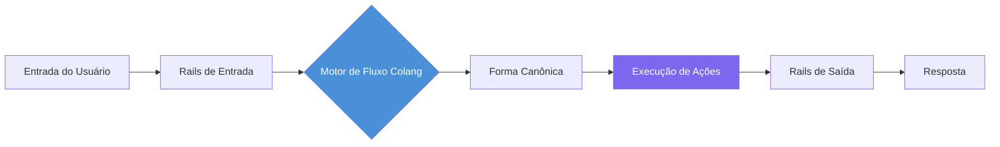
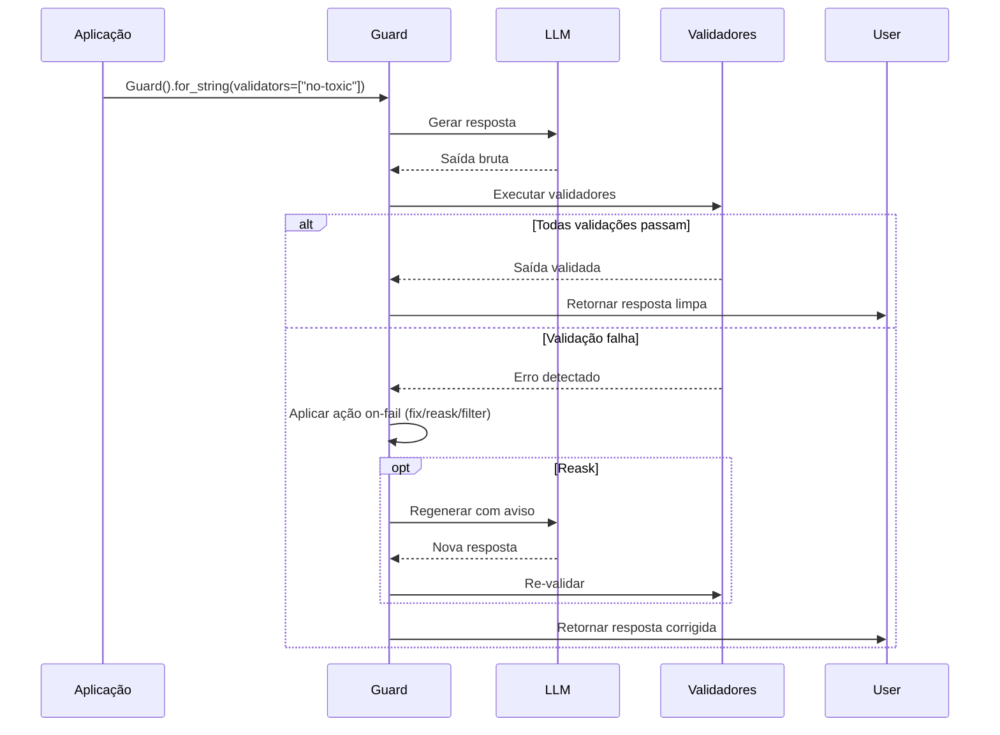

# Implementando Guardrails: NeMo, Guardrails AI e Personalizados

## NVIDIA NeMo Guardrails

NVIDIA NeMo Guardrails é um kit de ferramentas open-source para adicionar guardrails programáveis a aplicações baseadas em LLM. Ele usa a linguagem de política **Colang** para definir fluxos conversacionais e restrições de segurança.

### Conceitos Principais

- **Rails**: Definições de guardrails nomeadas escritas em Colang
- **Actions**: Funções Python que os rails invocam
- **Colang**: Uma DSL estilo YAML para modelar fluxos de diálogo
- **LLMRails**: O runtime que processa a entrada do usuário através dos rails definidos

### Diagrama de Fluxo Colang



### Configuração

```yaml
# config.yml
rails:
  input:
    flows:
      - self_check_input
      - detect_jailbreak
      - check_topic_allowed
  output:
    flows:
      - self_check_output
      - check_factual_consistency
      - validate_format

colang_files:
  - "rails/prompt_injection.co"
  - "rails/topical_rails.co"
  - "rails/safety.co"
```

### Exemplos de Políticas Colang

```
# rails/topical_rails.co
define flow topical_guardrail
  user said topic in allowed_topics
  bot express positive confirmation
  bot provide relevant response

define flow topical_guardrail
  user said topic not in allowed_topics
  bot express cannot answer
  bot suggest redirect

define user said topic in allowed_topics
  "topic" in ["product", "pricing", "shipping", "returns"]

define bot express cannot answer
  "Desculpe, só posso responder perguntas sobre nossos produtos e serviços."
```

### Ação Python para NeMo

```python
# actions/custom_actions.py
from nemoguardrails import RailsConfig, LLMRails

config = RailsConfig.from_path("config.yml")
rails = LLMRails(config)

response = rails.generate(
    messages=[{"role": "user", "content": "Qual é a política de devolução?"}]
)
print(response)
```

```python
# actions/harmful_content.py
from typing import Optional

def check_harmful_content(context: dict) -> Optional[str]:
    user_message = context.get("user_message", "")
    harmful_keywords = ["bomba", "ataque", "drogas ilegais", "hackear"]
    for keyword in harmful_keywords:
        if keyword in user_message.lower():
            return f"Conteúdo prejudicial detectado: {keyword}"
    return None
```

> [!NOTE]
> Colang usa sintaxe sensível à indentação semelhante ao YAML. Cada bloco `define flow` representa um caminho conversacional. O padrão `user ...` corresponde a qualquer mensagem do usuário, enquanto `user said ...` corresponde a intenções específicas.

---

## Guardrails AI Library

Guardrails AI fornece uma abordagem baseada em decoradores para definir validadores de saída.

### Fluxo de Validação



### Validador Personalizado

```python
# custom_validator.py
from guardrails.validators import Validator, register_validator

@register_validator("has_min_length", data_type="string")
class MinLengthValidator(Validator):
    def validate(self, value, metadata):
        min_len = metadata.get("min_length", 10)
        if len(value) < min_len:
            raise Exception(f"Resposta muito curta: {len(value)} < {min_len}")
        return value
```

### Aplicando Guard a uma Chamada LLM

```python
# guard_usage.py
import openai
from guardrails import Guard

guard = Guard.for_string(validators=["no-toxic-language", "valid-json"])

raw_output = openai.chat.completions.create(
    model="gpt-4",
    messages=[{"role": "user", "content": "Explique RLHF"}]
)
validated = guard.validate(raw_output.choices[0].message.content)

if validated.validation_passed:
    print("Saída segura:", validated.output)
else:
    print("Guardrail bloqueou:", validated.error)
```

### Especificação Rail (XML)

```xml
<rail version="0.1">
  <input>
    <validator type="length" min="1" max="2000" on-fail="reject"/>
    <validator type="prompt-injection" on-fail="reask"/>
  </input>
  <output>
    <validator type="no-toxic-language" on-fail="fix"/>
    <validator type="json-schema" on-fail="reask">
      <schema>
        {"type": "object", "properties": {"answer": {"type": "string"}}}
      </schema>
    </validator>
  </output>
</rail>
```

---

## Implementação Personalizada de Guardrails

```python
# custom_guardrail.py
import re, json, logging
from typing import Dict, List
from datetime import datetime

logging.basicConfig(level=logging.INFO)
logger = logging.getLogger("custom_guardrail")

class PIIRedactionGuardrail:
    def __init__(self, mask_token: str = "[REDACTED]"):
        self.mask_token = mask_token
        self.redaction_log: List[Dict] = []
        self.patterns = {
            "email": re.compile(r"[\w\.-]+@[\w\.-]+\.\w+"),
            "phone": re.compile(r"\b\d{3}[-.]?\d{3}[-.]?\d{4}\b"),
            "ssn": re.compile(r"\b\d{3}-\d{2}-\d{4}\b"),
        }

    def validate(self, text: str) -> str:
        for name, pattern in self.patterns.items():
            matches = pattern.findall(text)
            if matches:
                logger.info(f"[GUARDRAIL] Redigiu {len(matches)} {name}(s)")
                self.redaction_log.append({
                    "type": name, "count": len(matches),
                    "timestamp": datetime.utcnow().isoformat(),
                })
                text = pattern.sub(self.mask_token, text)
        return text

    def contains_pii(self, text: str) -> bool:
        return any(pattern.search(text) for pattern in self.patterns.values())

    def get_stats(self) -> Dict:
        return {
            "total_redactions": len(self.redaction_log),
            "by_type": {name: sum(1 for e in self.redaction_log if e["type"] == name) for name in self.patterns},
        }

# Uso
pii_guard = PIIRedactionGuardrail()
safe = pii_guard.validate("Contato: joao@email.com ou 555-123-4567")
print(safe)
```

> [!WARNING]
> Redação de PII baseada em regex é um ponto de partida, não uma solução completa. Nomes, endereços e PII dependentes de contexto exigem reconhecimento de entidade baseado em NLP (spaCy NER, Presidio). Sempre combine guardrails regex com classificadores baseados em modelo para produção.

> [!TIP]
> Ao implementar guardrails personalizados, sempre inclua um método `get_stats()` para observabilidade. Isso facilita a integração com dashboards de monitoramento e a identificação de padrões como taxas crescentes de falso positivo.

---

## Combinando Sistemas de Guardrails

```python
# combined_guardrails.py
from nemoguardrails import LLMRails
from guardrails import Guard

class HybridGuardrailSystem:
    def __init__(self, nemo_config_path: str):
        self.nemo = LLMRails.from_path(nemo_config_path)
        self.guardrails_ai = Guard.for_string(validators=["no-toxic-language", "valid-json"])
        self.pii = PIIRedactionGuardrail()

    def process(self, user_input: str) -> dict:
        result = {"input": user_input, "guarded": True}
        nemo_response = self.nemo.generate(messages=[{"role": "user", "content": user_input}])
        clean_text = self.pii.validate(nemo_response)
        validation = self.guardrails_ai.validate(clean_text)
        if validation.validation_passed:
            result["final_output"] = validation.output
        else:
            result["final_output"] = None
            result["error"] = str(validation.error)
        return result
```

---

## Tabela Comparativa

| Característica         | NeMo Guardrails       | Guardrails AI         | Implementação Personalizada |
|------------------------|----------------------|-----------------------|-----------------------------|
| Linguagem              | Colang + Python      | Python + XML spec     | Python puro                 |
| Guardrails de entrada  | Sim (fluxos Colang)  | Sim (validadores XML) | Você constrói               |
| Guardrails de saída    | Sim (fluxos Colang)  | Sim (validadores XML) | Você constrói               |
| Guardrails comportamentais | Sim (gestão diálogo)| Limitado (sem fluxos) | Você constrói               |
| Gestão de diálogo      | Completa (multiturno)| Nenhum                | Você constrói               |
| Curva de aprendizado   | Médio                | Baixo                 | Alto (do zero)              |
| Validadores nativos    | ~20                  | ~50                   | Nenhum                      |
| Ações personalizadas   | Funções Python       | @register_validator   | Qualquer código             |
| Melhor para            | Multiturno complexo  | Verificações simples  | Regras específicas de domínio |

---

## Perguntas de Prática

```question
{
  "id": "gr-2-q1",
  "type": "multiple-choice",
  "question": "Uma equipe precisa implementar políticas de diálogo multiturno complexas para um agente de atendimento ao cliente. Qual ferramenta é mais adequada?",
  "options": [
    "Guardrails AI com especificações XML",
    "Validadores Python personalizados",
    "NVIDIA NeMo Guardrails com Colang",
    "Redação de PII baseada em regex"
  ],
  "correct": 2,
  "explanation": "NeMo Guardrails com Colang é projetado para gestão de diálogo multiturno, modelando fluxos conversacionais e mantendo estado entre turnos."
}
```

```question
{
  "id": "gr-2-q2",
  "type": "multiple-choice",
  "question": "No Guardrails AI, como as regras de validação personalizadas são definidas?",
  "options": [
    "Usando arquivos de configuração YAML",
    "Usando um decorador @register_validator em uma classe Python",
    "Escrevendo definições de fluxo Colang",
    "Criando triggers SQL"
  ],
  "correct": 1,
  "explanation": "Guardrails AI usa o decorador @register_validator para registrar classes validadoras Python personalizadas que herdam de Validator."
}
```

```question
{
  "id": "gr-2-q3",
  "type": "multiple-choice",
  "question": "Um desenvolvedor implementa um guardrail usando regex para detectar telefones e emails na saída do LLM. Qual é a principal limitação?",
  "options": [
    "Regex é muito lento para produção",
    "Regex não detecta PII dependente de contexto como nomes e endereços",
    "Regex não pode ser combinado com outros guardrails",
    "Regex só funciona em dados estruturados"
  ],
  "correct": 1,
  "explanation": "Regex é rápido para PII estruturada, mas falha em PII não estruturada como nomes e endereços. Para produção, combine regex com reconhecimento de entidade baseado em NLP."
}
```

```question
{
  "id": "gr-2-q4",
  "type": "multiple-choice",
  "question": "Para que serve principalmente a linguagem Colang no NeMo Guardrails?",
  "options": [
    "Definir funções de ação Python",
    "Escrever testes unitários",
    "Modelar fluxos conversacionais e restrições de segurança",
    "Configurar deploy em nuvem"
  ],
  "correct": 2,
  "explanation": "Colang é uma DSL para modelar fluxos conversacionais, restrições de segurança e políticas de diálogo."
}
```

```question
{
  "id": "gr-2-q5",
  "type": "multiple-choice",
  "question": "Uma startup precisa adicionar rapidamente validação de saída para formatação JSON e detecção de linguagem tóxica. Qual abordagem escolher?",
  "options": [
    "Construir um guardrail Python do zero",
    "Usar NVIDIA NeMo Guardrails com Colang",
    "Usar Guardrails AI com validadores nativos",
    "Usar validação regex em um script shell"
  ],
  "correct": 2,
  "explanation": "Guardrails AI tem a curva de aprendizado mais baixa com ~50 validadores nativos e especificações XML simples."
}
```

---

> [!SUCCESS]
> ## Principais Conclusões
> - NVIDIA NeMo Guardrails usa Colang para definição de políticas em nível de diálogo com gestão de conversas multiturno.
> - Guardrails AI oferece validadores baseados em decorador com ~50 validadores nativos; melhor para validação de estrutura de saída.
> - Guardrails personalizados em Python dão controle total, mas exigem reimplementar logging, composição e tratamento de erros.
> - Guardrails baseados em regex são rápidos, mas frágeis; combine-os com classificadores baseados em modelo.
> - Sempre registre decisões de guardrail para auditoria e melhoria.
> - Considere abordagens híbridas combinando NeMo para fluxo de diálogo, Guardrails AI para validação de saída e código personalizado para regras de domínio específicas.
