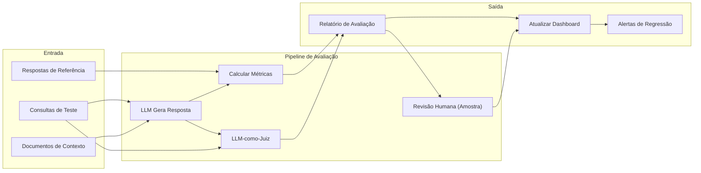
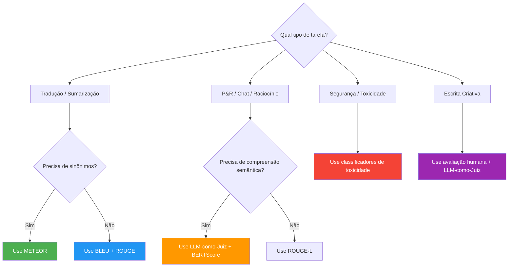

# Frameworks de Avaliação para Saídas de LLM

## O que Avaliar

A qualidade da saída do LLM é multidimensional. Estes são os cinco eixos principais:

| Dimensão      | O que Mede                                    | Exemplo de Falha                 | Método de Detecção           |
|---------------|------------------------------------------------|----------------------------------|------------------------------|
| Correção      | Precisão factual contra verdade absoluta      | "Paris é a capital da Itália"    | Consulta BC, fontes verificadas |
| Relevância    | Se a saída aborda a consulta do usuário       | Responder previsão do tempo errada | Similaridade de embeddings  |
| Fundamentação | Se as alegações são suportadas pelo contexto   | Alucinar citações                 | Pontuação de sobreposição    |
| Segurança     | Ausência de conteúdo tóxico, tendencioso       | Gerar discurso de ódio            | Classificadores de toxicidade |
| Fluência      | Qualidade gramatical e estilística             | Prosa fragmentada ou incoerente   | Perplexidade, corretores     |

> [!WARNING]
> Apenas correção não é suficiente. Uma resposta pode ser factualmente correta mas irrelevante, insegura ou sem fundamentação. Sempre avalie em múltiplas dimensões.

---

## Pipeline de Avaliação



---

## Árvore de Decisão para Seleção de Métricas



---

## Conjuntos de Dados de Avaliação

```json
{
  "dataset": "suporte-cliente-eval",
  "version": "1.0",
  "examples": [
    {
      "id": "cs-001",
      "query": "Como redefino minha senha?",
      "context": "Usuário está na página de login e esqueceu as credenciais.",
      "reference": "Clique em 'Esqueci a Senha' na tela de login, insira seu email e siga o link de redefinição.",
      "expected_tools": ["send_reset_email"],
      "tags": ["senha", "autenticação"],
      "difficulty": "fácil"
    },
    {
      "id": "cs-002",
      "query": "Qual é o status do meu reembolso?",
      "context": "Usuário pediu item #ORD-4521 em 10 de março.",
      "reference": "Seu reembolso para o pedido ORD-4521 está sendo processado.",
      "expected_tools": ["check_refund_status"],
      "tags": ["reembolso", "status-pedido"],
      "difficulty": "médio"
    }
  ]
}
```

### Criando um Dataset Programaticamente

```python
# create_eval_dataset.py
import json
from typing import List

class EvalDatasetBuilder:
    def __init__(self):
        self.examples = []

    def add_example(self, query: str, context: str = "", reference: str = "",
                    expected_tools: List[str] = None, tags: List[str] = None,
                    difficulty: str = "medium"):
        self.examples.append({
            "id": f"ex-{len(self.examples) + 1:04d}",
            "query": query, "context": context, "reference": reference,
            "expected_tools": expected_tools or [], "tags": tags or [],
            "difficulty": difficulty,
        })
        return self

    def save(self, path: str):
        with open(path, "w") as f:
            json.dump({"dataset": "custom-eval", "version": "1.0",
                       "total_examples": len(self.examples),
                       "examples": self.examples}, f, indent=2)

builder = EvalDatasetBuilder()
builder.add_example("Qual a política de devolução?", "Política de 30 dias",
                    expected_tools=["lookup_policy"], difficulty="fácil")
builder.save("eval_dataset.json")
```

---

## Métricas de Avaliação Automatizadas

### BLEU

```python
from nltk.translate.bleu_score import sentence_bleu, SmoothingFunction

reference = "o gato sentou no tapete".split()
candidate = "o gato sentou num tapete".split()
smoothie = SmoothingFunction().method4
score = sentence_bleu([reference], candidate, smoothing_function=smoothie)
print(f"BLEU: {score:.3f}")
```

### ROUGE

```python
from rouge_score import rouge_scorer

scorer = rouge_scorer.RougeScorer(["rouge1", "rouge2", "rougeL"], use_stemmer=True)
reference = "The quick brown fox jumps over the lazy dog"
candidate = "A quick brown fox jumped over a lazy dog"
scores = scorer.score(reference, candidate)
for metric, result in scores.items():
    print(f"{metric}: F1={result.fmeasure:.3f}")
```

### METEOR

```python
from nltk.translate.meteor_score import meteor_score

score = meteor_score(["o gato sentou no tapete"], "um gato senta num tapete")
print(f"METEOR: {score:.3f}")
```

### BERTScore

```python
from bert_score import score as bertscore

P, R, F1 = bertscore(
    ["The cat is sitting on the mat"],
    ["A cat sits on a rug"],
    model_type="microsoft/deberta-xlarge-mnli", lang="en"
)
print(f"BERTScore F1: {F1[0].item():.3f}")
```

### Limitações das Métricas N-Grama

- BLEU e ROUGE correlacionam-se mal com julgamento humano para tarefas criativas
- METEOR melhora o tratamento de sinônimos, mas ainda perde significado semântico
- Nenhuma detecta alucinações, toxicidade ou precisão factual diretamente
- Todas exigem textos de referência, que são caros de produzir em escala

---

## LLM-como-Juiz

```python
# llm_as_judge.py
import json
from openai import OpenAI

client = OpenAI()

def judge_output(query: str, generated: str, rubric: dict = None) -> dict:
    if rubric is None:
        rubric = {"correção": "A resposta é factualmente precisa?",
                  "relevância": "A resposta aborda diretamente a consulta?",
                  "utilidade": "A resposta realmente ajuda o usuário?"}

    rubric_text = "\n".join(f"- {dim}: {desc}" for dim, desc in rubric.items())
    judge_prompt = f"""Você é um avaliador especialista de respostas de IA.

## Rubrica
{rubric_text}

## Consulta do Usuário
{query}

## Resposta Gerada
{generated}

## Tarefa
Pontue a resposta de 1 a 5 para cada dimensão.
Forneça uma justificativa breve.
Saída JSON com chaves: "scores", "reasoning", "overall_score".
"""
    response = client.chat.completions.create(
        model="gpt-4",
        messages=[{"role": "user", "content": judge_prompt}],
        response_format={"type": "json_object"}, temperature=0.0,
    )
    return json.loads(response.choices[0].message.content)

result = judge_output("Explique entrelaçamento quântico", "É um fenômeno onde partículas se correlacionam...")
print(json.dumps(result, indent=2))
```

> [!TIP]
> Ao usar LLM-como-juiz, defina `temperature=0` para pontuação determinística e use `response_format={"type": "json_object"}`. Sempre valide o raciocínio do juiz para uma amostra de casos para detectar viés do modelo-juiz.

---

## Avaliação Humana

| Abordagem       | Custo por 1000 | Velocidade | Consistência | Melhor Para              |
|-----------------|----------------|------------|--------------|--------------------------|
| Métricas N-gram | ~$0.01         | Segundos   | Alta         | Tradução, sumarização    |
| BERTScore       | ~$1.00         | Minutos    | Alta         | Similaridade semântica   |
| LLM-como-juiz   | ~$5.00         | Minutos    | Média        | QA aberto, raciocínio    |
| Avaliação humana| ~$500          | Horas-Dias | Baixa        | Segurança, tom, UX       |

---

## Tabela Comparativa

| Métrica   | Tipo        | Mede        | Faixa   | Pontos Fortes                    | Pontos Fracos                    | Melhor Uso           |
|-----------|-------------|-------------|---------|----------------------------------|----------------------------------|----------------------|
| BLEU      | N-grama     | Precisão    | 0-1     | Rápido, determinístico           | Ignora recall, semântica         | Tradução automática  |
| ROUGE     | N-grama     | Recall      | 0-1     | Bom para sumarização             | Ignora fluência, ordem           | Sumarização          |
| METEOR    | N-grama+sin | F-score     | 0-1     | Sinônimos, radical, ordem        | Complexidade, ainda superficial  | Tradução, legendagem |
| BERTScore | Embedding   | F1 semântico| 0-1     | Captura paráfrases, significado  | Requer GPU, mais lento           | Similaridade semântica|
| LLM-juiz  | Modelo      | Qualidade   | 1-5     | Captura nuances, personalizável  | Caro, viés do modelo-juiz        | QA aberto, chat      |
| Humano    | Manual      | Todas dim.  | Subjetivo| Padrão ouro para qualidade       | Lento, caro, inconsistente       | Segurança, marca, UX |

---

## Perguntas de Prática

```question
{
  "id": "gr-3-q1",
  "type": "multiple-choice",
  "question": "Uma resposta recebe alta pontuação BLEU, mas usuários a consideram inútil. Qual a explicação mais provável?",
  "options": [
    "BLEU mede precisão de n-gramas, que ignora qualidade semântica e relevância",
    "BLEU penaliza respostas longas demais",
    "O texto de referência era muito curto",
    "BLEU só funciona para tarefas de tradução"
  ],
  "correct": 0,
  "explanation": "BLEU mede sobreposição de n-gramas com uma referência. Não mede qualidade semântica, precisão factual ou relevância."
}
```

```question
{
  "id": "gr-3-q2",
  "type": "multiple-choice",
  "question": "Uma equipe quer avaliar se as alegações do LLM são suportadas pelos documentos de contexto fornecidos. Qual dimensão de avaliação é alvo?",
  "options": ["Correção", "Relevância", "Fundamentação", "Fluência"],
  "correct": 2,
  "explanation": "Fundamentação mede se as alegações do LLM são suportadas pelo contexto fornecido. Uma resposta pode ser correta mas sem fundamentação."
}
```

```question
{
  "id": "gr-3-q3",
  "type": "multiple-choice",
  "question": "Uma equipe tem 10.000 conversas de produção, mas orçamento para avaliar apenas 1.000. Qual estratégia de amostragem é recomendada?",
  "options": [
    "Amostragem aleatória de 1.000 conversas",
    "Amostragem estratificada por categoria de conversa",
    "Selecionar as primeiras 1.000 conversas cronologicamente",
    "Deixar um LLM selecionar as conversas mais interessantes"
  ],
  "correct": 1,
  "explanation": "Amostragem estratificada garante que todas as categorias de conversa sejam proporcionalmente representadas."
}
```

```question
{
  "id": "gr-3-q4",
  "type": "multiple-choice",
  "question": "Uma equipe usa GPT-4 para pontuar as saídas de outro LLM. Qual é uma desvantagem conhecida desta abordagem LLM-como-juiz?",
  "options": [
    "É mais lento que avaliação humana",
    "Introduz custo e viés do modelo-juiz",
    "Não pode ser automatizado",
    "Só funciona para correção factual"
  ],
  "correct": 1,
  "explanation": "LLM-como-juiz introduz custo por avaliação e está sujeito a viéses do modelo-juiz, como preferir respostas mais longas."
}
```

```question
{
  "id": "gr-3-q5",
  "type": "multiple-choice",
  "question": "Uma equipe avalia um sistema de sumarização e precisa de uma métrica que considere recall, radicalização e correspondência de sinônimos. Qual métrica usar?",
  "options": ["BLEU", "ROUGE", "METEOR", "LLM-como-juiz"],
  "correct": 2,
  "explanation": "METEOR combina correspondência de n-gramas focada em recall com radicalização e sinônimos."
}
```

---

> [!SUCCESS]
> ## Principais Conclusões
> - Avalie saídas de LLM em cinco dimensões: correção, relevância, fundamentação, segurança e fluência.
> - Métricas N-grama (BLEU, ROUGE, METEOR) são rápidas, mas superficiais; perdem semântica e alucinações.
> - BERTScore captura similaridade semântica usando embeddings; detecta paráfrases.
> - LLM-como-juiz captura qualidade semântica, mas introduz custo e viés; use temperature=0 para reprodutibilidade.
> - Avaliação humana é o padrão ouro, mas escala mal; use-a estrategicamente para dimensões subjetivas.
> - Um conjunto de dados de avaliação representativo é mais importante que um grande; invista em anotação de qualidade.
> - Combine múltiplos métodos de avaliação — nenhuma métrica isolada conta a história completa.
