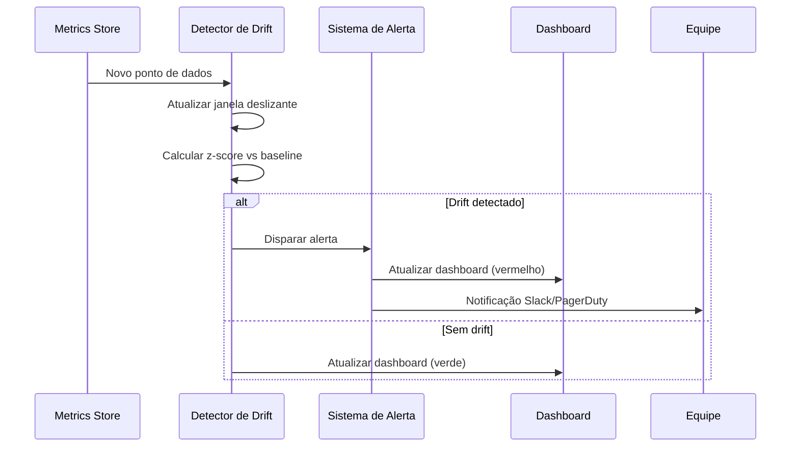
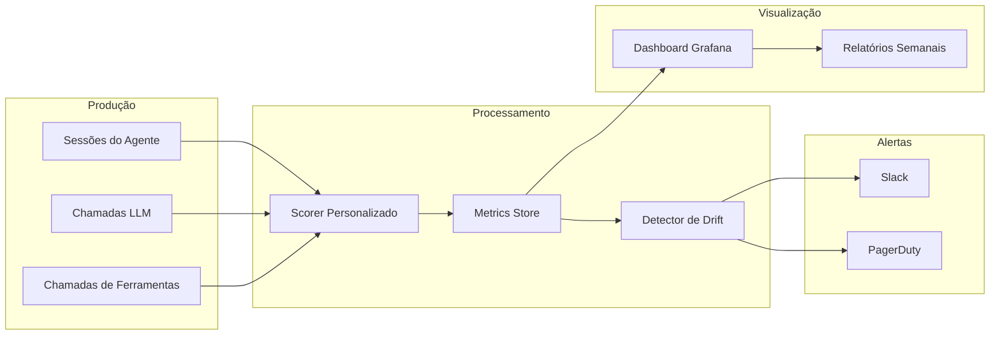

# Pontuação, Métricas e Monitoramento Contínuo

## Definindo Métricas Personalizadas

Métricas genéricas (BLEU, ROUGE) raramente capturam o que importa para seu agente específico. Você precisa de **critérios de sucesso personalizados** que reflitam os requisitos do seu domínio.

```python
# scoring.py
from typing import Dict, List, Any
import time

class AgentScorer:
    def __init__(self, config: Dict[str, Any]):
        self.task_completed_weight = config.get("task_completed_weight", 0.4)
        self.tool_efficiency_weight = config.get("tool_efficiency_weight", 0.2)
        self.response_time_weight = config.get("response_time_weight", 0.2)
        self.safety_score_weight = config.get("safety_score_weight", 0.2)

    def score_task_completion(self, expected: List[str], actual: List[str]) -> Dict[str, Any]:
        expected_set, actual_set = set(expected), set(actual)
        tp = len(expected_set & actual_set)
        fp = len(actual_set - expected_set)
        fn = len(expected_set - actual_set)
        precision = tp / (tp + fp) if (tp + fp) > 0 else 0.0
        recall = tp / (tp + fn) if (tp + fn) > 0 else 0.0
        f1 = 2 * precision * recall / (precision + recall) if (precision + recall) > 0 else 0.0
        return {"score": f1, "details": {"precision": precision, "recall": recall, "f1": f1, "tp": tp, "fp": fp, "fn": fn}, "timestamp": time.time()}

    def score_tool_efficiency(self, tool_calls: List[Dict], max_calls: int = 10) -> Dict:
        total = len(tool_calls)
        if total == 0:
            return {"score": 1.0, "details": {"calls": 0}, "timestamp": time.time()}
        efficiency = max(0.0, 1.0 - (total / max_calls))
        return {"score": efficiency, "details": {"total_calls": total, "max_allowed": max_calls}, "timestamp": time.time()}

    def score_response_time(self, rt_ms: float, threshold_ms: float = 5000) -> Dict:
        if rt_ms <= threshold_ms:
            return {"score": 1.0, "details": {"response_time_ms": rt_ms}, "timestamp": time.time()}
        score = max(0.0, 1.0 - ((rt_ms - threshold_ms) / threshold_ms))
        return {"score": score, "details": {"response_time_ms": rt_ms}, "timestamp": time.time()}

    def compute_overall(self, sub_scores: Dict[str, float]) -> Dict:
        overall = (sub_scores.get("task_completion", 0) * self.task_completed_weight +
                   sub_scores.get("tool_efficiency", 0) * self.tool_efficiency_weight +
                   sub_scores.get("response_time", 0) * self.response_time_weight +
                   sub_scores.get("safety", 0) * self.safety_score_weight)
        return {"overall_score": round(overall, 3), "weights": {"task_completion": self.task_completed_weight,
                "tool_efficiency": self.tool_efficiency_weight, "response_time": self.response_time_weight,
                "safety": self.safety_score_weight}, "sub_scores": sub_scores, "timestamp": time.time()}

scorer = AgentScorer({"task_completed_weight": 0.5, "tool_efficiency_weight": 0.2, "response_time_weight": 0.2, "safety_score_weight": 0.1})
task = scorer.score_task_completion(["reembolso_processado"], ["reembolso_processado", "email_enviado"])
rt = scorer.score_response_time(3200)
overall = scorer.compute_overall({"task_completion": task["score"], "tool_efficiency": 1.0, "response_time": rt["score"], "safety": 0.95})
print(f"Geral: {overall['overall_score']}")
```

> [!TIP]
> A seleção de pesos deve ser orientada por prioridades de negócio, não intuição. Analise logs de produção para identificar quais métricas correlacionam com satisfação do usuário e retenção.

---

## Armazenando Métricas ao Longo do Tempo

```python
# metrics_store.py
import sqlite3, json
from datetime import datetime, timezone
from typing import List, Tuple

class MetricsStore:
    def __init__(self, db_path: str = "metrics.db"):
        self.conn = sqlite3.connect(db_path)
        self._init_db()

    def _init_db(self):
        self.conn.execute("""
            CREATE TABLE IF NOT EXISTS agent_metrics (
                id INTEGER PRIMARY KEY AUTOINCREMENT,
                session_id TEXT NOT NULL,
                metric_name TEXT NOT NULL,
                score REAL NOT NULL,
                details TEXT,
                recorded_at TEXT NOT NULL
            )
        """)
        self.conn.execute("CREATE INDEX IF NOT EXISTS idx_metric_name ON agent_metrics(metric_name, recorded_at)")
        self.conn.commit()

    def record(self, session_id: str, metric_name: str, score: float, details: dict = None):
        self.conn.execute("INSERT INTO agent_metrics (session_id, metric_name, score, details, recorded_at) VALUES (?, ?, ?, ?, ?)",
                          (session_id, metric_name, score, json.dumps(details) if details else None, datetime.now(timezone.utc).isoformat()))
        self.conn.commit()

    def get_daily_average(self, metric_name: str, days: int = 7) -> List[Tuple[str, float]]:
        cursor = self.conn.execute("""
            SELECT DATE(recorded_at) as day, AVG(score) FROM agent_metrics
            WHERE metric_name = ? AND recorded_at >= DATE('now', ?) GROUP BY day ORDER BY day
        """, (metric_name, f"-{days} days"))
        return cursor.fetchall()
```

---

## Detecção de Drift

```python
# drift_detector.py
import statistics
from typing import List, Tuple, Optional

class DriftDetector:
    def __init__(self, window_size: int = 100, std_dev_threshold: float = 2.0, min_baseline_size: int = 30):
        self.window_size = window_size
        self.std_dev_threshold = std_dev_threshold
        self.min_baseline_size = min_baseline_size

    def check_drift(self, baseline: List[float], recent: List[float]) -> Tuple[bool, float]:
        if len(baseline) < self.min_baseline_size:
            return False, 0.0
        baseline_mean = statistics.mean(baseline)
        baseline_stdev = statistics.stdev(baseline) if len(baseline) > 1 else 1.0
        recent_mean = statistics.mean(recent) if recent else baseline_mean
        standard_error = baseline_stdev / (len(recent) ** 0.5)
        if standard_error == 0:
            return False, 0.0
        z_score = (baseline_mean - recent_mean) / standard_error
        return abs(z_score) > self.std_dev_threshold, z_score

    def alert_if_drifted(self, metric_name: str, baseline: List[float], recent: List[float]) -> Optional[str]:
        is_drifted, z_score = self.check_drift(baseline, recent)
        if is_drifted:
            return (f"[ALERTA] Métrica '{metric_name}' drifou "
                    f"(z-score: {z_score:.2f}, média recente: {statistics.mean(recent):.3f}, "
                    f"média base: {statistics.mean(baseline):.3f})")
        return None
```

### Sequência de Detecção de Drift



> [!WARNING]
> Detecção de drift requer dados suficientes para estabelecer uma baseline confiável. Não defina limites de alerta até ter pelo menos 100 pontos de dados por métrica. Limites prematuros causam fadiga de alerta.

> [!IMPORTANT]
> Defina SLIs (Indicadores de Nível de Serviço), SLOs (Objetivos de Nível de Serviço) e SLAs (Acordos de Nível de Serviço):
> - **SLI**: A métrica real que você mede
> - **SLO**: O limite alvo (ex: "score >= 0.85 em janela de 30 dias")
> - **SLA**: O compromisso com usuários (ex: "99.9% das requisições atendem ao SLO")

---

## Configuração de Alertas

```yaml
# alerts_config.yml
alerts:
  task_completion:
    metric: "task_completion"
    type: "drift"
    baseline_window_days: 30
    recent_window_count: 50
    z_score_threshold: 2.5
    channels: ["slack", "pagerduty"]
    severity: "critical"

  response_time:
    metric: "response_time"
    type: "threshold"
    threshold_ms: 8000
    evaluation_window_minutes: 15
    channels: ["slack"]
    severity: "warning"

  safety_violations:
    metric: "safety"
    type: "count"
    threshold: 5
    evaluation_window_hours: 24
    channels: ["slack", "pagerduty"]
    severity: "critical"
```

---

## Pipeline de Monitoramento Contínuo



---

## Dashboards

```yaml
# dashboard_config.yml
dashboard:
  title: "Saúde do Agente em Produção"
  refresh_interval_seconds: 60
  time_range_days: 7

  panels:
    - title: "Taxa de Sucesso (7d)"
      metric: "task_completion"
      aggregation: "avg"
      chart_type: "timeseries"
      alert_threshold: 0.80

    - title: "Tempo Médio de Resposta (7d)"
      metric: "response_time"
      aggregation: "avg"
      chart_type: "timeseries"
      alert_threshold: 5000
      unit: "ms"

    - title: "Contagem de Chamadas de Ferramentas"
      metric: "tool_efficiency"
      aggregation: "sum"
      chart_type: "bar"

    - title: "Violações de Segurança"
      metric: "safety"
      aggregation: "count"
      chart_type: "gauge"
      alert_threshold: 5
```

> [!WARNING]
> Fadiga de alerta é um perigo real. Siga estas regras: (1) alerte apenas em métricas com baseline estabelecida, (2) use níveis de severidade, (3) implemente histerese, (4) revise eficácia dos alertas mensalmente.

---

## Pipeline de Avaliação Contínua (CI/CD)

```yaml
# .github/workflows/eval-pipeline.yml
name: Avaliação Diária

on:
  schedule:
    - cron: "0 6 * * *"
  workflow_dispatch:

jobs:
  evaluate:
    runs-on: ubuntu-latest
    steps:
      - uses: actions/checkout@v4
      - run: pip install -r requirements.txt
      - name: Avaliar logs de produção de ontem
        run: python scripts/run_evaluation.py --input s3://prod-logs/$(date -d 'yesterday' +%Y/%m/%d)/ --output s3://eval-results/
      - name: Verificar drift
        run: python scripts/detect_drift.py --metrics-db s3://eval-results/metrics.db --output alert.json
      - name: Enviar alertas
        run: python scripts/send_alerts.py --input alert.json
```

---

## Tabela Comparativa: Tipos de Métricas

| Categoria de Métrica | Exemplos                        | Medição     | Fonte            | Prioridade |
|----------------------|---------------------------------|-------------|------------------|------------|
| Precisão             | Tarefa concluída, F1            | Por sessão  | Avaliação LLM    | Crítica    |
| Latência             | Tempo de resposta               | Por chamada | Logs aplicação   | Alta       |
| Custo                | Custo por sessão, tokens        | Por chamada | API de faturamento| Média     |
| Segurança            | Toxicidade, violações PII       | Por resposta| Guardrails       | Crítica    |
| Confiabilidade       | Taxa de erro, timeout           | Por chamada | Monitoramento    | Alta       |

---

## Perguntas de Prática

```question
{
  "id": "gr-5-q1",
  "type": "multiple-choice",
  "question": "Uma equipe nota que a pontuação média de conclusão de tarefa caiu de 0,92 para 0,73 em 3 dias. Qual é o primeiro passo diagnóstico?",
  "options": [
    "Reverter imediatamente o último deploy",
    "Investigar as sub-pontuações para identificar qual dimensão causou a queda",
    "Aumentar o limite de alerta para 0,70",
    "Retreinar o modelo LLM"
  ],
  "correct": 1,
  "explanation": "Antes de agir, investigue sub-pontuações para identificar qual dimensão causou a queda. Reverter ou retreinar sem diagnóstico desperdiça tempo."
}
```

```question
{
  "id": "gr-5-q2",
  "type": "multiple-choice",
  "question": "Um armazenamento de métricas registra pontuações em um banco de dados de série temporal. Qual o propósito principal?",
  "options": [
    "Gerar faturas para clientes",
    "Rastrear tendências, detectar regressões e alimentar dashboards",
    "Substituir a necessidade de avaliação humana",
    "Apenas cumprir leis de retenção de dados"
  ],
  "correct": 1,
  "explanation": "Armazenamento de série temporal permite análise de tendências, detecção de regressões e dashboards em tempo real."
}
```

```question
{
  "id": "gr-5-q3",
  "type": "multiple-choice",
  "question": "Uma equipe configura detecção de drift com z-score 2.0 e janela de 100 pontos. O que devem garantir antes de confiar nos alertas?",
  "options": [
    "O modelo LLM é a versão mais recente",
    "Há pelo menos 100 pontos de dados para estabelecer baseline confiável",
    "O dashboard tem pelo menos 5 painéis",
    "O sistema de alerta envia notificações por email"
  ],
  "correct": 1,
  "explanation": "Detecção de drift requer baseline estatisticamente significativa. A lição recomenda pelo menos 100 pontos de dados por métrica."
}
```

```question
{
  "id": "gr-5-q4",
  "type": "multiple-choice",
  "question": "Um dashboard tem um painel mostrando 'Violações de Segurança' como contagem. Qual tipo de gráfico é recomendado?",
  "options": ["Série temporal", "Gráfico de barras", "Gauge", "Gráfico de pizza"],
  "correct": 2,
  "explanation": "Gráfico gauge é recomendado para métricas de contagem porque fornece indicador visual de status (verde/amarelo/vermelho) contra um limite."
}
```

```question
{
  "id": "gr-5-q5",
  "type": "multiple-choice",
  "question": "Um pipeline de avaliação contínua roda diariamente às 06:00 UTC. Qual o gatilho mais apropriado?",
  "options": [
    "Um git push para branch main",
    "Um job cron agendado",
    "Apenas gatilho manual",
    "Aprovação de pull request"
  ],
  "correct": 1,
  "explanation": "Um job cron agendado é apropriado para avaliação diária de dados de produção que se acumulam ao longo do tempo."
}
```

---

> [!SUCCESS]
> ## Principais Conclusões
> - Métricas genéricas são insuficientes; defina funções de pontuação personalizadas com pesos configuráveis orientados por prioridades de negócio.
> - Armazene métricas em banco de dados de série temporal para rastrear tendências, detectar regressões e alimentar dashboards.
> - Detecção de drift usa testes estatísticos (z-score, janela deslizante) para identificar degradação automaticamente.
> - Limites de alerta devem ser definidos após estabelecer baseline confiável (mínimo 100 pontos) para evitar fadiga de alerta.
> - Defina SLIs, SLOs e SLAs para medir e comunicar desempenho do agente objetivamente.
> - Use níveis de severidade e histerese em alertas para focar sua equipe em problemas genuínos.
> - Todo componente — pontuação, armazenamento, detecção de drift, alertas, dashboards — deve ser definido antes do lançamento em produção.
