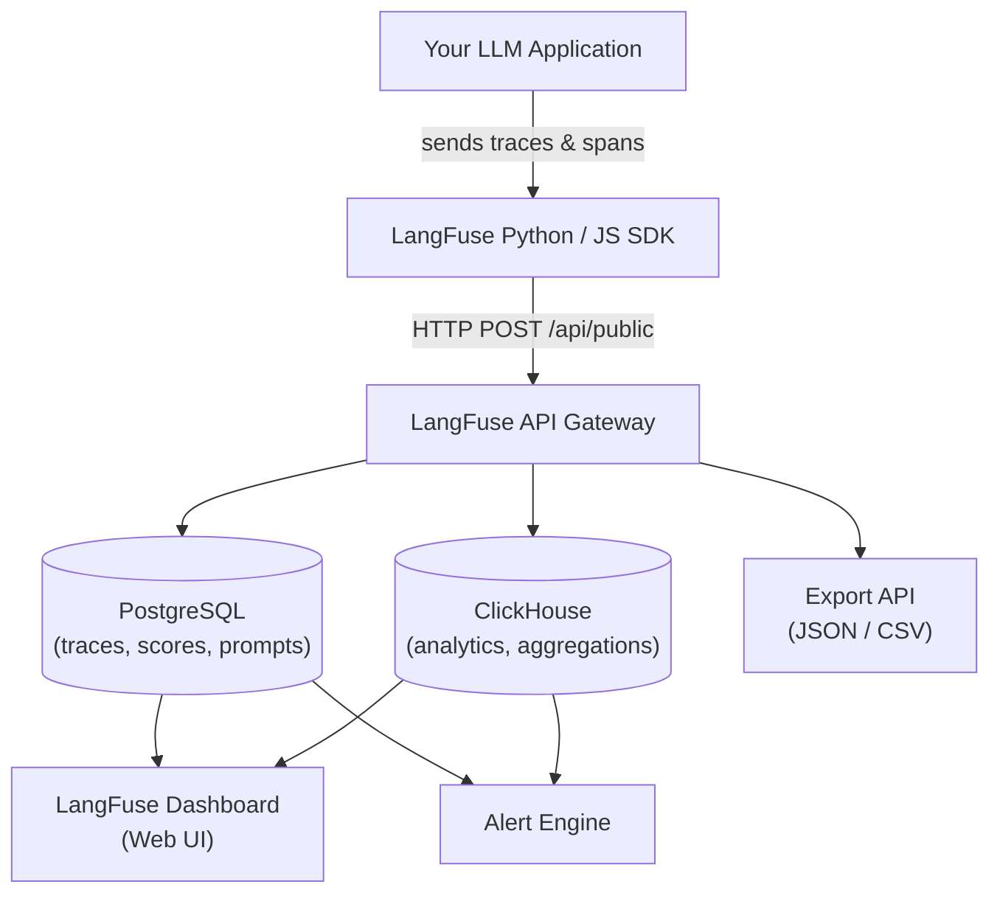
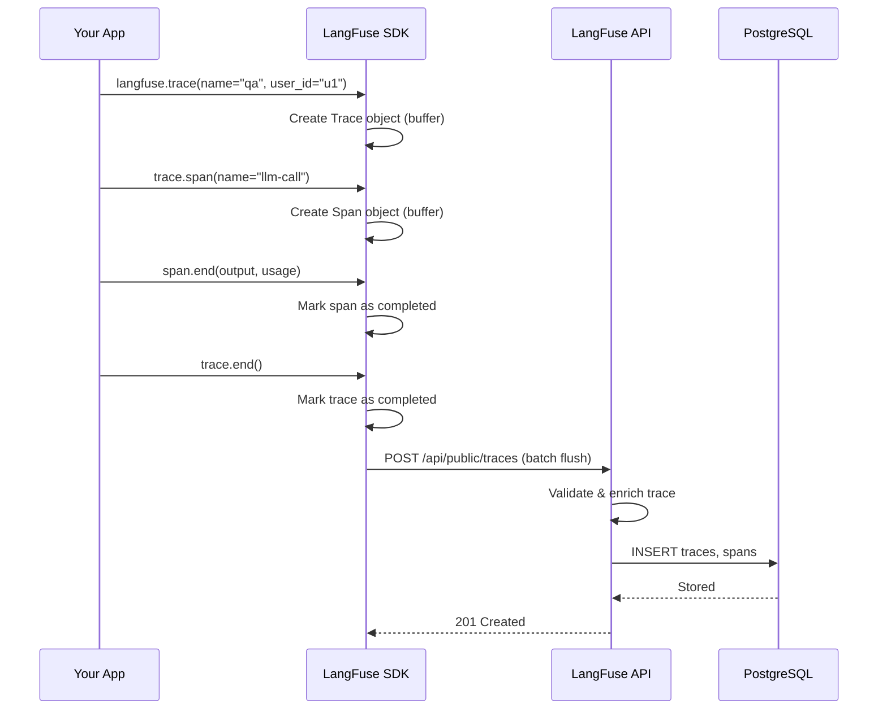
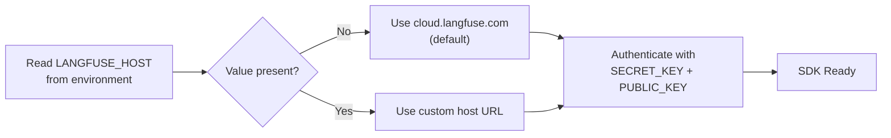

# LangFuse Overview, Setup and SDK Integration

LangFuse is an open-source observability and evaluation platform for LLM applications. It provides tracing, prompt management, evaluation, and monitoring capabilities designed specifically for projects built with frameworks like LangChain, LlamaIndex, and custom Python pipelines.

This lesson covers the fundamentals: what LangFuse offers, the difference between self-hosted and cloud deployments, project setup, SDK installation, and basic trace creation.

---

## What is LangFuse?

LangFuse helps teams:

- **Trace** every step of an LLM call — from prompt construction to model response.
- **Evaluate** outputs with manual scores, LLM-as-judge, or external metrics.
- **Manage prompts** with version control and deployment workflows.
- **Monitor costs, latency, and error rates** in real-time dashboards.

> [!WARNING]
> LangFuse is **not** a model provider or vector database. It is an observability layer that your application sends data to. You still need your own LLM API keys (OpenAI, Anthropic, etc.) and infrastructure.

> [!NOTE]
> LangFuse is fully open-source under the MIT license. You can inspect the source code at [github.com/langfuse/langfuse](https://github.com/langfuse/langfuse), contribute features, and self-host without any licensing fees.

### System Architecture

The following diagram shows how LangFuse fits into an LLM application stack:



The SDK buffers data and flushes it asynchronously to the API. The API writes to PostgreSQL (traces, scores, prompt configs) and ClickHouse (aggregated analytics for dashboards). The dashboard UI reads from both stores.

### Trace Creation Sequence

When your application makes an LLM call, the following sequence occurs:



Data is batched and flushed periodically (default every 1 second) to minimise network overhead.

---

## Self-Hosted vs Cloud

| Feature | Self-Hosted (OSS) | LangFuse Cloud |
|---|---|---|
| Setup effort | High — requires Docker, PostgreSQL, and networking | Low — sign up and get a project |
| Data residency | Full control | Managed by LangFuse |
| Maintenance | You handle upgrades, backups, scaling | Handled by LangFuse |
| Cost | Infrastructure cost only | Free tier + paid plans |
| Feature updates | Manual upgrade | Automatic |
| Scalability | Manual scaling | Auto-scaling |
| High availability | You configure HA | Built-in SLA |
| Audit logging | Configurable | Included |
| Custom domain | Supported with reverse proxy | Available on paid plans |

> [!TIP]
> Start with LangFuse Cloud during development. It takes 2 minutes to set up. Migrate to self-hosted later if you need data residency or expect very high volume that makes cloud pricing uneconomical.

---

## Creating a Project and Getting API Keys

1. Go to [cloud.langfuse.com](https://cloud.langfuse.com) (or your self-hosted instance).
2. Sign up and create an organization.
3. Create a project (e.g. "My Chatbot").
4. Navigate to **Settings → API Keys**.
5. Generate a **public key** and a **secret key** (also called `secret_key`).

Keep the secret key secure — it authorizes writes to your project.

> [!IMPORTANT]
> Rotate your secret keys periodically. LangFuse Cloud allows you to generate multiple key pairs and revoke old ones. Set up a quarterly rotation reminder. If a key is compromised, revoke it immediately from **Settings → API Keys**.

---

## Installing the Python SDK

```bash
pip install langfuse langchain-openai
```

The `langfuse` package provides the trace client. The `langchain-openai` package is used for LangChain integration examples in this course.

### Supported SDKs

| Language | Package | Status | Key Features |
|---|---|---|---|
| Python | `langfuse` | ✅ Stable | Full features: traces, spans, scores, datasets, prompts, `@observe` decorator, LangChain & LlamaIndex callbacks |
| JavaScript / TypeScript | `langfuse` | ✅ Stable | Same feature set as Python; supports LangChain.js, LlamaIndex.ts |
| Go | `langfuse-go` | ✅ Community | Core tracing and scoring |
| Rust | `langfuse-rs` | ✅ Community | Core tracing |
| REST API | HTTP | ✅ Always available | Any language can send traces via `POST /api/public/traces` |

> [!NOTE]
> This course focuses on the Python SDK, but the concepts are identical across all SDKs. The API contract is the same — each SDK is a thin wrapper around the REST endpoints.

---

## Basic Initialization

```python
# basic_init.py
from langfuse import Langfuse

langfuse = Langfuse(
    secret_key="sk-lf-...",      # Replace with your secret key
    public_key="pk-lf-...",      # Replace with your public key
    host="https://cloud.langfuse.com"  # Or your self-hosted URL
)

# Verify connection
print("LangFuse initialized:", langfuse.auth_check())
```

> [!WARNING]
> Never hard-code API keys in production. Use environment variables:
> ```python
> import os
> langfuse = Langfuse(
>     secret_key=os.environ["LANGFUSE_SECRET_KEY"],
>     public_key=os.environ["LANGFUSE_PUBLIC_KEY"],
>     host=os.environ.get("LANGFUSE_HOST", "https://cloud.langfuse.com")
> )
> ```

### Configuration Reference

| Environment Variable | Required | Default | Description |
|---|---|---|---|
| `LANGFUSE_SECRET_KEY` | ✅ Yes | — | Secret key for API authentication |
| `LANGFUSE_PUBLIC_KEY` | ✅ Yes | — | Public key for API authentication |
| `LANGFUSE_HOST` | ❌ No | `https://cloud.langfuse.com` | Self-hosted instance URL |
| `LANGFUSE_DEBUG` | ❌ No | `false` | Enable debug HTTP logging |
| `LANGFUSE_FLUSH_INTERVAL` | ❌ No | `1` | Flush interval in seconds |
| `LANGFUSE_MAX_RETRIES` | ❌ No | `3` | Max retries for failed API calls |

### Environment-Based Setup Decision



### Async Initialization

For async applications (FastAPI, Django channels, etc.), LangFuse provides an async-compatible client:

```python
# async_init.py
import asyncio
from langfuse import Langfuse

langfuse = Langfuse()

async def process_question(question: str) -> str:
    # The SDK uses an async HTTP client internally
    trace = langfuse.trace(name="async-chat", input={"question": question})
    # ... LLM call ...
    trace.end(output={"answer": "42"})
    # Flush is async-safe
    await asyncio.to_thread(langfuse.flush)

asyncio.run(process_question("What is the meaning of life?"))
```

### Context Manager Patterns

LangFuse supports context manager protocol for automatic span closure:

```python
# context_manager.py
from langfuse import Langfuse

langfuse = Langfuse()

with langfuse.trace(name="chat-session", user_id="user_42") as trace:
    # Trace automatically ends when the block exits

    with trace.span(name="llm-call") as span:
        # Automatically ends the span
        span.end(
            input={"prompt": "Hello"},
            output={"response": "Hi there!"},
            usage={"prompt_tokens": 5, "completion_tokens": 3}
        )

    with trace.span(name="retrieval") as retrieval_span:
        retrieval_span.end(input={"query": "docs"}, output={"count": 3})
```

This pattern ensures spans are always closed, even if an exception occurs inside the block.

### Error Handling

Implement proper error handling around LangFuse calls to avoid crashing your main application:

```python
# error_handling.py
from langfuse import Langfuse
from langfuse.api.core import ApiError

langfuse = Langfuse()

def safe_trace_llm_call(prompt: str) -> dict:
    """Trace an LLM call with comprehensive error handling."""
    trace = None
    try:
        trace = langfuse.trace(name="llm-call", input={"prompt": prompt})

        # Your actual LLM logic here
        response = call_llm(prompt)  # May raise an exception

        span = trace.span(name="response")
        span.end(
            output={"response": response},
            usage={"prompt_tokens": len(prompt.split()), "completion_tokens": len(response.split())}
        )
        trace.end(output=response)
        return {"success": True, "response": response}

    except ApiError as e:
        # LangFuse API is down or rejected the request
        print(f"LangFuse API error: {e.status_code} - {e.body}")
        # Application continues without observability
        return {"success": True, "response": response}
    except Exception as e:
        print(f"Application error: {e}")
        if trace:
            span = trace.span(name="error")
            span.end(level="ERROR", metadata={"error": str(e)})
            trace.end()
        return {"success": False, "error": str(e)}
    finally:
        langfuse.flush()
```

> [!TIP]
> If you are experiencing connection issues with LangFuse, enable debug logging to see the raw HTTP traffic:
> ```python
> import logging
> logging.basicConfig(level=logging.DEBUG)
> langfuse = Langfuse(debug=True)
> ```
> This prints every request and response to stderr, helping you diagnose TLS, authentication, or network problems.

---

## Creating a Basic Trace

A **trace** represents a single end-to-end request (e.g. a user question). Inside a trace you can create **spans** (individual steps).

```python
# simple_trace.py
from langfuse import Langfuse

langfuse = Langfuse()

# Start a trace
trace = langfuse.trace(name="hello-world", user_id="user_123")

# Add a span (an LLM call step)
span = trace.span(name="llm-call")

# Simulate an LLM response
span.end(
    input={"prompt": "Say hello in French"},
    output={"response": "Bonjour!"},
    usage={"prompt_tokens": 10, "completion_tokens": 2}
)

# End the trace (optional — ends when context manager exits)
# trace.end()

print("Trace ID:", trace.id)
```

---

## LangFuse vs Other Tools

| Feature | LangFuse | Weights & Biases | MLflow |
|---|---|---|---|
| LLM-native traces | ✅ Yes | Partial | ❌ No |
| Prompt versioning | ✅ Built-in | ❌ | ❌ |
| LLM-as-judge eval | ✅ Native | ❌ | ❌ |
| Self-hostable | ✅ Open-source | ❌ | ✅ Open-source |
| LangChain integration | ✅ First-class | ❌ | ❌ |
| Cost tracking | ✅ Per-trace | ❌ | ❌ |
| Dataset management | ✅ Built-in | ❌ | ❌ |
| Alert rules | ✅ Built-in | ❌ | ❌ |

---

## Interactive Questions

```question
{
  "id": "lf-1-q1",
  "type": "multiple-choice",
  "question": "You are building a RAG chatbot and need to debug why the model sometimes ignores retrieved context. Which LangFuse feature helps you inspect each step of the pipeline?",
  "options": [
    "Prompt versioning",
    "Tracing with nested spans",
    "LLM-as-judge evaluation",
    "Cost monitoring dashboards"
  ],
  "correct": 1,
  "explanation": "Tracing with nested spans captures every step (retrieval, prompt building, LLM call, response formatting) so you can inspect inputs and outputs at each stage."
}
```

```question
{
  "id": "lf-1-q2",
  "type": "multiple-choice",
  "question": "Which method initializes the LangFuse SDK in a Python application?",
  "options": [
    "LangChain.init()",
    "LangFuse.initialize()",
    "LangFuse() with secret and public keys",
    "FuseClient.setup()"
  ],
  "correct": 2,
  "explanation": "The LangFuse constructor accepts secret_key, public_key, and host parameters to create an authenticated SDK client."
}
```

```question
{
  "id": "lf-1-q3",
  "type": "multiple-choice",
  "question": "An LLM call in a FastAPI route handler raised an unexpected exception. Your LangFuse trace is never closed. How should you handle this?",
  "options": [
    "Wrap the trace in a try/finally block and call trace.end() or span.end(level='ERROR') in the except clause",
    "Ignore it — LangFuse auto-closes orphaned traces",
    "Restart the LangFuse SDK after every exception",
    "Set a global exception hook that sends a dummy trace"
  ],
  "correct": 0,
  "explanation": "Always use try/finally (or context managers) to guarantee proper trace closure. Mark spans with level='ERROR' and attach the error message for debugging."
}
```

```question
{
  "id": "lf-1-q4",
  "type": "multiple-choice",
  "question": "How should you provide API keys to the LangFuse SDK in production?",
  "options": [
    "Hard-code them directly in the Python source file",
    "Store them in a plain JSON config file in the repository",
    "Use environment variables such as LANGFUSE_SECRET_KEY",
    "Pass them as command-line arguments each time"
  ],
  "correct": 2,
  "explanation": "Environment variables keep secrets out of source control and are the standard best practice for production deployments."
}
```

```question
{
  "id": "lf-1-q5",
  "type": "multiple-choice",
  "question": "Which of the following is NOT a capability of LangFuse?",
  "options": [
    "Tracing LLM calls with nested spans",
    "Prompt versioning with deployment labels",
    "Training and fine-tuning LLM models",
    "LLM-as-judge automated evaluation"
  ],
  "correct": 2,
  "explanation": "LangFuse is an observability and evaluation platform, not a model training framework. Use tools like PyTorch, Hugging Face, or OpenAI fine-tuning APIs to train models."
}
```

---

> [!SUCCESS]
> **Key Takeaways**
> - LangFuse is an open-source observability platform built specifically for LLM applications.
> - You can use LangFuse Cloud or self-host with Docker and PostgreSQL.
> - Each project uses a public/secret key pair to authenticate the SDK.
> - A trace represents an entire request; spans represent individual steps within it.
> - LangFuse integrates natively with LangChain, LlamaIndex, and custom Python code.
> - Compared to W&B and MLflow, LangFuse offers LLM-specific features like prompt versioning and LLM-as-judge evaluation.
> - Always use environment variables for API keys and wrap traces in proper error handling.
