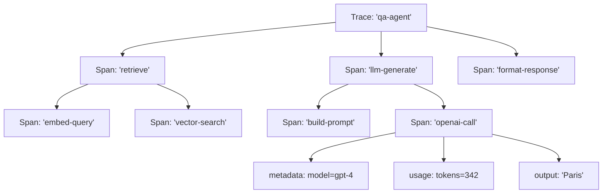
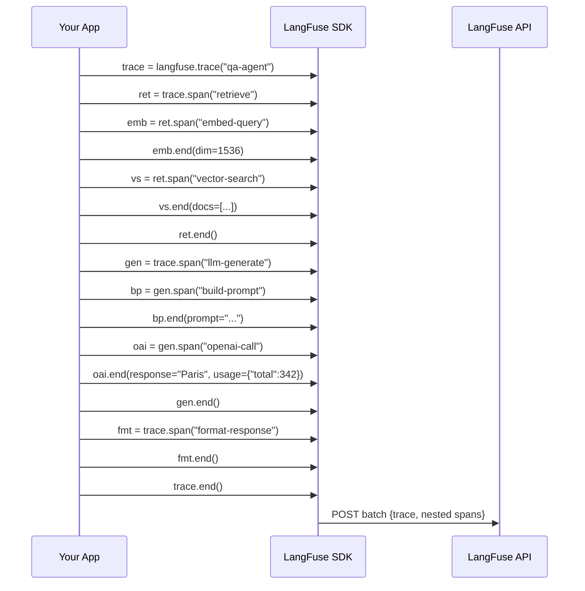
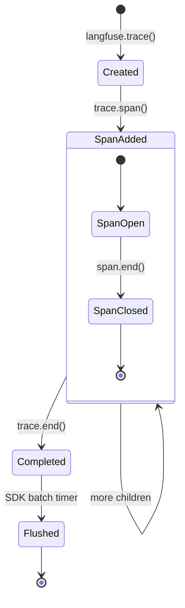

# Tracing LLM Calls and Agent Steps

Tracing is the core of LangFuse's observability. Every LLM call, retrieval step, tool invocation, or agent decision can be captured as a structured span inside a trace. This lesson shows how to build rich, nested trace trees and how to instrument LangChain and LlamaIndex pipelines.

---

## Creating Spans and Traces

Every trace starts with `langfuse.trace()`. Inside it, you create spans for each logical step:

```python
from langfuse import Langfuse

langfuse = Langfuse()

trace = langfuse.trace(
    name="qa-agent",
    input={"question": "What is the capital of France?"},
    user_id="user_42",
    session_id="sess_001"
)
```

Spans can be nested arbitrarily deep:

```python
# Root-level span (e.g. "retrieve documents")
retrieval = trace.span(name="retrieve")

# Child span (e.g. "embed query")
embed = retrieval.span(name="embed-query")
embed.end(
    input={"query": "capital of France"},
    output={"embedding_dim": 1536}
)

# Another child span (e.g. "vector search")
search = retrieval.span(name="vector-search")
search.end(
    input={"top_k": 5},
    output={"results": ["doc1", "doc3", "doc7"]}
)

retrieval.end()
```

> [!NOTE]
> A **trace** represents a complete end-to-end request (one user query). A **span** represents a single operation within that request. Multiple spans form a tree hierarchy. The root span of a trace is its first span; all others are children of some parent span.

> [!WARNING]
> Always call `.end()` on a span when the operation finishes. Orphaned spans (missing `.end()`) will remain "open" in the LangFuse dashboard and skew latency metrics. Use the context manager pattern (`with trace.span() as s:`) to guarantee closure.

---

## Trace Hierarchy (ASCII Diagram)



Each span can hold its own `input`, `output`, `metadata`, `usage`, and `level` (DEBUG, WARNING, ERROR).

### Nested Span Hierarchy (Sequence)

The following sequence diagram shows how a multi-step agent creates a nested span structure:



### Trace Lifecycle



---

## Adding Metadata and Scores

```python
# Adding metadata to a span
span = trace.span(
    name="llm-call",
    metadata={
        "model": "gpt-4",
        "temperature": 0.7,
        "max_tokens": 500
    }
)

# Adding a score after the span ends
trace.score(
    name="helpfulness",
    value=0.85,
    comment="Good answer, but could be shorter"
)

# Score types: NUMERIC, BOOLEAN, CATEGORICAL
trace.score(name="toxicity", value=False, data_type="BOOLEAN")
trace.score(name="difficulty", value="medium", data_type="CATEGORICAL")
```

> [!WARNING]
> Scores are attached to a trace or span **after** the fact. They do not block execution. Make sure you have a reference to the trace/span object (or its ID) so you can score it later.

> [!TIP]
> Use metadata to tag spans with business context: `environment`, `region`, `model_version`, `prompt_template_name`, `user_tier`. These fields become filterable dimensions in dashboards. Consistent tagging across all spans enables powerful cross-filtering.

### Score Data Types

| Data Type | Python Example | Dashboard Display | Use Case |
|---|---|---|---|
| NUMERIC | `value=0.85` | Histogram, avg/min/max | Correctness, helpfulness, relevance |
| BOOLEAN | `value=True` | Pass/fail rate, pie chart | Toxicity, safety checks, guardrails |
| CATEGORICAL | `value="medium"` | Bar chart, distribution | Difficulty, priority, intent class |

---

## Tracing LangChain Runs

LangFuse provides a LangChain callback handler that auto-instruments chains:

```python
from langfuse.callback import CallbackHandler
from langchain_openai import ChatOpenAI
from langchain_core.prompts import ChatPromptTemplate

# Create the handler (one per project)
langfuse_handler = CallbackHandler()

prompt = ChatPromptTemplate.from_template("Tell me a short {topic} joke")
model = ChatOpenAI(model="gpt-4")
chain = prompt | model

# The handler hooks into every step automatically
result = chain.invoke({"topic": "programming"}, config={"callbacks": [langfuse_handler]})
```

Each LangChain step (prompt template, LLM call, parser, retriever) becomes a separate span inside a single trace.

### Advanced: LangChain Agent with Tools

```python
from langfuse.callback import CallbackHandler
from langchain.agents import create_openai_functions_agent, AgentExecutor
from langchain.tools import tool
from langchain_openai import ChatOpenAI

langfuse_handler = CallbackHandler()

@tool
def get_weather(city: str) -> str:
    """Get the current weather for a city."""
    return f"Sunny, 22°C in {city}"

@tool
def calculate(expression: str) -> str:
    """Evaluate a mathematical expression."""
    return str(eval(expression))

llm = ChatOpenAI(model="gpt-4")
agent = create_openai_functions_agent(llm, [get_weather, calculate])
executor = AgentExecutor(agent=agent, tools=[get_weather, calculate])

# Every tool call, LLM invocation, and agent decision is traced
result = executor.invoke(
    {"input": "What is the weather in Paris plus 5?"},
    config={"callbacks": [langfuse_handler]}
)
```

Each tool invocation appears as a separate child span, and the agent's reasoning loop creates a trace tree that shows the full decision path.

---

## Tracing LlamaIndex Pipelines

```python
from langfuse.llama_index import LlamaIndexCallbackHandler
from llama_index.core import VectorStoreIndex, SimpleDirectoryReader

# Initialize handler
handler = LlamaIndexCallbackHandler()

documents = SimpleDirectoryReader("./data").load_data()
index = VectorStoreIndex.from_documents(documents)

query_engine = index.as_query_engine()
response = query_engine.query("What is LangFuse?")

# Flush traces
handler.flush()
```

---

## Custom Instrumentation with Decorators

For maximum control, use the `@observe()` decorator:

```python
from langfuse.decorators import observe

@observe()
def fetch_weather(city: str) -> str:
    """This function is traced automatically."""
    response = call_weather_api(city)
    return response

@observe(as_type="generation")
def call_llm(prompt: str, model: str = "gpt-4") -> str:
    """Mark this span as a 'generation' (LLM call)."""
    ...
```

> [!WARNING]
> The `@observe` decorator works with **any** Python function, not just LLM calls. Use the `as_type` parameter to distinguish generations (LLM calls) from regular spans.

### Advanced: Custom Instrumentation with Trace Grouping

Group related traces under a single session for comprehensive multi-turn conversations:

```python
# trace_grouping.py
from langfuse import Langfuse
from langfuse.decorators import observe

langfuse = Langfuse()

@observe()
def process_message(session_id: str, message: str, turn_number: int) -> str:
    """Process a single message in a multi-turn conversation."""

    # Fetch context (child span)
    context = retrieve_context(message)

    # LLM call (child span, marked as generation)
    response = generate_response(message, context)

    # Score the response
    trace = langfuse.current_trace()
    if trace:
        trace.score(name="coherence", value=0.9, data_type="NUMERIC")
        trace.update(session_id=session_id)

    return response

@observe(as_type="generation")
def generate_response(message: str, context: str) -> str:
    """Call the LLM with context. Marked as a generation span."""
    # ... LLM call ...
    return "Paris is the capital of France."

# Simulate a multi-turn conversation
session_1 = "sess_conversation_001"
for i, msg in enumerate(["Hi!", "What is the capital of France?"]):
    process_message(session_1, msg, i + 1)

langfuse.flush()
```

> [!TIP]
> When tracing agent loops, set `session_id` on every trace so the LangFuse dashboard groups all turns of a conversation. You can then filter by session to replay the entire agent trajectory.

---

## Comparison: Instrumentation Approaches

| Approach | Effort | Granularity | Auto-scoping | Best for |
|---|---|---|---|---|
| Manual spans | High | Full control | Manual | Custom pipelines, research |
| LangChain CallbackHandler | Low | Per-chain-step | Automatic | LangChain apps |
| LlamaIndex CallbackHandler | Low | Per-index-step | Automatic | LlamaIndex apps |
| `@observe` decorator | Medium | Per-function | Wraps function | Any Python code |

### Span Configuration Options

When creating a span, the following parameters are available:

```python
span = trace.span(
    name="my-span",             # Required: human-readable name
    input={"key": "value"},     # Optional: input data for debugging
    output={"result": "ok"},    # Optional: output data
    metadata={"env": "prod"},   # Optional: key-value metadata
    start_time=datetime.now(),  # Optional: custom start time
    level="DEFAULT",            # Optional: DEFAULT, DEBUG, WARNING, ERROR
    version="1.0"               # Optional: span version identifier
)

# Update span before ending
span.update(input={"new": "data"}, metadata={"retry": 1})

# End with output and usage
span.end(
    output={"response": "Hello"},
    usage={"prompt_tokens": 10, "completion_tokens": 5, "total": 15},
    model="gpt-4"
)
```

### Span Types Overview

| Span Type | `name` Convention | Recommended Metadata | Usage Tracking |
|---|---|---|---|
| **LLM Generation** | `llm-call`, `openai-completion`, `anthropic-generate` | `model`, `temperature`, `max_tokens`, `provider` | `prompt_tokens`, `completion_tokens`, `total` |
| **Retrieval** | `vector-search`, `embed-query`, `bm25-search` | `top_k`, `index_name`, `embedding_model` | Usually none |
| **Tool Execution** | `get_weather`, `calculate`, `search_web` | `tool_name`, `tool_input` | Usually none |
| **Logic / Routing** | `classify-intent`, `guardrail-check`, `format-response` | `decision`, `confidence` | Usually none |
| **Error Handler** | `error-handling`, `fallback` | `error_type`, `retry_count` | Usually none |

---

## Interactive Questions

```question
{
  "id": "lf-2-q1",
  "type": "multiple-choice",
  "question": "An agent makes 3 tool calls in sequence. Each tool call should appear as a separate span while sharing the same parent trace. How do you structure this?",
  "options": [
    "Create 3 separate traces with langfuse.trace()",
    "Create 1 trace, then call trace.span() for each tool call",
    "Use 3 different callback handlers",
    "Use @observe() on each tool function without a parent trace"
  ],
  "correct": 1,
  "explanation": "One trace represents the entire request. Each tool call becomes a child span via trace.span(). This keeps all operations under a single trace for end-to-end visibility."
}
```

```question
{
  "id": "lf-2-q2",
  "type": "multiple-choice",
  "question": "Which LangFuse class automatically instruments LangChain chains without manual span creation?",
  "options": [
    "LangFuseCallback",
    "CallbackHandler",
    "ChainObserver",
    "LangChainTracer"
  ],
  "correct": 1,
  "explanation": "langfuse.callback.CallbackHandler hooks into LangChain's callback system and creates spans automatically for every chain step."
}
```

```question
{
  "id": "lf-2-q3",
  "type": "multiple-choice",
  "question": "What does the @observe() decorator do when applied to a Python function?",
  "options": [
    "It caches the function output for reuse",
    "It logs the function parameters to a local file",
    "It automatically traces each call as a span in LangFuse",
    "It validates the function arguments against a schema"
  ],
  "correct": 2,
  "explanation": "The @observe() decorator from langfuse.decorators wraps the function and creates a LangFuse span for each invocation automatically."
}
```

```question
{
  "id": "lf-2-q4",
  "type": "multiple-choice",
  "question": "After a trace has been created, how do you attach a score to it?",
  "options": [
    "Pass the score as a parameter to langfuse.trace()",
    "Call trace.score(name='helpfulness', value=0.85)",
    "Include the score in the span metadata dictionary",
    "Scores are attached automatically by the SDK"
  ],
  "correct": 1,
  "explanation": "trace.score() is called on the trace or span object after the operation completes. Scores can be NUMERIC, BOOLEAN, or CATEGORICAL."
}
```

```question
{
  "id": "lf-2-q5",
  "type": "multiple-choice",
  "question": "You notice a span stays 'open' in the LangFuse dashboard for hours. What is the most likely cause?",
  "options": [
    "The trace has too many nested spans",
    "The SDK buffer has not been flushed yet",
    "span.end() was never called on that span",
    "The LangFuse server is rate-limiting your project"
  ],
  "correct": 2,
  "explanation": "An open span means .end() was not called. Use the context manager pattern (with trace.span() as s:) to automatically close spans on scope exit."
}
```

---

> [!SUCCESS]
> **Key Takeaways**
> - A trace wraps an entire request; spans capture individual operations in a tree structure.
> - Always call `.end()` on spans, or use context managers for automatic closure.
> - Metadata and tags make spans filterable in the dashboard — be consistent with key names.
> - LangChain and LlamaIndex callbacks provide zero-effort instrumentation.
> - The `@observe()` decorator gives fine-grained control over custom Python code.
> - Use `session_id` to group multi-turn conversations and agent trajectories.
