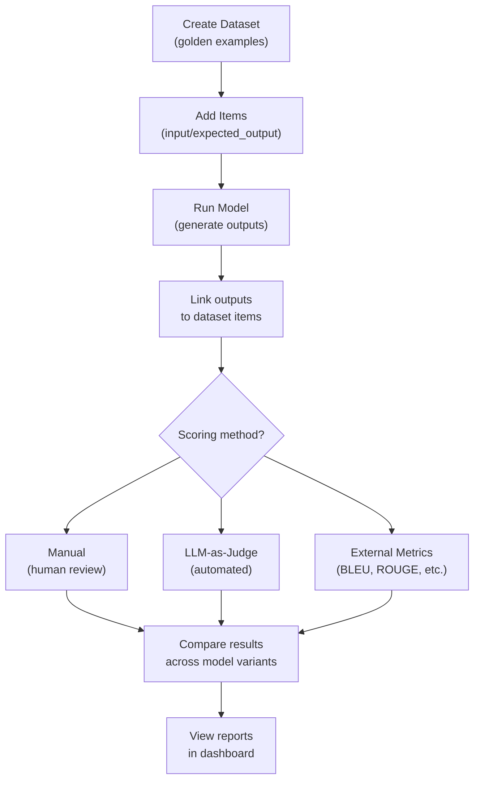
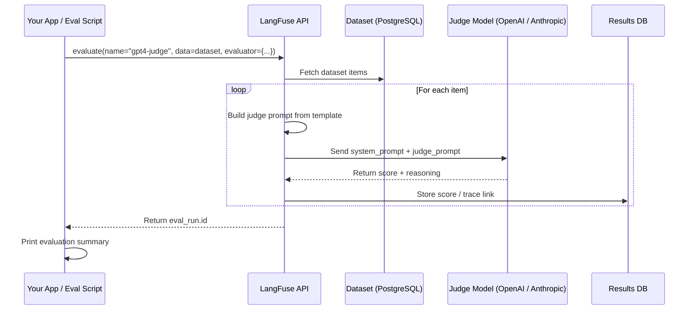
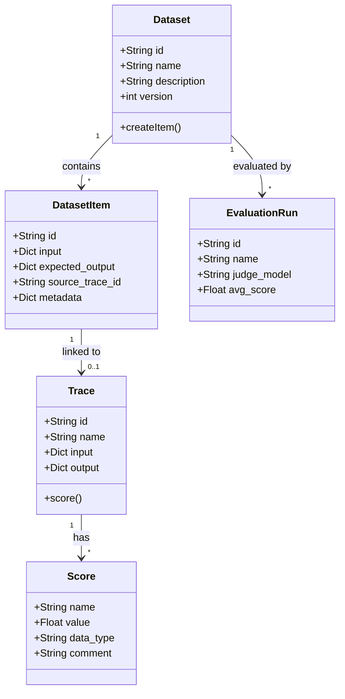

# Evaluations, Datasets and LLM-as-Judge Scoring

Evaluation is essential to building reliable LLM applications. LangFuse provides three complementary evaluation methods: manual scoring, LLM-as-judge, and external metric computation. This lesson walks through each approach and shows how to structure datasets, run evaluations, and compare model outputs.

---

## Creating Datasets

Datasets hold expected input-output pairs (golden examples). They serve as the ground truth for evaluation runs.

```python
from langfuse import Langfuse

langfuse = Langfuse()

# Create a dataset
dataset = langfuse.create_dataset(
    name="qa-correctness",
    description="Factual Q&A correctness test set"
)

# Add items (input + expected output)
dataset.create_item(
    input={"question": "What is the capital of France?"},
    expected_output="Paris"
)

dataset.create_item(
    input={"question": "What year did the Berlin Wall fall?"},
    expected_output="1989"
)
```

> [!WARNING]
> Dataset items are **immutable** once created. To update a test case, create a new dataset version or add a new item with a different ID.

> [!IMPORTANT]
> Dataset versioning follows a linear model. When you modify a dataset (add/remove items), LangFuse creates a new version. Traces linked to older dataset versions still reference the original items. This ensures that historical evaluation results remain reproducible even as your test set evolves.

### Creating Datasets from Existing Traces

You can also create datasets by selecting existing traces from the UI. Click **Create Dataset from Traces**, select the traces that represent good examples, and LangFuse extracts the input-output pairs automatically.

```python
# dataset_from_traces.py
# Programmatic approach: link existing trace IDs to a new dataset
langfuse = Langfuse()

dataset = langfuse.create_dataset(
    name="production-examples",
    description="Curated good examples from production"
)

trace_ids = ["trace_abc123", "trace_def456", "trace_ghi789"]
for tid in trace_ids:
    trace = langfuse.fetch_trace(tid)
    if trace:
        dataset.create_item(
            input=trace.input,
            expected_output=trace.output,
            source_trace_id=tid
        )
```

### Evaluation Pipeline (Flowchart)

The following diagram shows the end-to-end evaluation pipeline:



---

## Manual Evaluation Scoring

After generating traces, you can attach human scores:

```python
trace = langfuse.trace(name="eval-test", input="...")

# Later, after reviewing the output
trace.score(
    name="correctness",
    value=0.9,            # Numeric: 0.0 to 1.0
    comment="Correct, well-structured answer"
)

trace.score(
    name="toxicity",
    value=False,          # Boolean
    data_type="BOOLEAN"
)
```

### Custom Scoring Functions

For automated but rule-based scoring, write your own scoring functions:

```python
# custom_scoring.py
from langfuse import Langfuse

langfuse = Langfuse()

def score_factual_correctness(expected: str, actual: str) -> float:
    """Simple keyword overlap scoring for factual correctness."""
    expected_words = set(expected.lower().split())
    actual_words = set(actual.lower().split())
    if not expected_words:
        return 0.0
    overlap = len(expected_words & actual_words)
    return round(overlap / len(expected_words), 2)

def score_length_compliance(expected_max_words: int, actual: str) -> bool:
    """Boolean score: is the response within the expected word limit?"""
    return len(actual.split()) <= expected_max_words

dataset = langfuse.get_dataset("qa-correctness")

for item in dataset.items:
    # Simulate model output
    model_output = "Paris"

    trace = langfuse.trace(
        name="custom-scoring",
        input=item.input,
        output=model_output
    )

    # Apply custom scoring
    correctness = score_factual_correctness(
        item.expected_output["text"], model_output
    )
    trace.score(name="accuracy", value=correctness, data_type="NUMERIC")

    length_ok = score_length_compliance(
        item.metadata.get("max_words", 100), model_output
    )
    trace.score(name="concise", value=length_ok, data_type="BOOLEAN")

langfuse.flush()
```

> [!TIP]
> Design your evaluation criteria before writing a single line of code. For each output dimension (correctness, tone, safety, format), decide:
> 1. What constitutes a passing score?
> 2. Is it numeric (0-1), boolean (pass/fail), or categorical (good/fair/poor)?
> 3. Can it be automated, or does it require human judgment?
> 4. What inter-rater reliability do you expect for human assessments?

---

## LLM-as-Judge Evaluation

LangFuse can use an LLM to judge your outputs automatically. This requires a configured model (e.g. GPT-4) within the LangFuse UI or via SDK.

```python
from langfuse import Langfuse

langfuse = Langfuse()

# Run an LLM-as-judge evaluation
eval_run = langfuse.evaluate(
    name="gpt4-judge-correctness",
    data=dataset,                               # Dataset from above
    evaluator={
        "model": "gpt-4",                       # Judge model
        "system_prompt": (
            "You evaluate factuality. Score 0-1 based on correctness. "
            "Be strict: partial errors reduce score."
        ),
        "template": (
            "Question: {input}\n"
            "Expected: {expected_output}\n"
            "Actual: {output}\n"
            "Score: "
        ),
        "mapping": {"output": "output"},
    }
)

print("Evaluation run ID:", eval_run.id)
```

The judge model compares the actual output against the expected output and returns a score.

### LLM-as-Judge Sequence



---

## Running Evaluations on Model Variants

Compare two model versions on the same dataset:

```python
# Evaluate GPT-4 responses
results_gpt4 = langfuse.evaluate(
    name="eval-gpt4",
    data=dataset,
    evaluator={"model": "gpt-4", ...}
)

# Evaluate Claude responses (you must have generated traces for Claude first)
results_claude = langfuse.evaluate(
    name="eval-claude",
    data=dataset,
    evaluator={"model": "gpt-4", ...}  # Same judge for both
)
```

LangFuse lets you overlay results from different runs to compare scores side by side.

---

## Automated Evaluation Pipelines

For CI/CD integration, automate evaluation with a script:

```python
# run_eval_pipeline.py
from langfuse import Langfuse
from langfuse.decorators import observe

langfuse = Langfuse()

dataset = langfuse.get_dataset("qa-correctness")

for item in dataset.items:
    # Run your model
    response = your_model.invoke(item.input["question"])

    # Create a trace linked to this dataset item
    trace = langfuse.trace(
        name="pipeline-eval",
        input=item.input,
        output=response
    )

    # Score manually or call LLM judge
    trace.score(name="correctness", value=score_response(response, item.expected_output))

langfuse.flush()
```

> [!WARNING]
> Always call `langfuse.flush()` at the end of a batch script to ensure all traces and scores are sent before the process exits.

### Evaluation Strategy Decision Matrix

| Factor | Manual | LLM-as-Judge | External Metric |
|---|---|---|---|
| **Team maturity** | Any stage | Requires prompt engineering skill | Requires NLP expertise |
| **Scale tolerance** | < 100 samples/iteration | > 1000 samples/iteration | Any scale (computational) |
| **Subjectivity tolerance** | High (human can nuance) | Low (model may miss nuance) | None (deterministic) |
| **Cost per 1000 evals** | ~20-40 person-hours | ~$0.50-$5.00 | ~$0.01 in compute |
| **Iteration speed** | 1-2 days | 5-30 minutes | 1-5 minutes |
| **Gold standard** | Human judgment | GPT-4o best for factuality | BLEU/ROUGE for text similarity |
| **CI/CD suitability** | Poor (slow) | Excellent | Excellent |

### Running Batch Evaluations with Progress Tracking

```python
# batch_eval.py
from langfuse import Langfuse

langfuse = Langfuse()

dataset = langfuse.get_dataset("qa-correctness")
items = list(dataset.items)
total = len(items)
print(f"Running evaluation on {total} items...")

for idx, item in enumerate(items, 1):
    try:
        # Simulate model inference
        output = your_model.generate(item.input["question"])

        trace = langfuse.trace(
            name="batch-eval",
            session_id=f"batch-{dataset.name}-v{dataset.version}",
            input=item.input,
            metadata={"batch_item": idx, "dataset_version": dataset.version}
        )

        # Attach scores
        trace.score(name="correctness", value=compute_score(output, item.expected_output))
        trace.end(output=output)

        print(f"  [{idx}/{total}] Processed: {item.id}")

    except Exception as e:
        print(f"  [{idx}/{total}] FAILED: {item.id} - {e}")

    # Flush every 10 items to avoid losing data on crash
    if idx % 10 == 0:
        langfuse.flush()

# Final flush
langfuse.flush()
print("Batch evaluation complete.")
```

---

## Comparison: Evaluation Methods

| Method | Automation | Cost | Consistency | Best for |
|---|---|---|---|---|
| Manual scoring | Low (human reviews) | Free (human time) | Low (subjective) | Exploratory, qualitative |
| LLM-as-judge | High | Per-judge-model token cost | Medium (depends on judge) | Large-scale, factual tasks |
| External metrics (BLEU, ROUGE, etc.) | High | Free (computation) | High | Translation, summarization |

### Detailed Comparison: LLM-as-Judge Configurations

| Judge Model | Cost per 1K evals | Typical Quality | Latency per eval | Notes |
|---|---|---|---|---|
| GPT-4o | ~$3-5 | Excellent | 2-5s | Best for nuanced scoring |
| GPT-4o-mini | ~$0.5-1 | Good | 1-2s | Good balance for most tasks |
| Claude 3.5 Sonnet | ~$3-4 | Excellent | 2-4s | Strong on safety/copyright |
| Llama 3 (self-hosted) | ~$0.10 (compute) | Good-Variable | 3-10s | Requires GPU, full data privacy |
| Custom fine-tuned judge | Variable | Targeted | Variable | Best for domain-specific criteria |

### When to Use Each Evaluation Method

| Scenario | Recommended Method | Why |
|---|---|---|
| Prototyping a new feature | Manual scoring | Quick iterating, building intuition |
| Regression testing before release | LLM-as-judge | Scalable, reproducible, objective |
| Comparing LLM A vs LLM B | LLM-as-judge + same dataset | Controlled comparison, same judge |
| Translation quality assessment | BLEU / chrF | Well-established NLP metrics |
| Content safety filtering | LLM-as-judge + BOOLEAN scores | Nuanced safety decisions need LLM reasoning |
| CI/CD gate validation | LLM-as-judge + threshold | Automated pass/fail before merge |

---

### Evaluation Data Model

The following class diagram shows the relationships between datasets, items, traces, and scores:



---

## Interactive Questions

```question
{
  "id": "lf-3-q1",
  "type": "multiple-choice",
  "question": "What is the purpose of a dataset in LangFuse evaluation workflows?",
  "options": [
    "To store training data for fine-tuning models",
    "To hold golden input-output pairs used as ground truth for evaluation",
    "To cache LLM responses for faster inference",
    "To define alert thresholds for monitoring"
  ],
  "correct": 1,
  "explanation": "A dataset in LangFuse contains golden (ground truth) input-output pairs against which model outputs are compared during evaluation."
}
```

```question
{
  "id": "lf-3-q2",
  "type": "multiple-choice",
  "question": "Which method creates a dataset and populates it with test cases?",
  "options": [
    "langfuse.create_dataset() then dataset.create_item()",
    "langfuse.new_test_set() then test_set.add_case()",
    "dataset = Dataset(name='...') then dataset.add()",
    "langfuse.upload_csv('dataset.csv')"
  ],
  "correct": 0,
  "explanation": "langfuse.create_dataset() creates the container, then dataset.create_item() adds individual input-output pairs."
}
```

```question
{
  "id": "lf-3-q3",
  "type": "multiple-choice",
  "question": "In an LLM-as-judge evaluation, what does the judge model compare to produce a score?",
  "options": [
    "The user's input prompt against the system prompt",
    "The actual output against the expected output",
    "The token usage of two different models",
    "The latency of the application against a service-level objective"
  ],
  "correct": 1,
  "explanation": "The judge compares the actual model output against the expected_output from the dataset item, guided by the system_prompt and template."
}
```

```question
{
  "id": "lf-3-q4",
  "type": "multiple-choice",
  "question": "Why should you call langfuse.flush() at the end of a batch evaluation script?",
  "options": [
    "To reset the dataset for the next evaluation run",
    "To clear the local cache of prompts",
    "To ensure all pending traces and scores are sent before the process exits",
    "To delete old traces from the server"
  ],
  "correct": 2,
  "explanation": "flush() forces the SDK buffer to send all queued traces and scores. Without it, data may be lost when the process exits."
}
```

```question
{
  "id": "lf-3-q5",
  "type": "multiple-choice",
  "question": "Your team wants to add an automated evaluation step to the CI/CD pipeline that blocks deploys if correctness drops below 80%. Which approach should you use?",
  "options": [
    "Manual scoring by the QA team after each deploy",
    "LLM-as-judge evaluation with a pass/fail threshold on the gpt4-judge-correctness run",
    "External BLEU score, which measures translation quality",
    "Set up a LangFuse alert that emails the team when correctness is low"
  ],
  "correct": 1,
  "explanation": "LLM-as-judge provides automated, scalable scoring. Script the evaluate() call in CI/CD, compare average score against 0.8 threshold, and fail the pipeline if below."
}
```

---

> [!SUCCESS]
> **Key Takeaways**
> - Datasets store golden input-output pairs used as ground truth for evaluation.
> - Three evaluation methods: manual scoring, LLM-as-judge, and external metrics.
> - LLM-as-judge uses a configured model (e.g. GPT-4) to score outputs automatically.
> - Compare model variants by running separate evaluations on the same dataset.
> - Always call `langfuse.flush()` at the end of batch evaluation scripts.
> - Design your scoring criteria upfront and choose the right judge model for each dimension.
