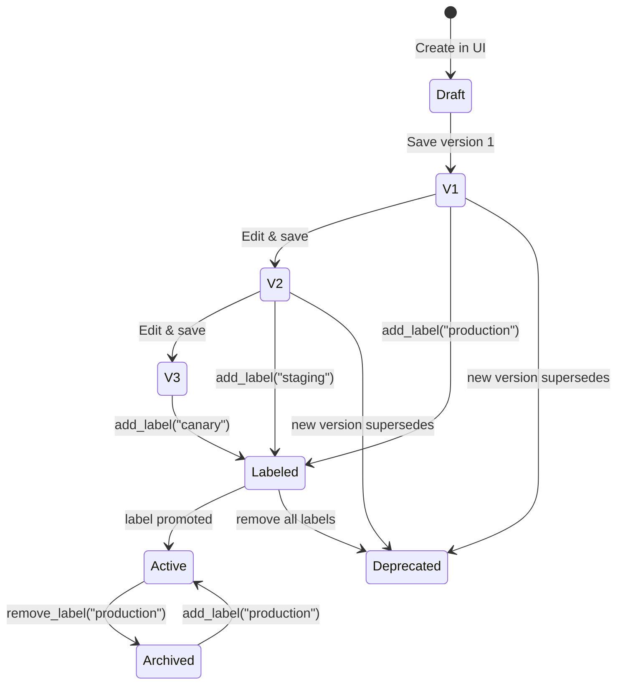
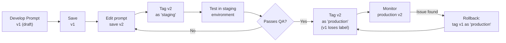
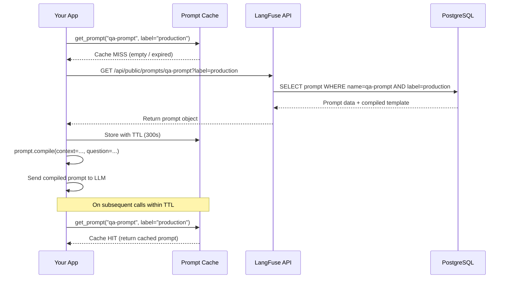

# Prompt Management and Version Control

Prompt engineering is iterative. LangFuse provides a centralised prompt registry with version control, deployment labels, and SDK-based fetching — so your prompts are always in sync across environments.

---

## Creating Prompts in the LangFuse UI

1. Navigate to **Prompts** in the LangFuse UI.
2. Click **New Prompt**.
3. Give it a name (e.g. `qa-system-prompt`).
4. Write the prompt content. Use `{{variable}}` for placeholders.

```
You are a helpful assistant. Answer the question based on context.

Context:
{{context}}

Question:
{{question}}

Answer concisely in {{language}}.
```

5. Save as **version 1**.

---

## Prompt Versioning

Every time you edit and save a prompt, LangFuse increments the version number. You can:

- View the full version history.
- Compare any two versions side-by-side.
- Roll back to a previous version.

```python
# List versions of a prompt
prompt = langfuse.get_prompt("qa-system-prompt")
print("Current version:", prompt.version)
print("Labels:", prompt.labels)  # e.g. ["production", "staging"]
```

> [!WARNING]
> Prompt versions are **immutable**. You cannot edit a saved version. Always create a new version and promote it to production when ready.

### Prompt Version Lifecycle



Versions are append-only. Once saved, a version's content never changes. Labels move between versions to indicate which one is active in each environment.

---

## Deploying Versions with Labels

Labels let you promote a specific version to an environment:

| Label | Purpose |
|---|---|
| `production` | Active prompt used in production |
| `staging` | Pre-release version for testing |
| `development` | Latest work-in-progress |
| Custom label | Any label (e.g. `canary`, `us_east`, `ab_test_a`) |

You can set labels via the UI or SDK:

```python
# Promote version 3 to production
prompt = langfuse.get_prompt("qa-system-prompt", version=3)
prompt.add_label("production")
```

### Deployment Workflow



> [!TIP]
> Use environment variables to determine which label your application fetches at runtime. This lets you deploy the same application code to multiple environments while each environment uses its own prompt version.

---

## Fetching Prompts via SDK

Your application fetches the prompt at runtime:

```python
from langfuse import Langfuse

langfuse = Langfuse()

# Fetch the production version
prompt = langfuse.get_prompt("qa-system-prompt", label="production")

# The raw prompt text with compiled variables
system_message = prompt.compile(
    context="LangFuse is an LLM observability tool.",
    question="What does LangFuse do?",
    language="English"
)

print(system_message)
# Output:
# You are a helpful assistant. Answer the question based on context.
# ...
```

> [!WARNING]
> If the prompt or label does not exist, `get_prompt()` raises a `LangFuseNotFoundError`. Always handle this exception in production code.

### Fetching with Caching

For production use, cache the fetched prompt to reduce network calls:

```python
# cached_prompt.py
from functools import lru_cache
from langfuse import Langfuse
from langfuse.api.core import ApiError

langfuse = Langfuse()

class PromptManager:
    """Cached prompt fetcher with TTL."""
    def __init__(self, ttl_seconds: int = 300):
        self._cache = {}
        self._ttl = ttl_seconds

    def get_prompt(self, name: str, label: str = "production"):
        cache_key = f"{name}:{label}"
        if cache_key in self._cache:
            entry = self._cache[cache_key]
            if entry["expires_at"] > time.time():
                return entry["prompt"]

        prompt = langfuse.get_prompt(name, label=label)
        self._cache[cache_key] = {
            "prompt": prompt,
            "expires_at": time.time() + self._ttl
        }
        return prompt

manager = PromptManager(ttl_seconds=300)
prompt = manager.get_prompt("qa-system-prompt", label="production")
compiled = prompt.compile(
    context="...",
    question="...",
    language="English"
)
```

> [!TIP]
> Cache prompts with a 5-minute TTL in production. This reduces API calls while keeping prompt updates within a reasonable window. If you need zero-delay updates, set a shorter TTL or use LangFuse webhooks to invalidate the cache.

---

## Prompt Templates with Variables

LangFuse uses `{{variable}}` syntax (Handlebars-style) for template variables. Variables are injected at runtime via `prompt.compile(**kwargs)`.

```python
# In the UI: "Summarize this {{text}} in {{max_words}} words."
prompt = langfuse.get_prompt("summarizer", label="production")

compiled = prompt.compile(
    text="Long article content here...",
    max_words="50"
)
```

You can also set default values in the UI so variables are optional.

### Template Variable Validation

Validate that all required variables are provided before calling the LLM:

```python
# validate_variables.py
import re
from langfuse import Langfuse

langfuse = Langfuse()

def validate_prompt_variables(prompt, **kwargs):
    """Check that all required template variables are provided."""
    # Extract {{variable}} patterns from the compiled prompt source
    template_vars = set(re.findall(r'\{\{(\w+)\}\}', prompt.prompt))

    provided = set(kwargs.keys())
    missing = template_vars - provided

    if missing:
        raise ValueError(
            f"Missing template variables: {', '.join(sorted(missing))}. "
            f"Provided: {', '.join(sorted(provided))}"
        )

    # Check for unused variables (typo prevention)
    extra = provided - template_vars
    if extra:
        print(f"Warning: unused variables provided: {', '.join(sorted(extra))}")

    return True

prompt = langfuse.get_prompt("qa-system-prompt", label="production")

# This will pass
validate_prompt_variables(prompt, context="...", question="...", language="English")

# This will raise ValueError: missing 'language'
validate_prompt_variables(prompt, context="...", question="...")
```

---

## Production vs Staging Prompts

A common workflow:

```
Version 1 ──→ label: production
Version 2 ──→ label: staging

While v2 is tested in staging, v1 remains active in production.
Once v2 is validated, promote it:
  v2.add_label("production")   # v1 loses "production" if v2 takes over
  v1.remove_label("production")
```

```python
# Staging environment fetches the staging prompt
if os.environ.get("ENV") == "staging":
    prompt = langfuse.get_prompt("qa-system-prompt", label="staging")
else:
    prompt = langfuse.get_prompt("qa-system-prompt", label="production")
```

### Creating Prompt Variants for A/B Testing

Test two prompt versions simultaneously on different user segments:

```python
# ab_test_prompts.py
from langfuse import Langfuse
import random

langfuse = Langfuse()

def get_prompt_for_user(user_id: str) -> str:
    """Assign variant A or B based on user ID hash."""
    variant = "A" if hash(user_id) % 2 == 0 else "B"
    label = f"ab_test_{variant}"

    prompt = langfuse.get_prompt("qa-system-prompt", label=label)
    return prompt, variant

# Usage in your application
user_id = "user_12345"
prompt, variant = get_prompt_for_user(user_id)

compiled = prompt.compile(
    context="LangFuse is an observability tool.",
    question="What does LangFuse do?",
    language="English"
)

# Tag the trace with the variant for later analysis
trace = langfuse.trace(
    name="qa-answer",
    user_id=user_id,
    metadata={"prompt_variant": variant}
)
# Pass compiled prompt to your LLM...
```

This approach lets you gradually roll out prompt changes to a subset of users and compare results using LangFuse dashboards filtered by `prompt_variant`.

---

## Comparison: Prompt Management Approaches

| Feature | LangFuse Prompts | Hardcoded strings | External YAML/JSON | Dedicated prompt tools |
|---|---|---|---|---|
| Version history | ✅ Built-in | ❌ | Manual | ✅ |
| Deployment labels | ✅ | ❌ | ❌ | Varies |
| Runtime fetch | ✅ SDK | ❌ | Manual load | ✅ |
| Template variables | ✅ | ✅ (f-strings) | ✅ | ✅ |
| Rollback | ✅ One click | ❌ | Git revert | Varies |
| Audit trail | ✅ | ❌ | Git history | Varies |
| A/B testing | ✅ Via labels | ❌ | Manual | Varies |
| Environment isolation | ✅ Labels | ❌ | Config files | ✅ |

### LangFuse vs Competitor Prompt Management

| Feature | LangFuse | LangSmith Hub | PromptLayer | Helicone |
|---|---|---|---|---|
| Open source | ✅ Yes | ❌ No | ❌ No | ❌ No |
| Self-hostable | ✅ | ❌ | ❌ | Partial |
| Version history | ✅ Linear | ✅ Linear | ✅ Linear | ✅ |
| Label-based deploy | ✅ | ❌ | ✅ | ❌ |
| Template variables | ✅ Handlebars | ✅ f-strings | ✅ Mustache | ✅ f-strings |
| SDK integration | ✅ Python, JS, Go | ✅ Python, JS | ✅ Python, JS | ✅ Python, JS |
| UI prompt editor | ✅ Built-in | ✅ | ✅ | ❌ |

---

### Cache Strategy Comparison

| Strategy | TTL | Latency Impact | Freshness | Best For |
|---|---|---|---|---|
| No cache (fetch every call) | N/A | +100-500ms per call | Immediate | Low-traffic dev/staging |
| In-memory TTL cache | 5-10 min | ~0ms (cached) | ~minutes | Most production apps |
| Redis cluster cache | Configurable | ~1ms | Configurable | High-traffic, multi-replica |
| Webhook cache invalidation | Event-driven | ~0ms (warm cache) | Near-real-time | CI/CD update scenarios |

### Runtime Prompt Fetch Sequence

When your application fetches a prompt at startup and on cache refresh, the following sequence occurs:



---

## Interactive Questions

```question
{
  "id": "lf-4-q1",
  "type": "multiple-choice",
  "question": "Where do you create and manage prompts in LangFuse?",
  "options": [
    "In the Prompts section of the LangFuse UI",
    "Directly in the Python SDK using langfuse.create_prompt()",
    "By editing a YAML file in the project repository",
    "Through the OpenAI API dashboard"
  ],
  "correct": 0,
  "explanation": "Prompts are managed in the Prompts section of the LangFuse web UI. The SDK is used to fetch and compile existing prompts, not to create them."
}
```

```question
{
  "id": "lf-4-q2",
  "type": "multiple-choice",
  "question": "What happens to a prompt version once it has been saved in LangFuse?",
  "options": [
    "It can be freely edited and overwritten at any time",
    "It becomes immutable and requires creating a new version for changes",
    "It is automatically deployed to production",
    "It expires after 30 days unless promoted"
  ],
  "correct": 1,
  "explanation": "Prompt versions are immutable. Each save creates a new version with an incremented number. You cannot modify a saved version's content."
}
```

```question
{
  "id": "lf-4-q3",
  "type": "multiple-choice",
  "question": "Which syntax does LangFuse use for template variables within prompts?",
  "options": [
    "${variable_name}",
    "{{variable_name}}",
    "%variable_name%",
    "{variable_name}"
  ],
  "correct": 1,
  "explanation": "LangFuse uses Handlebars-style {{variable_name}} syntax for template variables."
}
```

```question
{
  "id": "lf-4-q4",
  "type": "multiple-choice",
  "question": "How do you fetch the production version of a prompt in your Python application?",
  "options": [
    "langfuse.get_prompt('prompt-name', label='production')",
    "langfuse.get_production_prompt('prompt-name')",
    "Prompt.load('prompt-name', env='production')",
    "langfuse.prompts['prompt-name']['production']"
  ],
  "correct": 0,
  "explanation": "langfuse.get_prompt() with the label parameter fetches the version tagged with that label. 'production' returns the prompt currently promoted to production."
}
```

```question
{
  "id": "lf-4-q5",
  "type": "multiple-choice",
  "question": "You want to run an A/B test on two prompt variants, serving variant A to 50% of users and variant B to the other 50%. What is the best approach?",
  "options": [
    "Create two separate LangFuse projects, one for each variant",
    "Tag two prompt versions as 'ab_test_A' and 'ab_test_B', hash the user_id to pick one, and tag traces with the variant name",
    "Store both prompts as hardcoded strings and switch with an if/else statement",
    "Use the prompt compile method to randomly fill different templates"
  ],
  "correct": 1,
  "explanation": "Use LangFuse labels for A/B variants. Hash the user_id to deterministically assign a variant. Tag traces with the variant name so you can filter and compare results in the dashboard."
}
```

---

> [!SUCCESS]
> **Key Takeaways**
> - Prompts are created and versioned in the LangFuse UI, not in code.
> - Each saved version is immutable; edit the prompt to create a new version.
> - Labels (production, staging, custom) promote specific versions to environments.
> - Use `langfuse.get_prompt()` with the `label` parameter to fetch prompts at runtime.
> - Template variables use `{{variable}}` syntax and are filled via `prompt.compile()`.
> - Cache prompts in production and always handle `LangFuseNotFoundError`.
> - Labels support advanced workflows: A/B testing, canary deployments, and multi-environment setups.
