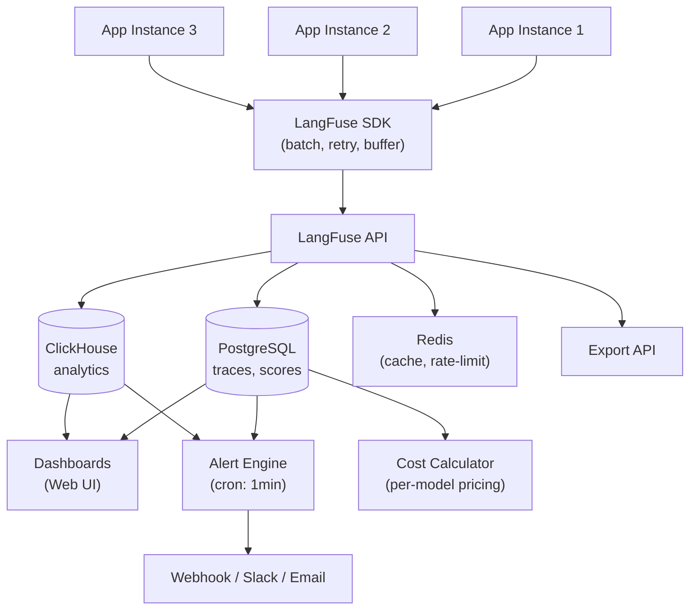
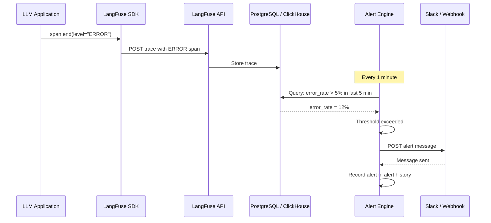
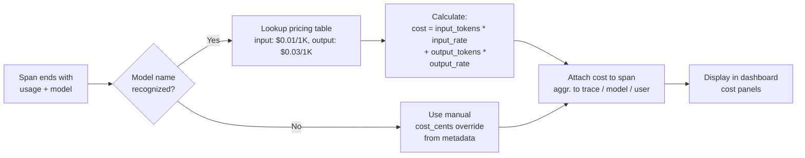

# Observability Dashboards, Alerts and Cost Monitoring

Once you are tracing all LLM calls, the next step is operational visibility. LangFuse provides custom dashboards, alert rules, and cost-tracking features to help you monitor your application in real time.

---

## Custom Dashboards

Dashboards are composed of **panels**. Each panel queries trace data using filters.

Available filter dimensions:

- **Trace / span name**
- **Model** (e.g. `gpt-4`, `claude-3`)
- **User ID** and **Session ID**
- **Tags**
- **Timestamp range**
- **Token count, latency, cost**
- **Score values**

```python
# Traces are already created; dashboards are configured in the UI.
# You can, however, tag traces for easier filtering:

trace = langfuse.trace(
    name="chat-completion",
    tags=["production", "gpt-4", "us-east-1"],
    metadata={"environment": "prod", "region": "us-east-1"}
)
```

> [!WARNING]
> Dashboard panels aggregate data across all traces. If you run a large batch evaluation, those traces will appear in your dashboards. Use tags and date filters to separate evaluation runs from production traffic.

### Dashboard Design Patterns

> [!TIP]
> Follow the **three-tier dashboard** pattern for comprehensive observability:
> 1. **Executive summary** (1-2 panels): Total cost, total requests, error rate. This tells you "is everything OK?" at a glance.
> 2. **Model performance** (3-5 panels): Latency p50/p95/p99 per model, cost per model, token usage trends. Answers "which model is performing best?"
> 3. **User/session deep-dive** (3-5 panels): Top users by cost, top users by latency, session-level traces. Answers "which user/query is causing issues?"
>
> Tags and metadata are the scaffolding that makes this pattern work. Without consistent tagging, you cannot slice data by environment, model, or user.

---

## Monitoring Architecture



The ingestion pipeline scales horizontally: multiple app instances send traces through the SDK, which batches and retries automatically. The API writes to PostgreSQL (for trace detail) and ClickHouse (for dashboard aggregations). The alert engine runs as a scheduled job that queries aggregated metrics against user-defined thresholds.

> [!NOTE]
> Data retention in LangFuse is configurable. In LangFuse Cloud, traces are retained according to your plan (typically 30-90 days). Self-hosted instances can configure retention via PostgreSQL settings. Use the Export API to archive older traces to your own data lake or S3 before they expire.

---

## Filtering and Aggregating Traces

In the **Traces** view you can:

- Search by trace name, user ID, or session ID.
- Filter by time range, score range, token count, or cost.
- Aggregate by model, month, or user to see top consumers.
- Export filtered results as CSV.

Example aggregated query (UI):

```
Filter: model = "gpt-4" AND tags contains "production"
Group by: user_id
Metrics: SUM(prompt_tokens), SUM(completion_tokens), AVG(latency_ms)
```

### Cost Analysis Queries

```python
# cost_analysis.py
from langfuse import Langfuse
from datetime import datetime, timedelta
import pandas as pd

langfuse = Langfuse()

def get_cost_by_model(days: int = 30):
    """Fetch cost breakdown by model for the last N days."""
    traces = langfuse.fetch_traces(
        limit=10000,
        from_timestamp=(datetime.now() - timedelta(days=days)).isoformat()
    )

    rows = []
    for t in traces.data:
        span_cost = 0
        model_name = "unknown"
        # Walk through spans to collect model usage
        if t.spans:
            for span in t.spans:
                if span.usage and span.model:
                    model_name = span.model
                    # LangFuse estimates cost based on model pricing
                    span_cost += span.calculated_cost or 0

        rows.append({
            "trace_id": t.id,
            "model": model_name,
            "cost": span_cost,
            "total_tokens": sum(
                (s.usage.get("total", 0) or 0) for s in (t.spans or [])
                if s.usage
            ),
            "latency_ms": t.latency or 0,
            "timestamp": t.timestamp
        })

    df = pd.DataFrame(rows)
    summary = df.groupby("model").agg({
        "cost": "sum",
        "total_tokens": "sum",
        "trace_id": "count"
    }).rename(columns={"trace_id": "request_count"})
    summary["avg_cost_per_request"] = summary["cost"] / summary["request_count"]
    return summary.sort_values("cost", ascending=False)

cost_report = get_cost_by_model(days=30)
print(cost_report)
```

### Custom Metric Reporting

Report custom business metrics alongside trace data for a unified view:

```python
# custom_metrics.py
from langfuse import Langfuse

langfuse = Langfuse()

def report_business_metric(trace_id: str, metric_name: str, value: float):
    """Attach a custom business metric as a score."""
    trace = langfuse.fetch_trace(trace_id)
    if trace:
        trace.score(
            name=metric_name,
            value=value,
            data_type="NUMERIC",
            comment="Custom business metric"
        )

# Usage: after a customer interaction
trace = langfuse.trace(name="customer-support", user_id="cust_789")
# ... LLM interactions ...

# Report derived metrics
report_business_metric(trace.id, "resolution_time_seconds", 12.5)
report_business_metric(trace.id, "customer_satisfaction", 4.5)

langfuse.flush()
```

These custom scores appear as filterable dimensions in dashboards, letting you correlate business outcomes with model behavior.

---

## Setting Up Alerts

Alerts notify you (via email, Slack, webhook) when a metric crosses a threshold.

| Alert Type | Example Threshold | Action |
|---|---|---|
| Error rate | > 5% in 5 minutes | Slack message |
| Latency p99 | > 10 seconds | Email to on-call |
| Cost per hour | > $50 | Webhook → PagerDuty |
| Token spike | > 1M tokens in 10 min | Slack + email |

Configure alerts in **Settings → Alerts** in the LangFuse UI.

> [!WARNING]
> Alerts check aggregated data and may have a delay of 1–5 minutes. They are not real-time. For sub-minute alerting, use a dedicated APM tool alongside LangFuse.

### Alert Types Comparison

| Type | Metric Source | Delay | Use Case |
|---|---|---|---|
| Error rate | Traces with level=ERROR | ~1-2 min | Catch model crashes, bad response formats |
| Latency threshold | Span duration | ~1-2 min | Detect slow models, prompt engineering regressions |
| Cost threshold | Calculated cost per span | ~2-5 min | Budget control, anomaly detection (unexpected spend) |
| Token count spike | usage.total | ~1-2 min | Prompt injection attacks, runaway loops |
| Score threshold | trace.score() values | ~2-5 min | Quality degradation (correctness < 0.7) |

### Setting Up Webhook Alerts

```python
# webhook_alert_receiver.py
# Example Flask webhook receiver for LangFuse alerts
from flask import Flask, request, jsonify

app = Flask(__name__)

@app.route("/webhook/langfuse-alert", methods=["POST"])
def handle_alert():
    """Receive alert notifications from LangFuse."""
    payload = request.json
    alert_type = payload.get("type")
    metric = payload.get("metric")
    threshold = payload.get("threshold")
    actual_value = payload.get("value")
    trace_url = payload.get("trace_url")

    print(f"ALERT: {alert_type}")
    print(f"  Metric: {metric} (threshold: {threshold}, actual: {actual_value})")
    print(f"  Trace: {trace_url}")

    # Trigger automated remediation
    if metric == "error_rate" and actual_value > threshold:
        print("Triggering automated rollback of latest model deploy...")
        # call_deployment_rollback()

    # Send to PagerDuty
    # send_pagerduty(payload)

    return jsonify({"status": "received"}), 200

if __name__ == "__main__":
    app.run(port=5000)
```

### Alert Configuration Checklist

Configure each alert with the following parameters in the LangFuse UI:

| Parameter | Example | Notes |
|---|---|---|
| **Metric** | `error_rate` | One of: error_rate, latency_p99, cost_per_hour, token_spike, score_value |
| **Filter** | `tags contains "production"` | Limit alerts to specific trace subsets |
| **Threshold type** | `> 5` | Greater than, less than, equal to |
| **Window** | `5 minutes` | Aggregation window (1, 5, 15, 60 min) |
| **Frequency** | `Once per window` | Prevent alert storms |
| **Notification channel** | Slack webhook | Slack, email, PagerDuty, custom webhook |
| **Message template** | `Alert: {metric} is {value} (threshold: {threshold})` | Customizable with placeholders |
| **Auto-resolve** | `Yes` | Auto-close when metric returns below threshold |

### Alert Triggering Sequence



---

### Cost Attribution Flow



---

## Token Usage and Cost Tracking

LangFuse automatically tracks token usage when you pass `usage` to a span. For supported models, it estimates cost based on current pricing.

```python
span.end(
    usage={
        "input": 150,          # prompt_tokens
        "output": 42,          # completion_tokens
        "total": 192,
        "unit": "TOKENS"
    },
    model="gpt-4"
)
```

Cost reporting shows:

- **Cost per trace** (sum of all span costs)
- **Cost per model** (breakdown by model name)
- **Cost per user / session**
- **Projected monthly cost**

> [!IMPORTANT]
> Cost attribution relies on accurate model names. If you pass an unrecognized model name (misspelled or custom), LangFuse cannot calculate costs. Always use the exact model identifier string (e.g. `gpt-4`, `gpt-4-0125-preview`, `claude-3-opus-20240229`) to ensure correct pricing lookup.
>
> For custom or fine-tuned models, you can manually set the cost per span:
> ```python
> span.end(
>     usage={"input": 150, "output": 42, "total": 192, "unit": "TOKENS"},
>     model="my-fine-tuned-model",
>     metadata={"cost_cents": 0.05}  # Manual cost override
> )
> ```

---

## Latency Monitoring

Each span automatically records its duration. Dashboard panels can show:

- Average latency (p50, p95, p99) by model or span name.
- Latency distribution histogram.
- Slowest traces list (sort by duration).

Latency data helps identify bottlenecks — e.g. embedding calls taking longer than generation.

---

## Error Rate Tracking

When a span fails, set its `level` to `ERROR` and include the error message.

```python
try:
    response = model.invoke(prompt)
    span.end(output=response)
except Exception as e:
    span.end(
        level="ERROR",
        metadata={"error": str(e)}
    )
```

The dashboard can then show:

- Error rate over time (line chart).
- Error count by span name (bar chart).
- Trace list filtered to errors only.

---

## Exporting Data

Export trace data for external analysis:

```python
import pandas as pd

# Fetch recent traces via SDK
traces = langfuse.fetch_traces(
    limit=1000,
    from_timestamp="2025-01-01T00:00:00Z"
)

# Convert to pandas DataFrame
df = pd.DataFrame([t.dict() for t in traces.data])
df.to_csv("traces_export.csv", index=False)
```

You can also use the LangFuse API directly (`GET /api/public/traces`) for large exports.

---

## Comparison: Monitoring Features

| Feature | LangFuse | Custom logging | Prometheus/Grafana |
|---|---|---|---|
| LLM-native metrics | ✅ | Manual | ❌ |
| Cost tracking | ✅ Built-in | Manual calc | ❌ |
| Alert rules | ✅ Basic | ✅ Flexible | ✅ Advanced |
| Dashboard builder | ✅ Visual | Manual | ✅ PromQL |
| Data retention | Configurable | Unlimited | Unlimited |
| Setup effort | Low | High | Very high |
| Multi-user support | ✅ Built-in | Manual | ✅ |
| API for export | ✅ REST + SDK | Depends | ✅ |

---

## Interactive Questions

```question
{
  "id": "lf-5-q1",
  "type": "multiple-choice",
  "question": "How can you distinguish evaluation traces from production traffic in LangFuse dashboards?",
  "options": [
    "Evaluation traces are automatically excluded from dashboards",
    "Tag evaluation traces and filter them out in dashboard panels",
    "Create a separate LangFuse account for evaluation runs",
    "Use a different API key for evaluation traces"
  ],
  "correct": 1,
  "explanation": "Use tags like 'eval' vs 'production' on your traces, then configure dashboard panels with tag filters to exclude or isolate specific trace groups."
}
```

```question
{
  "id": "lf-5-q2",
  "type": "multiple-choice",
  "question": "Which of the following metrics can trigger an alert in LangFuse?",
  "options": [
    "Error rate exceeding 5% in 5 minutes",
    "Number of active users below 100",
    "Average response sentiment score",
    "Database storage usage percentage"
  ],
  "correct": 0,
  "explanation": "LangFuse alerts are based on trace-level metrics: error rate, latency, cost, and token counts. Infrastructure metrics like user count and DB storage are not monitored by LangFuse."
}
```

```question
{
  "id": "lf-5-q3",
  "type": "multiple-choice",
  "question": "How does LangFuse estimate the cost of an LLM call?",
  "options": [
    "By multiplying the response character count by a fixed rate",
    "By applying known per-token pricing for the specified model",
    "By querying the LLM provider's billing API in real time",
    "By counting the number of spans in the trace"
  ],
  "correct": 1,
  "explanation": "LangFuse maintains a pricing table for popular models. It multiplies the reported token counts (input and output) by the per-token rate for the specified model name."
}
```

```question
{
  "id": "lf-5-q4",
  "type": "multiple-choice",
  "question": "How can you export trace data from LangFuse for external analysis?",
  "options": [
    "Using langfuse.fetch_traces() or the GET /api/public/traces endpoint",
    "By manually copying data from the dashboard UI",
    "Traces cannot be exported; they are stored permanently on the server",
    "By configuring an automatic daily email with CSV attachment"
  ],
  "correct": 0,
  "explanation": "The SDK's fetch_traces() and the REST API endpoint both return trace data in JSON format, which can be converted to CSV or loaded into pandas for analysis."
}
```

```question
{
  "id": "lf-5-q5",
  "type": "multiple-choice",
  "question": "Your monthly LLM bill suddenly spiked 3x. You need to find the root cause quickly. What is the most efficient first step?",
  "options": [
    "Check LangFuse cost-per-model dashboard to see which model had the highest cost increase",
    "Review every individual trace manually from the last 30 days",
    "Email the LLM provider's support team to ask why costs increased",
    "Disable all LLM calls until the issue is resolved"
  ],
  "correct": 0,
  "explanation": "LangFuse's cost-per-model breakdown immediately shows which model drove the increase. From there, drill into cost-per-user or cost-per-session to find the specific source."
}
```

---

> [!SUCCESS]
> **Key Takeaways**
> - Dashboards are built from filterable panels; use tags and metadata consistently.
> - Alerts check aggregated data every 1-2 minutes — suitable for operational alerts, not real-time.
> - Cost tracking requires accurate model names for pricing lookup.
> - Latency and error rate data come automatically from span timing and span level.
> - Export traces via SDK or REST API for external analysis in pandas/BI tools.
> - The three-tier dashboard pattern (executive summary → model → user) provides a structured approach to monitoring.
