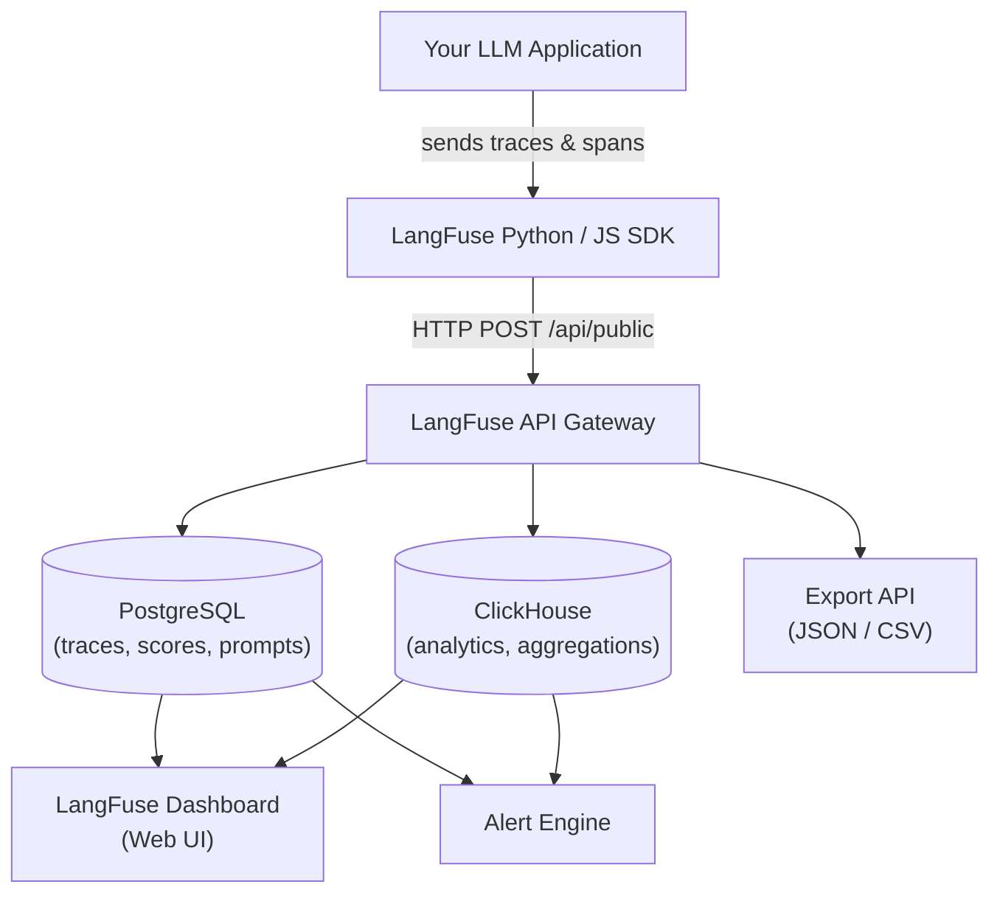
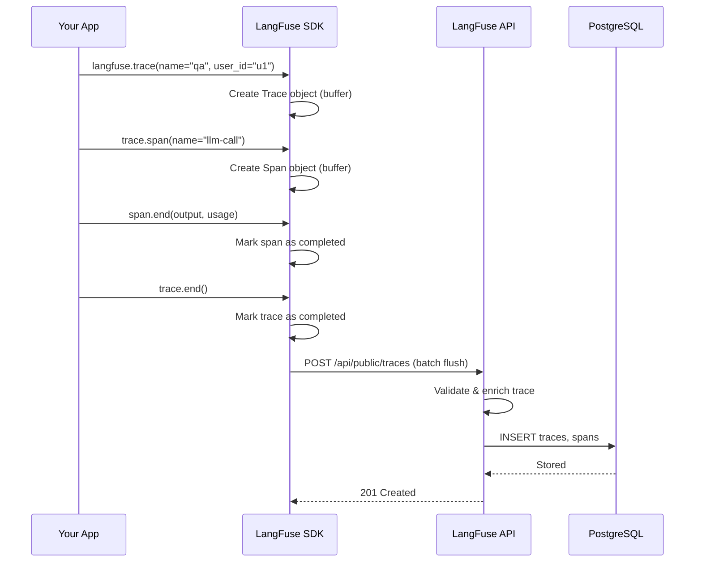
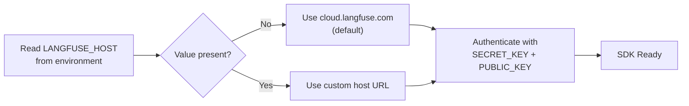

# Descripción General de LangFuse, Configuración e Integración SDK

LangFuse es una plataforma open-source de observabilidad y evaluación para aplicaciones LLM. Proporciona trazado, gestión de prompts, evaluación y monitoreo diseñados específicamente para proyectos construidos con frameworks como LangChain, LlamaIndex y pipelines personalizados en Python.

Esta lección cubre los fundamentos: qué ofrece LangFuse, la diferencia entre implementaciones auto-alojadas y en la nube, configuración del proyecto, instalación del SDK y creación básica de traces.

---

## ¿Qué es LangFuse?

LangFuse ayuda a los equipos a:

- **Trazar** cada paso de una llamada LLM — desde la construcción del prompt hasta la respuesta del modelo.
- **Evaluar** salidas con puntuaciones manuales, LLM-como-juez o métricas externas.
- **Gestionar prompts** con control de versiones y flujos de implementación.
- **Monitorear costos, latencia y tasas de error** en paneles en tiempo real.

> [!WARNING]
> LangFuse **no** es un proveedor de modelos ni una base de datos vectorial. Es una capa de observabilidad a la que tu aplicación envía datos. Aún necesitas tus propias claves de API LLM (OpenAI, Anthropic, etc.) e infraestructura.

> [!NOTE]
> LangFuse es completamente open-source bajo la licencia MIT. Puedes inspeccionar el código fuente en [github.com/langfuse/langfuse](https://github.com/langfuse/langfuse), contribuir con funciones y auto-alojarlo sin tarifas de licencia.

### Arquitectura del Sistema

El siguiente diagrama muestra cómo LangFuse encaja en una pila de aplicaciones LLM:



El SDK almacena datos en búfer y los envía de forma asíncrona a la API. La API escribe en PostgreSQL (traces, puntuaciones, configuraciones de prompt) y ClickHouse (análisis agregados para paneles). La interfaz del panel lee de ambos almacenes.

### Secuencia de Creación de Trace

Cuando tu aplicación realiza una llamada LLM, ocurre la siguiente secuencia:



Los datos se agrupan en lotes y se envían periódicamente (cada 1 segundo por defecto) para minimizar la sobrecarga de red.

---

## Auto-Alojado vs Nube

| Característica | Auto-Alojado (OSS) | LangFuse Nube |
|---|---|---|
| Esfuerzo de configuración | Alto — requiere Docker, PostgreSQL y redes | Bajo — regístrate y crea un proyecto |
| Residencia de datos | Control total | Gestionado por LangFuse |
| Mantenimiento | Tú gestionas actualizaciones, respaldos, escalabilidad | Gestionado por LangFuse |
| Costo | Solo costo de infraestructura | Plan gratuito + planes pagos |
| Actualizaciones de funciones | Actualización manual | Automática |
| Escalabilidad | Escalabilidad manual | Auto-escalado |
| Alta disponibilidad | Tú configuras HA | SLA integrado |
| Registro de auditoría | Configurable | Incluido |
| Dominio personalizado | Compatible con proxy inverso | Disponible en planes pagos |

> [!TIP]
> Comienza con LangFuse Nube durante el desarrollo. Toma 2 minutos configurarlo. Migra a auto-alojado después si necesitas residencia de datos o esperas un volumen muy alto que haga que el precio de la nube no sea económico.

---

## Creando un Proyecto y Obteniendo Claves de API

1. Ve a [cloud.langfuse.com](https://cloud.langfuse.com) (o a tu instancia auto-alojada).
2. Regístrate y crea una organización.
3. Crea un proyecto (ej.: "Mi Chatbot").
4. Navega a **Configuración → Claves de API**.
5. Genera una **clave pública** y una **clave secreta**.

Mantén la clave secreta segura — autoriza escrituras en tu proyecto.

> [!IMPORTANT]
> Rota tus claves secretas periódicamente. LangFuse Nube te permite generar múltiples pares de claves y revocar las antiguas. Configura un recordatorio trimestral de rotación. Si una clave se ve comprometida, revócala inmediatamente desde **Configuración → Claves de API**.

---

## Instalando el SDK de Python

```bash
pip install langfuse langchain-openai
```

El paquete `langfuse` proporciona el cliente de trace. El paquete `langchain-openai` se usa para ejemplos de integración con LangChain en este curso.

### SDKs Compatibles

| Lenguaje | Paquete | Estado | Características Principales |
|---|---|---|---|
| Python | `langfuse` | ✅ Estable | Todas las funciones: traces, spans, puntuaciones, datasets, prompts, decorador `@observe`, callbacks LangChain y LlamaIndex |
| JavaScript / TypeScript | `langfuse` | ✅ Estable | Mismo conjunto de funciones que Python; compatible con LangChain.js, LlamaIndex.ts |
| Go | `langfuse-go` | ✅ Comunidad | Trazado y puntuación principales |
| Rust | `langfuse-rs` | ✅ Comunidad | Trazado principal |
| REST API | HTTP | ✅ Siempre disponible | Cualquier lenguaje puede enviar traces vía `POST /api/public/traces` |

> [!NOTE]
> Este curso se centra en el SDK de Python, pero los conceptos son idénticos en todos los SDKs. El contrato de la API es el mismo — cada SDK es un envoltorio ligero alrededor de los endpoints REST.

---

## Inicialización Básica

```python
# init_basica.py
from langfuse import Langfuse

langfuse = Langfuse(
    secret_key="sk-lf-...",      # Reemplaza con tu clave secreta
    public_key="pk-lf-...",      # Reemplaza con tu clave pública
    host="https://cloud.langfuse.com"  # O tu URL auto-alojada
)

# Verificar conexión
print("LangFuse inicializado:", langfuse.auth_check())
```

> [!WARNING]
> Nunca uses claves de API hardcodeadas en producción. Usa variables de entorno:
> ```python
> import os
> langfuse = Langfuse(
>     secret_key=os.environ["LANGFUSE_SECRET_KEY"],
>     public_key=os.environ["LANGFUSE_PUBLIC_KEY"],
>     host=os.environ.get("LANGFUSE_HOST", "https://cloud.langfuse.com")
> )
> ```

### Decisión de Configuración Basada en Entorno



### Inicialización Asíncrona

Para aplicaciones asíncronas (FastAPI, Django channels, etc.), LangFuse proporciona un cliente compatible con async:

```python
# async_init.py
import asyncio
from langfuse import Langfuse

langfuse = Langfuse()

async def process_question(question: str) -> str:
    trace = langfuse.trace(name="async-chat", input={"question": question})
    # ... llamada LLM ...
    trace.end(output={"answer": "42"})
    await asyncio.to_thread(langfuse.flush)

asyncio.run(process_question("¿Cuál es el sentido de la vida?"))
```

### Patrones con Context Manager

LangFuse admite el protocolo context manager para cierre automático de spans:

```python
# context_manager.py
from langfuse import Langfuse

langfuse = Langfuse()

with langfuse.trace(name="chat-session", user_id="user_42") as trace:
    with trace.span(name="llm-call") as span:
        span.end(
            input={"prompt": "Hola"},
            output={"response": "¡Hola!"},
            usage={"prompt_tokens": 5, "completion_tokens": 3}
        )

    with trace.span(name="retrieval") as retrieval_span:
        retrieval_span.end(input={"query": "docs"}, output={"count": 3})
```

### Manejo de Errores

Implementa un manejo de errores adecuado alrededor de las llamadas a LangFuse para evitar que tu aplicación principal se detenga:

```python
# error_handling.py
from langfuse import Langfuse
from langfuse.api.core import ApiError

langfuse = Langfuse()

def safe_trace_llm_call(prompt: str) -> dict:
    trace = None
    try:
        trace = langfuse.trace(name="llm-call", input={"prompt": prompt})
        response = call_llm(prompt)

        span = trace.span(name="response")
        span.end(
            output={"response": response},
            usage={"prompt_tokens": len(prompt.split()), "completion_tokens": len(response.split())}
        )
        trace.end(output=response)
        return {"success": True, "response": response}

    except ApiError as e:
        print(f"Error de API LangFuse: {e.status_code} - {e.body}")
        return {"success": True, "response": response}
    except Exception as e:
        print(f"Error de aplicación: {e}")
        if trace:
            span = trace.span(name="error")
            span.end(level="ERROR", metadata={"error": str(e)})
            trace.end()
        return {"success": False, "error": str(e)}
    finally:
        langfuse.flush()
```

> [!TIP]
> Si estás experimentando problemas de conexión con LangFuse, activa el registro de depuración para ver el tráfico HTTP bruto:
> ```python
> import logging
> logging.basicConfig(level=logging.DEBUG)
> langfuse = Langfuse(debug=True)
> ```

---

## Creando un Trace Básico

Un **trace** representa una solicitud completa (ej.: una pregunta del usuario). Dentro de un trace puedes crear **spans** (pasos individuales).

```python
# trace_simple.py
from langfuse import Langfuse

langfuse = Langfuse()

# Iniciar un trace
trace = langfuse.trace(name="hello-world", user_id="user_123")

# Agregar un span (una llamada LLM)
span = trace.span(name="llm-call")

# Simular una respuesta LLM
span.end(
    input={"prompt": "Di hola en francés"},
    output={"response": "Bonjour!"},
    usage={"prompt_tokens": 10, "completion_tokens": 2}
)

print("ID del Trace:", trace.id)
```

---

## LangFuse vs Otras Herramientas

| Funcionalidad | LangFuse | Weights & Biases | MLflow |
|---|---|---|---|
| Traces nativos para LLM | ✅ Sí | Parcial | ❌ No |
| Versionado de prompts | ✅ Integrado | ❌ | ❌ |
| Evaluación LLM-como-juez | ✅ Nativo | ❌ | ❌ |
| Auto-alojable | ✅ Open-source | ❌ | ✅ Open-source |
| Integración LangChain | ✅ De primera clase | ❌ | ❌ |
| Seguimiento de costos | ✅ Por trace | ❌ | ❌ |
| Gestión de datasets | ✅ Integrado | ❌ | ❌ |
| Reglas de alerta | ✅ Integrado | ❌ | ❌ |

---

## Interactive Questions

```question
{
  "id": "lf-1-q1",
  "type": "multiple-choice",
  "question": "Estás construyendo un chatbot RAG y necesitas depurar por qué el modelo a veces ignora el contexto recuperado. ¿Qué función de LangFuse te ayuda a inspeccionar cada paso del pipeline?",
  "options": [
    "Versionado de prompts",
    "Trazado con spans anidados",
    "Evaluación LLM-como-juez",
    "Paneles de monitoreo de costos"
  ],
  "correct": 1,
  "explanation": "El trazado con spans anidados captura cada paso (recuperación, construcción del prompt, llamada LLM, formato de respuesta) para que puedas inspeccionar entradas y salidas en cada etapa."
}
```

```question
{
  "id": "lf-1-q2",
  "type": "multiple-choice",
  "question": "¿Qué método inicializa el SDK de LangFuse en una aplicación Python?",
  "options": [
    "LangChain.init()",
    "LangFuse.initialize()",
    "LangFuse() con claves secreta y pública",
    "FuseClient.setup()"
  ],
  "correct": 2,
  "explanation": "El constructor LangFuse acepta los parámetros secret_key, public_key y host para crear un cliente SDK autenticado."
}
```

```question
{
  "id": "lf-1-q3",
  "type": "multiple-choice",
  "question": "Una llamada LLM en un manejador de ruta FastAPI lanzó una excepción inesperada. Tu trace de LangFuse nunca se cierra. ¿Cómo deberías manejar esto?",
  "options": [
    "Envolver el trace en un bloque try/finally y llamar a trace.end() o span.end(level='ERROR') en la cláusula except",
    "Ignorarlo — LangFuse cierra automáticamente los traces huérfanos",
    "Reiniciar el SDK de LangFuse después de cada excepción",
    "Establecer un hook global de excepción que envíe un trace dummy"
  ],
  "correct": 0,
  "explanation": "Usa siempre try/finally (o context managers) para garantizar el cierre adecuado del trace. Marca los spans con level='ERROR' y adjunta el mensaje de error para depuración."
}
```

```question
{
  "id": "lf-1-q4",
  "type": "multiple-choice",
  "question": "¿Cómo deberías proporcionar las claves de API al SDK de LangFuse en producción?",
  "options": [
    "Hardcodeadas directamente en el archivo fuente Python",
    "Almacenadas en un archivo JSON simple en el repositorio",
    "Usar variables de entorno como LANGFUSE_SECRET_KEY",
    "Pasarlas como argumentos de línea de comandos cada vez"
  ],
  "correct": 2,
  "explanation": "Las variables de entorno mantienen los secretos fuera del control de versiones y son la mejor práctica estándar para implementaciones en producción."
}
```

```question
{
  "id": "lf-1-q5",
  "type": "multiple-choice",
  "question": "¿Cuál de las siguientes NO es una capacidad de LangFuse?",
  "options": [
    "Trazado de llamadas LLM con spans anidados",
    "Versionado de prompts con etiquetas de implementación",
    "Entrenamiento y fine-tuning de modelos LLM",
    "Evaluación automatizada LLM-como-juez"
  ],
  "correct": 2,
  "explanation": "LangFuse es una plataforma de observabilidad y evaluación, no un framework de entrenamiento de modelos. Usa herramientas como PyTorch, Hugging Face o APIs de fine-tuning de OpenAI para entrenar modelos."
}
```

---

> [!SUCCESS]
> **Conclusiones Clave**
> - LangFuse es una plataforma open-source de observabilidad construida específicamente para aplicaciones LLM.
> - Puedes usar LangFuse Nube o auto-alojarlo con Docker y PostgreSQL.
> - Cada proyecto usa un par de claves pública/secreta para autenticar el SDK.
> - Un trace representa una solicitud completa; los spans representan pasos individuales dentro de él.
> - LangFuse se integra nativamente con LangChain, LlamaIndex y código Python personalizado.
> - En comparación con W&B y MLflow, LangFuse ofrece funcionalidades específicas para LLM como versionado de prompts y evaluación LLM-como-juez.
> - Usa siempre variables de entorno para las claves de API y envuelve los traces en un manejo de errores adecuado.
