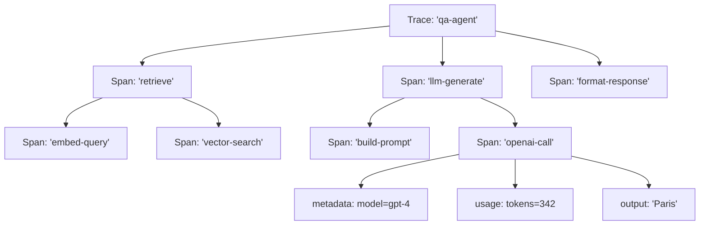
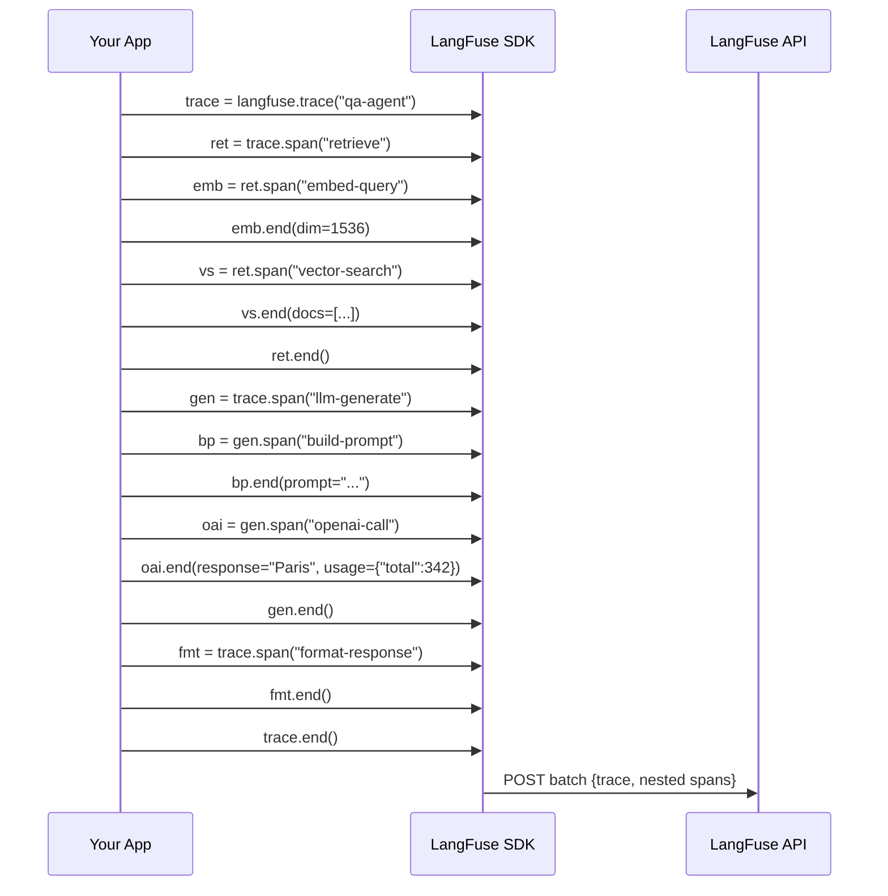
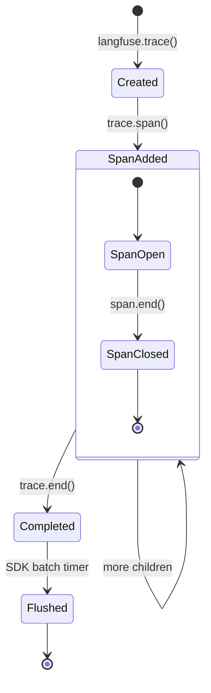

# Trazado de Llamadas LLM y Pasos de Agentes

El trazado es el núcleo de la observabilidad de LangFuse. Cada llamada LLM, paso de recuperación, invocación de herramienta o decisión de agente puede capturarse como un span estructurado dentro de un trace. Esta lección muestra cómo construir árboles de trace ricos y anidados y cómo instrumentar pipelines de LangChain y LlamaIndex.

---

## Creando Spans y Traces

Cada trace comienza con `langfuse.trace()`. Dentro de él, creas spans para cada paso lógico:

```python
from langfuse import Langfuse

langfuse = Langfuse()

trace = langfuse.trace(
    name="qa-agent",
    input={"question": "¿Cuál es la capital de Francia?"},
    user_id="user_42",
    session_id="sess_001"
)
```

Los spans pueden anidarse arbitrariamente:

```python
# Span raíz (ej.: "recuperar documentos")
recuperacion = trace.span(name="recuperar")

# Span hijo (ej.: "incrustar consulta")
incrustacion = recuperacion.span(name="incrustar-consulta")
incrustacion.end(
    input={"query": "capital de Francia"},
    output={"embedding_dim": 1536}
)

# Otro span hijo (ej.: "búsqueda vectorial")
busqueda = recuperacion.span(name="busqueda-vectorial")
busqueda.end(
    input={"top_k": 5},
    output={"results": ["doc1", "doc3", "doc7"]}
)

recuperacion.end()
```

> [!NOTE]
> Un **trace** representa una solicitud completa de extremo a extremo (una consulta de usuario). Un **span** representa una sola operación dentro de esa solicitud. Múltiples spans forman una jerarquía de árbol. El span raíz de un trace es su primer span; todos los demás son hijos de algún span padre.

> [!WARNING]
> Siempre llama a `.end()` en un span cuando la operación termine. Los spans huérfanos (sin `.end()`) permanecerán "abiertos" en el panel de LangFuse y sesgarán las métricas de latencia. Usa el patrón context manager (`with trace.span() as s:`) para garantizar el cierre.

---

## Jerarquía de Trace (Diagrama ASCII)



Cada span puede contener sus propios `input`, `output`, `metadata`, `usage` y `level` (DEBUG, WARNING, ERROR).

### Jerarquía de Span Anidado (Secuencia)



### Ciclo de Vida del Trace



---

## Agregando Metadatos y Puntuaciones

```python
# Agregando metadatos a un span
span = trace.span(
    name="llm-call",
    metadata={
        "model": "gpt-4",
        "temperature": 0.7,
        "max_tokens": 500
    }
)

# Agregando una puntuación después de que el span termine
trace.score(
    name="utilidad",
    value=0.85,
    comment="Buena respuesta, pero podría ser más corta"
)

# Tipos de puntuación: NUMERIC, BOOLEAN, CATEGORICAL
trace.score(name="toxicidad", value=False, data_type="BOOLEAN")
trace.score(name="dificultad", value="medio", data_type="CATEGORICAL")
```

> [!WARNING]
> Las puntuaciones se adjuntan a un trace o span **después** del hecho. No bloquean la ejecución. Asegúrate de tener una referencia al objeto trace/span (o su ID) para puntuarlo posteriormente.

> [!TIP]
> Usa metadatos para etiquetar spans con contexto de negocio: `environment`, `region`, `model_version`, `prompt_template_name`, `user_tier`. Estos campos se convierten en dimensiones filtrables en los paneles. El etiquetado consistente en todos los spans permite potentes filtros cruzados.

### Tipos de Datos de Puntuación

| Tipo de Dato | Ejemplo Python | Visualización en Panel | Caso de Uso |
|---|---|---|---|
| NUMERIC | `value=0.85` | Histograma, avg/min/max | Corrección, utilidad, relevancia |
| BOOLEAN | `value=True` | Tasa de aprobación/rechazo, gráfico circular | Toxicidad, verificaciones de seguridad, guardrails |
| CATEGORICAL | `value="medio"` | Gráfico de barras, distribución | Dificultad, prioridad, clase de intención |

---

## Trazando Ejecuciones de LangChain

LangFuse proporciona un callback handler para LangChain que auto-instrumenta chains:

```python
from langfuse.callback import CallbackHandler
from langchain_openai import ChatOpenAI
from langchain_core.prompts import ChatPromptTemplate

# Crear el handler (uno por proyecto)
langfuse_handler = CallbackHandler()

prompt = ChatPromptTemplate.from_template("Cuenta un chiste corto sobre {tema}")
model = ChatOpenAI(model="gpt-4")
chain = prompt | model

# El handler se conecta automáticamente a cada paso
resultado = chain.invoke({"tema": "programación"}, config={"callbacks": [langfuse_handler]})
```

Cada paso de LangChain (template de prompt, llamada LLM, parser, recuperador) se convierte en un span separado dentro de un solo trace.

### Avanzado: Agente LangChain con Herramientas

```python
from langfuse.callback import CallbackHandler
from langchain.agents import create_openai_functions_agent, AgentExecutor
from langchain.tools import tool
from langchain_openai import ChatOpenAI

langfuse_handler = CallbackHandler()

@tool
def get_weather(city: str) -> str:
    """Get the current weather for a city."""
    return f"Sunny, 22°C in {city}"

@tool
def calculate(expression: str) -> str:
    """Evaluate a mathematical expression."""
    return str(eval(expression))

llm = ChatOpenAI(model="gpt-4")
agent = create_openai_functions_agent(llm, [get_weather, calculate])
executor = AgentExecutor(agent=agent, tools=[get_weather, calculate])

result = executor.invoke(
    {"input": "What is the weather in Paris plus 5?"},
    config={"callbacks": [langfuse_handler]}
)
```

Cada invocación de herramienta aparece como un span hijo separado, y el bucle de razonamiento del agente crea un árbol de trace que muestra la ruta completa de decisión.

---

## Trazando Pipelines de LlamaIndex

```python
from langfuse.llama_index import LlamaIndexCallbackHandler
from llama_index.core import VectorStoreIndex, SimpleDirectoryReader

# Inicializar handler
handler = LlamaIndexCallbackHandler()

documentos = SimpleDirectoryReader("./data").load_data()
index = VectorStoreIndex.from_documents(documentos)

query_engine = index.as_query_engine()
respuesta = query_engine.query("¿Qué es LangFuse?")

# Descargar traces
handler.flush()
```

---

## Instrumentación Personalizada con Decoradores

Para máximo control, usa el decorador `@observe()`:

```python
from langfuse.decorators import observe

@observe()
def obtener_clima(ciudad: str) -> str:
    """Esta función se traza automáticamente."""
    respuesta = call_weather_api(ciudad)
    return respuesta

@observe(as_type="generation")
def llamar_llm(prompt: str, model: str = "gpt-4") -> str:
    """Marca este span como una 'generation' (llamada LLM)."""
    ...
```

> [!WARNING]
> El decorador `@observe` funciona con **cualquier** función de Python, no solo llamadas LLM. Usa el parámetro `as_type` para distinguir generaciones (llamadas LLM) de spans regulares.

### Avanzado: Instrumentación Personalizada con Agrupación de Traces

Agrupa traces relacionados bajo una sola sesión para conversaciones completas de múltiples turnos:

```python
# trace_grouping.py
from langfuse import Langfuse
from langfuse.decorators import observe

langfuse = Langfuse()

@observe()
def process_message(session_id: str, message: str, turn_number: int) -> str:
    """Process a single message in a multi-turn conversation."""
    context = retrieve_context(message)
    response = generate_response(message, context)

    trace = langfuse.current_trace()
    if trace:
        trace.score(name="coherence", value=0.9, data_type="NUMERIC")
        trace.update(session_id=session_id)

    return response

@observe(as_type="generation")
def generate_response(message: str, context: str) -> str:
    """Call the LLM with context."""
    return "París es la capital de Francia."

session_1 = "sess_conversation_001"
for i, msg in enumerate(["¡Hola!", "¿Cuál es la capital de Francia?"]):
    process_message(session_1, msg, i + 1)

langfuse.flush()
```

> [!TIP]
> Al trazar bucles de agentes, establece `session_id` en cada trace para que el panel de LangFuse agrupe todos los turnos de una conversación. Luego puedes filtrar por sesión para reproducir toda la trayectoria del agente.

---

## Comparación: Enfoques de Instrumentación

| Enfoque | Esfuerzo | Granularidad | Alcance automático | Mejor para |
|---|---|---|---|---|
| Spans manuales | Alto | Control total | Manual | Pipelines personalizados, investigación |
| CallbackHandler LangChain | Bajo | Por paso de chain | Automático | Aplicaciones LangChain |
| CallbackHandler LlamaIndex | Bajo | Por paso de índice | Automático | Aplicaciones LlamaIndex |
| Decorador `@observe` | Medio | Por función | Envuelve la función | Cualquier código Python |

### Resumen de Tipos de Span

| Tipo de Span | Convención de `name` | Metadatos Recomendados | Seguimiento de Uso |
|---|---|---|---|
| **Generación LLM** | `llm-call`, `openai-completion`, `anthropic-generate` | `model`, `temperature`, `max_tokens`, `provider` | `prompt_tokens`, `completion_tokens`, `total` |
| **Recuperación** | `vector-search`, `embed-query`, `bm25-search` | `top_k`, `index_name`, `embedding_model` | Generalmente ninguno |
| **Ejecución de Herramienta** | `get_weather`, `calculate`, `search_web` | `tool_name`, `tool_input` | Generalmente ninguno |
| **Lógica / Enrutamiento** | `classify-intent`, `guardrail-check`, `format-response` | `decision`, `confidence` | Generalmente ninguno |
| **Manejador de Error** | `error-handling`, `fallback` | `error_type`, `retry_count` | Generalmente ninguno |

---

## Interactive Questions

```question
{
  "id": "lf-2-q1",
  "type": "multiple-choice",
  "question": "Un agente hace 3 llamadas de herramienta en secuencia. Cada llamada de herramienta debe aparecer como un span separado compartiendo el mismo trace padre. ¿Cómo estructuras esto?",
  "options": [
    "Crear 3 traces separados con langfuse.trace()",
    "Crear 1 trace, luego llamar a trace.span() para cada llamada de herramienta",
    "Usar 3 callback handlers diferentes",
    "Usar @observe() en cada función de herramienta sin un trace padre"
  ],
  "correct": 1,
  "explanation": "Un trace representa la solicitud completa. Cada llamada de herramienta se convierte en un span hijo mediante trace.span(). Esto mantiene todas las operaciones bajo un solo trace para visibilidad de extremo a extremo."
}
```

```question
{
  "id": "lf-2-q2",
  "type": "multiple-choice",
  "question": "¿Qué clase de LangFuse instrumenta automáticamente las chains de LangChain sin creación manual de spans?",
  "options": [
    "LangFuseCallback",
    "CallbackHandler",
    "ChainObserver",
    "LangChainTracer"
  ],
  "correct": 1,
  "explanation": "langfuse.callback.CallbackHandler se conecta al sistema de callbacks de LangChain y crea spans automáticamente para cada paso de la chain."
}
```

```question
{
  "id": "lf-2-q3",
  "type": "multiple-choice",
  "question": "¿Qué hace el decorador @observe() cuando se aplica a una función Python?",
  "options": [
    "Almacena en caché la salida de la función para reutilizarla",
    "Registra los parámetros de la función en un archivo local",
    "Traza automáticamente cada llamada como un span en LangFuse",
    "Valida los argumentos de la función contra un esquema"
  ],
  "correct": 2,
  "explanation": "El decorador @observe() de langfuse.decorators envuelve la función y crea un span de LangFuse para cada invocación automáticamente."
}
```

```question
{
  "id": "lf-2-q4",
  "type": "multiple-choice",
  "question": "Después de crear un trace, ¿cómo se le adjunta una puntuación?",
  "options": [
    "Pasando la puntuación como parámetro a langfuse.trace()",
    "Llamando a trace.score(name='utilidad', value=0.85)",
    "Incluyendo la puntuación en el diccionario de metadatos del span",
    "Las puntuaciones se adjuntan automáticamente por el SDK"
  ],
  "correct": 1,
  "explanation": "trace.score() se llama en el objeto trace o span después de que la operación se completa. Las puntuaciones pueden ser NUMERIC, BOOLEAN o CATEGORICAL."
}
```

```question
{
  "id": "lf-2-q5",
  "type": "multiple-choice",
  "question": "Notas que un span permanece 'abierto' en el panel de LangFuse durante horas. ¿Cuál es la causa más probable?",
  "options": [
    "El trace tiene demasiados spans anidados",
    "El búfer del SDK no se ha vaciado todavía",
    "Nunca se llamó a span.end() en ese span",
    "El servidor LangFuse está limitando la tasa de tu proyecto"
  ],
  "correct": 2,
  "explanation": "Un span abierto significa que no se llamó a .end(). Usa el patrón context manager (with trace.span() as s:) para cerrar spans automáticamente al salir del ámbito."
}
```

---

> [!SUCCESS]
> **Conclusiones Clave**
> - Un trace envuelve una solicitud completa; los spans capturan operaciones individuales en una estructura de árbol.
> - Siempre llama a `.end()` en los spans, o usa context managers para cierre automático.
> - Los metadatos y etiquetas hacen que los spans sean filtrables en el panel — sé consistente con los nombres de las claves.
> - Los callbacks de LangChain y LlamaIndex proporcionan instrumentación con esfuerzo cero.
> - El decorador `@observe()` brinda control detallado sobre código Python personalizado.
> - Usa `session_id` para agrupar conversaciones de múltiples turnos y trayectorias de agentes.
