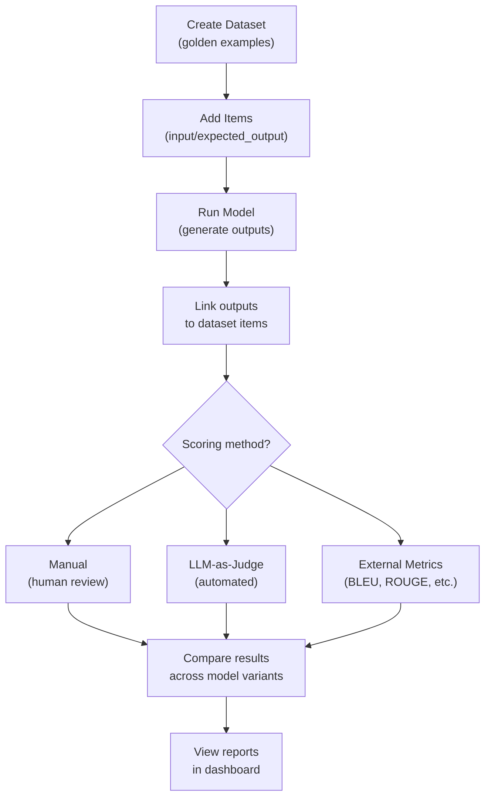
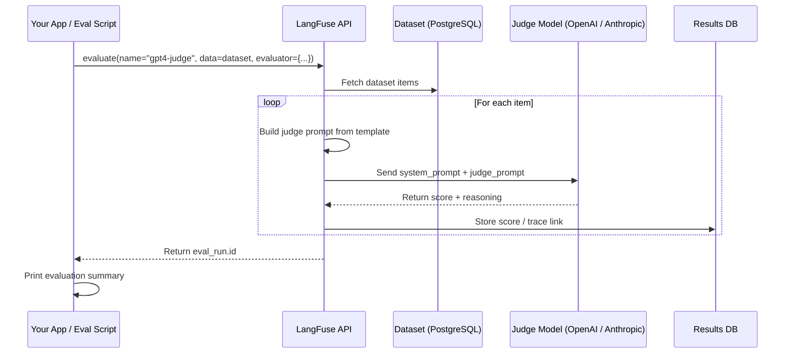
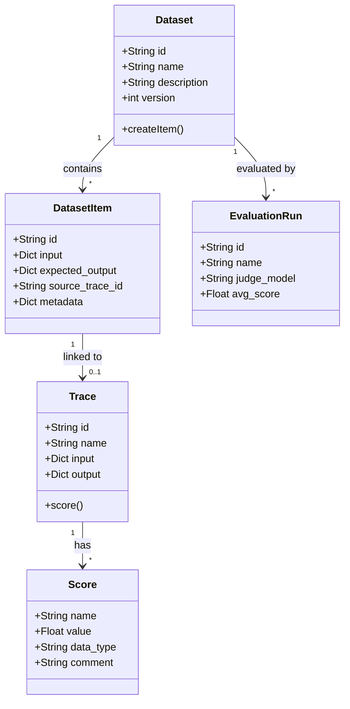

# Evaluaciones, Datasets y Puntuación LLM-como-Juez

La evaluación es esencial para construir aplicaciones LLM confiables. LangFuse proporciona tres métodos complementarios de evaluación: puntuación manual, LLM-como-juez y cálculo de métricas externas. Esta lección cubre cada enfoque y muestra cómo estructurar datasets, ejecutar evaluaciones y comparar salidas de modelos.

---

## Creando Datasets

Los datasets almacenan pares esperados de entrada-salida (ejemplos dorados). Sirven como verdad fundamental para ejecuciones de evaluación.

```python
from langfuse import Langfuse

langfuse = Langfuse()

# Crear un dataset
dataset = langfuse.create_dataset(
    name="correccion-qa",
    description="Conjunto de prueba de corrección para Q&A factual"
)

# Agregar ítems (entrada + salida esperada)
dataset.create_item(
    input={"question": "¿Cuál es la capital de Francia?"},
    expected_output="París"
)

dataset.create_item(
    input={"question": "¿En qué año cayó el Muro de Berlín?"},
    expected_output="1989"
)
```

> [!WARNING]
> Los ítems del dataset son **inmutables** una vez creados. Para actualizar un caso de prueba, crea una nueva versión del dataset o agrega un nuevo ítem con un ID diferente.

> [!IMPORTANT]
> El versionado de datasets sigue un modelo lineal. Cuando modificas un dataset (agregas/eliminas ítems), LangFuse crea una nueva versión. Los traces vinculados a versiones anteriores del dataset aún hacen referencia a los ítems originales. Esto garantiza que los resultados históricos de evaluación sigan siendo reproducibles incluso cuando tu conjunto de prueba evoluciona.

### Creando Datasets a Partir de Traces Existentes

```python
# dataset_from_traces.py
langfuse = Langfuse()

dataset = langfuse.create_dataset(
    name="ejemplos-produccion",
    description="Ejemplos buenos seleccionados de producción"
)

trace_ids = ["trace_abc123", "trace_def456", "trace_ghi789"]
for tid in trace_ids:
    trace = langfuse.fetch_trace(tid)
    if trace:
        dataset.create_item(
            input=trace.input,
            expected_output=trace.output,
            source_trace_id=tid
        )
```

### Pipeline de Evaluación (Diagrama de Flujo)



---

## Puntuación de Evaluación Manual

Después de generar traces, puedes adjuntar puntuaciones humanas:

```python
trace = langfuse.trace(name="test-evaluacion", input="...")

# Después, al revisar la salida
trace.score(
    name="correccion",
    value=0.9,            # Numérico: 0.0 a 1.0
    comment="Correcto, respuesta bien estructurada"
)

trace.score(
    name="toxicidad",
    value=False,          # Booleano
    data_type="BOOLEAN"
)
```

### Funciones de Puntuación Personalizadas

```python
# custom_scoring.py
from langfuse import Langfuse

langfuse = Langfuse()

def score_factual_correctness(expected: str, actual: str) -> float:
    expected_words = set(expected.lower().split())
    actual_words = set(actual.lower().split())
    if not expected_words:
        return 0.0
    overlap = len(expected_words & actual_words)
    return round(overlap / len(expected_words), 2)

def score_length_compliance(expected_max_words: int, actual: str) -> bool:
    return len(actual.split()) <= expected_max_words

dataset = langfuse.get_dataset("correccion-qa")

for item in dataset.items:
    model_output = "París"

    trace = langfuse.trace(
        name="custom-scoring",
        input=item.input,
        output=model_output
    )

    correctness = score_factual_correctness(
        item.expected_output["text"], model_output
    )
    trace.score(name="accuracy", value=correctness, data_type="NUMERIC")

    length_ok = score_length_compliance(
        item.metadata.get("max_words", 100), model_output
    )
    trace.score(name="concise", value=length_ok, data_type="BOOLEAN")

langfuse.flush()
```

> [!TIP]
> Diseña tus criterios de evaluación antes de escribir una sola línea de código. Para cada dimensión de salida (corrección, tono, seguridad, formato), decide:
> 1. ¿Qué constituye una puntuación de aprobación?
> 2. ¿Es numérica (0-1), booleana (aprobado/rechazado) o categórica (bueno/regular/malo)?
> 3. ¿Puede automatizarse o requiere juicio humano?
> 4. ¿Qué fiabilidad entre evaluadores esperas para evaluaciones humanas?

---

## Evaluación LLM-como-Juez

LangFuse puede usar un LLM para juzgar tus salidas automáticamente. Esto requiere un modelo configurado (ej.: GPT-4) en la interfaz de LangFuse o vía SDK.

```python
from langfuse import Langfuse

langfuse = Langfuse()

# Ejecutar una evaluación LLM-como-juez
ejec_evaluacion = langfuse.evaluate(
    name="juez-gpt4-correccion",
    data=dataset,                               # Dataset de arriba
    evaluator={
        "model": "gpt-4",                       # Modelo juez
        "system_prompt": (
            "Evalúas factualidad. Puntúa 0-1 basado en la corrección. "
            "Sé estricto: errores parciales reducen la puntuación."
        ),
        "template": (
            "Pregunta: {input}\n"
            "Esperado: {expected_output}\n"
            "Real: {output}\n"
            "Puntuación: "
        ),
        "mapping": {"output": "output"},
    }
)

print("ID de la ejecución:", ejec_evaluacion.id)
```

El modelo juez compara la salida real con la salida esperada y devuelve una puntuación.

### Secuencia LLM-como-Juez



---

## Ejecutando Evaluaciones en Variantes de Modelo

Compara dos versiones de modelo en el mismo dataset:

```python
# Evaluar respuestas de GPT-4
resultados_gpt4 = langfuse.evaluate(
    name="evaluacion-gpt4",
    data=dataset,
    evaluator={"model": "gpt-4", ...}
)

# Evaluar respuestas de Claude
resultados_claude = langfuse.evaluate(
    name="evaluacion-claude",
    data=dataset,
    evaluator={"model": "gpt-4", ...}  # Mismo juez para ambos
)
```

LangFuse permite superponer resultados de diferentes ejecuciones para comparar puntuaciones lado a lado.

---

## Pipelines de Evaluación Automatizados

Para integración CI/CD, automatiza la evaluación con un script:

```python
# pipeline_evaluacion.py
from langfuse import Langfuse
from langfuse.decorators import observe

langfuse = Langfuse()

dataset = langfuse.get_dataset("correccion-qa")

for item in dataset.items:
    # Ejecutar tu modelo
    respuesta = tu_modelo.invoke(item.input["question"])

    # Crear un trace vinculado a este ítem del dataset
    trace = langfuse.trace(
        name="evaluacion-pipeline",
        input=item.input,
        output=respuesta
    )

    # Puntuar manualmente o llamar al juez LLM
    trace.score(name="correccion", value=calcular_puntuacion(respuesta, item.expected_output))

langfuse.flush()
```

> [!WARNING]
> Siempre llama a `langfuse.flush()` al final de un script por lotes para asegurar que todos los traces y puntuaciones se envíen antes de que el proceso termine.

### Ejecutando Evaluaciones por Lotes con Seguimiento de Progreso

```python
# batch_eval.py
from langfuse import Langfuse

langfuse = Langfuse()

dataset = langfuse.get_dataset("correccion-qa")
items = list(dataset.items)
total = len(items)
print(f"Ejecutando evaluación en {total} ítems...")

for idx, item in enumerate(items, 1):
    try:
        output = tu_modelo.generate(item.input["question"])

        trace = langfuse.trace(
            name="batch-eval",
            session_id=f"batch-{dataset.name}-v{dataset.version}",
            input=item.input,
            metadata={"batch_item": idx, "dataset_version": dataset.version}
        )

        trace.score(name="correccion", value=compute_score(output, item.expected_output))
        trace.end(output=output)

        print(f"  [{idx}/{total}] Procesado: {item.id}")

    except Exception as e:
        print(f"  [{idx}/{total}] FALLÓ: {item.id} - {e}")

    if idx % 10 == 0:
        langfuse.flush()

langfuse.flush()
print("Evaluación por lotes completada.")
```

---

## Comparación: Métodos de Evaluación

| Método | Automatización | Costo | Consistencia | Mejor para |
|---|---|---|---|---|
| Puntuación manual | Baja (revisión humana) | Gratis (tiempo humano) | Baja (subjetiva) | Exploratoria, cualitativa |
| LLM-como-juez | Alta | Costo de tokens del juez | Media (depende del juez) | Tareas factuales a gran escala |
| Métricas externas (BLEU, ROUGE, etc.) | Alta | Gratis (computación) | Alta | Traducción, resumen |

### Comparación Detallada: Configuraciones LLM-como-Juez

| Modelo Juez | Costo por 1K evaluaciones | Calidad Típica | Latencia por evaluación | Notas |
|---|---|---|---|---|
| GPT-4o | ~$3-5 | Excelente | 2-5s | Mejor para puntuación matizada |
| GPT-4o-mini | ~$0.5-1 | Buena | 1-2s | Buen equilibrio para la mayoría de tareas |
| Claude 3.5 Sonnet | ~$3-4 | Excelente | 2-4s | Fuerte en seguridad/derechos de autor |
| Llama 3 (auto-alojado) | ~$0.10 (cómputo) | Buena-Variable | 3-10s | Requiere GPU, privacidad total de datos |
| Juez fine-tuned personalizado | Variable | Dirigida | Variable | Mejor para criterios específicos de dominio |

### Cuándo Usar Cada Método de Evaluación

| Escenario | Método Recomendado | Por qué |
|---|---|---|
| Prototipando una nueva función | Puntuación manual | Iteración rápida, construcción de intuición |
| Prueba de regresión antes del lanzamiento | LLM-como-juez | Escalable, reproducible, objetivo |
| Comparando LLM A vs LLM B | LLM-como-juez + mismo dataset | Comparación controlada, mismo juez |
| Evaluación de calidad de traducción | BLEU / chrF | Métricas NLP bien establecidas |
| Filtrado de seguridad de contenido | LLM-como-juez + puntuaciones BOOLEAN | Decisiones de seguridad matizadas necesitan razonamiento LLM |
| Validación de gate CI/CD | LLM-como-juez + umbral | Aprobación/rechazo automatizado antes del merge |

---

### Modelo de Datos de Evaluación



---

## Interactive Questions

```question
{
  "id": "lf-3-q1",
  "type": "multiple-choice",
  "question": "¿Cuál es el propósito de un dataset en los flujos de evaluación de LangFuse?",
  "options": [
    "Almacenar datos de entrenamiento para fine-tuning de modelos",
    "Mantener pares dorados de entrada-salida usados como verdad fundamental para evaluación",
    "Almacenar en caché respuestas LLM para inferencia más rápida",
    "Definir umbrales de alerta para monitoreo"
  ],
  "correct": 1,
  "explanation": "Un dataset en LangFuse contiene pares dorados (verdad fundamental) de entrada-salida contra los que se comparan las salidas del modelo durante la evaluación."
}
```

```question
{
  "id": "lf-3-q2",
  "type": "multiple-choice",
  "question": "¿Qué método crea un dataset y lo puebla con casos de prueba?",
  "options": [
    "langfuse.create_dataset() luego dataset.create_item()",
    "langfuse.new_test_set() luego test_set.add_case()",
    "dataset = Dataset(name='...') luego dataset.add()",
    "langfuse.upload_csv('dataset.csv')"
  ],
  "correct": 0,
  "explanation": "langfuse.create_dataset() crea el contenedor, luego dataset.create_item() agrega pares individuales de entrada-salida."
}
```

```question
{
  "id": "lf-3-q3",
  "type": "multiple-choice",
  "question": "En una evaluación LLM-como-juez, ¿qué compara el modelo juez para producir una puntuación?",
  "options": [
    "El prompt de entrada del usuario contra el prompt del sistema",
    "La salida real contra la salida esperada",
    "El uso de tokens de dos modelos diferentes",
    "La latencia de la aplicación contra un objetivo de nivel de servicio"
  ],
  "correct": 1,
  "explanation": "El juez compara la salida real del modelo contra el expected_output del ítem del dataset, guiado por el system_prompt y template."
}
```

```question
{
  "id": "lf-3-q4",
  "type": "multiple-choice",
  "question": "¿Por qué deberías llamar a langfuse.flush() al final de un script de evaluación por lotes?",
  "options": [
    "Para reiniciar el dataset para la siguiente ejecución de evaluación",
    "Para limpiar el caché local de prompts",
    "Para garantizar que todos los traces y puntuaciones pendientes se envíen antes de salir",
    "Para eliminar traces antiguos del servidor"
  ],
  "correct": 2,
  "explanation": "flush() fuerza al búfer del SDK a enviar todos los traces y puntuaciones en cola. Sin ello, los datos pueden perderse cuando el proceso termina."
}
```

```question
{
  "id": "lf-3-q5",
  "type": "multiple-choice",
  "question": "Tu equipo quiere agregar un paso de evaluación automatizada al pipeline CI/CD que bloquee deploys si la corrección cae por debajo del 80%. ¿Qué enfoque deberías usar?",
  "options": [
    "Puntuación manual por el equipo de QA después de cada deploy",
    "Evaluación LLM-como-juez con un umbral de aprobación/rechazo en la ejecución gpt4-judge-correctness",
    "Puntuación BLEU externa, que mide calidad de traducción",
    "Configurar una alerta de LangFuse que envíe un correo al equipo cuando la corrección es baja"
  ],
  "correct": 1,
  "explanation": "LLM-como-juez proporciona puntuación automatizada y escalable. Programa la llamada evaluate() en CI/CD, compara la puntuación media contra el umbral de 0.8 y falla el pipeline si está por debajo."
}
```

---

> [!SUCCESS]
> **Conclusiones Clave**
> - Los datasets almacenan pares dorados de entrada-salida usados como verdad fundamental para evaluación.
> - Tres métodos de evaluación: puntuación manual, LLM-como-juez y métricas externas.
> - LLM-como-juez usa un modelo configurado (ej.: GPT-4) para puntuar salidas automáticamente.
> - Compara variantes de modelo ejecutando evaluaciones separadas en el mismo dataset.
> - Siempre llama a `langfuse.flush()` al final de scripts de evaluación por lotes.
> - Diseña tus criterios de puntuación anticipadamente y elige el modelo juez adecuado para cada dimensión.
