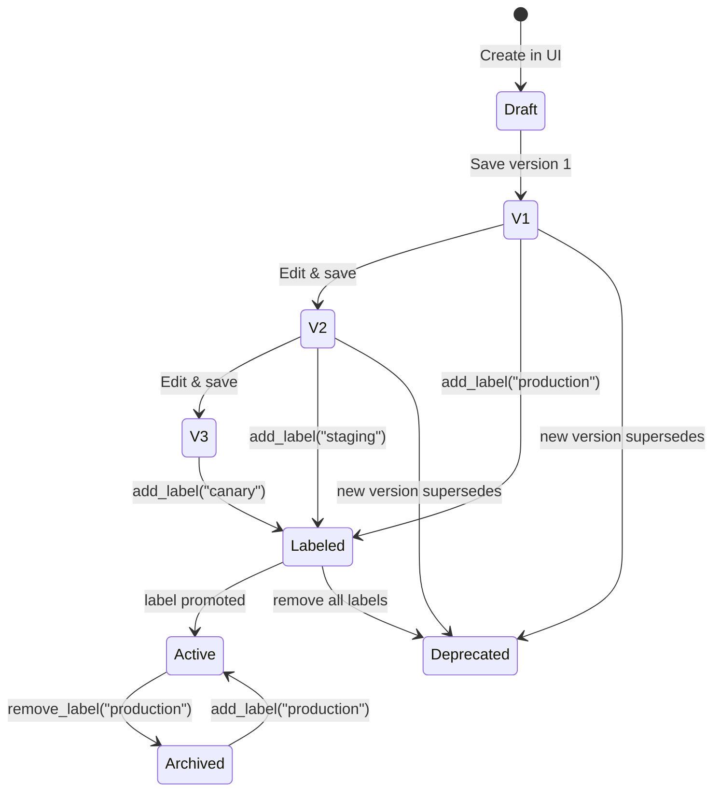
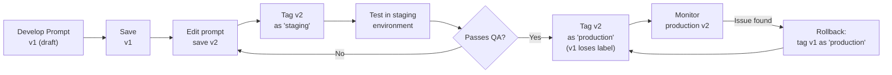
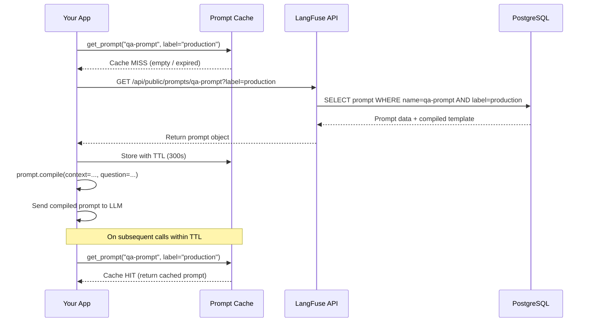

# Gestión de Prompts y Control de Versiones

La ingeniería de prompts es iterativa. LangFuse proporciona un registro centralizado de prompts con control de versiones, etiquetas de implementación y obtención vía SDK — para que tus prompts estén siempre sincronizados entre entornos.

---

## Creando Prompts en la Interfaz de LangFuse

1. Navega a **Prompts** en la interfaz de LangFuse.
2. Haz clic en **Nuevo Prompt**.
3. Dale un nombre (ej.: `prompt-sistema-qa`).
4. Escribe el contenido del prompt. Usa `{{variable}}` para placeholders.

```
Eres un asistente servicial. Responde la pregunta basándote en el contexto.

Contexto:
{{contexto}}

Pregunta:
{{pregunta}}

Responde concisamente en {{idioma}}.
```

5. Guarda como **versión 1**.

---

## Versionado de Prompts

Cada vez que editas y guardas un prompt, LangFuse incrementa el número de versión. Puedes:

- Ver el historial completo de versiones.
- Comparar dos versiones lado a lado.
- Revertir a una versión anterior.

```python
# Listar versiones de un prompt
prompt = langfuse.get_prompt("prompt-sistema-qa")
print("Versión actual:", prompt.version)
print("Etiquetas:", prompt.labels)  # ej.: ["production", "staging"]
```

> [!WARNING]
> Las versiones de prompt son **inmutables**. No puedes editar una versión guardada. Siempre crea una nueva versión y promuévela a producción cuando esté lista.

### Ciclo de Vida de la Versión del Prompt



Las versiones son de solo adición. Una vez guardada, el contenido de una versión nunca cambia. Las etiquetas se mueven entre versiones para indicar cuál está activa en cada entorno.

---

## Implementando Versiones con Etiquetas

Las etiquetas te permiten promover una versión específica a un entorno:

| Etiqueta | Propósito |
|---|---|
| `production` | Prompt activo usado en producción |
| `staging` | Versión de prelanzamiento para prueba |
| `development` | Última versión en desarrollo |
| Etiqueta personalizada | Cualquier etiqueta (ej.: `canary`, `us_east`, `ab_test_a`) |

Puedes definir etiquetas vía interfaz o SDK:

```python
# Promover versión 3 a producción
prompt = langfuse.get_prompt("prompt-sistema-qa", version=3)
prompt.add_label("production")
```

### Flujo de Trabajo de Implementación



> [!TIP]
> Usa variables de entorno para determinar qué etiqueta tu aplicación obtiene en tiempo de ejecución. Esto te permite implementar el mismo código de aplicación en múltiples entornos mientras cada entorno usa su propia versión de prompt.

---

## Obteniendo Prompts vía SDK

Tu aplicación obtiene el prompt en tiempo de ejecución:

```python
from langfuse import Langfuse

langfuse = Langfuse()

# Obtener la versión de producción
prompt = langfuse.get_prompt("prompt-sistema-qa", label="production")

# El texto del prompt compilado con variables
mensaje_sistema = prompt.compile(
    contexto="LangFuse es una herramienta de observabilidad LLM.",
    pregunta="¿Qué hace LangFuse?",
    idioma="Español"
)

print(mensaje_sistema)
# Salida:
# Eres un asistente servicial. Responde la pregunta basándote en el contexto.
# ...
```

> [!WARNING]
> Si el prompt o la etiqueta no existen, `get_prompt()` lanza un `LangFuseNotFoundError`. Siempre maneja esta excepción en código de producción.

### Obtención con Caché

Para uso en producción, almacena en caché el prompt obtenido para reducir llamadas de red:

```python
# cached_prompt.py
from functools import lru_cache
from langfuse import Langfuse
from langfuse.api.core import ApiError

langfuse = Langfuse()

class PromptManager:
    """Gestor de prompts en caché con TTL."""
    def __init__(self, ttl_seconds: int = 300):
        self._cache = {}
        self._ttl = ttl_seconds

    def get_prompt(self, name: str, label: str = "production"):
        cache_key = f"{name}:{label}"
        if cache_key in self._cache:
            entry = self._cache[cache_key]
            if entry["expires_at"] > time.time():
                return entry["prompt"]

        prompt = langfuse.get_prompt(name, label=label)
        self._cache[cache_key] = {
            "prompt": prompt,
            "expires_at": time.time() + self._ttl
        }
        return prompt

manager = PromptManager(ttl_seconds=300)
prompt = manager.get_prompt("prompt-sistema-qa", label="production")
compiled = prompt.compile(
    contexto="...",
    pregunta="...",
    idioma="Español"
)
```

> [!TIP]
> Almacena prompts en caché con TTL de 5 minutos en producción. Esto reduce llamadas de API mientras mantiene las actualizaciones de prompt dentro de una ventana razonable. Si necesitas actualizaciones sin demora, establece un TTL más corto o usa webhooks de LangFuse para invalidar el caché.

---

## Plantillas de Prompt con Variables

LangFuse usa sintaxis `{{variable}}` (estilo Handlebars) para variables de plantilla. Las variables se inyectan en tiempo de ejecución vía `prompt.compile(**kwargs)`.

```python
# En la interfaz: "Resume este {{texto}} en {{max_palabras}} palabras."
prompt = langfuse.get_prompt("resumidor", label="production")

compilado = prompt.compile(
    texto="Contenido largo del artículo aquí...",
    max_palabras="50"
)
```

También puedes establecer valores predeterminados en la interfaz para que las variables sean opcionales.

### Validación de Variables de Plantilla

Valida que todas las variables requeridas se hayan proporcionado antes de llamar al LLM:

```python
# validate_variables.py
import re
from langfuse import Langfuse

langfuse = Langfuse()

def validate_prompt_variables(prompt, **kwargs):
    template_vars = set(re.findall(r'\{\{(\w+)\}\}', prompt.prompt))
    provided = set(kwargs.keys())
    missing = template_vars - provided

    if missing:
        raise ValueError(
            f"Variables de plantilla faltantes: {', '.join(sorted(missing))}. "
            f"Proporcionadas: {', '.join(sorted(provided))}"
        )

    extra = provided - template_vars
    if extra:
        print(f"Aviso: variables no utilizadas proporcionadas: {', '.join(sorted(extra))}")

    return True

prompt = langfuse.get_prompt("prompt-sistema-qa", label="production")

validate_prompt_variables(prompt, contexto="...", pregunta="...", idioma="Español")
```

---

## Prompts de Producción vs Staging

Un flujo de trabajo común:

```
Versión 1 ──→ etiqueta: production
Versión 2 ──→ etiqueta: staging

Mientras v2 se prueba en staging, v1 permanece activa en producción.
Una vez validada v2, promuévela:
  v2.add_label("production")   # v1 pierde "production" si v2 asume
  v1.remove_label("production")
```

```python
# Entorno staging obtiene el prompt de staging
if os.environ.get("ENV") == "staging":
    prompt = langfuse.get_prompt("prompt-sistema-qa", label="staging")
else:
    prompt = langfuse.get_prompt("prompt-sistema-qa", label="production")
```

### Creando Variantes de Prompt para Pruebas A/B

Prueba dos versiones de prompt simultáneamente en diferentes segmentos de usuarios:

```python
# ab_test_prompts.py
from langfuse import Langfuse
import random

langfuse = Langfuse()

def get_prompt_for_user(user_id: str) -> str:
    variant = "A" if hash(user_id) % 2 == 0 else "B"
    label = f"ab_test_{variant}"

    prompt = langfuse.get_prompt("prompt-sistema-qa", label=label)
    return prompt, variant

user_id = "user_12345"
prompt, variant = get_prompt_for_user(user_id)

compiled = prompt.compile(
    contexto="LangFuse es una herramienta de observabilidad.",
    pregunta="¿Qué hace LangFuse?",
    idioma="Español"
)

trace = langfuse.trace(
    name="qa-answer",
    user_id=user_id,
    metadata={"prompt_variant": variant}
)
```

Este enfoque te permite implementar gradualmente cambios de prompt para un subconjunto de usuarios y comparar resultados usando paneles de LangFuse filtrados por `prompt_variant`.

---

## Comparación: Enfoques de Gestión de Prompts

| Funcionalidad | LangFuse Prompts | Cadenas fijas | YAML/JSON externo | Herramientas dedicadas |
|---|---|---|---|---|
| Historial de versiones | ✅ Integrado | ❌ | Manual | ✅ |
| Etiquetas de implementación | ✅ | ❌ | ❌ | Variable |
| Obtención en tiempo de ejecución | ✅ SDK | ❌ | Carga manual | ✅ |
| Variables de plantilla | ✅ | ✅ (f-strings) | ✅ | ✅ |
| Reversión | ✅ Un clic | ❌ | Git revert | Variable |
| Rastro de auditoría | ✅ | ❌ | Historial Git | Variable |
| Pruebas A/B | ✅ Via etiquetas | ❌ | Manual | Variable |
| Aislamiento de entorno | ✅ Etiquetas | ❌ | Archivos de configuración | ✅ |

### LangFuse vs Gestión de Prompts de Competidores

| Funcionalidad | LangFuse | LangSmith Hub | PromptLayer | Helicone |
|---|---|---|---|---|
| Código abierto | ✅ Sí | ❌ No | ❌ No | ❌ No |
| Auto-alojable | ✅ | ❌ | ❌ | Parcial |
| Historial de versiones | ✅ Lineal | ✅ Lineal | ✅ Lineal | ✅ |
| Implementación basada en etiquetas | ✅ | ❌ | ✅ | ❌ |
| Variables de plantilla | ✅ Handlebars | ✅ f-strings | ✅ Mustache | ✅ f-strings |
| Integración SDK | ✅ Python, JS, Go | ✅ Python, JS | ✅ Python, JS | ✅ Python, JS |
| Editor de prompt en interfaz | ✅ Integrado | ✅ | ✅ | ❌ |

---

### Secuencia de Obtención de Prompt en Tiempo de Ejecución



---

## Interactive Questions

```question
{
  "id": "lf-4-q1",
  "type": "multiple-choice",
  "question": "¿Dónde creas y gestionas prompts en LangFuse?",
  "options": [
    "En la sección Prompts de la interfaz de LangFuse",
    "Directamente en el SDK de Python usando langfuse.create_prompt()",
    "Editando un archivo YAML en el repositorio del proyecto",
    "A través del panel de la API de OpenAI"
  ],
  "correct": 0,
  "explanation": "Los prompts se gestionan en la sección Prompts de la interfaz web de LangFuse. El SDK se usa para obtener y compilar prompts existentes, no para crearlos."
}
```

```question
{
  "id": "lf-4-q2",
  "type": "multiple-choice",
  "question": "¿Qué sucede con una versión de prompt después de guardarla en LangFuse?",
  "options": [
    "Puede editarse y sobrescribirse libremente en cualquier momento",
    "Se vuelve inmutable y requiere crear una nueva versión para hacer cambios",
    "Se implementa automáticamente en producción",
    "Expira después de 30 días a menos que se promueva"
  ],
  "correct": 1,
  "explanation": "Las versiones de prompt son inmutables. Cada guardado crea una nueva versión con un número incrementado. No puedes modificar el contenido de una versión guardada."
}
```

```question
{
  "id": "lf-4-q3",
  "type": "multiple-choice",
  "question": "¿Qué sintaxis usa LangFuse para las variables de plantilla dentro de los prompts?",
  "options": [
    "${variable}",
    "{{variable}}",
    "%variable%",
    "{variable}"
  ],
  "correct": 1,
  "explanation": "LangFuse usa sintaxis estilo Handlebars {{variable}} para las variables de plantilla."
}
```

```question
{
  "id": "lf-4-q4",
  "type": "multiple-choice",
  "question": "¿Cómo obtienes la versión de producción de un prompt en tu aplicación Python?",
  "options": [
    "langfuse.get_prompt('nombre-prompt', label='production')",
    "langfuse.get_production_prompt('nombre-prompt')",
    "Prompt.load('nombre-prompt', env='production')",
    "langfuse.prompts['nombre-prompt']['production']"
  ],
  "correct": 0,
  "explanation": "langfuse.get_prompt() con el parámetro label obtiene la versión etiquetada con esa etiqueta. 'production' devuelve el prompt actualmente promovido a producción."
}
```

```question
{
  "id": "lf-4-q5",
  "type": "multiple-choice",
  "question": "Quieres ejecutar una prueba A/B en dos variantes de prompt, sirviendo la variante A al 50% de los usuarios y la variante B al otro 50%. ¿Cuál es el mejor enfoque?",
  "options": [
    "Crear dos proyectos LangFuse separados, uno para cada variante",
    "Etiquetar dos versiones de prompt como 'ab_test_A' y 'ab_test_B', aplicar hash al user_id para elegir una y etiquetar traces con el nombre de la variante",
    "Almacenar ambos prompts como cadenas fijas y cambiar con un if/else",
    "Usar el método compile del prompt para llenar aleatoriamente diferentes plantillas"
  ],
  "correct": 1,
  "explanation": "Usa etiquetas de LangFuse para variantes A/B. Aplica hash al user_id para asignar deterministamente una variante. Etiqueta los traces con el nombre de la variante para que puedas filtrar y comparar resultados en el panel."
}
```

---

> [!SUCCESS]
> **Conclusiones Clave**
> - Los prompts se crean y versionan en la interfaz de LangFuse, no en el código.
> - Cada versión guardada es inmutable; edita el prompt para crear una nueva versión.
> - Las etiquetas (production, staging, personalizada) promueven versiones específicas a entornos.
> - Usa `langfuse.get_prompt()` con el parámetro `label` para obtener prompts en tiempo de ejecución.
> - Las variables de plantilla usan sintaxis `{{variable}}` y se rellenan vía `prompt.compile()`.
> - Almacena prompts en caché en producción y siempre maneja `LangFuseNotFoundError`.
> - Las etiquetas admiten flujos de trabajo avanzados: pruebas A/B, implementaciones canary y configuraciones multi-entorno.
