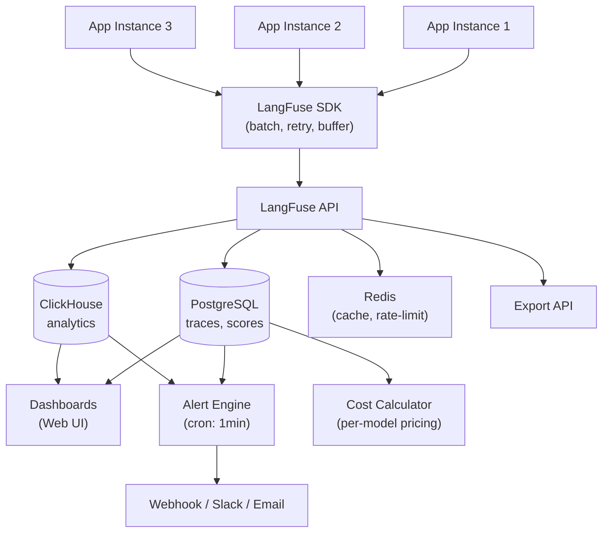
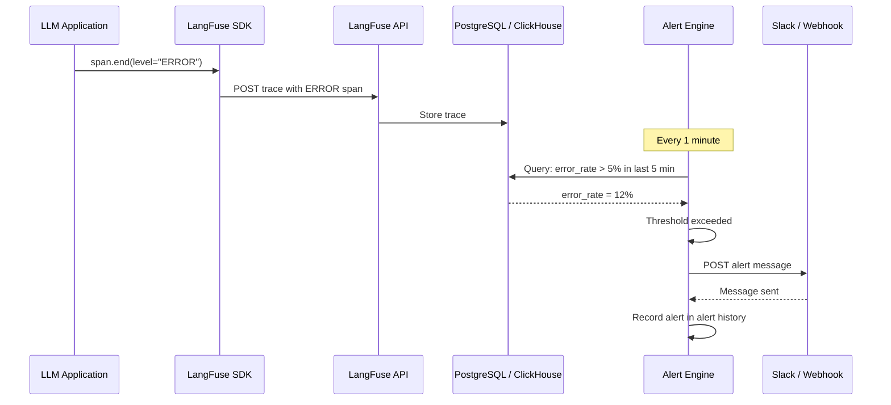
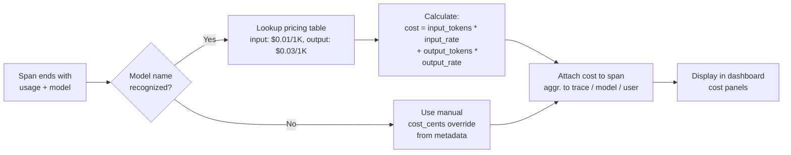

# Paneles de Observabilidad, Alertas y Monitoreo de Costos

Una vez que estás trazando todas las llamadas LLM, el siguiente paso es la visibilidad operacional. LangFuse proporciona paneles personalizados, reglas de alerta y funciones de seguimiento de costos para ayudarte a monitorear tu aplicación en tiempo real.

---

## Paneles Personalizados

Los paneles se componen de **cuadros**. Cada cuadro consulta datos de trace usando filtros.

Dimensiones de filtro disponibles:

- **Nombre del trace / span**
- **Modelo** (ej.: `gpt-4`, `claude-3`)
- **ID de usuario** e **ID de sesión**
- **Tags**
- **Rango de tiempo**
- **Conteo de tokens, latencia, costo**
- **Valores de puntuación**

```python
# Los traces ya se crean; los paneles se configuran en la interfaz.
# Sin embargo, puedes etiquetar traces para facilitar el filtrado:

trace = langfuse.trace(
    name="chat-completion",
    tags=["production", "gpt-4", "us-east-1"],
    metadata={"environment": "prod", "region": "us-east-1"}
)
```

> [!WARNING]
> Los cuadros del panel agregan datos de todos los traces. Si ejecutas una evaluación por lotes grande, esos traces aparecerán en tus paneles. Usa tags y filtros de fecha para separar las ejecuciones de evaluación del tráfico de producción.

### Patrones de Diseño de Paneles

> [!TIP]
> Sigue el patrón de **panel de tres niveles** para una observabilidad completa:
> 1. **Resumen ejecutivo** (1-2 cuadros): Costo total, solicitudes totales, tasa de error. Esto responde "¿está todo bien?" de un vistazo.
> 2. **Rendimiento del modelo** (3-5 cuadros): Latencia p50/p95/p99 por modelo, costo por modelo, tendencias de uso de tokens. Responde "¿qué modelo tiene mejor rendimiento?"
> 3. **Inmersión profunda en usuario/sesión** (3-5 cuadros): Principales usuarios por costo, principales usuarios por latencia, traces a nivel de sesión. Responde "¿qué usuario/consulta está causando problemas?"
>
> Las tags y metadatos son el andamiaje que hace que este patrón funcione. Sin un etiquetado consistente, no puedes segmentar datos por entorno, modelo o usuario.

---

## Arquitectura de Monitoreo



El pipeline de ingesta escala horizontalmente: múltiples instancias de aplicación envían traces a través del SDK, que los agrupa en lotes y reintenta automáticamente. La API escribe en PostgreSQL (para detalles del trace) y ClickHouse (para agregaciones del panel). El motor de alertas se ejecuta como un trabajo programado que consulta métricas agregadas contra umbrales definidos por el usuario.

> [!NOTE]
> La retención de datos en LangFuse es configurable. En LangFuse Nube, los traces se retienen según tu plan (típicamente 30-90 días). Las instancias auto-alojadas pueden configurar la retención mediante ajustes de PostgreSQL. Usa la API de Exportación para archivar traces antiguos en tu propio data lake o S3 antes de que expiren.

---

## Filtrado y Agregación de Traces

En la vista **Traces** puedes:

- Buscar por nombre de trace, ID de usuario o ID de sesión.
- Filtrar por rango de tiempo, rango de puntuación, conteo de tokens o costo.
- Agregar por modelo, mes o usuario para ver los mayores consumidores.
- Exportar resultados filtrados como CSV.

Ejemplo de consulta agregada (interfaz):

```
Filtro: model = "gpt-4" AND tags contiene "production"
Agrupar por: user_id
Métricas: SUM(prompt_tokens), SUM(completion_tokens), AVG(latency_ms)
```

### Consultas de Análisis de Costos

```python
# cost_analysis.py
from langfuse import Langfuse
from datetime import datetime, timedelta
import pandas as pd

langfuse = Langfuse()

def get_cost_by_model(days: int = 30):
    traces = langfuse.fetch_traces(
        limit=10000,
        from_timestamp=(datetime.now() - timedelta(days=days)).isoformat()
    )

    rows = []
    for t in traces.data:
        span_cost = 0
        model_name = "unknown"
        if t.spans:
            for span in t.spans:
                if span.usage and span.model:
                    model_name = span.model
                    span_cost += span.calculated_cost or 0

        rows.append({
            "trace_id": t.id,
            "model": model_name,
            "cost": span_cost,
            "total_tokens": sum(
                (s.usage.get("total", 0) or 0) for s in (t.spans or [])
                if s.usage
            ),
            "latency_ms": t.latency or 0,
            "timestamp": t.timestamp
        })

    df = pd.DataFrame(rows)
    summary = df.groupby("model").agg({
        "cost": "sum",
        "total_tokens": "sum",
        "trace_id": "count"
    }).rename(columns={"trace_id": "request_count"})
    summary["avg_cost_per_request"] = summary["cost"] / summary["request_count"]
    return summary.sort_values("cost", ascending=False)

cost_report = get_cost_by_model(days=30)
print(cost_report)
```

### Informes de Métricas Personalizadas

```python
# custom_metrics.py
from langfuse import Langfuse

langfuse = Langfuse()

def report_business_metric(trace_id: str, metric_name: str, value: float):
    trace = langfuse.fetch_trace(trace_id)
    if trace:
        trace.score(
            name=metric_name,
            value=value,
            data_type="NUMERIC",
            comment="Métrica de negocio personalizada"
        )

trace = langfuse.trace(name="soporte-cliente", user_id="cust_789")

report_business_metric(trace.id, "tiempo_resolucion_segundos", 12.5)
report_business_metric(trace.id, "satisfaccion_cliente", 4.5)

langfuse.flush()
```

---

## Configurando Alertas

Las alertas te notifican (vía email, Slack, webhook) cuando una métrica cruza un umbral.

| Tipo de Alerta | Ejemplo de Umbral | Acción |
|---|---|---|
| Tasa de error | > 5% en 5 minutos | Mensaje en Slack |
| Latencia p99 | > 10 segundos | Email al responsable |
| Costo por hora | > $50 | Webhook → PagerDuty |
| Pico de tokens | > 1M tokens en 10 min | Slack + email |

Configura alertas en **Configuración → Alertas** en la interfaz de LangFuse.

> [!WARNING]
> Las alertas verifican datos agregados y pueden tener un retraso de 1–5 minutos. No son en tiempo real. Para alertas sub-minuto, usa una herramienta APM dedicada junto con LangFuse.

### Comparación de Tipos de Alerta

| Tipo | Fuente de Métrica | Retraso | Caso de Uso |
|---|---|---|---|
| Tasa de error | Traces con level=ERROR | ~1-2 min | Capturar fallos de modelo, formatos de respuesta incorrectos |
| Umbral de latencia | Duración del span | ~1-2 min | Detectar modelos lentos, regresiones de ingeniería de prompt |
| Umbral de costo | Costo calculado por span | ~2-5 min | Control de presupuesto, detección de anomalías (gasto inesperado) |
| Pico de conteo de tokens | usage.total | ~1-2 min | Ataques de inyección de prompt, bucles sin control |
| Umbral de puntuación | Valores de trace.score() | ~2-5 min | Degradación de calidad (corrección < 0.7) |

### Configurando Alertas Webhook

```python
# webhook_alert_receiver.py
from flask import Flask, request, jsonify

app = Flask(__name__)

@app.route("/webhook/langfuse-alert", methods=["POST"])
def handle_alert():
    payload = request.json
    alert_type = payload.get("type")
    metric = payload.get("metric")
    threshold = payload.get("threshold")
    actual_value = payload.get("value")
    trace_url = payload.get("trace_url")

    print(f"ALERTA: {alert_type}")
    print(f"  Métrica: {metric} (umbral: {threshold}, real: {actual_value})")
    print(f"  Trace: {trace_url}")

    if metric == "error_rate" and actual_value > threshold:
        print("Activando reversión automática del despliegue del modelo...")

    return jsonify({"status": "recibido"}), 200

if __name__ == "__main__":
    app.run(port=5000)
```

### Secuencia de Activación de Alerta



---

### Flujo de Atribución de Costos



---

## Seguimiento de Uso de Tokens y Costos

LangFuse rastrea automáticamente el uso de tokens cuando pasas `usage` a un span. Para modelos compatibles, estima el costo basado en los precios actuales.

```python
span.end(
    usage={
        "input": 150,          # prompt_tokens
        "output": 42,          # completion_tokens
        "total": 192,
        "unit": "TOKENS"
    },
    model="gpt-4"
)
```

Los informes de costo muestran:

- **Costo por trace** (suma de costos de todos los spans)
- **Costo por modelo** (desglose por nombre de modelo)
- **Costo por usuario / sesión**
- **Costo mensual proyectado**

> [!IMPORTANT]
> La atribución de costos depende de nombres de modelo precisos. Si pasas un nombre de modelo no reconocido (mal escrito o personalizado), LangFuse no puede calcular costos. Usa siempre la cadena exacta del identificador del modelo (ej.: `gpt-4`, `gpt-4-0125-preview`, `claude-3-opus-20240229`) para garantizar la consulta de precios correcta.
>
> Para modelos personalizados o fine-tuned, puedes establecer manualmente el costo por span:
> ```python
> span.end(
>     usage={"input": 150, "output": 42, "total": 192, "unit": "TOKENS"},
>     model="mi-modelo-fine-tuned",
>     metadata={"cost_cents": 0.05}
> )
> ```

---

## Monitoreo de Latencia

Cada span registra automáticamente su duración. Los cuadros del panel pueden mostrar:

- Latencia promedio (p50, p95, p99) por modelo o nombre de span.
- Histograma de distribución de latencia.
- Lista de traces más lentos (ordenar por duración).

Los datos de latencia ayudan a identificar cuellos de botella — por ejemplo, llamadas de embedding que tardan más que la generación.

---

## Seguimiento de Tasa de Error

Cuando un span falla, establece su `level` como `ERROR` e incluye el mensaje de error.

```python
try:
    response = model.invoke(prompt)
    span.end(output=response)
except Exception as e:
    span.end(
        level="ERROR",
        metadata={"error": str(e)}
    )
```

El panel puede entonces mostrar:

- Tasa de error a lo largo del tiempo (gráfico de líneas).
- Conteo de errores por nombre de span (gráfico de barras).
- Lista de traces filtrada solo para errores.

---

## Exportando Datos

Exporta datos de trace para análisis externo:

```python
import pandas as pd

# Obtener traces recientes vía SDK
traces = langfuse.fetch_traces(
    limit=1000,
    from_timestamp="2025-01-01T00:00:00Z"
)

# Convertir a pandas DataFrame
df = pd.DataFrame([t.dict() for t in traces.data])
df.to_csv("exportacion_traces.csv", index=False)
```

También puedes usar la API de LangFuse directamente (`GET /api/public/traces`) para exportaciones grandes.

---

## Comparación: Funcionalidades de Monitoreo

| Funcionalidad | LangFuse | Logging personalizado | Prometheus/Grafana |
|---|---|---|---|
| Métricas nativas LLM | ✅ | Manual | ❌ |
| Seguimiento de costos | ✅ Integrado | Cálculo manual | ❌ |
| Reglas de alerta | ✅ Básico | ✅ Flexible | ✅ Avanzado |
| Constructor de paneles | ✅ Visual | Manual | ✅ PromQL |
| Retención de datos | Configurable | Ilimitada | Ilimitada |
| Esfuerzo de configuración | Bajo | Alto | Muy alto |
| Soporte multi-usuario | ✅ Integrado | Manual | ✅ |
| API para exportación | ✅ REST + SDK | Depende | ✅ |

---

## Interactive Questions

```question
{
  "id": "lf-5-q1",
  "type": "multiple-choice",
  "question": "¿Cómo distinguir traces de evaluación del tráfico de producción en los paneles de LangFuse?",
  "options": [
    "Los traces de evaluación se excluyen automáticamente de los paneles",
    "Etiquetar los traces de evaluación y filtrarlos en los cuadros del panel",
    "Crear una cuenta separada de LangFuse para ejecuciones de evaluación",
    "Usar una clave de API diferente para los traces de evaluación"
  ],
  "correct": 1,
  "explanation": "Usa tags como 'eval' vs 'production' en tus traces, luego configura cuadros del panel con filtros de tag para excluir o aislar grupos específicos de traces."
}
```

```question
{
  "id": "lf-5-q2",
  "type": "multiple-choice",
  "question": "¿Cuál de las siguientes métricas puede activar una alerta en LangFuse?",
  "options": [
    "Tasa de error que supera el 5% en 5 minutos",
    "Número de usuarios activos por debajo de 100",
    "Puntuación media de sentimiento de la respuesta",
    "Porcentaje de uso de almacenamiento de la base de datos"
  ],
  "correct": 0,
  "explanation": "Las alertas de LangFuse se basan en métricas a nivel de trace: tasa de error, latencia, costo y conteos de tokens. Las métricas de infraestructura como conteo de usuarios y almacenamiento de BD no son monitoreadas por LangFuse."
}
```

```question
{
  "id": "lf-5-q3",
  "type": "multiple-choice",
  "question": "¿Cómo estima LangFuse el costo de una llamada LLM?",
  "options": [
    "Multiplicando el número de caracteres de la respuesta por una tarifa fija",
    "Aplicando el precio conocido por token para el modelo especificado",
    "Consultando la API de facturación del proveedor LLM en tiempo real",
    "Contando el número de spans en el trace"
  ],
  "correct": 1,
  "explanation": "LangFuse mantiene una tabla de precios para modelos populares. Multiplica los conteos de tokens reportados (entrada y salida) por la tarifa por token para el nombre del modelo especificado."
}
```

```question
{
  "id": "lf-5-q4",
  "type": "multiple-choice",
  "question": "¿Cómo exportar datos de trace de LangFuse para análisis externo?",
  "options": [
    "Usando langfuse.fetch_traces() o el endpoint GET /api/public/traces",
    "Copiando manualmente los datos desde la interfaz del panel",
    "Los traces no se pueden exportar; se almacenan permanentemente en el servidor",
    "Configurando un correo automático diario con archivo CSV adjunto"
  ],
  "correct": 0,
  "explanation": "El fetch_traces() del SDK y el endpoint REST API ambos devuelven datos de trace en formato JSON, que pueden convertirse a CSV o cargarse en pandas para análisis."
}
```

```question
{
  "id": "lf-5-q5",
  "type": "multiple-choice",
  "question": "Tu factura mensual de LLM de repente se triplicó. Necesitas encontrar la causa raíz rápidamente. ¿Cuál es el primer paso más eficiente?",
  "options": [
    "Verificar el panel de costo por modelo de LangFuse para ver qué modelo tuvo el mayor aumento de costo",
    "Revisar cada trace individual manualmente de los últimos 30 días",
    "Enviar un correo al equipo de soporte del proveedor LLM preguntando por qué aumentaron los costos",
    "Deshabilitar todas las llamadas LLM hasta que se resuelva el problema"
  ],
  "correct": 0,
  "explanation": "El desglose de costo por modelo de LangFuse muestra inmediatamente qué modelo impulsó el aumento. Desde allí, profundiza en costo por usuario o costo por sesión para encontrar la fuente específica."
}
```

---

> [!SUCCESS]
> **Conclusiones Clave**
> - Los paneles se construyen a partir de cuadros filtrables; usa tags y metadatos de forma consistente.
> - Las alertas verifican datos agregados cada 1-2 minutos — adecuadas para alertas operativas, no en tiempo real.
> - El seguimiento de costos requiere nombres de modelo precisos para la consulta de precios.
> - Los datos de latencia y tasa de error provienen automáticamente del tiempo del span y del nivel del span.
> - Exporta traces vía SDK o REST API para análisis externo en pandas/herramientas de BI.
> - El patrón de panel de tres niveles (resumen ejecutivo → modelo → usuario) proporciona un enfoque estructurado para el monitoreo.
