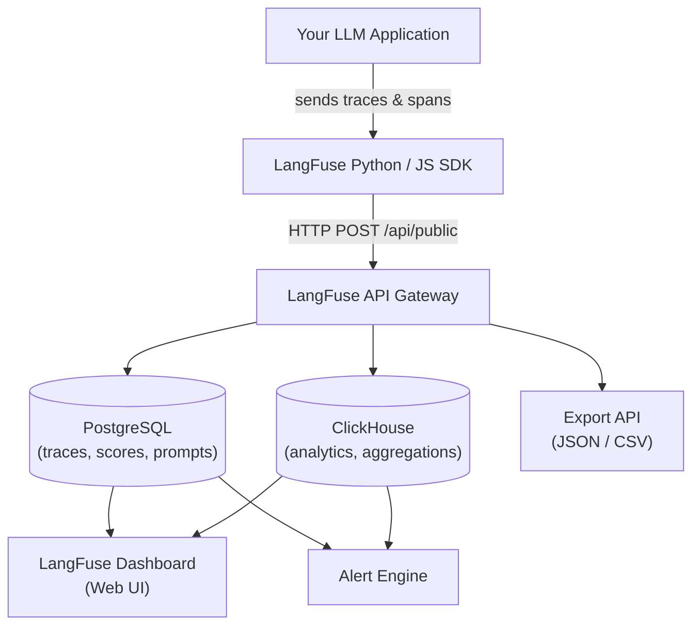
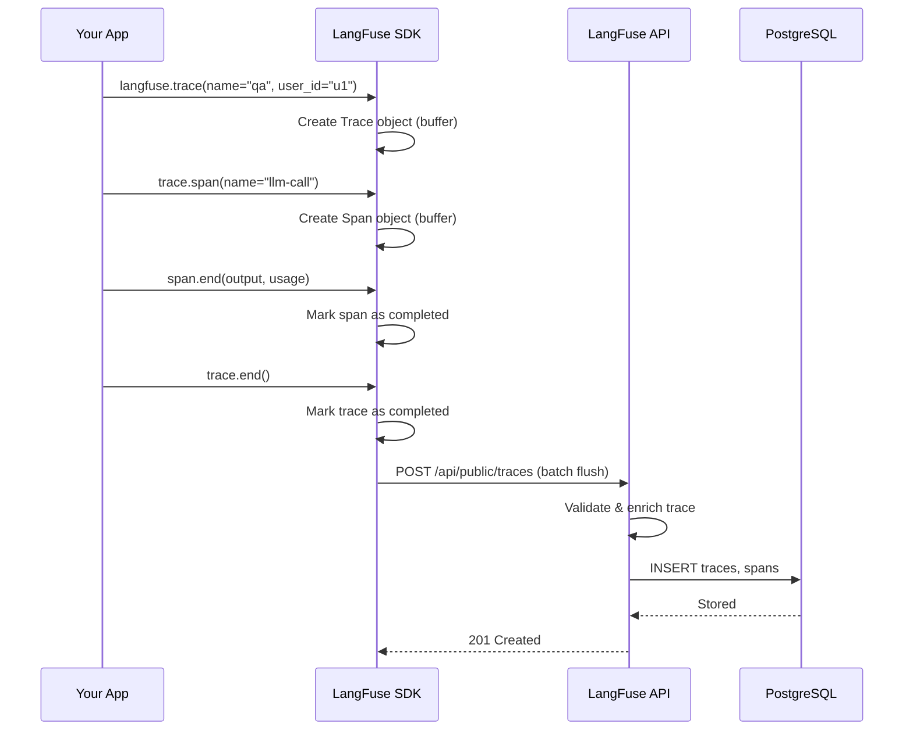
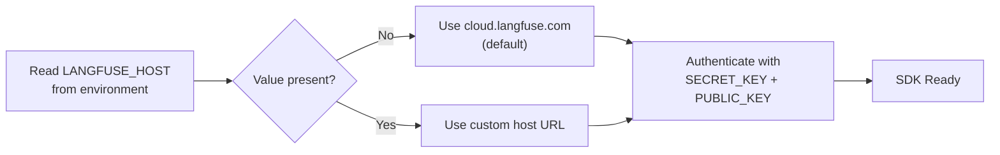

# Visão Geral do LangFuse, Configuração e Integração SDK

LangFuse é uma plataforma open-source de observabilidade e avaliação para aplicações LLM. Ela fornece rastreamento, gerenciamento de prompts, avaliação e monitoramento projetados especificamente para projetos construídos com frameworks como LangChain, LlamaIndex e pipelines Python personalizados.

Esta lição aborda os fundamentos: o que o LangFuse oferece, a diferença entre implantações auto-hospedadas e na nuvem, configuração do projeto, instalação do SDK e criação básica de traces.

---

## O que é o LangFuse?

LangFuse ajuda equipes a:

- **Rastrear** cada etapa de uma chamada LLM — da construção do prompt à resposta do modelo.
- **Avaliar** saídas com pontuações manuais, LLM-como-juiz ou métricas externas.
- **Gerenciar prompts** com controle de versão e fluxos de implantação.
- **Monitorar custos, latência e taxas de erro** em dashboards em tempo real.

> [!WARNING]
> LangFuse **não** é um provedor de modelos ou banco de dados vetorial. É uma camada de observabilidade para a qual sua aplicação envia dados. Você ainda precisa de suas próprias chaves de API LLM (OpenAI, Anthropic, etc.) e infraestrutura.

> [!NOTE]
> LangFuse é totalmente open-source sob a licença MIT. Você pode inspecionar o código-fonte em [github.com/langfuse/langfuse](https://github.com/langfuse/langfuse), contribuir com funcionalidades e auto-hospedar sem taxas de licenciamento.

### Arquitetura do Sistema

O diagrama a seguir mostra como o LangFuse se encaixa em uma pilha de aplicações LLM:



O SDK armazena dados em buffer e os envia de forma assíncrona para a API. A API escreve no PostgreSQL (traces, pontuações, configurações de prompt) e no ClickHouse (análises agregadas para dashboards). A interface do dashboard lê de ambos os armazenamentos.

### Sequência de Criação de Trace

Quando sua aplicação faz uma chamada LLM, a seguinte sequência ocorre:



Os dados são agrupados em lote e enviados periodicamente (a cada 1 segundo por padrão) para minimizar a sobrecarga de rede.

---

## Auto-Hospedado vs Nuvem

| Característica | Auto-Hospedado (OSS) | LangFuse Nuvem |
|---|---|---|
| Esforço de configuração | Alto — requer Docker, PostgreSQL e rede | Baixo — cadastre-se e crie um projeto |
| Residência de dados | Controle total | Gerenciado pela LangFuse |
| Manutenção | Você gerencia upgrades, backups, escalabilidade | Gerenciado pela LangFuse |
| Custo | Apenas custo de infraestrutura | Plano gratuito + planos pagos |
| Atualizações de funcionalidades | Upgrade manual | Automático |
| Escalabilidade | Escalabilidade manual | Auto-escalonamento |
| Alta disponibilidade | Você configura HA | SLA integrado |
| Auditoria de logs | Configurável | Incluído |
| Domínio personalizado | Suportado com proxy reverso | Disponível em planos pagos |

> [!TIP]
> Comece com LangFuse Nuvem durante o desenvolvimento. Leva 2 minutos para configurar. Migre para auto-hospedado depois se precisar de residência de dados ou expectativa de volume muito alto que torne o preço da nuvem antieconômico.

---

## Criando um Projeto e Obtendo Chaves de API

1. Acesse [cloud.langfuse.com](https://cloud.langfuse.com) (ou sua instância auto-hospedada).
2. Cadastre-se e crie uma organização.
3. Crie um projeto (ex.: "Meu Chatbot").
4. Navegue até **Configurações → Chaves de API**.
5. Gere uma **chave pública** e uma **chave secreta**.

Mantenha a chave secreta segura — ela autoriza escritas no seu projeto.

> [!IMPORTANT]
> Rotacione suas chaves secretas periodicamente. O LangFuse Nuvem permite gerar múltiplos pares de chaves e revogar os antigos. Configure um lembrete trimestral de rotação. Se uma chave for comprometida, revogue-a imediatamente em **Configurações → Chaves de API**.

---

## Instalando o SDK Python

```bash
pip install langfuse langchain-openai
```

O pacote `langfuse` fornece o cliente de trace. O pacote `langchain-openai` é usado para exemplos de integração com LangChain neste curso.

### SDKs Suportados

| Linguagem | Pacote | Status | Principais Recursos |
|---|---|---|---|
| Python | `langfuse` | ✅ Estável | Todos os recursos: traces, spans, pontuações, datasets, prompts, decorador `@observe`, callbacks LangChain e LlamaIndex |
| JavaScript / TypeScript | `langfuse` | ✅ Estável | Mesmo conjunto de recursos do Python; suporta LangChain.js, LlamaIndex.ts |
| Go | `langfuse-go` | ✅ Comunidade | Rastreamento e pontuação principais |
| Rust | `langfuse-rs` | ✅ Comunidade | Rastreamento principal |
| REST API | HTTP | ✅ Sempre disponível | Qualquer linguagem pode enviar traces via `POST /api/public/traces` |

> [!NOTE]
> Este curso foca no SDK Python, mas os conceitos são idênticos em todos os SDKs. O contrato da API é o mesmo — cada SDK é um wrapper leve em torno dos endpoints REST.

---

## Inicialização Básica

```python
# init_basica.py
from langfuse import Langfuse

langfuse = Langfuse(
    secret_key="sk-lf-...",      # Substitua pela sua chave secreta
    public_key="pk-lf-...",      # Substitua pela sua chave pública
    host="https://cloud.langfuse.com"  # Ou sua URL auto-hospedada
)

# Verificar conexão
print("LangFuse inicializado:", langfuse.auth_check())
```

> [!WARNING]
> Nunca hard-code chaves de API em produção. Use variáveis de ambiente:
> ```python
> import os
> langfuse = Langfuse(
>     secret_key=os.environ["LANGFUSE_SECRET_KEY"],
>     public_key=os.environ["LANGFUSE_PUBLIC_KEY"],
>     host=os.environ.get("LANGFUSE_HOST", "https://cloud.langfuse.com")
> )
> ```

### Decisão de Configuração Baseada em Ambiente



### Inicialização Assíncrona

Para aplicações assíncronas (FastAPI, Django channels, etc.), o LangFuse fornece um cliente compatível com async:

```python
# async_init.py
import asyncio
from langfuse import Langfuse

langfuse = Langfuse()

async def process_question(question: str) -> str:
    trace = langfuse.trace(name="async-chat", input={"question": question})
    # ... chamada LLM ...
    trace.end(output={"answer": "42"})
    await asyncio.to_thread(langfuse.flush)

asyncio.run(process_question("Qual o sentido da vida?"))
```

### Padrões com Context Manager

O LangFuse suporta o protocolo context manager para fechamento automático de spans:

```python
# context_manager.py
from langfuse import Langfuse

langfuse = Langfuse()

with langfuse.trace(name="chat-session", user_id="user_42") as trace:
    with trace.span(name="llm-call") as span:
        span.end(
            input={"prompt": "Olá"},
            output={"response": "Olá!"},
            usage={"prompt_tokens": 5, "completion_tokens": 3}
        )

    with trace.span(name="retrieval") as retrieval_span:
        retrieval_span.end(input={"query": "docs"}, output={"count": 3})
```

### Tratamento de Erros

Implemente tratamento de erros adequado em torno das chamadas LangFuse para evitar interromper sua aplicação principal:

```python
# error_handling.py
from langfuse import Langfuse
from langfuse.api.core import ApiError

langfuse = Langfuse()

def safe_trace_llm_call(prompt: str) -> dict:
    trace = None
    try:
        trace = langfuse.trace(name="llm-call", input={"prompt": prompt})
        response = call_llm(prompt)

        span = trace.span(name="response")
        span.end(
            output={"response": response},
            usage={"prompt_tokens": len(prompt.split()), "completion_tokens": len(response.split())}
        )
        trace.end(output=response)
        return {"success": True, "response": response}

    except ApiError as e:
        print(f"Erro na API LangFuse: {e.status_code} - {e.body}")
        return {"success": True, "response": response}
    except Exception as e:
        print(f"Erro na aplicação: {e}")
        if trace:
            span = trace.span(name="error")
            span.end(level="ERROR", metadata={"error": str(e)})
            trace.end()
        return {"success": False, "error": str(e)}
    finally:
        langfuse.flush()
```

> [!TIP]
> Se você estiver enfrentando problemas de conexão com o LangFuse, ative o log de depuração para ver o tráfego HTTP bruto:
> ```python
> import logging
> logging.basicConfig(level=logging.DEBUG)
> langfuse = Langfuse(debug=True)
> ```

---

## Criando um Trace Básico

Um **trace** representa uma requisição completa (ex.: uma pergunta do usuário). Dentro de um trace você pode criar **spans** (etapas individuais).

```python
# trace_simples.py
from langfuse import Langfuse

langfuse = Langfuse()

# Iniciar um trace
trace = langfuse.trace(name="hello-world", user_id="user_123")

# Adicionar um span (uma chamada LLM)
span = trace.span(name="llm-call")

# Simular uma resposta LLM
span.end(
    input={"prompt": "Diga olá em francês"},
    output={"response": "Bonjour!"},
    usage={"prompt_tokens": 10, "completion_tokens": 2}
)

print("ID do Trace:", trace.id)
```

---

## LangFuse vs Outras Ferramentas

| Funcionalidade | LangFuse | Weights & Biases | MLflow |
|---|---|---|---|
| Traces nativos para LLM | ✅ Sim | Parcial | ❌ Não |
| Versionamento de prompts | ✅ Integrado | ❌ | ❌ |
| Avaliação LLM-como-juiz | ✅ Nativo | ❌ | ❌ |
| Auto-hospedável | ✅ Open-source | ❌ | ✅ Open-source |
| Integração LangChain | ✅ Primeira-classe | ❌ | ❌ |
| Rastreamento de custos | ✅ Por trace | ❌ | ❌ |
| Gerenciamento de datasets | ✅ Integrado | ❌ | ❌ |
| Regras de alerta | ✅ Integrado | ❌ | ❌ |

---

## Interactive Questions

```question
{
  "id": "lf-1-q1",
  "type": "multiple-choice",
  "question": "Você está construindo um chatbot RAG e precisa depurar por que o modelo às vezes ignora o contexto recuperado. Qual recurso do LangFuse ajuda a inspecionar cada etapa do pipeline?",
  "options": [
    "Versionamento de prompts",
    "Rastreamento com spans aninhados",
    "Avaliação LLM-como-juiz",
    "Dashboards de monitoramento de custos"
  ],
  "correct": 1,
  "explanation": "O rastreamento com spans aninhados captura cada etapa (recuperação, construção do prompt, chamada LLM, formatação da resposta) para que você possa inspecionar entradas e saídas em cada estágio."
}
```

```question
{
  "id": "lf-1-q2",
  "type": "multiple-choice",
  "question": "Qual método inicializa o SDK do LangFuse em uma aplicação Python?",
  "options": [
    "LangChain.init()",
    "LangFuse.initialize()",
    "LangFuse() com chaves secreta e pública",
    "FuseClient.setup()"
  ],
  "correct": 2,
  "explanation": "O construtor LangFuse aceita os parâmetros secret_key, public_key e host para criar um cliente SDK autenticado."
}
```

```question
{
  "id": "lf-1-q3",
  "type": "multiple-choice",
  "question": "Uma chamada LLM em um manipulador de rota FastAPI gerou uma exceção inesperada. Seu trace LangFuse nunca é fechado. Como você deve lidar com isso?",
  "options": [
    "Envolver o trace em um bloco try/finally e chamar trace.end() ou span.end(level='ERROR') na cláusula except",
    "Ignorar — LangFuse fecha automaticamente traces órfãos",
    "Reiniciar o SDK LangFuse após cada exceção",
    "Definir um hook global de exceção que envia um trace dummy"
  ],
  "correct": 0,
  "explanation": "Sempre use try/finally (ou context managers) para garantir o fechamento adequado do trace. Marque spans com level='ERROR' e anexe a mensagem de erro para depuração."
}
```

```question
{
  "id": "lf-1-q4",
  "type": "multiple-choice",
  "question": "Como você deve fornecer chaves de API ao SDK do LangFuse em produção?",
  "options": [
    "Hard-coded diretamente no arquivo fonte Python",
    "Armazenadas em um arquivo JSON simples no repositório",
    "Usar variáveis de ambiente como LANGFUSE_SECRET_KEY",
    "Passá-las como argumentos de linha de comando a cada execução"
  ],
  "correct": 2,
  "explanation": "Variáveis de ambiente mantêm segredos fora do controle de versão e são a melhor prática padrão para implantações em produção."
}
```

```question
{
  "id": "lf-1-q5",
  "type": "multiple-choice",
  "question": "Qual das seguintes NÃO é uma capacidade do LangFuse?",
  "options": [
    "Rastreamento de chamadas LLM com spans aninhados",
    "Versionamento de prompts com rótulos de implantação",
    "Treinamento e fine-tuning de modelos LLM",
    "Avaliação automatizada LLM-como-juiz"
  ],
  "correct": 2,
  "explanation": "LangFuse é uma plataforma de observabilidade e avaliação, não um framework de treinamento de modelos. Use ferramentas como PyTorch, Hugging Face ou APIs de fine-tuning da OpenAI para treinar modelos."
}
```

---

> [!SUCCESS]
> **Principais Conclusões**
> - LangFuse é uma plataforma open-source de observabilidade construída especificamente para aplicações LLM.
> - Você pode usar LangFuse Nuvem ou auto-hospedar com Docker e PostgreSQL.
> - Cada projeto usa um par de chaves pública/secreta para autenticar o SDK.
> - Um trace representa uma requisição completa; spans representam etapas individuais dentro dele.
> - LangFuse integra-se nativamente com LangChain, LlamaIndex e código Python personalizado.
> - Em comparação com W&B e MLflow, LangFuse oferece funcionalidades específicas para LLM como versionamento de prompts e avaliação LLM-como-juiz.
> - Sempre use variáveis de ambiente para chaves de API e envolva traces em tratamento de erros adequado.
