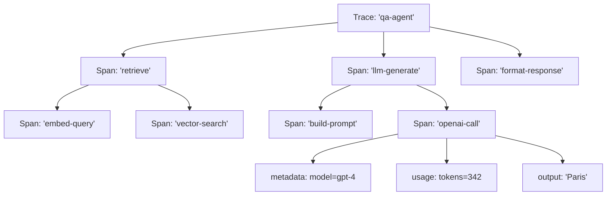
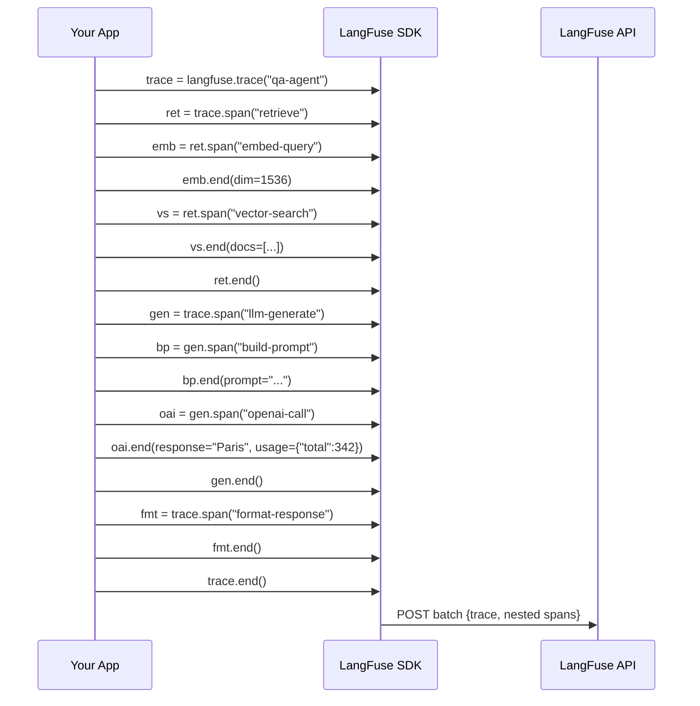
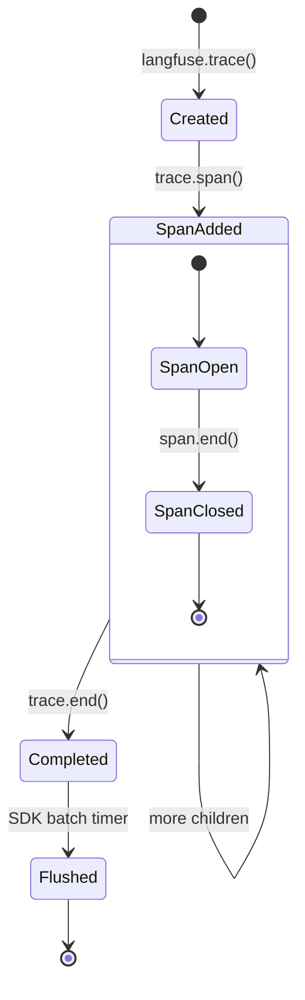

# Rastreamento de Chamadas LLM e Etapas de Agentes

Rastreamento é o núcleo da observabilidade do LangFuse. Cada chamada LLM, etapa de recuperação, invocação de ferramenta ou decisão de agente pode ser capturada como um span estruturado dentro de um trace. Esta lição mostra como construir árvores de trace ricas e aninhadas e como instrumentar pipelines LangChain e LlamaIndex.

---

## Criando Spans e Traces

Cada trace começa com `langfuse.trace()`. Dentro dele, você cria spans para cada etapa lógica:

```python
from langfuse import Langfuse

langfuse = Langfuse()

trace = langfuse.trace(
    name="qa-agent",
    input={"question": "Qual é a capital da França?"},
    user_id="user_42",
    session_id="sess_001"
)
```

Spans podem ser aninhados arbitrariamente:

```python
# Span raiz (ex.: "recuperar documentos")
recuperacao = trace.span(name="recuperar")

# Span filho (ex.: "incorporar consulta")
incorporacao = recuperacao.span(name="incorporar-consulta")
incorporacao.end(
    input={"query": "capital da França"},
    output={"embedding_dim": 1536}
)

# Outro span filho (ex.: "busca vetorial")
busca = recuperacao.span(name="busca-vetorial")
busca.end(
    input={"top_k": 5},
    output={"results": ["doc1", "doc3", "doc7"]}
)

recuperacao.end()
```

> [!NOTE]
> Um **trace** representa uma requisição completa de ponta a ponta (uma consulta de usuário). Um **span** representa uma única operação dentro dessa requisição. Múltiplos spans formam uma hierarquia em árvore. O span raiz de um trace é seu primeiro span; todos os outros são filhos de algum span pai.

> [!WARNING]
> Sempre chame `.end()` em um span quando a operação terminar. Spans órfãos (sem `.end()`) permanecerão "abertos" no dashboard do LangFuse e distorcerão as métricas de latência. Use o padrão context manager (`with trace.span() as s:`) para garantir o fechamento.

---

## Hierarquia de Trace (Diagrama ASCII)



Cada span pode conter seus próprios `input`, `output`, `metadata`, `usage` e `level` (DEBUG, WARNING, ERROR).

### Hierarquia de Span Aninhado (Sequência)



### Ciclo de Vida do Trace



---

## Adicionando Metadados e Pontuações

```python
# Adicionando metadados a um span
span = trace.span(
    name="llm-call",
    metadata={
        "model": "gpt-4",
        "temperature": 0.7,
        "max_tokens": 500
    }
)

# Adicionando uma pontuação após o span terminar
trace.score(
    name="utilidade",
    value=0.85,
    comment="Boa resposta, mas poderia ser mais curta"
)

# Tipos de pontuação: NUMERIC, BOOLEAN, CATEGORICAL
trace.score(name="toxicidade", value=False, data_type="BOOLEAN")
trace.score(name="dificuldade", value="medio", data_type="CATEGORICAL")
```

> [!WARNING]
> Pontuações são anexadas a um trace ou span **após** o fato. Elas não bloqueiam a execução. Certifique-se de ter uma referência ao objeto trace/span (ou seu ID) para pontuá-lo posteriormente.

> [!TIP]
> Use metadados para marcar spans com contexto de negócio: `environment`, `region`, `model_version`, `prompt_template_name`, `user_tier`. Esses campos se tornam dimensões filtráveis nos dashboards. A marcação consistente em todos os spans permite filtros cruzados poderosos.

### Tipos de Dados de Pontuação

| Tipo de Dado | Exemplo Python | Exibição no Dashboard | Caso de Uso |
|---|---|---|---|
| NUMERIC | `value=0.85` | Histograma, avg/min/max | Corretude, utilidade, relevância |
| BOOLEAN | `value=True` | Taxa de aprovação/reprovação, gráfico de pizza | Toxicidade, verificações de segurança, guardrails |
| CATEGORICAL | `value="medio"` | Gráfico de barras, distribuição | Dificuldade, prioridade, classe de intenção |

---

## Rastreando Execuções LangChain

O LangFuse fornece um callback handler para LangChain que auto-instrumenta chains:

```python
from langfuse.callback import CallbackHandler
from langchain_openai import ChatOpenAI
from langchain_core.prompts import ChatPromptTemplate

# Criar o handler (um por projeto)
langfuse_handler = CallbackHandler()

prompt = ChatPromptTemplate.from_template("Conte uma piada curta sobre {topico}")
model = ChatOpenAI(model="gpt-4")
chain = prompt | model

# O handler conecta-se automaticamente a cada etapa
resultado = chain.invoke({"topico": "programação"}, config={"callbacks": [langfuse_handler]})
```

Cada etapa do LangChain (template de prompt, chamada LLM, parser, recuperador) torna-se um span separado dentro de um único trace.

### Avançado: Agente LangChain com Ferramentas

```python
from langfuse.callback import CallbackHandler
from langchain.agents import create_openai_functions_agent, AgentExecutor
from langchain.tools import tool
from langchain_openai import ChatOpenAI

langfuse_handler = CallbackHandler()

@tool
def get_weather(city: str) -> str:
    """Get the current weather for a city."""
    return f"Sunny, 22°C in {city}"

@tool
def calculate(expression: str) -> str:
    """Evaluate a mathematical expression."""
    return str(eval(expression))

llm = ChatOpenAI(model="gpt-4")
agent = create_openai_functions_agent(llm, [get_weather, calculate])
executor = AgentExecutor(agent=agent, tools=[get_weather, calculate])

result = executor.invoke(
    {"input": "What is the weather in Paris plus 5?"},
    config={"callbacks": [langfuse_handler]}
)
```

Cada invocação de ferramenta aparece como um span filho separado, e o loop de raciocínio do agente cria uma árvore de trace que mostra o caminho completo da decisão.

---

## Rastreando Pipelines LlamaIndex

```python
from langfuse.llama_index import LlamaIndexCallbackHandler
from llama_index.core import VectorStoreIndex, SimpleDirectoryReader

# Inicializar handler
handler = LlamaIndexCallbackHandler()

documentos = SimpleDirectoryReader("./data").load_data()
index = VectorStoreIndex.from_documents(documentos)

query_engine = index.as_query_engine()
resposta = query_engine.query("O que é LangFuse?")

# Descarregar traces
handler.flush()
```

---

## Instrumentação Personalizada com Decoradores

Para controle máximo, use o decorador `@observe()`:

```python
from langfuse.decorators import observe

@observe()
def obter_clima(cidade: str) -> str:
    """Esta função é rastreada automaticamente."""
    resposta = call_weather_api(cidade)
    return resposta

@observe(as_type="generation")
def chamar_llm(prompt: str, model: str = "gpt-4") -> str:
    """Marca este span como uma 'generation' (chamada LLM)."""
    ...
```

> [!WARNING]
> O decorador `@observe` funciona com **qualquer** função Python, não apenas chamadas LLM. Use o parâmetro `as_type` para distinguir gerações (chamadas LLM) de spans regulares.

### Avançado: Instrumentação Personalizada com Agrupamento de Traces

Agrupe traces relacionados sob uma única sessão para conversas abrangentes de múltiplas interações:

```python
# trace_grouping.py
from langfuse import Langfuse
from langfuse.decorators import observe

langfuse = Langfuse()

@observe()
def process_message(session_id: str, message: str, turn_number: int) -> str:
    """Process a single message in a multi-turn conversation."""
    context = retrieve_context(message)
    response = generate_response(message, context)

    trace = langfuse.current_trace()
    if trace:
        trace.score(name="coherence", value=0.9, data_type="NUMERIC")
        trace.update(session_id=session_id)

    return response

@observe(as_type="generation")
def generate_response(message: str, context: str) -> str:
    """Call the LLM with context."""
    return "Paris é a capital da França."

session_1 = "sess_conversation_001"
for i, msg in enumerate(["Olá!", "Qual é a capital da França?"]):
    process_message(session_1, msg, i + 1)

langfuse.flush()
```

> [!TIP]
> Ao rastrear loops de agentes, defina `session_id` em cada trace para que o dashboard do LangFuse agrupe todas as interações de uma conversa. Você pode então filtrar por sessão para reproduzir toda a trajetória do agente.

---

## Comparação: Abordagens de Instrumentação

| Abordagem | Esforço | Granularidade | Escopo automático | Melhor para |
|---|---|---|---|---|
| Spans manuais | Alto | Controle total | Manual | Pipelines personalizados, pesquisa |
| CallbackHandler LangChain | Baixo | Por etapa da chain | Automático | Aplicações LangChain |
| CallbackHandler LlamaIndex | Baixo | Por etapa do índice | Automático | Aplicações LlamaIndex |
| Decorador `@observe` | Médio | Por função | Envolve a função | Qualquer código Python |

### Visão Geral dos Tipos de Span

| Tipo de Span | Convenção de `name` | Metadados Recomendados | Rastreamento de Uso |
|---|---|---|---|
| **Geração LLM** | `llm-call`, `openai-completion`, `anthropic-generate` | `model`, `temperature`, `max_tokens`, `provider` | `prompt_tokens`, `completion_tokens`, `total` |
| **Recuperação** | `vector-search`, `embed-query`, `bm25-search` | `top_k`, `index_name`, `embedding_model` | Geralmente nenhum |
| **Execução de Ferramenta** | `get_weather`, `calculate`, `search_web` | `tool_name`, `tool_input` | Geralmente nenhum |
| **Lógica / Roteamento** | `classify-intent`, `guardrail-check`, `format-response` | `decision`, `confidence` | Geralmente nenhum |
| **Manipulador de Erro** | `error-handling`, `fallback` | `error_type`, `retry_count` | Geralmente nenhum |

---

## Interactive Questions

```question
{
  "id": "lf-2-q1",
  "type": "multiple-choice",
  "question": "Um agente faz 3 chamadas de ferramenta em sequência. Cada chamada de ferramenta deve aparecer como um span separado enquanto compartilha o mesmo trace pai. Como você estrutura isso?",
  "options": [
    "Criar 3 traces separados com langfuse.trace()",
    "Criar 1 trace, depois chamar trace.span() para cada chamada de ferramenta",
    "Usar 3 callback handlers diferentes",
    "Usar @observe() em cada função de ferramenta sem um trace pai"
  ],
  "correct": 1,
  "explanation": "Um trace representa a requisição inteira. Cada chamada de ferramenta torna-se um span filho via trace.span(). Isso mantém todas as operações sob um único trace para visibilidade de ponta a ponta."
}
```

```question
{
  "id": "lf-2-q2",
  "type": "multiple-choice",
  "question": "Qual classe do LangFuse instrumenta automaticamente chains do LangChain sem criação manual de spans?",
  "options": [
    "LangFuseCallback",
    "CallbackHandler",
    "ChainObserver",
    "LangChainTracer"
  ],
  "correct": 1,
  "explanation": "langfuse.callback.CallbackHandler conecta-se ao sistema de callbacks do LangChain e cria spans automaticamente para cada etapa da chain."
}
```

```question
{
  "id": "lf-2-q3",
  "type": "multiple-choice",
  "question": "O que o decorador @observe() faz quando aplicado a uma função Python?",
  "options": [
    "Ele armazena em cache a saída da função para reuso",
    "Ele registra os parâmetros da função em um arquivo local",
    "Ele rastreia automaticamente cada chamada como um span no LangFuse",
    "Ele valida os argumentos da função contra um esquema"
  ],
  "correct": 2,
  "explanation": "O decorador @observe() de langfuse.decorators envolve a função e cria um span LangFuse para cada invocação automaticamente."
}
```

```question
{
  "id": "lf-2-q4",
  "type": "multiple-choice",
  "question": "Depois que um trace é criado, como anexar uma pontuação a ele?",
  "options": [
    "Passar a pontuação como parâmetro para langfuse.trace()",
    "Chamar trace.score(name='utilidade', value=0.85)",
    "Incluir a pontuação no dicionário de metadados do span",
    "Pontuações são anexadas automaticamente pelo SDK"
  ],
  "correct": 1,
  "explanation": "trace.score() é chamado no objeto trace ou span após a operação ser concluída. As pontuações podem ser NUMERIC, BOOLEAN ou CATEGORICAL."
}
```

```question
{
  "id": "lf-2-q5",
  "type": "multiple-choice",
  "question": "Você percebe que um span permanece 'aberto' no dashboard do LangFuse por horas. Qual é a causa mais provável?",
  "options": [
    "O trace tem muitos spans aninhados",
    "O buffer do SDK não foi enviado ainda",
    "span.end() nunca foi chamado naquele span",
    "O servidor LangFuse está limitando a taxa do seu projeto"
  ],
  "correct": 2,
  "explanation": "Um span aberto significa que .end() não foi chamado. Use o padrão context manager (with trace.span() as s:) para fechar spans automaticamente na saída do escopo."
}
```

---

> [!SUCCESS]
> **Principais Conclusões**
> - Um trace envolve uma requisição inteira; spans capturam operações individuais em uma estrutura de árvore.
> - Sempre chame `.end()` nos spans, ou use context managers para fechamento automático.
> - Metadados e tags tornam spans filtráveis no dashboard — seja consistente com os nomes das chaves.
> - Callbacks do LangChain e LlamaIndex fornecem instrumentação com esforço zero.
> - O decorador `@observe()` dá controle refinado sobre código Python personalizado.
> - Use `session_id` para agrupar conversas de múltiplas interações e trajetórias de agentes.
