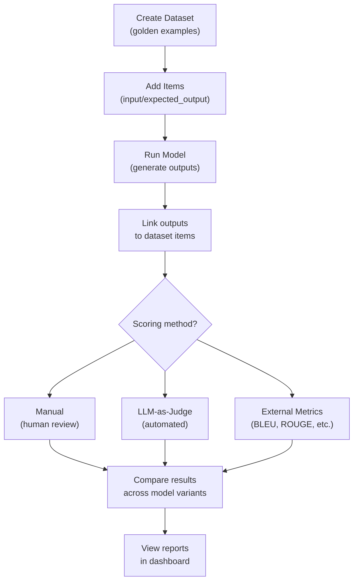
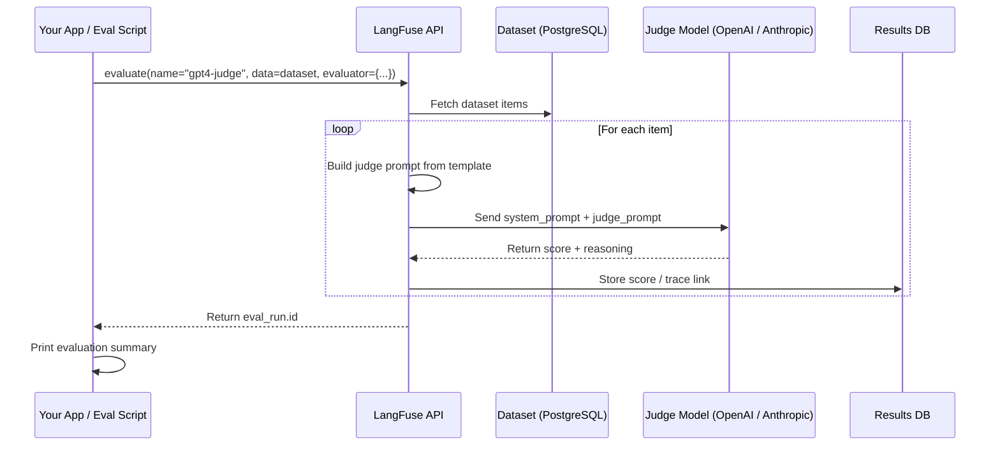
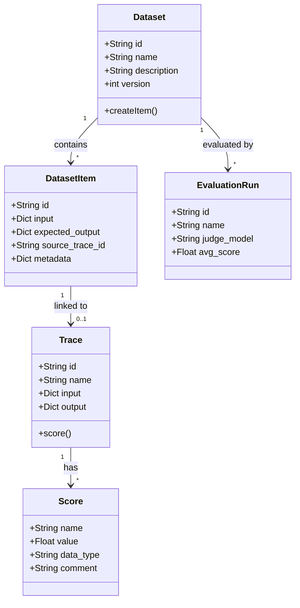

# Avaliações, Datasets e Pontuação LLM-como-Juiz

A avaliação é essencial para construir aplicações LLM confiáveis. O LangFuse fornece três métodos complementares de avaliação: pontuação manual, LLM-como-juiz e computação de métricas externas. Esta lição aborda cada abordagem e mostra como estruturar datasets, executar avaliações e comparar saídas de modelos.

---

## Criando Datasets

Datasets armazenam pares esperados de entrada-saída (exemplos dourados). Eles servem como verdade fundamental para execuções de avaliação.

```python
from langfuse import Langfuse

langfuse = Langfuse()

# Criar um dataset
dataset = langfuse.create_dataset(
    name="corretude-qa",
    description="Conjunto de teste de corretude para Q&A factual"
)

# Adicionar itens (entrada + saída esperada)
dataset.create_item(
    input={"question": "Qual é a capital da França?"},
    expected_output="Paris"
)

dataset.create_item(
    input={"question": "Em que ano o Muro de Berlim caiu?"},
    expected_output="1989"
)
```

> [!WARNING]
> Itens de dataset são **imutáveis** após a criação. Para atualizar um caso de teste, crie uma nova versão do dataset ou adicione um novo item com um ID diferente.

> [!IMPORTANT]
> O versionamento de datasets segue um modelo linear. Quando você modifica um dataset (adiciona/remove itens), o LangFuse cria uma nova versão. Traces vinculados a versões mais antigas do dataset ainda referenciam os itens originais. Isso garante que os resultados históricos de avaliação permaneçam reproduzíveis mesmo com a evolução do conjunto de teste.

### Criando Datasets a Partir de Traces Existentes

```python
# dataset_from_traces.py
langfuse = Langfuse()

dataset = langfuse.create_dataset(
    name="exemplos-producao",
    description="Exemplos bons selecionados da produção"
)

trace_ids = ["trace_abc123", "trace_def456", "trace_ghi789"]
for tid in trace_ids:
    trace = langfuse.fetch_trace(tid)
    if trace:
        dataset.create_item(
            input=trace.input,
            expected_output=trace.output,
            source_trace_id=tid
        )
```

### Pipeline de Avaliação (Fluxograma)



---

## Pontuação de Avaliação Manual

Após gerar traces, você pode anexar pontuações humanas:

```python
trace = langfuse.trace(name="teste-avaliacao", input="...")

# Depois, após revisar a saída
trace.score(
    name="corretude",
    value=0.9,            # Numérico: 0.0 a 1.0
    comment="Correto, resposta bem estruturada"
)

trace.score(
    name="toxicidade",
    value=False,          # Booleano
    data_type="BOOLEAN"
)
```

### Funções de Pontuação Personalizadas

```python
# custom_scoring.py
from langfuse import Langfuse

langfuse = Langfuse()

def score_factual_correctness(expected: str, actual: str) -> float:
    expected_words = set(expected.lower().split())
    actual_words = set(actual.lower().split())
    if not expected_words:
        return 0.0
    overlap = len(expected_words & actual_words)
    return round(overlap / len(expected_words), 2)

def score_length_compliance(expected_max_words: int, actual: str) -> bool:
    return len(actual.split()) <= expected_max_words

dataset = langfuse.get_dataset("corretude-qa")

for item in dataset.items:
    model_output = "Paris"

    trace = langfuse.trace(
        name="custom-scoring",
        input=item.input,
        output=model_output
    )

    correctness = score_factual_correctness(
        item.expected_output["text"], model_output
    )
    trace.score(name="accuracy", value=correctness, data_type="NUMERIC")

    length_ok = score_length_compliance(
        item.metadata.get("max_words", 100), model_output
    )
    trace.score(name="concise", value=length_ok, data_type="BOOLEAN")

langfuse.flush()
```

> [!TIP]
> Projete seus critérios de avaliação antes de escrever uma única linha de código. Para cada dimensão de saída (corretude, tom, segurança, formato), decida:
> 1. O que constitui uma pontuação de aprovação?
> 2. É numérica (0-1), booleana (aprovado/reprovado) ou categórica (bom/regular/ruim)?
> 3. Pode ser automatizada ou requer julgamento humano?
> 4. Qual confiabilidade entre avaliadores você espera para avaliações humanas?

---

## Avaliação LLM-como-Juiz

LangFuse pode usar um LLM para julgar suas saídas automaticamente. Isso requer um modelo configurado (ex.: GPT-4) na interface do LangFuse ou via SDK.

```python
from langfuse import Langfuse

langfuse = Langfuse()

# Executar uma avaliação LLM-como-juiz
exec_avaliacao = langfuse.evaluate(
    name="juiz-gpt4-corretude",
    data=dataset,                               # Dataset acima
    evaluator={
        "model": "gpt-4",                       # Modelo juiz
        "system_prompt": (
            "Você avalia factualidade. Pontue 0-1 com base na corretude. "
            "Seja rigoroso: erros parciais reduzem a pontuação."
        ),
        "template": (
            "Pergunta: {input}\n"
            "Esperado: {expected_output}\n"
            "Real: {output}\n"
            "Pontuação: "
        ),
        "mapping": {"output": "output"},
    }
)

print("ID da execução:", exec_avaliacao.id)
```

O modelo juiz compara a saída real com a saída esperada e retorna uma pontuação.

### Sequência LLM-como-Juiz



---

## Executando Avaliações em Variantes de Modelo

Compare duas versões de modelo no mesmo dataset:

```python
# Avaliar respostas do GPT-4
resultados_gpt4 = langfuse.evaluate(
    name="avaliacao-gpt4",
    data=dataset,
    evaluator={"model": "gpt-4", ...}
)

# Avaliar respostas do Claude
resultados_claude = langfuse.evaluate(
    name="avaliacao-claude",
    data=dataset,
    evaluator={"model": "gpt-4", ...}  # Mesmo juiz para ambos
)
```

O LangFuse permite sobrepor resultados de diferentes execuções para comparar pontuações lado a lado.

---

## Pipelines de Avaliação Automatizados

Para integração CI/CD, automatize a avaliação com um script:

```python
# pipeline_avaliacao.py
from langfuse import Langfuse
from langfuse.decorators import observe

langfuse = Langfuse()

dataset = langfuse.get_dataset("corretude-qa")

for item in dataset.items:
    # Executar seu modelo
    resposta = seu_modelo.invoke(item.input["question"])

    # Criar um trace vinculado a este item do dataset
    trace = langfuse.trace(
        name="avaliacao-pipeline",
        input=item.input,
        output=resposta
    )

    # Pontuar manualmente ou chamar juiz LLM
    trace.score(name="corretude", value=calcular_pontuacao(resposta, item.expected_output))

langfuse.flush()
```

> [!WARNING]
> Sempre chame `langfuse.flush()` ao final de um script em lote para garantir que todos os traces e pontuações sejam enviados antes da saída do processo.

### Executando Avaliações em Lote com Acompanhamento de Progresso

```python
# batch_eval.py
from langfuse import Langfuse

langfuse = Langfuse()

dataset = langfuse.get_dataset("corretude-qa")
items = list(dataset.items)
total = len(items)
print(f"Executando avaliação em {total} itens...")

for idx, item in enumerate(items, 1):
    try:
        output = seu_modelo.generate(item.input["question"])

        trace = langfuse.trace(
            name="batch-eval",
            session_id=f"batch-{dataset.name}-v{dataset.version}",
            input=item.input,
            metadata={"batch_item": idx, "dataset_version": dataset.version}
        )

        trace.score(name="corretude", value=compute_score(output, item.expected_output))
        trace.end(output=output)

        print(f"  [{idx}/{total}] Processado: {item.id}")

    except Exception as e:
        print(f"  [{idx}/{total}] FALHOU: {item.id} - {e}")

    if idx % 10 == 0:
        langfuse.flush()

langfuse.flush()
print("Avaliação em lote concluída.")
```

---

## Comparação: Métodos de Avaliação

| Método | Automação | Custo | Consistência | Melhor para |
|---|---|---|---|---|
| Pontuação manual | Baixa (revisão humana) | Grátis (tempo humano) | Baixa (subjetiva) | Exploratória, qualitativa |
| LLM-como-juiz | Alta | Custo de tokens do juiz | Média (depende do juiz) | Tarefas factuais em larga escala |
| Métricas externas (BLEU, ROUGE, etc.) | Alta | Grátis (computação) | Alta | Tradução, sumarização |

### Comparação Detalhada: Configurações LLM-como-Juiz

| Modelo Juiz | Custo por 1K avaliações | Qualidade Típica | Latência por avaliação | Notas |
|---|---|---|---|---|
| GPT-4o | ~$3-5 | Excelente | 2-5s | Melhor para pontuação diferenciada |
| GPT-4o-mini | ~$0.5-1 | Boa | 1-2s | Bom equilíbrio para a maioria das tarefas |
| Claude 3.5 Sonnet | ~$3-4 | Excelente | 2-4s | Forte em segurança/direitos autorais |
| Llama 3 (auto-hospedado) | ~$0.10 (computação) | Bom-Variável | 3-10s | Requer GPU, privacidade total de dados |
| Juiz fine-tuned personalizado | Variável | Direcionada | Variável | Melhor para critérios específicos de domínio |

### Quando Usar Cada Método de Avaliação

| Cenário | Método Recomendado | Por quê |
|---|---|---|
| Prototipando um novo recurso | Pontuação manual | Iteração rápida, construção de intuição |
| Teste de regressão antes do lançamento | LLM-como-juiz | Escalável, reproduzível, objetivo |
| Comparando LLM A vs LLM B | LLM-como-juiz + mesmo dataset | Comparação controlada, mesmo juiz |
| Avaliação de qualidade de tradução | BLEU / chrF | Métricas NLP bem estabelecidas |
| Filtragem de segurança de conteúdo | LLM-como-juiz + pontuações BOOLEAN | Decisões de segurança diferenciadas precisam de raciocínio LLM |
| Validação de gate CI/CD | LLM-como-juiz + limite | Aprovação/reprovação automatizada antes do merge |

---

### Modelo de Dados de Avaliação



---

## Interactive Questions

```question
{
  "id": "lf-3-q1",
  "type": "multiple-choice",
  "question": "Qual é o propósito de um dataset em fluxos de avaliação do LangFuse?",
  "options": [
    "Armazenar dados de treinamento para fine-tuning de modelos",
    "Manter pares dourados de entrada-saída usados como verdade fundamental para avaliação",
    "Armazenar em cache respostas LLM para inferência mais rápida",
    "Definir limites de alerta para monitoramento"
  ],
  "correct": 1,
  "explanation": "Um dataset no LangFuse contém pares dourados (verdade fundamental) de entrada-saída contra os quais as saídas do modelo são comparadas durante a avaliação."
}
```

```question
{
  "id": "lf-3-q2",
  "type": "multiple-choice",
  "question": "Qual método cria um dataset e o povoa com casos de teste?",
  "options": [
    "langfuse.create_dataset() depois dataset.create_item()",
    "langfuse.new_test_set() depois test_set.add_case()",
    "dataset = Dataset(name='...') depois dataset.add()",
    "langfuse.upload_csv('dataset.csv')"
  ],
  "correct": 0,
  "explanation": "langfuse.create_dataset() cria o contêiner, depois dataset.create_item() adiciona pares individuais de entrada-saída."
}
```

```question
{
  "id": "lf-3-q3",
  "type": "multiple-choice",
  "question": "Em uma avaliação LLM-como-juiz, o que o modelo juiz compara para produzir uma pontuação?",
  "options": [
    "O prompt de entrada do usuário contra o prompt do sistema",
    "A saída real contra a saída esperada",
    "O uso de tokens de dois modelos diferentes",
    "A latência da aplicação contra um objetivo de nível de serviço"
  ],
  "correct": 1,
  "explanation": "O juiz compara a saída real do modelo contra o expected_output do item do dataset, guiado pelo system_prompt e template."
}
```

```question
{
  "id": "lf-3-q4",
  "type": "multiple-choice",
  "question": "Por que você deve chamar langfuse.flush() ao final de um script de avaliação em lote?",
  "options": [
    "Para redefinir o dataset para a próxima execução de avaliação",
    "Para limpar o cache local de prompts",
    "Para garantir que todos os traces e pontuações pendentes sejam enviados antes da saída",
    "Para deletar traces antigos do servidor"
  ],
  "correct": 2,
  "explanation": "flush() força o buffer do SDK a enviar todos os traces e pontuações enfileirados. Sem ele, os dados podem ser perdidos quando o processo termina."
}
```

```question
{
  "id": "lf-3-q5",
  "type": "multiple-choice",
  "question": "Sua equipe quer adicionar uma etapa de avaliação automatizada ao pipeline CI/CD que bloqueie deploys se a corretude cair abaixo de 80%. Qual abordagem você deve usar?",
  "options": [
    "Pontuação manual pela equipe de QA após cada deploy",
    "Avaliação LLM-como-juiz com um limite de aprovação/reprovação na execução gpt4-judge-correctness",
    "Pontuação BLEU externa, que mede qualidade de tradução",
    "Configurar um alerta LangFuse que envia email para a equipe quando a corretude está baixa"
  ],
  "correct": 1,
  "explanation": "LLM-como-juiz fornece pontuação automatizada e escalável. Script da chamada evaluate() no CI/CD, compare a pontuação média contra o limite de 0,8 e falhe o pipeline se estiver abaixo."
}
```

---

> [!SUCCESS]
> **Principais Conclusões**
> - Datasets armazenam pares dourados de entrada-saída usados como verdade fundamental para avaliação.
> - Três métodos de avaliação: pontuação manual, LLM-como-juiz e métricas externas.
> - LLM-como-juiz usa um modelo configurado (ex.: GPT-4) para pontuar saídas automaticamente.
> - Compare variantes de modelo executando avaliações separadas no mesmo dataset.
> - Sempre chame `langfuse.flush()` ao final de scripts de avaliação em lote.
> - Projete seus critérios de pontuação antecipadamente e escolha o modelo juiz certo para cada dimensão.
