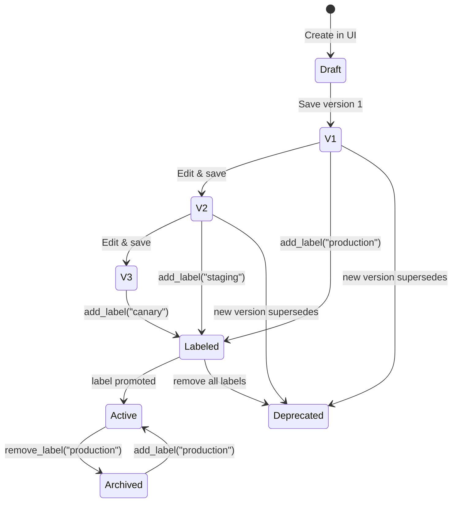
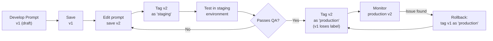
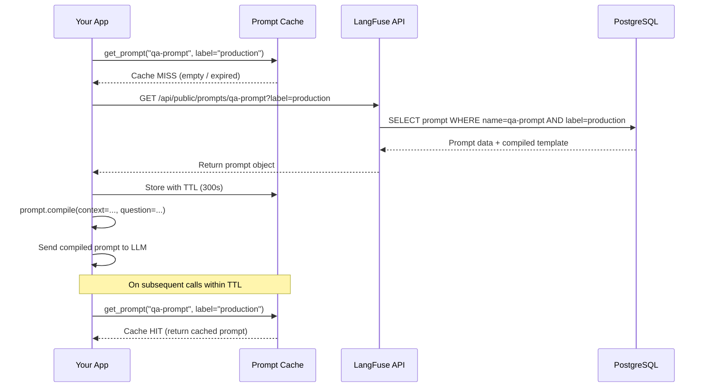

# Gerenciamento de Prompts e Controle de Versão

A engenharia de prompts é iterativa. O LangFuse fornece um registro centralizado de prompts com controle de versão, rótulos de implantação e busca via SDK — para que seus prompts estejam sempre sincronizados entre ambientes.

---

## Criando Prompts na Interface do LangFuse

1. Navegue até **Prompts** na interface do LangFuse.
2. Clique em **Novo Prompt**.
3. Dê um nome (ex.: `prompt-sistema-qa`).
4. Escreva o conteúdo do prompt. Use `{{variavel}}` para placeholders.

```
Você é um assistente prestativo. Responda à pergunta com base no contexto.

Contexto:
{{contexto}}

Pergunta:
{{pergunta}}

Responda concisamente em {{idioma}}.
```

5. Salve como **versão 1**.

---

## Versionamento de Prompts

Cada vez que você edita e salva um prompt, o LangFuse incrementa o número da versão. Você pode:

- Ver o histórico completo de versões.
- Comparar duas versões lado a lado.
- Reverter para uma versão anterior.

```python
# Listar versões de um prompt
prompt = langfuse.get_prompt("prompt-sistema-qa")
print("Versão atual:", prompt.version)
print("Rótulos:", prompt.labels)  # ex.: ["production", "staging"]
```

> [!WARNING]
> Versões de prompt são **imutáveis**. Você não pode editar uma versão salva. Sempre crie uma nova versão e promova-a para produção quando estiver pronta.

### Ciclo de Vida da Versão do Prompt



As versões são somente adição. Uma vez salva, o conteúdo de uma versão nunca muda. Os rótulos se movem entre as versões para indicar qual está ativa em cada ambiente.

---

## Implantando Versões com Rótulos

Rótulos permitem promover uma versão específica para um ambiente:

| Rótulo | Propósito |
|---|---|
| `production` | Prompt ativo usado em produção |
| `staging` | Versão de pré-lançamento para teste |
| `development` | Última versão em desenvolvimento |
| Rótulo personalizado | Qualquer rótulo (ex.: `canary`, `us_east`, `ab_test_a`) |

Você pode definir rótulos via interface ou SDK:

```python
# Promover versão 3 para produção
prompt = langfuse.get_prompt("prompt-sistema-qa", version=3)
prompt.add_label("production")
```

### Fluxo de Trabalho de Implantação



> [!TIP]
> Use variáveis de ambiente para determinar qual rótulo sua aplicação busca em tempo de execução. Isso permite implantar o mesmo código de aplicação em vários ambientes enquanto cada ambiente usa sua própria versão de prompt.

---

## Buscando Prompts via SDK

Sua aplicação busca o prompt em tempo de execução:

```python
from langfuse import Langfuse

langfuse = Langfuse()

# Buscar a versão de produção
prompt = langfuse.get_prompt("prompt-sistema-qa", label="production")

# O texto do prompt compilado com variáveis
mensagem_sistema = prompt.compile(
    contexto="LangFuse é uma ferramenta de observabilidade LLM.",
    pergunta="O que o LangFuse faz?",
    idioma="Português"
)

print(mensagem_sistema)
# Saída:
# Você é um assistente prestativo. Responda à pergunta com base no contexto.
# ...
```

> [!WARNING]
> Se o prompt ou rótulo não existir, `get_prompt()` lança um `LangFuseNotFoundError`. Sempre trate esta exceção em código de produção.

### Busca com Cache

Para uso em produção, armazene em cache o prompt buscado para reduzir chamadas de rede:

```python
# cached_prompt.py
from functools import lru_cache
from langfuse import Langfuse
from langfuse.api.core import ApiError

langfuse = Langfuse()

class PromptManager:
    """Gerenciador de prompts em cache com TTL."""
    def __init__(self, ttl_seconds: int = 300):
        self._cache = {}
        self._ttl = ttl_seconds

    def get_prompt(self, name: str, label: str = "production"):
        cache_key = f"{name}:{label}"
        if cache_key in self._cache:
            entry = self._cache[cache_key]
            if entry["expires_at"] > time.time():
                return entry["prompt"]

        prompt = langfuse.get_prompt(name, label=label)
        self._cache[cache_key] = {
            "prompt": prompt,
            "expires_at": time.time() + self._ttl
        }
        return prompt

manager = PromptManager(ttl_seconds=300)
prompt = manager.get_prompt("prompt-sistema-qa", label="production")
compiled = prompt.compile(
    contexto="...",
    pergunta="...",
    idioma="Português"
)
```

> [!TIP]
> Armazene prompts em cache com TTL de 5 minutos em produção. Isso reduz chamadas de API enquanto mantém as atualizações de prompt dentro de uma janela razoável. Se você precisar de atualizações sem atraso, defina um TTL mais curto ou use webhooks do LangFuse para invalidar o cache.

---

## Templates de Prompt com Variáveis

LangFuse usa sintaxe `{{variavel}}` (estilo Handlebars) para variáveis de template. As variáveis são injetadas em tempo de execução via `prompt.compile(**kwargs)`.

```python
# Na interface: "Resuma este {{texto}} em {{max_palavras}} palavras."
prompt = langfuse.get_prompt("sumarizador", label="production")

compilado = prompt.compile(
    texto="Conteúdo longo do artigo aqui...",
    max_palavras="50"
)
```

Você também pode definir valores padrão na interface para que variáveis sejam opcionais.

### Validação de Variáveis de Template

Valide se todas as variáveis necessárias foram fornecidas antes de chamar o LLM:

```python
# validate_variables.py
import re
from langfuse import Langfuse

langfuse = Langfuse()

def validate_prompt_variables(prompt, **kwargs):
    template_vars = set(re.findall(r'\{\{(\w+)\}\}', prompt.prompt))
    provided = set(kwargs.keys())
    missing = template_vars - provided

    if missing:
        raise ValueError(
            f"Variáveis de template ausentes: {', '.join(sorted(missing))}. "
            f"Fornecidas: {', '.join(sorted(provided))}"
        )

    extra = provided - template_vars
    if extra:
        print(f"Aviso: variáveis não utilizadas fornecidas: {', '.join(sorted(extra))}")

    return True

prompt = langfuse.get_prompt("prompt-sistema-qa", label="production")

validate_prompt_variables(prompt, contexto="...", pergunta="...", idioma="Português")
```

---

## Prompts de Produção vs Staging

Um fluxo de trabalho comum:

```
Versão 1 ──→ rótulo: production
Versão 2 ──→ rótulo: staging

Enquanto v2 é testada em staging, v1 permanece ativa em produção.
Após validar v2, promova-a:
  v2.add_label("production")   # v1 perde "production" se v2 assumir
  v1.remove_label("production")
```

```python
# Ambiente de staging busca o prompt de staging
if os.environ.get("ENV") == "staging":
    prompt = langfuse.get_prompt("prompt-sistema-qa", label="staging")
else:
    prompt = langfuse.get_prompt("prompt-sistema-qa", label="production")
```

### Criando Variantes de Prompt para Teste A/B

Teste duas versões de prompt simultaneamente em diferentes segmentos de usuários:

```python
# ab_test_prompts.py
from langfuse import Langfuse
import random

langfuse = Langfuse()

def get_prompt_for_user(user_id: str) -> str:
    variant = "A" if hash(user_id) % 2 == 0 else "B"
    label = f"ab_test_{variant}"

    prompt = langfuse.get_prompt("prompt-sistema-qa", label=label)
    return prompt, variant

user_id = "user_12345"
prompt, variant = get_prompt_for_user(user_id)

compiled = prompt.compile(
    contexto="LangFuse é uma ferramenta de observabilidade.",
    pergunta="O que o LangFuse faz?",
    idioma="Português"
)

trace = langfuse.trace(
    name="qa-answer",
    user_id=user_id,
    metadata={"prompt_variant": variant}
)
```

Esta abordagem permite que você implemente gradualmente alterações de prompt para um subconjunto de usuários e compare resultados usando dashboards do LangFuse filtrados por `prompt_variant`.

---

## Comparação: Abordagens de Gerenciamento de Prompts

| Funcionalidade | LangFuse Prompts | Strings fixas | YAML/JSON externo | Ferramentas dedicadas |
|---|---|---|---|---|
| Histórico de versões | ✅ Integrado | ❌ | Manual | ✅ |
| Rótulos de implantação | ✅ | ❌ | ❌ | Variável |
| Busca em tempo de execução | ✅ SDK | ❌ | Carga manual | ✅ |
| Variáveis de template | ✅ | ✅ (f-strings) | ✅ | ✅ |
| Reversão | ✅ Um clique | ❌ | Git revert | Variável |
| Trilha de auditoria | ✅ | ❌ | Histórico Git | Variável |
| Teste A/B | ✅ Via rótulos | ❌ | Manual | Variável |
| Isolamento de ambiente | ✅ Rótulos | ❌ | Arquivos de configuração | ✅ |

### LangFuse vs Gerenciamento de Prompts de Concorrentes

| Funcionalidade | LangFuse | LangSmith Hub | PromptLayer | Helicone |
|---|---|---|---|---|
| Código aberto | ✅ Sim | ❌ Não | ❌ Não | ❌ Não |
| Auto-hospedável | ✅ | ❌ | ❌ | Parcial |
| Histórico de versões | ✅ Linear | ✅ Linear | ✅ Linear | ✅ |
| Implantação baseada em rótulo | ✅ | ❌ | ✅ | ❌ |
| Variáveis de template | ✅ Handlebars | ✅ f-strings | ✅ Mustache | ✅ f-strings |
| Integração SDK | ✅ Python, JS, Go | ✅ Python, JS | ✅ Python, JS | ✅ Python, JS |
| Editor de prompt na interface | ✅ Integrado | ✅ | ✅ | ❌ |

---

### Sequência de Busca de Prompt em Tempo de Execução



---

## Interactive Questions

```question
{
  "id": "lf-4-q1",
  "type": "multiple-choice",
  "question": "Onde você cria e gerencia prompts no LangFuse?",
  "options": [
    "Na seção Prompts da interface do LangFuse",
    "Diretamente no SDK Python usando langfuse.create_prompt()",
    "Editando um arquivo YAML no repositório do projeto",
    "Através do painel da API OpenAI"
  ],
  "correct": 0,
  "explanation": "Os prompts são gerenciados na seção Prompts da interface web do LangFuse. O SDK é usado para buscar e compilar prompts existentes, não para criá-los."
}
```

```question
{
  "id": "lf-4-q2",
  "type": "multiple-choice",
  "question": "O que acontece com uma versão de prompt depois de salva no LangFuse?",
  "options": [
    "Pode ser livremente editada e sobrescrita a qualquer momento",
    "Torna-se imutável, exigindo a criação de uma nova versão para alterações",
    "É automaticamente implantada em produção",
    "Expira após 30 dias a menos que seja promovida"
  ],
  "correct": 1,
  "explanation": "As versões de prompt são imutáveis. Cada salvamento cria uma nova versão com um número incrementado. Você não pode modificar o conteúdo de uma versão salva."
}
```

```question
{
  "id": "lf-4-q3",
  "type": "multiple-choice",
  "question": "Qual sintaxe o LangFuse usa para variáveis de template dentro dos prompts?",
  "options": [
    "${variavel}",
    "{{variavel}}",
    "%variavel%",
    "{variavel}"
  ],
  "correct": 1,
  "explanation": "O LangFuse usa sintaxe estilo Handlebars {{variavel}} para variáveis de template."
}
```

```question
{
  "id": "lf-4-q4",
  "type": "multiple-choice",
  "question": "Como você busca a versão de produção de um prompt em sua aplicação Python?",
  "options": [
    "langfuse.get_prompt('nome-prompt', label='production')",
    "langfuse.get_production_prompt('nome-prompt')",
    "Prompt.load('nome-prompt', env='production')",
    "langfuse.prompts['nome-prompt']['production']"
  ],
  "correct": 0,
  "explanation": "langfuse.get_prompt() com o parâmetro label busca a versão marcada com esse rótulo. 'production' retorna o prompt atualmente promovido para produção."
}
```

```question
{
  "id": "lf-4-q5",
  "type": "multiple-choice",
  "question": "Você quer executar um teste A/B em duas variantes de prompt, servindo a variante A para 50% dos usuários e a variante B para os outros 50%. Qual é a melhor abordagem?",
  "options": [
    "Criar dois projetos LangFuse separados, um para cada variante",
    "Marcar duas versões de prompt como 'ab_test_A' e 'ab_test_B', aplicar hash no user_id para escolher uma e marcar traces com o nome da variante",
    "Armazenar ambos os prompts como strings fixas e alternar com um if/else",
    "Usar o método compile do prompt para preencher aleatoriamente diferentes templates"
  ],
  "correct": 1,
  "explanation": "Use rótulos LangFuse para variantes A/B. Aplique hash no user_id para atribuir deterministicamente uma variante. Marque traces com o nome da variante para que você possa filtrar e comparar resultados no dashboard."
}
```

---

> [!SUCCESS]
> **Principais Conclusões**
> - Prompts são criados e versionados na interface do LangFuse, não no código.
> - Cada versão salva é imutável; edite o prompt para criar uma nova versão.
> - Rótulos (production, staging, personalizado) promovem versões específicas para ambientes.
> - Use `langfuse.get_prompt()` com o parâmetro `label` para buscar prompts em tempo de execução.
> - Variáveis de template usam sintaxe `{{variavel}}` e são preenchidas via `prompt.compile()`.
> - Armazene prompts em cache em produção e sempre trate `LangFuseNotFoundError`.
> - Rótulos suportam fluxos de trabalho avançados: teste A/B, implantações canary e configurações multi-ambiente.
