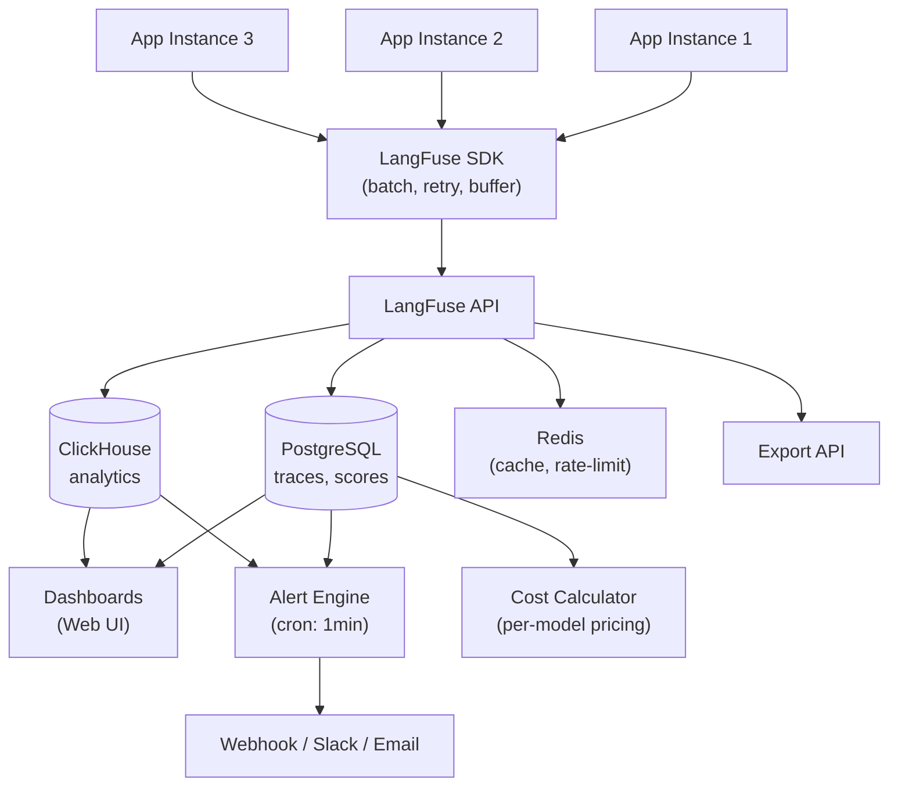
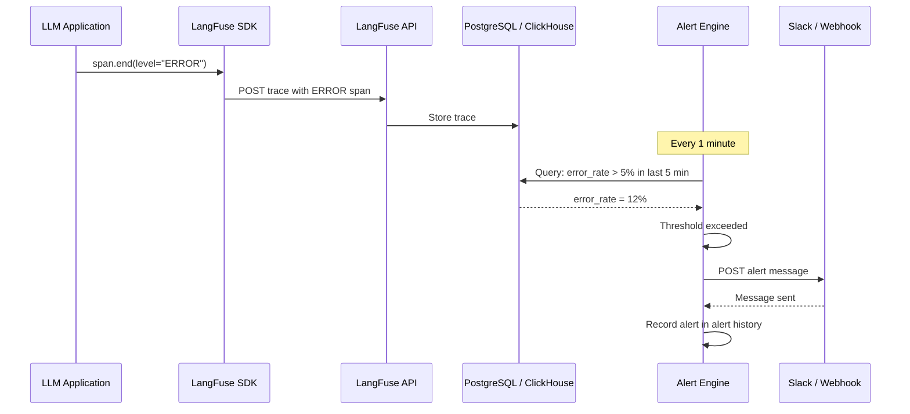
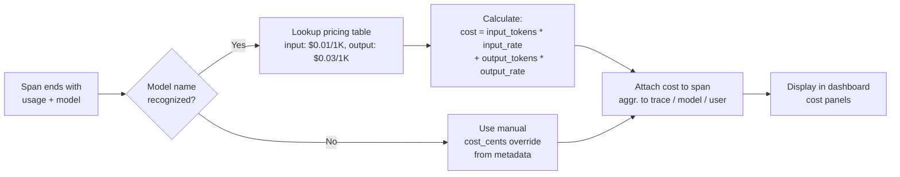

# Dashboards de Observabilidade, Alertas e Monitoramento de Custos

Depois de rastrear todas as chamadas LLM, o próximo passo é a visibilidade operacional. O LangFuse fornece dashboards personalizados, regras de alerta e recursos de rastreamento de custos para ajudar a monitorar sua aplicação em tempo real.

---

## Dashboards Personalizados

Dashboards são compostos por **painéis**. Cada painel consulta dados de trace usando filtros.

Dimensões de filtro disponíveis:

- **Nome do trace / span**
- **Modelo** (ex.: `gpt-4`, `claude-3`)
- **ID do usuário** e **ID da sessão**
- **Tags**
- **Intervalo de tempo**
- **Contagem de tokens, latência, custo**
- **Valores de pontuação**

```python
# Traces já são criados; dashboards são configurados na interface.
# Você pode, no entanto, marcar traces com tags para filtragem mais fácil:

trace = langfuse.trace(
    name="chat-completion",
    tags=["production", "gpt-4", "us-east-1"],
    metadata={"environment": "prod", "region": "us-east-1"}
)
```

> [!WARNING]
> Painéis de dashboard agregam dados de todos os traces. Se você executar uma grande avaliação em lote, esses traces aparecerão em seus dashboards. Use tags e filtros de data para separar execuções de avaliação do tráfego de produção.

### Padrões de Design de Dashboard

> [!TIP]
> Siga o padrão de **dashboard de três camadas** para observabilidade abrangente:
> 1. **Resumo executivo** (1-2 painéis): Custo total, requisições totais, taxa de erro. Isso responde "está tudo OK?" de relance.
> 2. **Desempenho do modelo** (3-5 painéis): Latência p50/p95/p99 por modelo, custo por modelo, tendências de uso de tokens. Responde "qual modelo está com melhor desempenho?"
> 3. **Análise detalhada de usuário/sessão** (3-5 painéis): Principais usuários por custo, principais usuários por latência, traces em nível de sessão. Responde "qual usuário/consulta está causando problemas?"
>
> Tags e metadados são a estrutura que faz esse padrão funcionar. Sem marcação consistente, você não pode fatiar dados por ambiente, modelo ou usuário.

---

## Arquitetura de Monitoramento



O pipeline de ingestão escala horizontalmente: múltiplas instâncias de aplicação enviam traces através do SDK, que faz lotes e tenta novamente automaticamente. A API escreve no PostgreSQL (para detalhes do trace) e ClickHouse (para agregações do dashboard). O mecanismo de alerta executa como um trabalho agendado que consulta métricas agregadas contra limites definidos pelo usuário.

> [!NOTE]
> A retenção de dados no LangFuse é configurável. No LangFuse Nuvem, os traces são retidos de acordo com seu plano (tipicamente 30-90 dias). Instâncias auto-hospedadas podem configurar a retenção via configurações do PostgreSQL. Use a API de Exportação para arquivar traces mais antigos em seu próprio data lake ou S3 antes que expirem.

---

## Filtrando e Agregando Traces

Na visualização **Traces** você pode:

- Pesquisar por nome do trace, ID do usuário ou ID da sessão.
- Filtrar por intervalo de tempo, faixa de pontuação, contagem de tokens ou custo.
- Agregar por modelo, mês ou usuário para ver os maiores consumidores.
- Exportar resultados filtrados como CSV.

Exemplo de consulta agregada (interface):

```
Filtro: model = "gpt-4" AND tags contém "production"
Agrupar por: user_id
Métricas: SUM(prompt_tokens), SUM(completion_tokens), AVG(latency_ms)
```

### Consultas de Análise de Custos

```python
# cost_analysis.py
from langfuse import Langfuse
from datetime import datetime, timedelta
import pandas as pd

langfuse = Langfuse()

def get_cost_by_model(days: int = 30):
    traces = langfuse.fetch_traces(
        limit=10000,
        from_timestamp=(datetime.now() - timedelta(days=days)).isoformat()
    )

    rows = []
    for t in traces.data:
        span_cost = 0
        model_name = "unknown"
        if t.spans:
            for span in t.spans:
                if span.usage and span.model:
                    model_name = span.model
                    span_cost += span.calculated_cost or 0

        rows.append({
            "trace_id": t.id,
            "model": model_name,
            "cost": span_cost,
            "total_tokens": sum(
                (s.usage.get("total", 0) or 0) for s in (t.spans or [])
                if s.usage
            ),
            "latency_ms": t.latency or 0,
            "timestamp": t.timestamp
        })

    df = pd.DataFrame(rows)
    summary = df.groupby("model").agg({
        "cost": "sum",
        "total_tokens": "sum",
        "trace_id": "count"
    }).rename(columns={"trace_id": "request_count"})
    summary["avg_cost_per_request"] = summary["cost"] / summary["request_count"]
    return summary.sort_values("cost", ascending=False)

cost_report = get_cost_by_model(days=30)
print(cost_report)
```

### Relatórios de Métricas Personalizadas

```python
# custom_metrics.py
from langfuse import Langfuse

langfuse = Langfuse()

def report_business_metric(trace_id: str, metric_name: str, value: float):
    trace = langfuse.fetch_trace(trace_id)
    if trace:
        trace.score(
            name=metric_name,
            value=value,
            data_type="NUMERIC",
            comment="Métrica de negócio personalizada"
        )

trace = langfuse.trace(name="suporte-cliente", user_id="cust_789")

report_business_metric(trace.id, "tempo_resolucao_segundos", 12.5)
report_business_metric(trace.id, "satisfacao_cliente", 4.5)

langfuse.flush()
```

---

## Configurando Alertas

Alertas notificam você (via email, Slack, webhook) quando uma métrica ultrapassa um limiar.

| Tipo de Alerta | Exemplo de Limiar | Ação |
|---|---|---|
| Taxa de erro | > 5% em 5 minutos | Mensagem no Slack |
| Latência p99 | > 10 segundos | Email para plantão |
| Custo por hora | > $50 | Webhook → PagerDuty |
| Pico de tokens | > 1M tokens em 10 min | Slack + email |

Configure alertas em **Configurações → Alertas** na interface do LangFuse.

> [!WARNING]
> Alertas verificam dados agregados e podem ter um atraso de 1–5 minutos. Eles não são em tempo real. Para alertas sub-minuto, use uma ferramenta APM dedicada junto com o LangFuse.

### Comparação de Tipos de Alerta

| Tipo | Fonte da Métrica | Atraso | Caso de Uso |
|---|---|---|---|
| Taxa de erro | Traces com level=ERROR | ~1-2 min | Capturar falhas de modelo, formatos de resposta ruins |
| Limiar de latência | Duração do span | ~1-2 min | Detectar modelos lentos, regressões de engenharia de prompt |
| Limiar de custo | Custo calculado por span | ~2-5 min | Controle de orçamento, detecção de anomalias (gasto inesperado) |
| Pico de contagem de tokens | usage.total | ~1-2 min | Ataques de injeção de prompt, loops sem controle |
| Limiar de pontuação | Valores de trace.score() | ~2-5 min | Degradação de qualidade (corretude < 0.7) |

### Configurando Alertas Webhook

```python
# webhook_alert_receiver.py
from flask import Flask, request, jsonify

app = Flask(__name__)

@app.route("/webhook/langfuse-alert", methods=["POST"])
def handle_alert():
    payload = request.json
    alert_type = payload.get("type")
    metric = payload.get("metric")
    threshold = payload.get("threshold")
    actual_value = payload.get("value")
    trace_url = payload.get("trace_url")

    print(f"ALERTA: {alert_type}")
    print(f"  Métrica: {metric} (limiar: {threshold}, real: {actual_value})")
    print(f"  Trace: {trace_url}")

    if metric == "error_rate" and actual_value > threshold:
        print("Acionando reversão automática do deploy do modelo...")

    return jsonify({"status": "recebido"}), 200

if __name__ == "__main__":
    app.run(port=5000)
```

### Sequência de Acionamento de Alerta



---

### Fluxo de Atribuição de Custos



---

## Rastreamento de Uso de Tokens e Custos

LangFuse rastreia automaticamente o uso de tokens quando você passa `usage` para um span. Para modelos suportados, ele estima o custo com base nos preços atuais.

```python
span.end(
    usage={
        "input": 150,          # prompt_tokens
        "output": 42,          # completion_tokens
        "total": 192,
        "unit": "TOKENS"
    },
    model="gpt-4"
)
```

Os relatórios de custo mostram:

- **Custo por trace** (soma dos custos de todos os spans)
- **Custo por modelo** (detalhamento por nome do modelo)
- **Custo por usuário / sessão**
- **Custo mensal projetado**

> [!IMPORTANT]
> A atribuição de custos depende de nomes de modelo precisos. Se você passar um nome de modelo não reconhecido (com erro de ortografia ou personalizado), o LangFuse não pode calcular custos. Sempre use a string exata do identificador do modelo (ex.: `gpt-4`, `gpt-4-0125-preview`, `claude-3-opus-20240229`) para garantir a consulta de preços correta.
>
> Para modelos personalizados ou fine-tuned, você pode definir manualmente o custo por span:
> ```python
> span.end(
>     usage={"input": 150, "output": 42, "total": 192, "unit": "TOKENS"},
>     model="meu-modelo-fine-tuned",
>     metadata={"cost_cents": 0.05}
> )
> ```

---

## Monitoramento de Latência

Cada span registra automaticamente sua duração. Painéis do dashboard podem mostrar:

- Latência média (p50, p95, p99) por modelo ou nome do span.
- Histograma de distribuição de latência.
- Lista de traces mais lentos (ordenar por duração).

Dados de latência ajudam a identificar gargalos — por exemplo, chamadas de embedding demorando mais que a geração.

---

## Rastreamento de Taxa de Erro

Quando um span falha, defina seu `level` como `ERROR` e inclua a mensagem de erro.

```python
try:
    response = model.invoke(prompt)
    span.end(output=response)
except Exception as e:
    span.end(
        level="ERROR",
        metadata={"error": str(e)}
    )
```

O dashboard pode então mostrar:

- Taxa de erro ao longo do tempo (gráfico de linha).
- Contagem de erros por nome do span (gráfico de barras).
- Lista de traces filtrada apenas para erros.

---

## Exportando Dados

Exporte dados de trace para análise externa:

```python
import pandas as pd

# Buscar traces recentes via SDK
traces = langfuse.fetch_traces(
    limit=1000,
    from_timestamp="2025-01-01T00:00:00Z"
)

# Converter para pandas DataFrame
df = pd.DataFrame([t.dict() for t in traces.data])
df.to_csv("exportacao_traces.csv", index=False)
```

Você também pode usar a API do LangFuse diretamente (`GET /api/public/traces`) para exportações grandes.

---

## Comparação: Funcionalidades de Monitoramento

| Funcionalidade | LangFuse | Logging personalizado | Prometheus/Grafana |
|---|---|---|---|
| Métricas nativas LLM | ✅ | Manual | ❌ |
| Rastreamento de custos | ✅ Integrado | Cálculo manual | ❌ |
| Regras de alerta | ✅ Básico | ✅ Flexível | ✅ Avançado |
| Construtor de dashboards | ✅ Visual | Manual | ✅ PromQL |
| Retenção de dados | Configurável | Ilimitada | Ilimitada |
| Esforço de configuração | Baixo | Alto | Muito alto |
| Suporte a múltiplos usuários | ✅ Integrado | Manual | ✅ |
| API para exportação | ✅ REST + SDK | Depende | ✅ |

---

## Interactive Questions

```question
{
  "id": "lf-5-q1",
  "type": "multiple-choice",
  "question": "Como distinguir traces de avaliação do tráfego de produção nos dashboards do LangFuse?",
  "options": [
    "Traces de avaliação são automaticamente excluídos dos dashboards",
    "Marcar traces de avaliação com tags e filtrá-los nos painéis do dashboard",
    "Criar uma conta separada do LangFuse para execuções de avaliação",
    "Usar uma chave de API diferente para traces de avaliação"
  ],
  "correct": 1,
  "explanation": "Use tags como 'eval' vs 'production' em seus traces, depois configure painéis do dashboard com filtros de tag para excluir ou isolar grupos específicos de traces."
}
```

```question
{
  "id": "lf-5-q2",
  "type": "multiple-choice",
  "question": "Qual das seguintes métricas pode disparar um alerta no LangFuse?",
  "options": [
    "Taxa de erro excedendo 5% em 5 minutos",
    "Número de usuários ativos abaixo de 100",
    "Pontuação média de sentimento da resposta",
    "Percentual de uso de armazenamento do banco de dados"
  ],
  "correct": 0,
  "explanation": "Os alertas do LangFuse são baseados em métricas de nível de trace: taxa de erro, latência, custo e contagens de tokens. Métricas de infraestrutura como contagem de usuários e armazenamento de banco de dados não são monitoradas pelo LangFuse."
}
```

```question
{
  "id": "lf-5-q3",
  "type": "multiple-choice",
  "question": "Como o LangFuse estima o custo de uma chamada LLM?",
  "options": [
    "Multiplicando o número de caracteres da resposta por uma taxa fixa",
    "Aplicando o preço conhecido por token para o modelo especificado",
    "Consultando a API de cobrança do provedor LLM em tempo real",
    "Contando o número de spans no trace"
  ],
  "correct": 1,
  "explanation": "O LangFuse mantém uma tabela de preços para modelos populares. Ele multiplica as contagens de tokens relatadas (entrada e saída) pela taxa por token para o nome do modelo especificado."
}
```

```question
{
  "id": "lf-5-q4",
  "type": "multiple-choice",
  "question": "Como exportar dados de trace do LangFuse para análise externa?",
  "options": [
    "Usando langfuse.fetch_traces() ou o endpoint GET /api/public/traces",
    "Copiando manualmente os dados da interface do dashboard",
    "Traces não podem ser exportados; são armazenados permanentemente no servidor",
    "Configurando um email automático diário com anexo CSV"
  ],
  "correct": 0,
  "explanation": "O fetch_traces() do SDK e o endpoint REST API ambos retornam dados de trace em formato JSON, que podem ser convertidos para CSV ou carregados no pandas para análise."
}
```

```question
{
  "id": "lf-5-q5",
  "type": "multiple-choice",
  "question": "Sua conta mensal de LLM de repente triplicou. Você precisa encontrar a causa raiz rapidamente. Qual é o primeiro passo mais eficiente?",
  "options": [
    "Verificar o dashboard de custo por modelo do LangFuse para ver qual modelo teve o maior aumento de custo",
    "Revisar cada trace individual manualmente dos últimos 30 dias",
    "Enviar email para a equipe de suporte do provedor LLM perguntando por que os custos aumentaram",
    "Desabilitar todas as chamadas LLM até que o problema seja resolvido"
  ],
  "correct": 0,
  "explanation": "A análise de custo por modelo do LangFuse mostra imediatamente qual modelo impulsionou o aumento. A partir daí, detalhe para custo por usuário ou custo por sessão para encontrar a fonte específica."
}
```

---

> [!SUCCESS]
> **Principais Conclusões**
> - Dashboards são construídos a partir de painéis filtráveis; use tags e metadados de forma consistente.
> - Alertas verificam dados agregados a cada 1-2 minutos — adequados para alertas operacionais, não em tempo real.
> - O rastreamento de custos requer nomes de modelo precisos para consulta de preços.
> - Dados de latência e taxa de erro vêm automaticamente da temporização do span e do nível do span.
> - Exporte traces via SDK ou REST API para análise externa em pandas/ferramentas de BI.
> - O padrão de dashboard de três camadas (resumo executivo → modelo → usuário) fornece uma abordagem estruturada para monitoramento.
