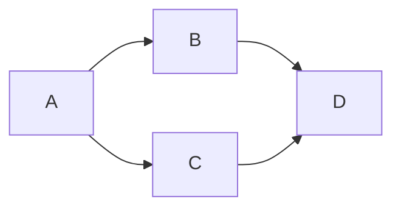

# Execução Paralela

LangGraph supports parallel execution of nodes via fan-out edges. This lesson covers when and how to parallelize, coordinating parallel branches, merging results, and handling thread safety.

---

## Como Funciona a Execução Paralela

When a node has multiple outgoing edges, all target nodes execute **simultaneously** in separate threads:

```python
# Fan-out: B and C run in parallel after A
builder.add_edge("A", "B")
builder.add_edge("A", "C")
```



Each branch receives a **copy** of the state at the point of fan-out. When all branches complete, their updates are **merged** before the fan-in node runs.

---

## Fan-Out/Fan-In Básico

```python
from langgraph.graph import StateGraph, START, END
from typing_extensions import TypedDict, Annotated
from typing import List
from operator import add

class ParallelState(TypedDict):
    input_text: str
    results: Annotated[List[str], add]
    merged: str

def splitter(state: ParallelState) -> dict:
    """Fan-out: this node passes state to multiple parallel nodes."""
    return {}  # Passes state through unchanged

def process_a(state: ParallelState) -> dict:
    return {"results": [f"Process A: {state['input_text'].upper()}"]}

def process_b(state: ParallelState) -> dict:
    return {"results": [f"Process B: {state['input_text'].lower()}"]}

def process_c(state: ParallelState) -> dict:
    return {"results": [f"Process C: {state['input_text'][::-1]}"]}

def merger(state: ParallelState) -> dict:
    combined = "\n".join(state["results"])
    return {"merged": combined}

builder = StateGraph(ParallelState)
builder.add_node("splitter", splitter)
builder.add_node("process_a", process_a)
builder.add_node("process_b", process_b)
builder.add_node("process_c", process_c)
builder.add_node("merger", merger)

builder.add_edge(START, "splitter")
builder.add_edge("splitter", "process_a")
builder.add_edge("splitter", "process_b")
builder.add_edge("splitter", "process_c")
builder.add_edge("process_a", "merger")
builder.add_edge("process_b", "merger")
builder.add_edge("process_c", "merger")
builder.add_edge("merger", END)

app = builder.compile()
```

[!NOTA]
All three process nodes (A, B, C) run in parallel. The merger node waits for all three to complete before executing.

---

## Paralelismo Dinâmico

Fan-out dynamically based on the number of items to process:

```python
def dispatch(state: State) -> dict:
    items = state["items"]
    # Dynamic dispatch creates parallel work
    return {"item_count": len(items)}

# The splitter node and multiple parallel workers
# process different chunks simultaneously
```

For truly dynamic fan-out, use a **map** pattern:

```python
def map_node(state: State) -> dict:
    items = state["items_to_process"]
    results = []

    # Process each item (can parallelize by fan-out)
    for item in items:
        result = process_item(item)
        results.append(result)

    return {"all_results": results}
```

---

## Segurança de Thread

Parallel branches share the state but execute in separate threads. Each branch receives a **snapshot** of state at the fan-out point:

```python
import threading
import time

def parallel_worker(state: State) -> dict:
    thread_id = threading.get_ident()
    print(f"Thread {thread_id} processing: {state.get('shared_value', 'N/A')}")

    # Simulate work
    time.sleep(1)

    return {"worker_result": f"Thread {thread_id} done"}

# Each worker sees the same state snapshot
# Their updates are merged when all complete
```

[!IMPORTANTE]
Parallel branches should not depend on each other's results. Each branch works from the same state snapshot. Use fan-in nodes for coordination after parallel work completes.

---

## Padrões de Redução (Fan-In)

### Agregação Simples

```python
def reducer(state: State) -> dict:
    all_results = "\n".join(state.get("results", []))
    return {"final": all_results}
```

### Fusão Ponderada

```python
def weighted_merger(state: State) -> dict:
    results = state.get("results", [])
    weights = state.get("weights", {})
    final = ""

    for result in results:
        source = result.split(":")[0]
        weight = weights.get(source, 1.0)
        if weight > 0.5:
            final += f"[High confidence] {result}\n"

    return {"merged": final}
```

### Fusão por Votação

```python
def voting_merger(state: State) -> dict:
    results = state.get("results", [])
    from collections import Counter
    answers = Counter(results)
    most_common = answers.most_common(1)[0]
    return {"consensus": most_common[0], "votes": most_common[1]}
```

---

## Execução Paralela de Ferramentas

Execute multiple tools in parallel:

```python
from langgraph.prebuilt import ToolExecutor

@tool
def search_web(q: str) -> str:
    return f"Web: {q}"

@tool
def search_db(q: str) -> str:
    return f"DB: {q}"

@tool
def search_api(q: str) -> str:
    return f"API: {q}"

tools = [search_web, search_db, search_api]
tool_executor = ToolExecutor(tools)

def parallel_search(state: State) -> dict:
    query = state["query"]

    # Dispatch all three searches in parallel via fan-out
    return {
        "web_query": query,
        "db_query": query,
        "api_query": query
    }

# Each search node runs in parallel
def web_search_node(state: State) -> dict:
    result = tool_executor.invoke({"name": "search_web", "args": {"q": state["web_query"]}})
    return {"web_result": str(result)}

# Same for db_search_node and api_search_node...

def aggregate_results(state: State) -> dict:
    combined = f"Web: {state['web_result']}\nDB: {state['db_result']}\nAPI: {state['api_result']}"
    return {"final": combined}
```

---

## Chamadas LLM Paralelas

Use parallel fan-out to get multiple LLM perspectives:

```python
def perspective_a(state: State) -> dict:
    response = llm.invoke(f"Analyze {state['topic']} from an economic perspective")
    return {"perspectives": [f"Economic: {response.content}"]}

def perspective_b(state: State) -> dict:
    response = llm.invoke(f"Analyze {state['topic']} from a social perspective")
    return {"perspectives": [f"Social: {response.content}"]}

def perspective_c(state: State) -> dict:
    response = llm.invoke(f"Analyze {state['topic']} from a technical perspective")
    return {"perspectives": [f"Technical: {response.content}"]}

# All three run in parallel → merger synthesizes
```

[!DICA]
Parallel LLM calls with different system prompts let you gather diverse perspectives simultaneously, then synthesize them into a comprehensive answer.

---

## Tratamento de Erros em Ramos Paralelos

```python
def safe_parallel_worker(state: State) -> dict:
    try:
        result = risky_operation(state["input"])
        return {"results": [f"Success: {result}"]}
    except Exception as e:
        return {"errors": [f"Worker failed: {e}"]}

def error_aware_merger(state: State) -> dict:
    results = state.get("results", [])
    errors = state.get("errors", [])

    if errors and not results:
        return {"merged": f"All workers failed: {errors}"}

    if errors:
        return {"merged": f"Partial results: {results}\nErrors: {errors}"}

    return {"merged": "\n".join(results)}
```

[!AVISO]
An exception in one parallel branch does not cancel other branches. All branches complete; their results are merged including any error fields.

---

## Considerações de Desempenho

| Factor | Impacto | Mitigation |
| :--- | :--- | :--- |
| Thread overhead | Starting threads has cost | Only parallelize work > 100ms |
| Shared state lock | Writes need synchronization | Use add reducer for writes |
| Fan-out width | Too many branches = contention | Limit to 5-10 parallel branches |
| Memory | Each branch has its own context | Keep state small |
| LLM rate limits | Parallel calls hit limits faster | Add throttling |

---

## Exemplo Completo de Processamento Paralelo

```python
from langgraph.graph import StateGraph, START, END
from typing_extensions import TypedDict, Annotated
from typing import List
from operator import add

class DataState(TypedDict):
    data: str
    chunks: List[str]
    chunk_results: Annotated[List[str], add]
    final_output: str

def split_data(state: DataState) -> dict:
    # Split large text into chunks for parallel processing
    chunk_size = len(state["data"]) // 3
    chunks = [
        state["data"][:chunk_size],
        state["data"][chunk_size:2*chunk_size],
        state["data"][2*chunk_size:]
    ]
    return {"chunks": chunks}

def process_chunk_1(state: DataState) -> dict:
    return {"chunk_results": [f"Chunk 1: {state['chunks'][0][:50]}..."]}

def process_chunk_2(state: DataState) -> dict:
    return {"chunk_results": [f"Chunk 2: {state['chunks'][1][:50]}..."]}

def process_chunk_3(state: DataState) -> dict:
    return {"chunk_results": [f"Chunk 3: {state['chunks'][2][:50]}..."]}

def merge_results(state: DataState) -> dict:
    return {"final_output": "\n".join(state["chunk_results"])}

builder = StateGraph(DataState)
builder.add_node("split", split_data)
builder.add_node("chunk1", process_chunk_1)
builder.add_node("chunk2", process_chunk_2)
builder.add_node("chunk3", process_chunk_3)
builder.add_node("merge", merge_results)

builder.add_edge(START, "split")
builder.add_edge("split", "chunk1")
builder.add_edge("split", "chunk2")
builder.add_edge("split", "chunk3")
builder.add_edge("chunk1", "merge")
builder.add_edge("chunk2", "merge")
builder.add_edge("chunk3", "merge")
builder.add_edge("merge", END)

app = builder.compile()
```

---

## Perguntas Práticas

```question
{
  "id": "lg-advanced-08-q1",
  "type": "multiple-choice",
  "question": "How does LangGraph execute nodes with multiple outgoing edges?",
  "options": [
    "Sequentially in order",
    "In parallel using separate threads",
    "Only the first edge is followed",
    "An error is thrown"
  ],
  "correct": 1,
  "explanation": "When a node has multiple outgoing edges, all target nodes execute simultaneously in separate threads."
}
```

```question
{
  "id": "lg-advanced-08-q2",
  "type": "multiple-choice",
  "question": "What does a fan-in node receive?",
  "options": [
    "Only the first branch's results",
    "State merged from all incoming branches that have completed",
    "Nothing — fan-in is automatic",
    "State from only the fastest branch"
  ],
  "correct": 1,
  "explanation": "The fan-in node waits for all incoming branches to complete, then receives the merged state from all of them."
}
```

```question
{
  "id": "lg-advanced-08-q3",
  "type": "multiple-choice",
  "question": "What state snapshot do parallel branches see?",
  "options": [
    "They all see the same state at the time of fan-out",
    "Each branch sees the others' updates in real-time",
    "They see an empty state",
    "The state is randomized per branch"
  ],
  "correct": 0,
  "explanation": "Each parallel branch receives a copy of the state as it was at the fan-out point. Branches don't see each other's intermediate updates."
}
```

```question
{
  "id": "lg-advanced-08-q4",
  "type": "multiple-choice",
  "question": "What happens if one parallel branch raises an exception?",
  "options": [
    "All branches are cancelled",
    "The exception is captured, other branches continue, and the merge node sees errors in state",
    "The graph retries the failed branch",
    "The exception is ignored"
  ],
  "correct": 1,
  "explanation": "Exceptions in a branch are captured. Other branches continue, and the merge node receives the results (including any error fields) from all branches."
}
```

```question
{
  "id": "lg-advanced-08-q5",
  "type": "multiple-choice",
  "question": "What is the recommended maximum number of parallel branches?",
  "options": ["Unlimited", "5-10", "100", "3"],
  "correct": 1,
  "explanation": "5-10 parallel branches balances throughput against thread overhead and system contention."
}
```

```question
{
  "id": "lg-advanced-08-q6",
  "type": "multiple-choice",
  "question": "What reducer is ideal for collecting results from parallel branches?",
  "options": ["replace (default)", "Annotated[list, add]", "Annotated[dict, merge]", "A custom reducer"],
  "correct": 1,
  "explanation": "Annotated[list, add] with the add reducer appends results from each branch into a list that the merge node can process."
}
```

```question
{
  "id": "lg-advanced-08-q7",
  "type": "multiple-choice",
  "question": "How can you parallelize LLM calls with different perspectives?",
  "options": [
    "Use a single LLM call with a complex prompt",
    "Fan-out to multiple nodes each with a different system prompt",
    "Parallel LLM calls are not supported",
    "Run LLM calls sequentially"
  ],
  "correct": 1,
  "explanation": "Create separate nodes for each perspective (economic, social, technical) and fan-out so they run in parallel, each with its own system prompt."
}
```

```question
{
  "id": "lg-advanced-08-q8",
  "type": "multiple-choice",
  "question": "When is parallel execution NOT beneficial?",
  "options": [
    "When tasks are independent",
    "When task duration is very short (< 100ms) — thread overhead dominates",
    "When processing large datasets",
    "When calling multiple APIs"
  ],
  "correct": 1,
  "explanation": "For very short tasks, the overhead of creating threads outweighs the parallelism benefit. Only parallelize tasks that take significant time."
}
```

```question
{
  "id": "lg-advanced-08-q9",
  "type": "multiple-choice",
  "question": "What pattern processes a large dataset by splitting, parallel processing, and merging?",
  "options": ["Fan-out/Fan-in (Map-Reduce)", "Sequential chain", "Reflection loop", "Supervisor pattern"],
  "correct": 0,
  "explanation": "The split → parallel process → merge pattern is equivalent to Map-Reduce: divide data, process chunks in parallel, combine results."
}
```

```question
{
  "id": "lg-advanced-08-q10",
  "type": "multiple-choice",
  "question": "How does the 'add' reducer help with parallel execution?",
  "options": [
    "It adds latency",
    "It accumulates results from all branches into a single list without conflicts",
    "It removes duplicate results",
    "It sorts results alphabetically"
  ],
  "correct": 1,
  "explanation": "The 'add' reducer concatenates list results from all branches, providing a clean way to accumulate parallel outputs."
}
```

---

[!SUCESSO]
### Principais Conclusões
- Fan-out edges create parallel execution branches
- Each branch sees the same state snapshot at fan-out
- Fan-in nodes wait for all branches to complete before executing
- Annotated[list, add] cleanly accumulates parallel results
- Handle errors per-branch using try/except
- 5-10 parallel branches is a good maximum for most systems
- Parallel LLM calls with different prompts gather diverse perspectives
- Map-Reduce pattern: split → parallel process → merge
- Short tasks (< 100ms) may not benefit from parallelization
