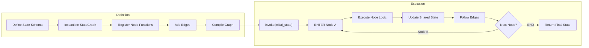
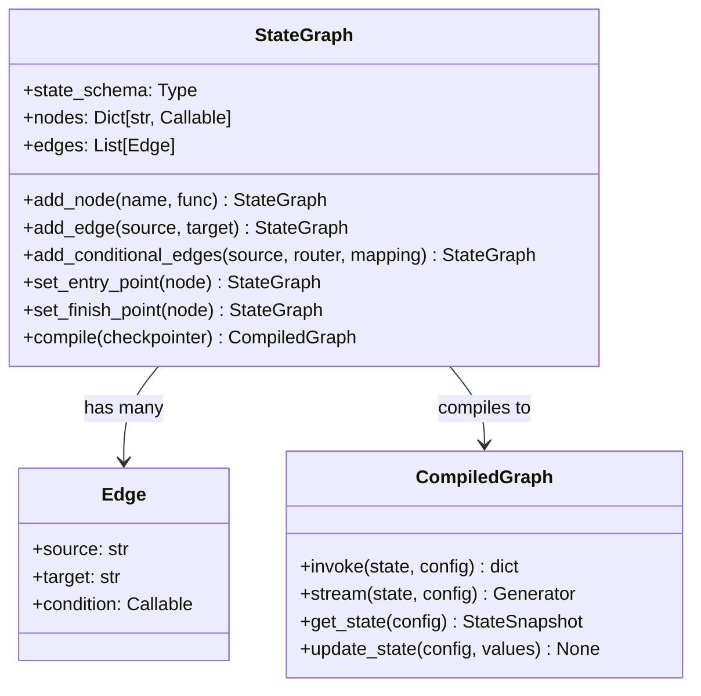
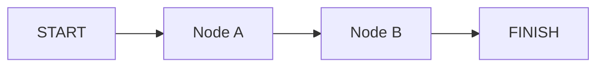
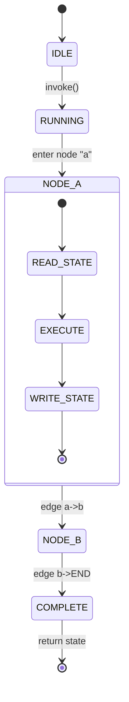

# LangGraph Fundamentals and State Graphs

LangGraph is a framework from LangChain for building **stateful, multi-actor applications** using graphs as the core abstraction. Each node modifies a shared state and edges define the flow.

---

## What is LangGraph?

LangGraph extends LangChain by modeling agent logic as a **directed graph**. The graph carries a **typed state object** that persists across nodes, enabling complex loops, branching, and memory.

Key concepts:
- **StateGraph**: Recommended class for stateful graphs
- **Graph**: Simpler, stateless alternative
- **Nodes**: Python functions that receive and mutate state
- **Edges**: Directed connections between nodes

[!WARNING]
LangGraph is **not** a workflow DAG tool. Nodes can be revisited, loops can form, and state is preserved across cycles. This is what makes it suitable for agentic systems.

---

## Mermaid: Full Execution Cycle



The **Definition** phase builds the graph topology. The **Execution** phase runs nodes sequentially or in parallel, each reading and writing to the shared state.

---

## StateGraph vs Graph

| Feature | StateGraph | Graph |
| :--- | :--- | :--- |
| Typed state | Yes (TypedDict or dataclass) | No (bare values only) |
| Conditional edges | Yes | Yes |
| Checkpointing | Built-in via MemorySaver | Not supported |
| Parallel branching | Yes | Limited |
| Re-entrant nodes | Yes | No |
| Production readiness | High (PostgresSaver, etc.) | Low |
| Loop support | Yes | No |
| Human-in-the-loop | Via interrupt() | Not supported |
| Subgraph composition | Yes | No |

[!TIP]
Always default to `StateGraph` unless you have a very simple stateless pipeline. The overhead is minimal and you gain checkpointing, branching, and production features for free.

---

## Mermaid: StateGraph API Class Diagram



The `StateGraph` builder pattern collects nodes and edges, then `.compile()` produces a `CompiledGraph` that can be invoked with state and config.

---

## Defining State with TypedDict

```python
from typing import TypedDict, List
from langgraph.graph import StateGraph

# Define the shared state schema
class AgentState(TypedDict):
    messages: List[str]   # conversation so far
    next_step: str        # which node to run next
    metadata: dict        # arbitrary metadata

# Instantiate a StateGraph with the schema
builder = StateGraph(AgentState)
```

[!NOTE]
StateGraph supports three schema definition approaches: `TypedDict` (lightweight, no validation), `dataclass` (mutable, Pythonic), and `pydantic.BaseModel` (validation, serialization). Choose `BaseModel` for production when you need runtime type checking.

### Comparison: State Definition Approaches

| Approach | Validation | Serialization | Boilerplate | Use Case |
| :--- | :--- | :--- | :--- | :--- |
| `TypedDict` | None | Manual | Minimal | Prototyping, simple agents |
| `dataclass` | None | Via dataclasses.asdict() | Low | Internal tools |
| `BaseModel` | Pydantic full validation | Built-in .dict()/.json() | Moderate | Production systems |

---

## Nodes and Edges

```python
# Node: a function that receives state and returns updates
def node_a(state: AgentState) -> dict:
    print("--- Node A ---")
    return {"messages": state["messages"] + ["Hello from A"]}

def node_b(state: AgentState) -> dict:
    print("--- Node B ---")
    return {"messages": state["messages"] + ["Hello from B"]}

# Register nodes
builder.add_node("a", node_a)
builder.add_node("b", node_b)

# Add edges: a -> b
builder.add_edge("a", "b")

# Set entry and exit points
builder.set_entry_point("a")
builder.set_finish_point("b")
```

[!TIP]
Node functions **must** return a dict (or `None`). The returned values are merged into the shared state via a shallow update. Keys not returned retain their previous value — this is how state persists between nodes.

### Parallel Node Execution

```python
def node_a(state: AgentState) -> dict:
    return {"messages": state["messages"] + ["A"]}

def node_b(state: AgentState) -> dict:
    return {"messages": state["messages"] + ["B"]}

def node_c(state: AgentState) -> dict:
    return {"messages": state["messages"] + ["C"]}

builder = StateGraph(AgentState)
builder.add_node("a", node_a)
builder.add_node("b", node_b)
builder.add_node("c", node_c)

# Fan-out: a triggers b and c simultaneously
builder.add_edge(START, "a")
builder.add_edge("a", "b")
builder.add_edge("a", "c")
builder.add_edge("b", END)
builder.add_edge("c", END)
```

When two edges leave the same node, both targets execute **in parallel** using Python threads. Each branch gets a copy of the state and writes merges at completion.

### Error Handling in Nodes

```python
import traceback

def safe_node(state: AgentState) -> dict:
    try:
        result = risky_operation(state["messages"][-1])
        return {"messages": state["messages"] + [result]}
    except Exception as e:
        # Log the error and continue with a fallback
        return {
            "messages": state["messages"] + [f"[ERROR]: {str(e)}"],
            "errors": state.get("errors", []) + [traceback.format_exc()]
        }
```

Wrap fallible node logic in try/except to prevent the entire graph from crashing. Store errors in state for downstream handling or human review.

---

## Compiling and Running

```python
# Compile the graph into a runnable object
app = builder.compile()

# Invoke with initial state
result = app.invoke({
    "messages": [],
    "next_step": "start",
    "metadata": {}
})

print(result["messages"])
# Output: ['Hello from A', 'Hello from B']
```

[!IMPORTANT]
The `.compile()` method freeze the graph definition. After compilation, you cannot add nodes or edges — you must rebuild the builder. For dynamic topologies, see Lesson 4 on dynamic graph updates.

### Streaming Results

```python
# Stream updates as each node completes
for event in app.stream({"messages": [], "next_step": "start", "metadata": {}}):
    for node_name, output in event.items():
        if node_name != "__end__":
            print(f"[{node_name}] -> {output}")
# Output:
# [a] -> {'messages': ['Hello from A']}
# [b] -> {'messages': ['Hello from A', 'Hello from B']}
```

Use `.stream()` instead of `.invoke()` when you want to observe intermediate states. Each emitted event is keyed by node name with the partial state update.

---

## Mermaid: Basic State Graph



State flows down edges; each node can read *and* write to the shared `AgentState`.

---

## Mermaid State Diagram: Node Lifecycle



Each node transitions through read → execute → write. The graph orchestrates the sequence, passing state along edges.

---

## Debugging Graphs with LangSmith

[!TIP]
When your graph behaves unexpectedly, trace execution with LangSmith. Set `LANGCHAIN_TRACING_V2=true` and `LANGCHAIN_API_KEY=your_key` to get full trace logs showing every node's input, output, and timing.

```bash
# Enable LangSmith tracing
export LANGCHAIN_TRACING_V2=true
export LANGCHAIN_PROJECT=my-agent
```

---

```question
{
  "id": "lg-01-q1",
  "type": "multiple-choice",
  "question": "Which class should you use for a stateful multi-step agent?",
  "options": ["Graph", "StateGraph", "AgentGraph", "SimpleGraph"],
  "correct": 1,
  "explanation": "StateGraph is preferred over the basic Graph class when you need typed, checkpointable state for multi-step agents."
}
```

```question
{
  "id": "lg-01-q2",
  "type": "multiple-choice",
  "question": "How is state typically typed in a StateGraph?",
  "options": ["dataclass", "TypedDict from typing", "pydantic.BaseModel", "All of the above"],
  "correct": 3,
  "explanation": "StateGraph supports TypedDict, dataclass, and pydantic.BaseModel schemas, so all of these are valid."
}
```

```question
{
  "id": "lg-01-q3",
  "type": "multiple-choice",
  "question": "What does a node function receive and return?",
  "options": ["Only a dict", "The full state dict and returns a partial update dict", "A list of messages", "Nothing, it mutates a global variable"],
  "correct": 1,
  "explanation": "A node function receives the full state dictionary and returns a partial dict of updates to merge into the state."
}
```

```question
{
  "id": "lg-01-q4",
  "type": "multiple-choice",
  "question": "What is the purpose of compile()?",
  "options": ["Type-check the graph definition", "Convert the graph to a runnable object", "Deploy to LangSmith", "Serialize the graph to JSON"],
  "correct": 1,
  "explanation": "compile() transforms the graph definition into a runnable object that can be invoked with state."
}
```

```question
{
  "id": "lg-01-q5",
  "type": "multiple-choice",
  "question": "Which of the following is NOT supported by the basic Graph class?",
  "options": ["Conditional edges", "Typed state", "Multiple nodes", "Directed edges"],
  "correct": 1,
  "explanation": "The basic Graph class does not support typed state; that requires StateGraph."
}
```

---

[!SUCCESS]
### Key Takeaways
- LangGraph uses directed graphs to represent stateful agent logic.
- `StateGraph` is preferred over `Graph` when you need typed, checkpointable state.
- State is defined with `TypedDict` and flows through nodes.
- Nodes are Python functions that return partial state updates.
- The graph is compiled via `.compile()` and invoked via `.invoke()`.
- Edges define the topology; START and FINISH mark entry and exit points.
- StateGraph supports loops, conditional branching, and persistence.
- Use `.stream()` for real-time observation of each node's output.
- Wrap node logic in try/except to handle errors gracefully.
- LangSmith tracing helps debug complex graph executions.
