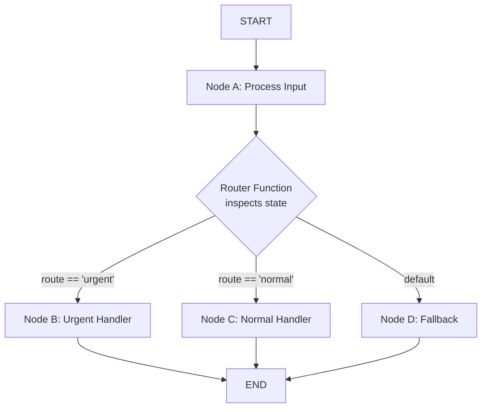
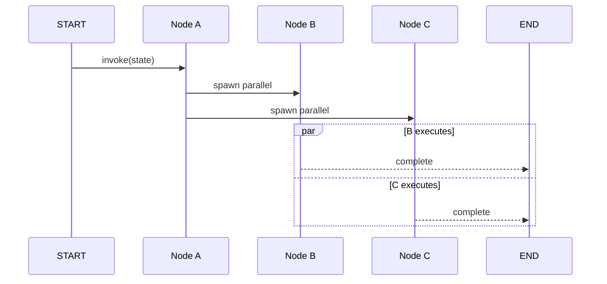
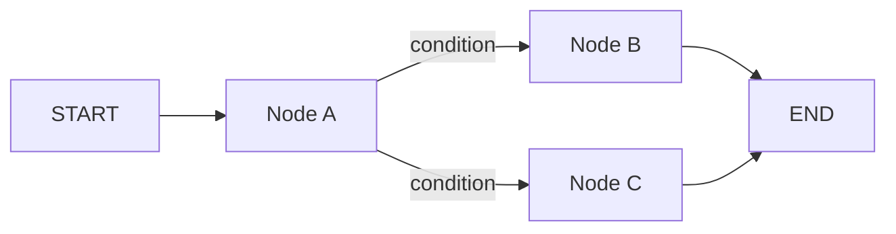

# Nodes, Edges and Conditional Flow

After defining a StateGraph, the next step is wiring up nodes with edges. LangGraph supports **normal edges** for linear pipelines and **conditional edges** for dynamic routing based on state.

---

## Adding Nodes

Every node is a Python function (or a callable) that takes the full state and returns a dict of updates.

```python
from typing import TypedDict, List
from langgraph.graph import StateGraph

class State(TypedDict):
    messages: List[str]
    route: str

def process_a(state: State) -> dict:
    return {"messages": state["messages"] + ["A processed"]}

def process_b(state: State) -> dict:
    return {"messages": state["messages"] + ["B processed"]}

def process_c(state: State) -> dict:
    return {"messages": state["messages"] + ["C processed"]}

builder = StateGraph(State)
builder.add_node("a", process_a)
builder.add_node("b", process_b)
builder.add_node("c", process_c)
```

[!NOTE]
Node names must be unique within a graph. If you call `add_node()` twice with the same name, the second call overwrites the first. Use descriptive names like `"validate_input"` rather than `"node_1"` for readability.

---

## Normal Edges vs Conditional Edges

| Edge Type | Method | Behavior |
| :--- | :--- | :--- |
| Normal | `add_edge(source, target)` | Always passes from source to target |
| Conditional | `add_conditional_edges(source, router, mapping)` | Router function selects the next node(s) at runtime |
| Entry | `add_edge(START, target)` | Defines the graph entry point |
| Exit | `add_edge(source, END)` | Marks a termination path |
| Loop-back | `add_edge(source, source)` | Creates a self-loop (re-entrant node) |

[!WARNING]
Self-loops (`add_edge("a", "a")`) create re-entrant nodes that can run indefinitely. Always pair them with conditional edges and a termination condition to prevent infinite loops.

---

## Mermaid: Conditional Branching with Router



The router function inspects state fields and returns a key that determines which edge to follow. Each key maps to a target node.

---

## Routing Functions

A **routing function** inspects the current state and returns the name of the next node.

```python
def router(state: State) -> str:
    # Decide the next node based on state content
    if "urgent" in state["route"]:
        return "b"
    return "c"

# Connect node "a" to either "b" or "c"
builder.add_conditional_edges("a", router, {
    "b": "b",
    "c": "c",
})
```

[!TIP]
Your router function can return a single string (one target) or a list of strings (fan-out to multiple targets). When returning a list, all listed nodes execute in parallel.

### Multi-Conditional Routing

```python
def advanced_router(state: State) -> str:
    msg_count = len(state["messages"])
    if msg_count == 0:
        return "collect_input"
    elif msg_count < 5:
        return "process"
    elif msg_count < 10:
        return "summarize"
    else:
        return "archive"

builder.add_conditional_edges("entry", advanced_router, {
    "collect_input": "collect_input",
    "process": "process",
    "summarize": "summarize",
    "archive": "archive",
})
```

### Route Function Patterns

| Pattern | Return Type | Behavior |
| :--- | :--- | :--- |
| Single target | `str` | Route to exactly one node |
| Multi target | `List[str]` | Fan-out to multiple nodes |
| Dynamic mapping | `str` (dynamic key) | Key looked up in mapping dict |
| Default fallback | `str` with catch-all | Map a default key for unhandled cases |
| State-based | Uses state fields | Decision depends on accumulated state |

[!WARNING]
The router function **must** return a key that exists in the mapping dict. If the mapping contains `"b": "b"` and the router returns `"x"`, LangGraph raises a runtime error. Always include a fallback route for unhandled cases.

---

## Sending to Specific Nodes with Send()

For advanced dynamic fan-out, LangGraph provides `Send()` — a typed API that lets you send different state to different target nodes.

```python
from langgraph.graph import Send

def dynamic_assigner(state: State) -> List[Send]:
    """Dynamically assign tasks to workers with custom state."""
    tasks = []
    for i, item in enumerate(state.get("items", [])):
        # Each worker gets a personalized slice of state
        tasks.append(
            Send(
                "worker",
                {"messages": [f"Task {i}: {item}"], "route": state["route"]}
            )
        )
    return tasks

# Each Send() creates an independent execution branch
builder.add_node("worker", worker_node)
builder.add_conditional_edges("dispatcher", dynamic_assigner, {
    "worker": "worker",
})
```

`Send()` is the canonical way to implement map-reduce patterns in LangGraph. Each `Send` creates an independent execution context with its own state.

---

## Fan-Out / Fan-In Pattern

```python
def reducer_node(state: State) -> dict:
    """Collect results from parallel branches and merge."""
    all_results = state.get("results", [])
    # Each branch appended its output to 'results'
    merged = "\n".join(all_results)
    return {"messages": state["messages"] + [f"Merged: {merged}"]}

def branch_a(state: State) -> dict:
    return {"results": state.get("results", []) + ["Branch A done"]}

def branch_b(state: State) -> dict:
    return {"results": state.get("results", []) + ["Branch B done"]}

builder = StateGraph(State)
builder.add_node("dispatcher", dispatcher_node)
builder.add_node("branch_a", branch_a)
builder.add_node("branch_b", branch_b)
builder.add_node("reducer", reducer_node)

# Fan-out
builder.add_edge("dispatcher", "branch_a")
builder.add_edge("dispatcher", "branch_b")

# Fan-in: both converge to the reducer
builder.add_edge("branch_a", "reducer")
builder.add_edge("branch_b", "reducer")

builder.add_edge(START, "dispatcher")
builder.add_edge("reducer", END)
```

The fan-in pattern requires that **all** upstream branches complete before the downstream node executes. LangGraph handles this coordination automatically.

---

## START and END Nodes

LangGraph provides two special nodes: `START` (entry point) and `END` (termination).

```python
from langgraph.graph import START, END

# Set the graph entry point
builder.add_edge(START, "a")

# Multiple termination edges are allowed
builder.add_edge("b", END)
builder.add_edge("c", END)
```

[!IMPORTANT]
`START` and `END` are **reserved sentinel node names**. You cannot register nodes named `"START"` or `"END"` via `add_node()`. They are built-in constants from `langgraph.graph`.

---

## Mermaid: Parallel Execution Sequence



Parallel branches execute concurrently. The graph waits for all branches to complete before proceeding to a shared downstream node.

---

## Parallel Execution

You can fan out from one node to several nodes. They execute **in parallel** and all paths must converge or reach END.

```python
# After "a", run both "b" and "c" simultaneously
builder.add_edge("a", "b")
builder.add_edge("a", "c")

# Both branches terminate
builder.add_edge("b", END)
builder.add_edge("c", END)
```

[!TIP]
Parallel execution uses Python threads internally. For CPU-bound work, consider using `asyncio`-based nodes and `.ainvoke()` to leverage `asyncio` concurrency instead of threading.

---

## Sending to Specific Nodes

For advanced use, a conditional edge router can return **a list of nodes** to fan out dynamically.

```python
def multi_router(state: State) -> List[str]:
    targets = ["b"]
    if state["route"] == "broadcast":
        targets.append("c")
    return targets  # sends to both "b" and maybe "c"
```

---

## Complete Conditional Flow Example

```python
def router(state: State) -> str:
    if len(state["messages"]) > 3:
        return "b"
    return "c"

builder.add_conditional_edges("a", router, {
    "b": "b",
    "c": "c",
})
builder.add_edge(START, "a")
builder.add_edge("b", END)
builder.add_edge("c", END)

app = builder.compile()
result = app.invoke({"messages": ["start"], "route": "normal"})
print(result["messages"])
```

---

## Mermaid: Conditional Flow



---

## Infinite Loop Prevention

[!WARNING]
When using conditional edges that loop back to a prior node, always include a **loop counter** or **termination condition** in your state. Without it, the graph may cycle forever, exhausting your compute budget.

```python
def router_with_guard(state: State) -> str:
    max_loops = 5
    current = state.get("loop_count", 0)
    if current >= max_loops:
        return "exit"
    return "process"

def increment_loop(state: State) -> dict:
    return {"loop_count": state.get("loop_count", 0) + 1}
```

---

## Channel-Based State Updates

[!TIP]
LangGraph uses "channels" internally to manage state merge semantics. Each key in your state schema is a separate channel. When two parallel branches update the same key, the last writer wins. Use distinct keys per branch to avoid conflicts.

```python
def branch_a(state: State) -> dict:
    return {"a_result": "output from A"}

def branch_b(state: State) -> dict:
    return {"b_result": "output from B"}
```

---

```question
{
  "id": "lg-02-q1",
  "type": "multiple-choice",
  "question": "What method adds a normal edge in LangGraph?",
  "options": ["add_edge()", "add_conditional_edges()", "connect()", "link()"],
  "correct": 0,
  "explanation": "add_edge() is the method used to add a normal (unconditional) edge between two nodes."
}
```

```question
{
  "id": "lg-02-q2",
  "type": "multiple-choice",
  "question": "What does a conditional edge router function return?",
  "options": ["A boolean", "A string matching a key in the mapping dict", "A State object", "A list of messages"],
  "correct": 1,
  "explanation": "A conditional edge router function returns a string that must match a key in the mapping dictionary passed to add_conditional_edges()."
}
```

```question
{
  "id": "lg-02-q3",
  "type": "multiple-choice",
  "question": "What are START and END in LangGraph?",
  "options": ["Reserved node names for entry and exit", "Python keywords", "Variables in the global scope", "Decorators for node functions"],
  "correct": 0,
  "explanation": "START and END are reserved sentinel node names that mark the entry point and termination point of a graph."
}
```

```question
{
  "id": "lg-02-q4",
  "type": "multiple-choice",
  "question": "What happens when you add two edges from node a to nodes b and c?",
  "options": ["Only b executes", "b and c execute in parallel", "Runtime error — multiple edges from one node not allowed", "c waits for b to finish"],
  "correct": 1,
  "explanation": "Multiple outgoing edges from one node execute their targets in parallel."
}
```

```question
{
  "id": "lg-02-q5",
  "type": "multiple-choice",
  "question": "What occurs if a router returns a key not present in the mapping dict?",
  "options": ["The graph falls back to the default edge", "A runtime error is raised", "The graph skips the node silently", "The state is rolled back"],
  "correct": 1,
  "explanation": "LangGraph raises a runtime error if the router function returns a key that does not exist in the mapping dictionary."
}
```

```question
{
  "id": "lg-02-q6",
  "type": "multiple-choice",
  "question": "Scenario: You have a customer support agent. If the user's message contains 'refund', route to 'refund_handler'; otherwise route to 'general_handler'. What pattern should you use?",
  "options": ["Normal edges only", "Conditional edges with a router function checking for 'refund'", "Parallel execution", "Dynamic graph update"],
  "correct": 1,
  "explanation": "A conditional edge with a router that inspects state['messages'] for 'refund' is the correct pattern for this dynamic routing scenario."
}
```

```question
{
  "id": "lg-02-q7",
  "type": "multiple-choice",
  "question": "What is the purpose of Send() in LangGraph?",
  "options": ["Send data to an external API", "Dynamically assign different state slices to parallel workers", "Send a message to the user", "Trigger a webhook"],
  "correct": 1,
  "explanation": "Send() allows dynamically assigning different state to different target nodes, enabling map-reduce patterns with per-worker state."
}
```

---

[!SUCCESS]
### Key Takeaways
- Nodes are callables that receive state and return partial updates.
- Normal edges (`add_edge`) always fire; conditional edges (`add_conditional_edges`) use a router function.
- `START` and `END` are reserved sentinel nodes.
- Multiple outgoing edges from one node execute targets in parallel.
- Router functions inspect state and return a target key (or list of keys).
- Always ensure router return values match the mapping dictionary.
- Conditional flow enables dynamic, state-driven agent behavior.
- Use `Send()` for map-reduce patterns with per-worker state.
- Implement loop counters to prevent infinite re-entrant loops.
- Keep parallel branch state keys distinct to avoid last-writer-wins conflicts.
