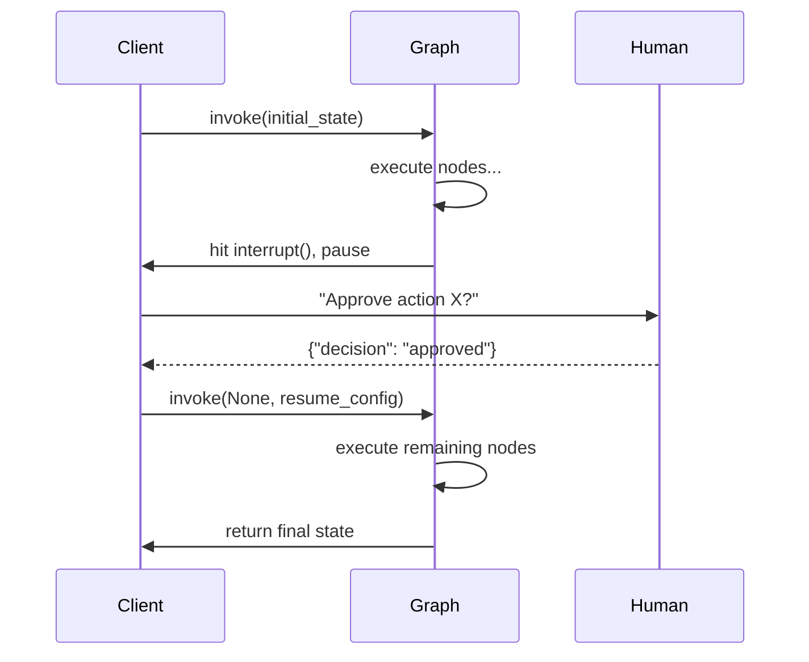
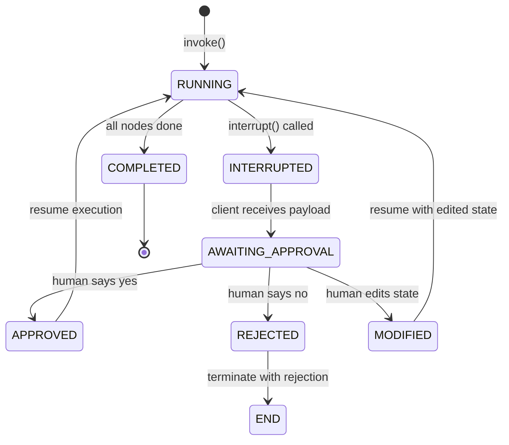
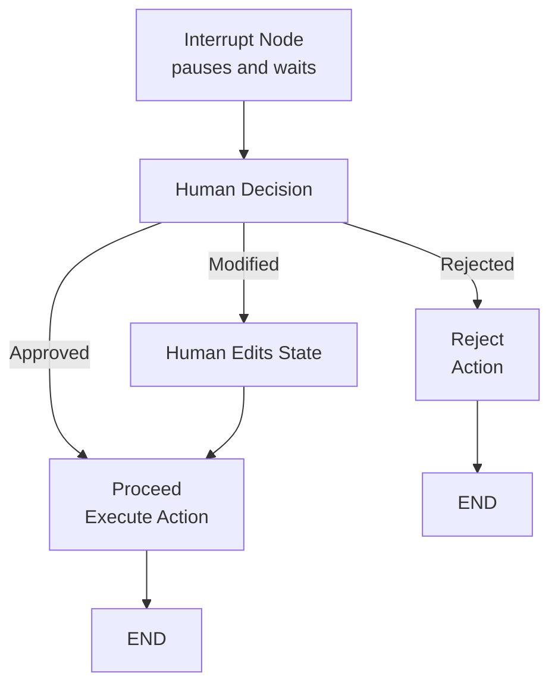

# Human-in-the-Loop, Breakpoints and Dynamic Control

Production agents often need human oversight. LangGraph provides **interrupts**, **breakpoints**, and **dynamic graph updates** to pause execution, wait for input, and modify state or structure on the fly.

---

## Mermaid: Interrupt/Approval Flow



The graph runs until it hits `interrupt()`, the client receives the interrupt payload and presents it to a human, then resumes with the human's decision.

---

## Interrupt Nodes for Human Approval

An **interrupt node** pauses the graph and yields control to the caller. The graph can be resumed later, optionally with modified state.

```python
from langgraph.graph import StateGraph, START, END
from langgraph.types import interrupt

def approval_node(state: AgentState) -> dict:
    # Pause execution and ask for human decision
    decision = interrupt({
        "question": "Approve this action?",
        "action": state["pending_action"]
    })
    if decision == "approved":
        return {"status": "approved"}
    else:
        return {"status": "rejected"}

builder.add_node("approve", approval_node)
```

[!WARNING]
The `interrupt()` function raises a special exception that pauses the graph. The caller **must** catch it via the client API to read the interrupt value and provide a resume action.

---

## Mermaid: HITL Decision State Diagram



The HITL state machine has multiple exit paths from the interrupt: approve, reject, or modify-and-continue.

---

## Comparison: Interrupt Types

| Interrupt Type | Method | Scope | Use Case |
| :--- | :--- | :--- | :--- |
| Node interrupt | `interrupt()` inside node | Pauses at specific point | Approval gate, validation failures |
| `interrupt_before` | `app.invoke(interrupt_before=["node"])` | Pauses before a node | Debugging, step-through |
| `interrupt_after` | `app.invoke(interrupt_after=["node"])` | Pauses after a node | Verify output before proceeding |
| All-nodes breakpoint | `app.invoke(interrupt_before=["__all__"])` | Pauses before every node | Deep debugging, trace |

---

## Waiting for User Input Mid-Graph

When a graph hits an interrupt, the client receives the interrupt data and must decide how to proceed.

```python
# Client-side code
from langgraph.graph import StateGraph

app = builder.compile(checkpointer=memory)

# Run until interrupt
config = {"configurable": {"thread_id": "t1"}}
for event in app.stream({"messages": ["Process payment"]}, config):
    if "__interrupt__" in event:
        interrupt_data = event["__interrupt__"][0]
        print(interrupt_data["question"])  # "Approve this action?"

        # Resume with human decision
        result = app.invoke(
            None,  # no new input, just resume
            {"configurable": {"thread_id": "t1"}},
            interrupt_after={"approve": "approved"}
        )
```

[!TIP]
You can pass a **resumption value** to `interrupt()` by passing it as the second argument to `app.invoke()`. The value becomes the return value of `interrupt()` inside the node. For example, pass `"approved"` to resume with approval.

---

## Interrupt with Approval/Rejection

```python
def payment_approval_node(state: AgentState) -> dict:
    """Interrupt for payment approval with full context."""
    approval_data = {
        "type": "payment_approval",
        "amount": state["payment"]["amount"],
        "recipient": state["payment"]["recipient"],
        "risk_score": state["risk_score"],
        "summary": f"Transfer ${state['payment']['amount']} to {state['payment']['recipient']}"
    }
    decision = interrupt(approval_data)

    if decision == "approved":
        return {"payment_status": "approved", "approved_by": "human"}
    elif decision == "rejected":
        return {"payment_status": "rejected", "rejection_reason": "human declined"}
    else:
        # Human modified the payment
        return {"payment": decision, "payment_status": "modified"}

# Client side: resume with decision
resumed = app.invoke(
    None,
    config,
    interrupt_after={"payment_approval": "approved"}
)
```

---

## Editing State Mid-Graph

You can modify the graph state before resuming, effectively overriding what the agent was about to do.

```python
# Get current state from checkpoint
state = app.get_state(config)

# Edit messages in state
state.values["messages"] = state.values["messages"] + ["[Corrected by human]"]

# Update state and resume
app.update_state(config, {"messages": state.values["messages"]})
result = app.invoke(None, config)
```

This pattern is critical for **human correction** — the operator can fix errors before the agent continues.

[!IMPORTANT]
Calling `update_state()` creates a **new checkpoint** with the modified values. The original state is preserved in the prior checkpoint, so you can always roll back if the human correction introduced new errors.

### State Editing Safety

```python
def safe_state_edit(app, config, edits: dict) -> dict:
    """Safely edit state with validation before resuming."""
    # 1. Capture current state
    current = app.get_state(config)
    print(f"Current state: {current.values}")

    # 2. Apply edits
    for key, value in edits.items():
        if key in current.values:
            current.values[key] = value
        else:
            print(f"Warning: key '{key}' not in state schema")

    # 3. Update and resume
    app.update_state(config, edits)
    return app.invoke(None, config)

# Human corrects an amount
result = safe_state_edit(app, config, {"amount": 150.00, "approved": True})
```

---

## Timeout Handling with Human Approval

[!WARNING]
If a human takes too long to respond, the interrupt sits open indefinitely. Implement a **timeout mechanism** on the client side to handle abandoned approvals.

```python
import asyncio

async def invoke_with_timeout(app, state, config, timeout_seconds=300):
    """Invoke graph with a human-in-the-loop timeout."""
    try:
        async for event in app.astream(state, config):
            if "__interrupt__" in event:
                print("Waiting for human approval...")
                # Start a timeout task
                try:
                    decision = await asyncio.wait_for(
                        get_human_decision(event["__interrupt__"]),
                        timeout=timeout_seconds
                    )
                    # Resume with decision
                    return app.invoke(None, {
                        **config,
                        "interrupt_after": decision
                    })
                except asyncio.TimeoutError:
                    # Auto-reject on timeout
                    print("Approval timed out — rejecting")
                    return app.invoke(None, {
                        **config,
                        "interrupt_after": "rejected"
                    })
    except Exception as e:
        return {"error": str(e)}
```

---

## Dynamic Graph Updates

LangGraph allows adding or removing nodes and edges **between runs** without redefining the entire graph.

```python
# After the first run, dynamically add a new node
builder.add_node("audit", lambda s: {"audit_log": s["messages"]})
builder.add_edge("process", "audit")
builder.add_edge("audit", END)

# Recompile and run with the new structure
app2 = builder.compile(checkpointer=memory)
```

This enables adaptive agent topologies where the graph shape evolves based on prior execution results.

[!TIP]
Dynamic updates are useful for **progressive disclosure** — start with a simple graph and add capability nodes as the conversation reveals more complex needs.

---

## Validation Nodes

A **validation node** is a guard that checks state integrity before the graph proceeds further, often combined with interrupts for human correction.

```python
def validation_node(state: AgentState) -> dict:
    errors = []
    if not state.get("user_confirmed"):
        errors.append("User confirmation missing")
    if state["amount"] < 0:
        errors.append("Negative amount not allowed")

    if errors:
        # Interrupt with validation errors
        interrupt({"errors": errors, "state": state})
    return {"validation_errors": errors}
```

### Validation Node Pattern

```python
def comprehensive_validation(state: AgentState) -> dict:
    """Multi-field validation with human override."""
    validation_results = {"valid": True, "errors": [], "warnings": []}

    # Required fields
    required_fields = ["user_id", "amount", "recipient"]
    for field in required_fields:
        if field not in state or state[field] is None:
            validation_results["errors"].append(f"Missing required field: {field}")
            validation_results["valid"] = False

    # Business rules
    if state.get("amount", 0) > 10000:
        validation_results["warnings"].append(
            f"Large transfer: ${state['amount']} — needs manager approval"
        )

    if not validation_results["valid"]:
        # Pause for human correction
        human_response = interrupt({
            "type": "validation_failure",
            "errors": validation_results["errors"],
            "warnings": validation_results["warnings"],
            "current_state": state,
        })
        return {"validation_result": human_response}

    return {"validation_result": validation_results}
```

---

## Comparison: Breakpoint Strategies

| Strategy | Method | Use Case |
| :--- | :--- | :--- |
| Interrupt node | `interrupt()` | Internal graph pause for approval |
| Update state | `update_state()` | Correct or amend state before resume |
| Dynamic node | `add_node()` / `add_edge()` | Change graph topology between runs |
| Validation guard | Custom node + interrupt | Pre-commit validation with human override |
| Timeout handling | asyncio.wait_for | Auto-reject abandoned approvals |
| Step-through break | `interrupt_before` / `interrupt_after` | Per-node debugging |

---

## Mermaid: Human-in-the-Loop Flow



The graph pauses at the interrupt node, waits for human input, then routes based on the decision.

---

```question
{
  "id": "lg-04-q1",
  "type": "multiple-choice",
  "question": "What function does LangGraph provide to pause execution for human input?",
  "options": ["pause()", "interrupt()", "wait()", "breakpoint()"],
  "correct": 1,
  "explanation": "The interrupt() function pauses the graph and yields control to the caller for human input or approval."
}
```

```question
{
  "id": "lg-04-q2",
  "type": "multiple-choice",
  "question": "How do you modify the graph state before resuming from an interrupt?",
  "options": ["Pass a new state dict to invoke()", "Call update_state() with the desired changes", "Recompile the graph with new initial state", "Set environment variables"],
  "correct": 1,
  "explanation": "update_state() allows you to amend the graph state before resuming execution from an interrupt."
}
```

```question
{
  "id": "lg-04-q3",
  "type": "multiple-choice",
  "question": "What is a dynamic graph update?",
  "options": ["Changing the graph topology between runs without redefining everything", "Updating the state schema at runtime", "Replacing the interrupt handler", "Modifying Python imports"],
  "correct": 0,
  "explanation": "Dynamic graph updates let you add or remove nodes and edges between runs without redefining the entire graph."
}
```

```question
{
  "id": "lg-04-q4",
  "type": "multiple-choice",
  "question": "What is the purpose of a validation node?",
  "options": ["Log execution metrics", "Check state integrity before proceeding, often triggering an interrupt", "Compile the graph", "Run unit tests"],
  "correct": 1,
  "explanation": "A validation node acts as a guard that checks state integrity before the graph proceeds, often combined with interrupts for human correction."
}
```

```question
{
  "id": "lg-04-q5",
  "type": "multiple-choice",
  "question": "Which API call is used to resume a graph after an interrupt?",
  "options": ["app.resume()", "app.continue()", "app.invoke() with the same config", "app.restart()"],
  "correct": 2,
  "explanation": "After an interrupt, you resume the graph by calling app.invoke() with the same thread config."
}
```

```question
{
  "id": "lg-04-q6",
  "type": "multiple-choice",
  "question": "Scenario: A payment processing agent hits interrupt() asking for approval. The human realizes the amount is wrong. How should they proceed?",
  "options": ["Reject and restart the whole conversation", "Use update_state() to correct the amount, then resume with invoke()", "Ignore the interrupt", "Kill the process"],
  "correct": 1,
  "explanation": "The operator should use app.update_state() to fix the amount, then app.invoke(None, config) to resume with the corrected state."
}
```

```question
{
  "id": "lg-04-q7",
  "type": "multiple-choice",
  "question": "What happens if a human never responds to an interrupt?",
  "options": ["The graph auto-resumes after 30 seconds", "The interrupt stays open indefinitely unless client handles timeout", "The graph raises an exception", "The state is garbage collected"],
  "correct": 1,
  "explanation": "Interrupts persist indefinitely until the client resumes via invoke(). Implement client-side timeout handling for production."
}
```

---

[!SUCCESS]
### Key Takeaways
- `interrupt()` pauses the graph and returns control to the caller.
- After an interrupt, the client can inspect, modify state, and resume via `invoke()`.
- `update_state()` allows state corrections before resuming execution.
- Dynamic graph updates let you add nodes/edges between runs.
- Validation nodes combined with interrupts create guardrails for production agents.
- The human-in-the-loop pattern is essential for trusted, auditable agent systems.
- Breakpoints can be inserted at specific nodes or at every node for debugging.
- Implement timeout handling for production HITL to prevent abandoned interrupts.
- Use `interrupt_before` and `interrupt_after` for step-through debugging.
- State editing creates new checkpoints — the original state is always recoverable.
