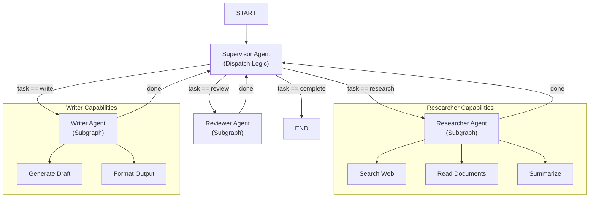
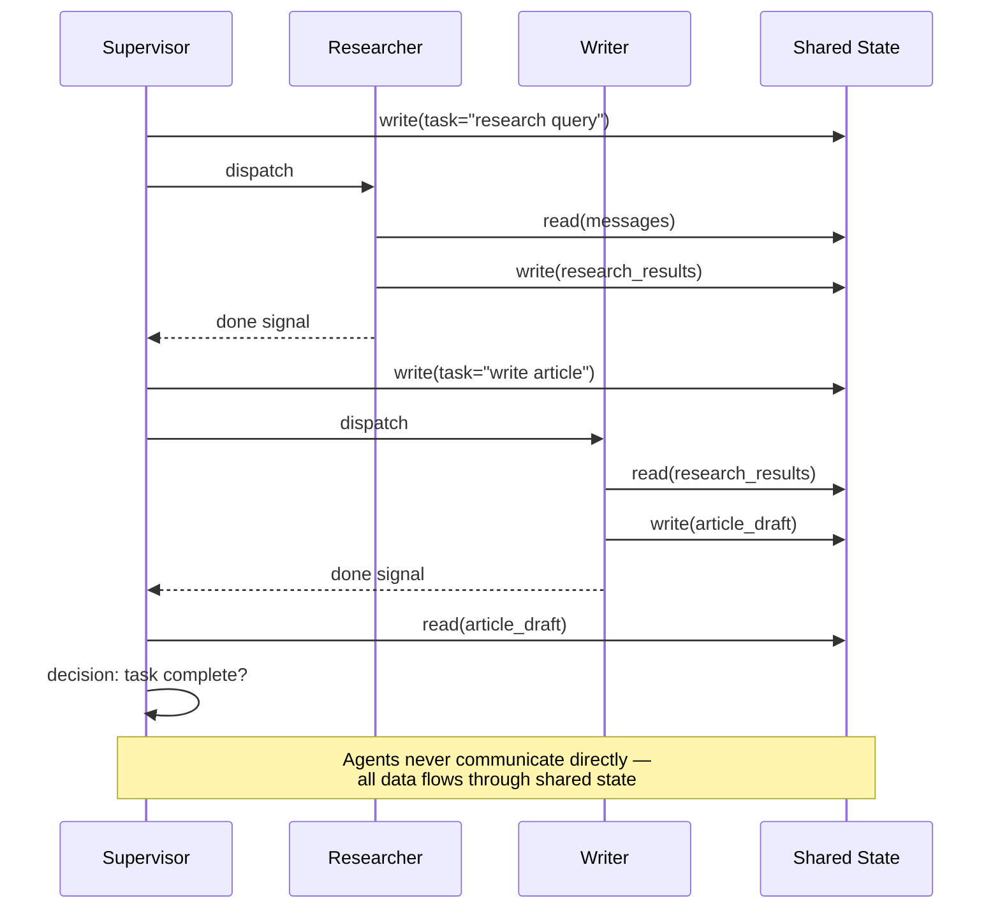
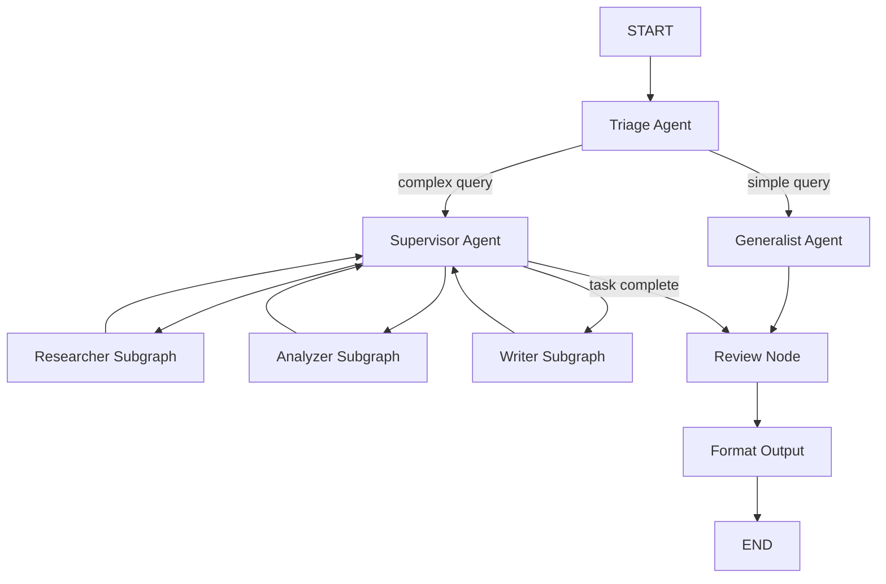

# Multi-Agent Orchestration and Subgraphs

Real-world agent systems rarely use a single agent. LangGraph lets you compose **subgraphs** into larger graphs, orchestrate multiple agents with a **supervisor**, and enable communication through shared state.

---

## Mermaid: Supervisor Agent Architecture



The supervisor sits at the center, dispatching tasks to specialized subgraphs. Each subgraph encapsulates its own tools, nodes, and state management.

---

## Composing Subgraphs into Parent Graphs

A subgraph is a fully compiled `StateGraph` that can be added as a node in a parent graph. The parent graph passes state to the subgraph and receives updated state upon completion.

```python
from langgraph.graph import StateGraph, START, END

# Define a subgraph
sub_builder = StateGraph(AgentState)
sub_builder.add_node("sub_task", lambda s: {"messages": s["messages"] + ["Sub done"]})
sub_builder.add_edge(START, "sub_task")
sub_builder.add_edge("sub_task", END)
subgraph = sub_builder.compile()

# Define the parent graph
parent_builder = StateGraph(AgentState)
parent_builder.add_node("preprocess", preprocess_node)
parent_builder.add_node("subgraph", subgraph)  # subgraph as a node
parent_builder.add_node("postprocess", postprocess_node)

parent_builder.add_edge(START, "preprocess")
parent_builder.add_edge("preprocess", "subgraph")
parent_builder.add_edge("subgraph", "postprocess")
parent_builder.add_edge("postprocess", END)

parent_app = parent_builder.compile()
```

[!WARNING]
Subgraphs use their **own state schema**. The parent must pass a compatible state dict. If schemas differ, map fields explicitly in the node wrapper.

### Subgraph State Mapping

```python
def subgraph_wrapper(state: ParentState) -> dict:
    """Map parent state to subgraph schema and back."""
    # Transform parent state to subgraph-compatible format
    sub_state = {
        "messages": state["conversation_history"],  # renamed field
        "config": state["settings"],
        "task": state["current_task"],
    }
    # The subgraph node receives and returns sub_state
    return sub_state
```

---

## Mermaid: Agent-to-Agent Communication



Agents communicate exclusively through the shared state. This decouples agents, making the system easier to debug, test, and extend.

---

## Agent Communication via Shared State

Multiple agents in the same graph communicate through the shared state. Each agent reads messages, processes them, and appends results for the next agent.

```python
def researcher_agent(state: AgentState) -> dict:
    # Reads shared state, produces research
    query = state["messages"][-1]
    research = f"Research findings about: {query}"
    return {"messages": state["messages"] + [f"[Researcher]: {research}"]}

def writer_agent(state: AgentState) -> dict:
    # Reads research from state, writes output
    last_msg = state["messages"][-1]
    article = f"Draft based on: {last_msg}"
    return {"messages": state["messages"] + [f"[Writer]: {article}"]}

builder.add_node("researcher", researcher_agent)
builder.add_node("writer", writer_agent)
builder.add_edge(START, "researcher")
builder.add_edge("researcher", "writer")
builder.add_edge("writer", END)
```

[!TIP]
Design shared state as a **message bus**. Each agent appends to a `messages` list, creating an auditable trace of every agent's output. This makes debugging trivial — you can replay the conversation and see exactly what each agent produced.

---

## Supervisor Agent Pattern

A **supervisor agent** is a special node that decides which subordinate agent should run next. It inspects the shared state and emits routing commands.

```python
def supervisor_agent(state: AgentState) -> dict:
    # Decide which agent to route to next
    if state.get("task_complete"):
        return {"next_agent": "FINISH"}
    if "research" in state["task_type"]:
        return {"next_agent": "researcher"}
    return {"next_agent": "writer"}

# Route based on supervisor decision
builder.add_conditional_edges(
    "supervisor",
    lambda s: s["next_agent"],
    {
        "researcher": "researcher",
        "writer": "writer",
        "FINISH": END,
    }
)
```

### Supervisor Routing with LLM

```python
from langchain.chat_models import ChatOpenAI

llm = ChatOpenAI(model="gpt-4")

def llm_supervisor(state: AgentState) -> dict:
    """Use an LLM to decide the next agent."""
    agents = ["researcher", "writer", "reviewer", "FINISH"]
    prompt = f"""
    Current task: {state['task']}
    Progress: {state['messages'][-3:]}
    Available agents: {', '.join(agents)}
    Which agent should run next?
    """
    response = llm.invoke(prompt)
    next_agent = response.content.strip()

    # Validate the LLM's choice
    if next_agent not in agents:
        next_agent = "FINISH"  # safe fallback

    return {"next_agent": next_agent}
```

---

## Routing Between Agents

The supervisor-driven loop continues until `FINISH` is selected. Each subordinate reports back to the supervisor after completing its work.

```python
# After researcher finishes, return to supervisor
builder.add_edge("researcher", "supervisor")
# After writer finishes, return to supervisor
builder.add_edge("writer", "supervisor")

# Start with supervisor
builder.add_edge(START, "supervisor")
```

This creates a **re-entrant loop** where the supervisor keeps dispatching until the task is done.

---

## Agent Handoff Patterns

```python
def handoff_agent(state: AgentState) -> dict:
    """Hand off to another agent with context."""
    return {
        "messages": state["messages"] + [
            "[Handoff]: Transferring to specialist agent"
        ],
        "current_agent": "specialist",
        "handoff_context": {
            "original_query": state["messages"][0],
            "processing_summary": state.get("processing_summary", ""),
        }
    }

# Handoff triggers a conditional edge
builder.add_conditional_edges(
    "triage_agent",
    lambda s: s["current_agent"],
    {
        "generalist": "generalist",
        "specialist": "specialist",
        "FINISH": END,
    }
)
```

---

## Subgraph Composition

```python
# Specialist subgraph with its own tools
specialist_builder = StateGraph(AgentState)
specialist_builder.add_node("analyze", analyze_tool)
specialist_builder.add_node("recommend", recommend_tool)
specialist_builder.add_edge(START, "analyze")
specialist_builder.add_edge("analyze", "recommend")
specialist_builder.add_edge("recommend", END)
specialist_subgraph = specialist_builder.compile()

# Compose into parent
parent = StateGraph(AgentState)
parent.add_node("triage", triage_agent)
parent.add_node("specialist", specialist_subgraph)
parent.add_edge(START, "triage")
parent.add_conditional_edges("triage", router, {
    "specialist": "specialist",
    "FINISH": END,
})
parent.add_edge("specialist", END)
```

### Comparison: Subgraph Patterns

| Pattern | Structure | State Sharing | Best For |
| :--- | :--- | :--- | :--- |
| Flat composition | All nodes in one graph | Full shared state | Simple multi-step agents |
| Hierarchical subgraph | Parent + nested subgraphs | Schema mapping layer | Encapsulated capabilities |
| Supervisor loop | Central router + workers | Task queue in state | Complex orchestration |
| Pipeline subgraph | Sequential subgraph chain | Pass-through state | Multi-stage processing |
| Parallel subgraphs | Multiple subgraphs in parallel | Branch-specific state | Independent subtasks |

---

## Tool-Calling Agents

Agents can call external tools. Tools are registered as nodes or as functions available to an LLM-powered agent node.

```python
from langchain.tools import tool

@tool
def search_web(query: str) -> str:
    """Search the web for information."""
    return f"Web results for {query}"

@tool
def calculate(expression: str) -> str:
    """Evaluate a mathematical expression."""
    return str(eval(expression))

# Tool-calling agent node
def tool_agent(state: AgentState) -> dict:
    # LLM decides which tool to call based on state
    if "calculate" in state["messages"][-1]:
        result = calculate.invoke({"expression": "2 + 2"})
    else:
        result = search_web.invoke({"query": state["messages"][-1]})
    return {"messages": state["messages"] + [f"[Tool]: {result}"]}
```

### Structured Tool Agent

```python
from typing import Any, Dict, List
from langchain.tools import StructuredTool

def database_query(table: str, filters: Dict[str, Any]) -> List[Dict]:
    """Query a database table with filters."""
    # Simulated query
    return [{"id": 1, "name": "Sample"}]

query_tool = StructuredTool.from_function(
    func=database_query,
    name="database_query",
    description="Query the database with table name and filters"
)

def structured_tool_agent(state: AgentState) -> dict:
    """Agent that uses structured tools with typed parameters."""
    result = query_tool.invoke({
        "table": "customers",
        "filters": {"status": "active", "limit": 10}
    })
    return {"messages": state["messages"] + [f"[DB Query]: {len(result)} records"]}
```

---

## Shared State Design

[!TIP]
Design your shared state to include a **dedicated communication field** (e.g., `messages` or `interactions`) that all agents can read and append to. Keep agent-specific data in namespaced keys (e.g., `research_agent.output`, `writer_agent.draft`) to avoid key collisions.

```python
class MultiAgentState(TypedDict):
    # Shared communication channel
    messages: List[str]

    # Supervisor routing
    next_agent: str
    task_complete: bool

    # Agent-specific namespaced outputs
    research_output: str
    writer_draft: str
    reviewer_feedback: str

    # Shared context
    original_query: str
    task_type: str
    loop_count: int  # prevent infinite loops
```

---

## Subgraph Permission Boundaries

[!WARNING]
Subgraphs cannot access the parent's nodes or state directly — they only see the state passed to them. This is a **security boundary**: a subgraph cannot mutate parent state arbitrarily. Use explicit state mapping to control what each subgraph can read and write.

---

## Comparison: Communication Strategies

| Strategy | Mechanism | Coupling | Debugging | Use Case |
| :--- | :--- | :--- | :--- | :--- |
| Shared state dict | `state["messages"]` | Loose (via schema) | Easy — replay state | Most agents |
| Namespaced state keys | `state["agent_name.field"]` | Loose | Easy — per-agent traces | Multi-agent with outputs |
| Subgraph I/O mapping | Explicit field mapping | Loose | Moderate — check mapping | Subgraph composition |
| Direct function call | Call another node directly | Tight | Hard — hidden dependency | Not recommended |
| Message bus pattern | Append-only messages | Very loose | Trivial — full history | Supervisor orchestrations |

---

## Mermaid: Full Orchestration Flow



---

```question
{
  "id": "lg-05-q1",
  "type": "multiple-choice",
  "question": "How do you add a subgraph as a node in a parent graph?",
  "options": ["parent.add_node(\"name\", subgraph)", "parent.attach(subgraph)", "parent.include(subgraph)", "parent.merge(subgraph)"],
  "correct": 0,
  "explanation": "A fully compiled StateGraph (subgraph) can be added as a node using add_node() just like any regular node."
}
```

```question
{
  "id": "lg-05-q2",
  "type": "multiple-choice",
  "question": "What is the role of a supervisor agent in LangGraph?",
  "options": ["Execute all tasks itself", "Decide which subordinate agent should run next", "Compile the graph", "Manage database connections"],
  "correct": 1,
  "explanation": "A supervisor agent inspects shared state and decides which subordinate agent should run next, routing dynamically."
}
```

```question
{
  "id": "lg-05-q3",
  "type": "multiple-choice",
  "question": "How do multiple agents communicate in LangGraph?",
  "options": ["Via HTTP requests", "Through the shared graph state", "Writing to files", "Using Unix sockets"],
  "correct": 1,
  "explanation": "Multiple agents in the same graph communicate through the shared typed state passed between nodes."
}
```

```question
{
  "id": "lg-05-q4",
  "type": "multiple-choice",
  "question": "What creates a re-entrant loop in a supervisor pattern?",
  "options": ["Subordinate agents returning to the supervisor after work", "Adding parallel edges", "Using MemorySaver", "Calling interrupt()"],
  "correct": 0,
  "explanation": "Each subordinate agent returns control to the supervisor after completing its work, creating a loop until the task is complete."
}
```

```question
{
  "id": "lg-05-q5",
  "type": "multiple-choice",
  "question": "Which of the following is NOT a typical orchestration pattern in LangGraph?",
  "options": ["Sequential", "Supervisor loop", "Event-driven pub/sub", "Tool-calling"],
  "correct": 2,
  "explanation": "Event-driven pub/sub is not a typical orchestration pattern in LangGraph; supported patterns include sequential, supervisor loop, subgraph, and tool-calling."
}
```

```question
{
  "id": "lg-05-q6",
  "type": "multiple-choice",
  "question": "Scenario: You have a research agent that produces output the writer agent needs. How should data flow?",
  "options": ["Research agent calls writer agent directly", "Research writes to shared state, supervisor routes to writer", "Both agents use separate databases", "Writer agent re-does the research"],
  "correct": 1,
  "explanation": "The researcher writes findings to shared state, then the supervisor routes the writer to read from state and produce output."
}
```

```question
{
  "id": "lg-05-q7",
  "type": "multiple-choice",
  "question": "What is the security implication of subgraph state boundaries?",
  "options": ["Subgraphs can read any parent state", "Subgraphs only see the state explicitly passed to them", "Subgraphs can modify parent nodes", "There are no boundaries"],
  "correct": 1,
  "explanation": "Subgraphs only see and operate on the state explicitly passed to them, providing a natural permission boundary."
}
```

---

[!SUCCESS]
### Key Takeaways
- Subgraphs are fully compiled StateGraphs added as nodes in a parent graph.
- Multiple agents communicate through the shared typed state passed between nodes.
- The supervisor agent pattern uses a central dispatcher that routes to subordinate agents.
- Subordinate agents return control to the supervisor, creating a loop until completion.
- Tool-calling agents integrate external functions (APIs, calculators, search) as nodes.
- Subgraphs encapsulate capabilities and can be reused across different parent graphs.
- LangGraph supports sequential, supervisor, subgraph, tool-calling, and parallel orchestration.
- Design shared state with namespaced keys to avoid agent output collisions.
- Subgraph state boundaries provide natural security isolation.
- Use the message bus pattern (append-only messages) for full auditability.
