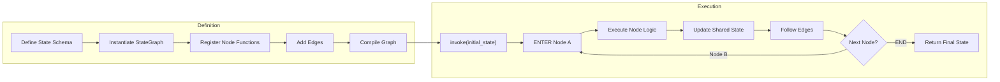
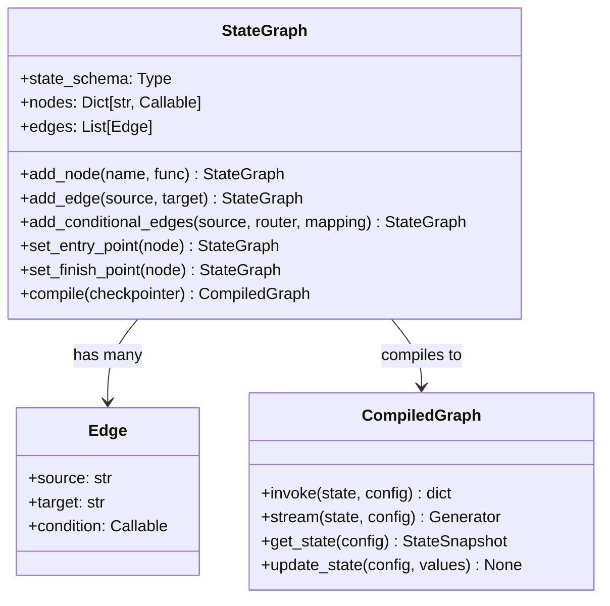
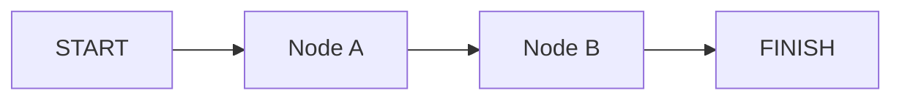
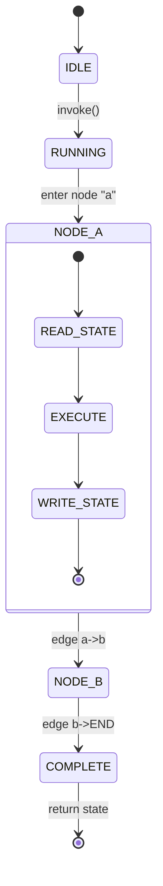

# Fundamentos de LangGraph y Grafos de Estado

LangGraph es un framework de LangChain para construir **aplicaciones stateful multi-agente** usando grafos como abstracción central. Cada nodo modifica un estado compartido y las aristas definen el flujo.

---

## ¿Qué es LangGraph?

LangGraph extiende LangChain modelando la lógica del agente como un **grafo dirigido**. El grafo transporta un **objeto de estado tipado** que persiste a través de los nodos, permitiendo loops complejos, ramificaciones y memoria.

Conceptos clave:
- **StateGraph**: Clase recomendada para grafos con estado
- **Graph**: Alternativa más simple, stateless
- **Nodos**: Funciones Python que reciben y modifican el estado
- **Aristas**: Conexiones dirigidas entre nodos

[!WARNING]
LangGraph **no** es una herramienta de DAG de workflow. Los nodos pueden ser revisitados, los loops pueden formarse y el estado se preserva entre ciclos. Esto es lo que lo hace adecuado para sistemas agenticos.

---

## Mermaid: Ciclo de Ejecución Completo



La fase de **Definición** construye la topología del grafo. La fase de **Ejecución** ejecuta nodos secuencialmente o en paralelo, cada uno leyendo y escribiendo en el estado compartido.

---

## StateGraph vs Graph

| Característica | StateGraph | Graph |
| :--- | :--- | :--- |
| Estado tipado | Sí (TypedDict) | No (valores simples) |
| Aristas condicionales | Sí | Sí |
| Checkpointing | Integrado (MemorySaver) | No soportado |
| Ramificación paralela | Sí | Limitada |
| Nodos re-entrantes | Sí | No |
| Preparado para producción | Alto (PostgresSaver) | Bajo |
| Soporte de loops | Sí | No |
| Humano-en-el-bucle | Via interrupt() | No soportado |
| Composición de subgrafos | Sí | No |

[!TIP]
Siempre prefiere `StateGraph` a menos que tengas un pipeline stateless muy simple. La sobrecarga es mínima y obtienes checkpointing, ramificación y características de producción gratis.

---

## Mermaid: Diagrama de Clase de la API StateGraph



El patrón builder `StateGraph` colecciona nodos y aristas, luego `.compile()` produce un `CompiledGraph` que puede invocarse con estado y configuración.

---

## Definiendo Estado con TypedDict

```python
from typing import TypedDict, List
from langgraph.graph import StateGraph

# Define el esquema de estado compartido
class AgentState(TypedDict):
    messages: List[str]   # conversación hasta ahora
    next_step: str        # qué nodo ejecutar a continuación
    metadata: dict        # metadatos arbitrarios

# Instancia un StateGraph con el esquema
builder = StateGraph(AgentState)
```

[!NOTE]
StateGraph soporta tres enfoques de definición de esquema: `TypedDict` (ligero, sin validación), `dataclass` (mutable, Pythonico) y `pydantic.BaseModel` (validación, serialización). Elige `BaseModel` para producción cuando necesites verificación de tipos en tiempo de ejecución.

### Comparación: Enfoques de Definición de Estado

| Enfoque | Validación | Serialización | Boilerplate | Caso de Uso |
| :--- | :--- | :--- | :--- | :--- |
| `TypedDict` | Ninguna | Manual | Mínimo | Prototipado, agentes simples |
| `dataclass` | Ninguna | Via dataclasses.asdict() | Bajo | Herramientas internas |
| `BaseModel` | Validación Pydantic completa | .dict()/.json() integrado | Moderado | Sistemas de producción |

---

## Nodos y Aristas

```python
# Nodo: una función que recibe el estado y retorna actualizaciones
def node_a(state: AgentState) -> dict:
    print("--- Nodo A ---")
    return {"messages": state["messages"] + ["Hola desde A"]}

def node_b(state: AgentState) -> dict:
    print("--- Nodo B ---")
    return {"messages": state["messages"] + ["Hola desde B"]}

# Registra nodos
builder.add_node("a", node_a)
builder.add_node("b", node_b)

# Añade aristas: a -> b
builder.add_edge("a", "b")

# Define puntos de entrada y salida
builder.set_entry_point("a")
builder.set_finish_point("b")
```

[!TIP]
Las funciones de nodo **deben** retornar un diccionario (o `None`). Los valores retornados se fusionan en el estado compartido mediante una actualización superficial. Las claves no retornadas mantienen su valor anterior — así es como el estado persiste entre nodos.

### Ejecución Paralela de Nodos

```python
def node_a(state: AgentState) -> dict:
    return {"messages": state["messages"] + ["A"]}

def node_b(state: AgentState) -> dict:
    return {"messages": state["messages"] + ["B"]}

def node_c(state: AgentState) -> dict:
    return {"messages": state["messages"] + ["C"]}

builder = StateGraph(AgentState)
builder.add_node("a", node_a)
builder.add_node("b", node_b)
builder.add_node("c", node_c)

# Fan-out: a dispara b y c simultáneamente
builder.add_edge(START, "a")
builder.add_edge("a", "b")
builder.add_edge("a", "c")
builder.add_edge("b", END)
builder.add_edge("c", END)
```

Cuando dos aristas salen del mismo nodo, ambos destinos ejecutan **en paralelo** usando threads de Python. Cada rama recibe una copia del estado y las escrituras se fusionan al completarse.

### Manejo de Errores en Nodos

```python
import traceback

def safe_node(state: AgentState) -> dict:
    try:
        result = risky_operation(state["messages"][-1])
        return {"messages": state["messages"] + [result]}
    except Exception as e:
        # Registra el error y continúa con fallback
        return {
            "messages": state["messages"] + [f"[ERROR]: {str(e)}"],
            "errors": state.get("errors", []) + [traceback.format_exc()]
        }
```

Envuelve la lógica de nodo propensa a fallos en try/except para evitar que todo el grafo se caiga. Almacena errores en el estado para manejo downstream o revisión humana.

---

## Compilando y Ejecutando

```python
# Compila el grafo en un objeto ejecutable
app = builder.compile()

# Invoca con estado inicial
result = app.invoke({
    "messages": [],
    "next_step": "start",
    "metadata": {}
})

print(result["messages"])
# Salida: ['Hola desde A', 'Hola desde B']
```

[!IMPORTANT]
El método `.compile()` congela la definición del grafo. Después de la compilación, no puedes añadir nodos o aristas — debes reconstruir el builder. Para topologías dinámicas, ve la Lección 4 sobre actualizaciones dinámicas de grafo.

### Streaming de Resultados

```python
# Stream de actualizaciones conforme cada nodo completa
for event in app.stream({"messages": [], "next_step": "start", "metadata": {}}):
    for node_name, output in event.items():
        if node_name != "__end__":
            print(f"[{node_name}] -> {output}")
# Salida:
# [a] -> {'messages': ['Hola desde A']}
# [b] -> {'messages': ['Hola desde A', 'Hola desde B']}
```

Usa `.stream()` en lugar de `.invoke()` cuando quieras observar estados intermedios. Cada evento emitido tiene como clave el nombre del nodo con la actualización parcial de estado.

---

## Mermaid: Grafo de Estado Básico



El estado fluye a través de las aristas; cada nodo puede leer *y* escribir en el `AgentState` compartido.

---

## Mermaid: Diagrama de Estado del Ciclo de Vida del Nodo



Cada nodo transiciona por leer → ejecutar → escribir. El grafo orquesta la secuencia, pasando estado a lo largo de las aristas.

---

## Depurando Grafos con LangSmith

[!TIP]
Cuando tu grafo se comporte inesperadamente, traza la ejecución con LangSmith. Establece `LANGCHAIN_TRACING_V2=true` y `LANGCHAIN_API_KEY=your_key` para obtener registros de traza completos mostrando entrada, salida y tiempo de cada nodo.

```bash
# Habilita tracing de LangSmith
export LANGCHAIN_TRACING_V2=true
export LANGCHAIN_PROJECT=mi-agente
```

---

```question
{
  "id": "lg-01-es-q1",
  "type": "multiple-choice",
  "question": "¿Qué clase deberías usar para un agente stateful con múltiples pasos?",
  "options": ["Graph", "StateGraph", "AgentGraph", "SimpleGraph"],
  "correct": 1,
  "explanation": "StateGraph es preferible sobre la clase Graph básica cuando necesitas estado tipado y con checkpoint para agentes multi-paso."
}
```

```question
{
  "id": "lg-01-es-q2",
  "type": "multiple-choice",
  "question": "¿Cómo se tipifica típicamente el estado en un StateGraph?",
  "options": ["dataclass", "TypedDict de typing", "pydantic.BaseModel", "Todas las anteriores"],
  "correct": 3,
  "explanation": "StateGraph soporta esquemas TypedDict, dataclass y pydantic.BaseModel, así que todas son válidas."
}
```

```question
{
  "id": "lg-01-es-q3",
  "type": "multiple-choice",
  "question": "¿Qué recibe y retorna una función de nodo?",
  "options": ["Solo un diccionario", "El estado completo y retorna un diccionario de actualización parcial", "Una lista de mensajes", "Nada, modifica una variable global"],
  "correct": 1,
  "explanation": "Una función de nodo recibe el estado completo y retorna un diccionario parcial de actualizaciones para fusionar en el estado."
}
```

```question
{
  "id": "lg-01-es-q4",
  "type": "multiple-choice",
  "question": "¿Cuál es el propósito de compile()?",
  "options": ["Verificar tipos de la definición del grafo", "Convertir el grafo en un objeto ejecutable", "Desplegar en LangSmith", "Serializar el grafo a JSON"],
  "correct": 1,
  "explanation": "compile() transforma la definición del grafo en un objeto ejecutable que puede invocarse con estado."
}
```

```question
{
  "id": "lg-01-es-q5",
  "type": "multiple-choice",
  "question": "¿Qué NO está soportado por la clase básica Graph?",
  "options": ["Aristas condicionales", "Estado tipado", "Múltiples nodos", "Aristas dirigidas"],
  "correct": 1,
  "explanation": "La clase Graph básica no soporta estado tipado; eso requiere StateGraph."
}
```

```question
{
  "id": "lg-01-es-q6",
  "type": "multiple-choice",
  "question": "Escenario: Estás construyendo un agente de producción que necesita checkpointing. ¿Qué clase elegir?",
  "options": ["Graph", "StateGraph", "SimpleGraph", "AgentGraph"],
  "correct": 1,
  "explanation": "StateGraph ofrece checkpointing integrado via MemorySaver/PostgresSaver, esencial para agentes de producción."
}
```

---

[!SUCCESS]
### Conclusiones Clave
- LangGraph usa grafos dirigidos para representar lógica de agente stateful.
- `StateGraph` es preferible a `Graph` cuando necesitas estado tipado y con checkpoint.
- El estado se define con `TypedDict` y fluye a través de los nodos.
- Los nodos son funciones Python que retornan actualizaciones parciales de estado.
- El grafo se compila via `.compile()` y se invoca via `.invoke()`.
- Las aristas definen la topología; START y FINISH marcan puntos de entrada y salida.
- StateGraph soporta loops, ramificaciones condicionales y persistencia.
- Usa `.stream()` para observación en tiempo real de la salida de cada nodo.
- Envuelve la lógica de nodo en try/except para manejar errores con gracia.
- El tracing de LangSmith ayuda a depurar ejecuciones complejas de grafos.
