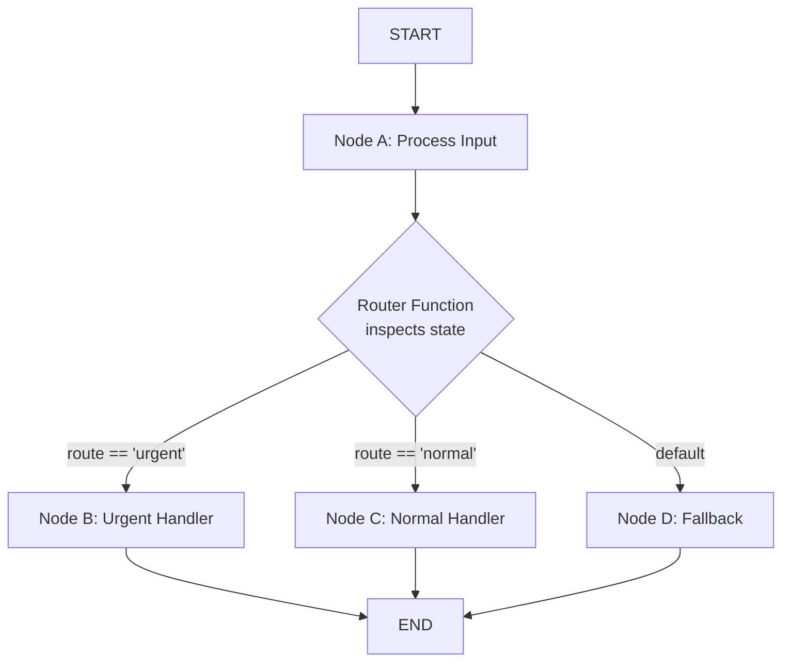
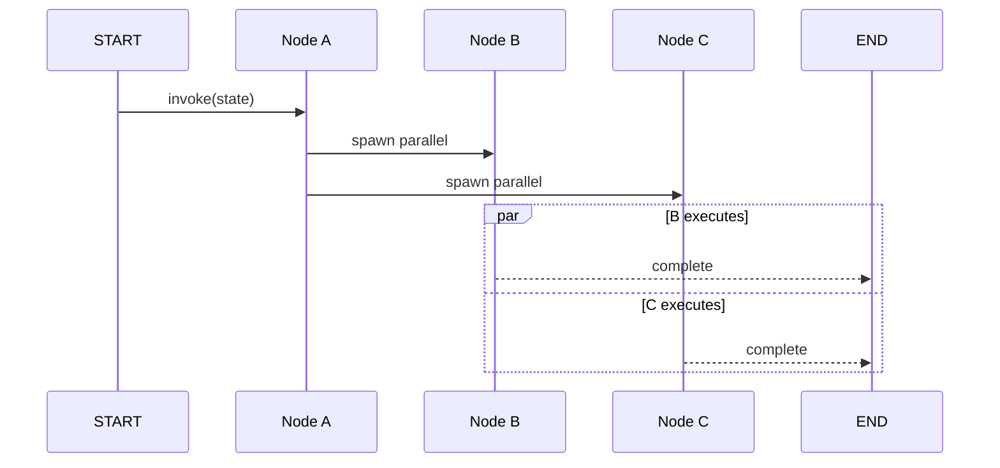
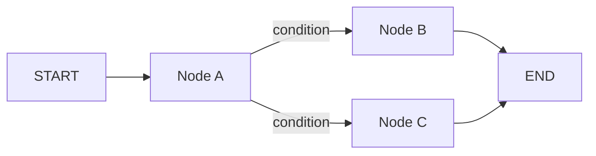

# Nodos, Aristas y Flujo Condicional

Después de definir un StateGraph, el siguiente paso es conectar los nodos con aristas. LangGraph soporta **aristas normales** para pipelines lineales y **aristas condicionales** para enrutamiento dinámico basado en el estado.

---

## Añadiendo Nodos

Cada nodo es una función Python (o callable) que recibe el estado completo y retorna un diccionario de actualizaciones.

```python
from typing import TypedDict, List
from langgraph.graph import StateGraph

class State(TypedDict):
    messages: List[str]
    route: str

def process_a(state: State) -> dict:
    return {"messages": state["messages"] + ["A procesado"]}

def process_b(state: State) -> dict:
    return {"messages": state["messages"] + ["B procesado"]}

def process_c(state: State) -> dict:
    return {"messages": state["messages"] + ["C procesado"]}

builder = StateGraph(State)
builder.add_node("a", process_a)
builder.add_node("b", process_b)
builder.add_node("c", process_c)
```

[!NOTE]
Los nombres de nodos deben ser únicos dentro de un grafo. Si llamas a `add_node()` dos veces con el mismo nombre, la segunda llamada sobrescribe la primera. Usa nombres descriptivos como `"validar_entrada"` en lugar de `"no_1"` para legibilidad.

---

## Aristas Normales vs Aristas Condicionales

| Tipo de Arista | Método | Comportamiento |
| :--- | :--- | :--- |
| Normal | `add_edge(source, target)` | Siempre pasa de origen a destino |
| Condicional | `add_conditional_edges(source, router, mapping)` | Función enrutadora elige el/los siguiente(s) nodo(s) en tiempo real |
| Entrada | `add_edge(START, target)` | Define el punto de entrada del grafo |
| Salida | `add_edge(source, END)` | Marca un camino de terminación |
| Auto-loop | `add_edge(source, source)` | Crea un auto-loop (nodo re-entrante) |

[!WARNING]
Los auto-loops (`add_edge("a", "a")`) crean nodos re-entrantes que pueden ejecutarse indefinidamente. Siempre combínalos con aristas condicionales y una condición de término para prevenir loops infinitos.

---

## Mermaid: Ramificación Condicional con Enrutador



La función enrutadora inspecciona campos del estado y retorna una clave que determina qué arista seguir. Cada clave mapea a un nodo de destino.

---

## Funciones de Enrutamiento

Una **función enrutadora** inspecciona el estado actual y retorna el nombre del siguiente nodo.

```python
def router(state: State) -> str:
    # Decide el siguiente nodo basado en el contenido del estado
    if "urgente" in state["route"]:
        return "b"
    return "c"

# Conecta el nodo "a" a "b" o "c"
builder.add_conditional_edges("a", router, {
    "b": "b",
    "c": "c",
})
```

[!TIP]
Tu función enrutadora puede retornar una sola cadena (un destino) o una lista de cadenas (fan-out a múltiples destinos). Al retornar una lista, todos los nodos listados ejecutan en paralelo.

### Enrutamiento Multi-Condicional

```python
def advanced_router(state: State) -> str:
    msg_count = len(state["messages"])
    if msg_count == 0:
        return "collect_input"
    elif msg_count < 5:
        return "process"
    elif msg_count < 10:
        return "summarize"
    else:
        return "archive"

builder.add_conditional_edges("entry", advanced_router, {
    "collect_input": "collect_input",
    "process": "process",
    "summarize": "summarize",
    "archive": "archive",
})
```

### Patrones de Función Enrutadora

| Patrón | Tipo de Retorno | Comportamiento |
| :--- | :--- | :--- |
| Destino único | `str` | Enruta a exactamente un nodo |
| Múltiples destinos | `List[str]` | Fan-out a múltiples nodos |
| Mapeo dinámico | `str` (clave dinámica) | Clave consultada en el diccionario de mapeo |
| Fallback por defecto | `str` con captura total | Mapea una clave por defecto para casos no manejados |
| Basado en estado | Usa campos del estado | Decisión depende del estado acumulado |

[!WARNING]
La función enrutadora **debe** retornar una clave que exista en el diccionario de mapeo. Si el mapeo contiene `"b": "b"` y el enrutador retorna `"x"`, LangGraph lanza un error de tiempo de ejecución. Siempre incluye una ruta de fallback para casos no manejados.

---

## Enviando a Nodos Específicos con Send()

Para fan-out dinámico avanzado, LangGraph proporciona `Send()` — una API tipada que permite enviar estados diferentes a nodos de destino diferentes.

```python
from langgraph.graph import Send

def dynamic_assigner(state: State) -> List[Send]:
    """Asigna dinámicamente tareas a workers con estado personalizado."""
    tasks = []
    for i, item in enumerate(state.get("items", [])):
        # Cada worker recibe una porción personalizada de estado
        tasks.append(
            Send(
                "worker",
                {"messages": [f"Task {i}: {item}"], "route": state["route"]}
            )
        )
    return tasks

# Cada Send() crea una rama de ejecución independiente
builder.add_node("worker", worker_node)
builder.add_conditional_edges("dispatcher", dynamic_assigner, {
    "worker": "worker",
})
```

`Send()` es la forma canónica de implementar patrones map-reduce en LangGraph. Cada `Send` crea un contexto de ejecución independiente con su propio estado.

---

## Patrón Fan-Out / Fan-In

```python
def reducer_node(state: State) -> dict:
    """Colecciona resultados de ramas paralelas y fusiona."""
    all_results = state.get("results", [])
    # Cada rama adjuntó su salida a 'results'
    merged = "\n".join(all_results)
    return {"messages": state["messages"] + [f"Fusionado: {merged}"]}

def branch_a(state: State) -> dict:
    return {"results": state.get("results", []) + ["Rama A completada"]}

def branch_b(state: State) -> dict:
    return {"results": state.get("results", []) + ["Rama B completada"]}

builder = StateGraph(State)
builder.add_node("dispatcher", dispatcher_node)
builder.add_node("branch_a", branch_a)
builder.add_node("branch_b", branch_b)
builder.add_node("reducer", reducer_node)

# Fan-out
builder.add_edge("dispatcher", "branch_a")
builder.add_edge("dispatcher", "branch_b")

# Fan-in: ambas convergen al reducer
builder.add_edge("branch_a", "reducer")
builder.add_edge("branch_b", "reducer")

builder.add_edge(START, "dispatcher")
builder.add_edge("reducer", END)
```

El patrón fan-in requiere que **todas** las ramas upstream completen antes de que el nodo downstream ejecute. LangGraph maneja esta coordinación automáticamente.

---

## Nodos START y END

LangGraph proporciona dos nodos especiales: `START` (punto de entrada) y `END` (terminación).

```python
from langgraph.graph import START, END

# Define el punto de entrada del grafo
builder.add_edge(START, "a")

# Múltiples aristas de terminación están permitidas
builder.add_edge("b", END)
builder.add_edge("c", END)
```

[!IMPORTANT]
`START` y `END` son **nombres de nodos centinela reservados**. No puedes registrar nodos llamados `"START"` o `"END"` via `add_node()`. Son constantes incorporadas de `langgraph.graph`.

---

## Mermaid: Secuencia de Ejecución Paralela



Las ramas paralelas ejecutan concurrentemente. El grafo espera a que todas las ramas completen antes de proceder a un nodo downstream compartido.

---

## Ejecución Paralela

Puedes bifurcar de un nodo a varios nodos. Se ejecutan **en paralelo** y todos los caminos deben converger o alcanzar END.

```python
# Después de "a", ejecuta "b" y "c" simultáneamente
builder.add_edge("a", "b")
builder.add_edge("a", "c")

# Ambas ramas terminan
builder.add_edge("b", END)
builder.add_edge("c", END)
```

[!TIP]
La ejecución paralela usa threads de Python internamente. Para trabajo intensivo de CPU, considera usar nodos basados en `asyncio` y `.ainvoke()` para aprovechar concurrencia `asyncio` en lugar de threading.

---

## Enviando a Nodos Específicos

Para uso avanzado, un enrutador condicional puede retornar **una lista de nodos** para bifurcar dinámicamente.

```python
def multi_router(state: State) -> List[str]:
    targets = ["b"]
    if state["route"] == "broadcast":
        targets.append("c")
    return targets  # envía a "b" y quizás "c"
```

---

## Ejemplo Completo de Flujo Condicional

```python
def router(state: State) -> str:
    if len(state["messages"]) > 3:
        return "b"
    return "c"

builder.add_conditional_edges("a", router, {
    "b": "b",
    "c": "c",
})
builder.add_edge(START, "a")
builder.add_edge("b", END)
builder.add_edge("c", END)

app = builder.compile()
result = app.invoke({"messages": ["inicio"], "route": "normal"})
print(result["messages"])
```

---

## Mermaid: Flujo Condicional



---

## Prevención de Loop Infinito

[!WARNING]
Al usar aristas condicionales que vuelven a un nodo anterior, siempre incluye un **contador de loop** o **condición de término** en tu estado. Sin esto, el grafo puede ciclar para siempre, agotando tu presupuesto de cómputo.

```python
def router_with_guard(state: State) -> str:
    max_loops = 5
    current = state.get("loop_count", 0)
    if current >= max_loops:
        return "exit"
    return "process"

def increment_loop(state: State) -> dict:
    return {"loop_count": state.get("loop_count", 0) + 1}
```

---

## Actualizaciones de Estado Basadas en Canal

[!TIP]
LangGraph usa "canales" internamente para gestionar la semántica de fusión de estado. Cada clave en tu esquema de estado es un canal separado. Cuando dos ramas paralelas actualizan la misma clave, el último escritor gana. Usa claves distintas por rama para evitar conflictos.

```python
def branch_a(state: State) -> dict:
    return {"a_result": "salida de A"}

def branch_b(state: State) -> dict:
    return {"b_result": "salida de B"}
```

---

```question
{
  "id": "lg-02-es-q1",
  "type": "multiple-choice",
  "question": "¿Qué método añade una arista normal en LangGraph?",
  "options": ["add_edge()", "add_conditional_edges()", "connect()", "link()"],
  "correct": 0,
  "explanation": "add_edge() es el método usado para añadir una arista normal (incondicional) entre dos nodos."
}
```

```question
{
  "id": "lg-02-es-q2",
  "type": "multiple-choice",
  "question": "¿Qué retorna una función enrutadora condicional?",
  "options": ["Un booleano", "Una cadena que coincide con una clave en el diccionario de mapeo", "Un objeto State", "Una lista de mensajes"],
  "correct": 1,
  "explanation": "Una función enrutadora condicional retorna una cadena que debe coincidir con una clave en el diccionario de mapeo pasado a add_conditional_edges()."
}
```

```question
{
  "id": "lg-02-es-q3",
  "type": "multiple-choice",
  "question": "¿Qué son START y END en LangGraph?",
  "options": ["Nombres de nodos reservados para entrada y salida", "Palabras clave de Python", "Variables en el ámbito global", "Decoradores para funciones de nodo"],
  "correct": 0,
  "explanation": "START y END son nombres de nodos centinela reservados que marcan el punto de entrada y el punto de terminación de un grafo."
}
```

```question
{
  "id": "lg-02-es-q4",
  "type": "multiple-choice",
  "question": "¿Qué sucede cuando añades dos aristas desde el nodo a a los nodos b y c?",
  "options": ["Solo b ejecuta", "b y c ejecutan en paralelo", "Error de tiempo de ejecución — no se permiten múltiples aristas desde un nodo", "c espera a que b termine"],
  "correct": 1,
  "explanation": "Múltiples aristas salientes de un nodo ejecutan sus destinos en paralelo."
}
```

```question
{
  "id": "lg-02-es-q5",
  "type": "multiple-choice",
  "question": "¿Qué ocurre si un enrutador retorna una clave que no existe en el diccionario de mapeo?",
  "options": ["El grafo usa la arista por defecto", "Se lanza un error de tiempo de ejecución", "El grafo salta el nodo silenciosamente", "El estado se revierte"],
  "correct": 1,
  "explanation": "LangGraph lanza un error de tiempo de ejecución si la función enrutadora retorna una clave que no existe en el diccionario de mapeo."
}
```

```question
{
  "id": "lg-02-es-q6",
  "type": "multiple-choice",
  "question": "Escenario: Tienes un agente de soporte al cliente. Si el mensaje del usuario contiene 'reembolso', enruta a 'refund_handler'; si no, a 'general_handler'. ¿Qué patrón usar?",
  "options": ["Solo aristas normales", "Aristas condicionales con enrutador verificando 'reembolso'", "Ejecución paralela", "Actualización dinámica de grafo"],
  "correct": 1,
  "explanation": "Una arista condicional con un enrutador que inspecciona state['messages'] en busca de 'reembolso' es el patrón correcto para este escenario de enrutamiento dinámico."
}
```

```question
{
  "id": "lg-02-es-q7",
  "type": "multiple-choice",
  "question": "¿Cuál es el propósito de Send() en LangGraph?",
  "options": ["Enviar datos a una API externa", "Asignar dinámicamente diferentes porciones de estado a workers paralelos", "Enviar un mensaje al usuario", "Disparar un webhook"],
  "correct": 1,
  "explanation": "Send() permite asignar dinámicamente estados diferentes a nodos de destino diferentes, habilitando patrones map-reduce con estado por worker."
}
```

---

[!SUCCESS]
### Conclusiones Clave
- Los nodos son callables que reciben estado y retornan actualizaciones parciales.
- Las aristas normales (`add_edge`) siempre disparan; condicionales (`add_conditional_edges`) usan un enrutador.
- `START` y `END` son nodos centinela reservados.
- Múltiples aristas salientes de un nodo ejecutan destinos en paralelo.
- Las funciones enrutadoras inspeccionan el estado y retornan una clave de destino (o lista).
- Asegúrate siempre de que los valores de retorno del enrutador coincidan con el diccionario de mapeo.
- El flujo condicional permite comportamiento de agente dinámico orientado a estado.
- Usa `Send()` para patrones map-reduce con estado por worker.
- Implementa contadores de loop para prevenir loops re-entrantes infinitos.
- Mantén claves de estado de ramas paralelas distintas para evitar conflictos de último escritor.
