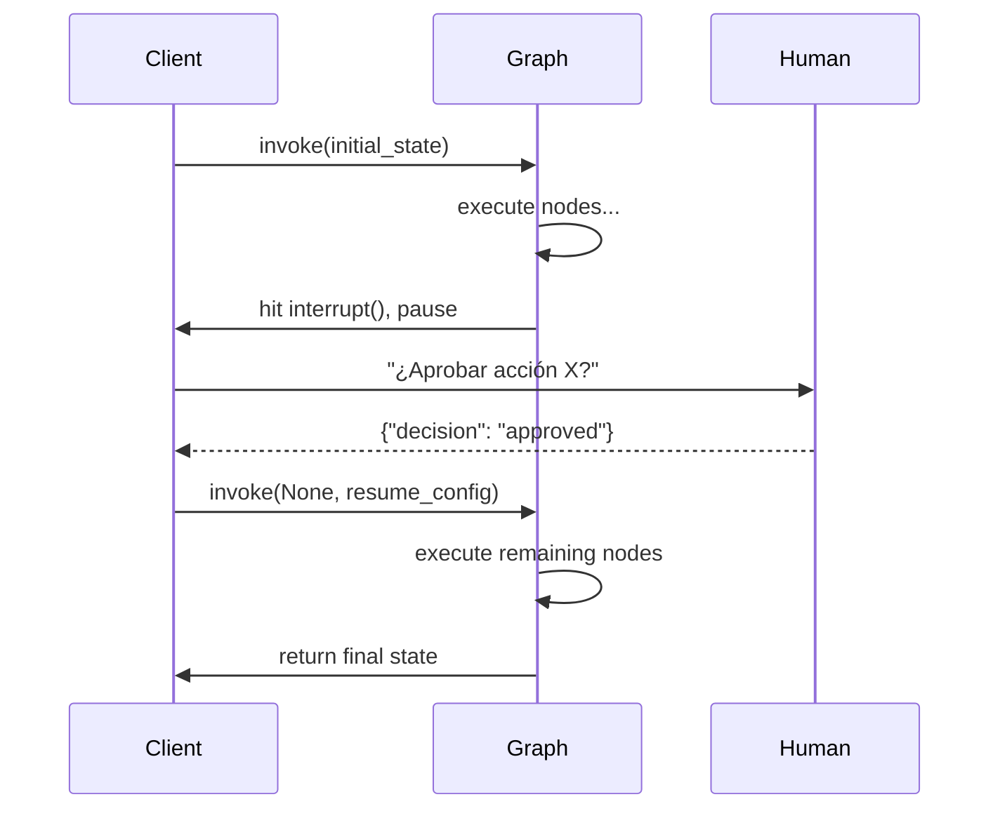
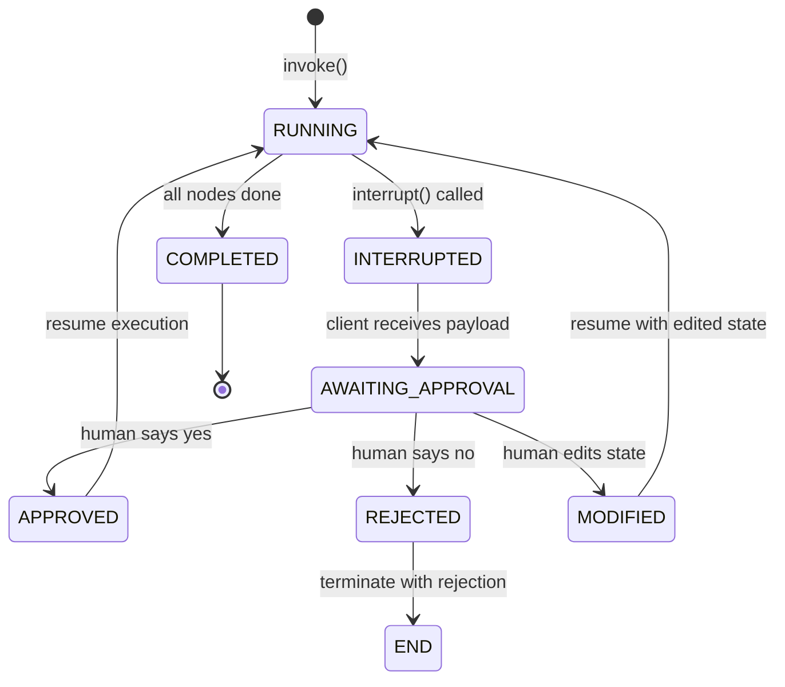
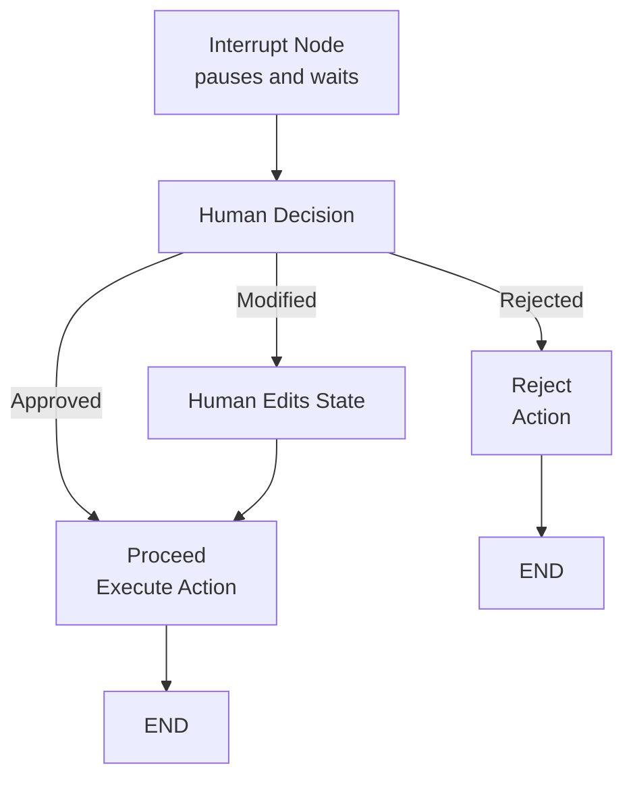

# Humano-en-el-Bucle, Breakpoints y Control Dinámico

Los agentes de producción a menudo necesitan supervisión humana. LangGraph proporciona **interrupciones**, **breakpoints** y **actualizaciones dinámicas de grafo** para pausar la ejecución, esperar entrada y modificar estado o estructura sobre la marcha.

---

## Mermaid: Flujo de Interrupción/Aprobación



El grafo ejecuta hasta encontrar `interrupt()`, el cliente recibe el payload de interrupción y lo presenta a un humano, luego reanuda con la decisión humana.

---

## Nodos de Interrupción para Aprobación Humana

Un **nodo de interrupción** pausa el grafo y cede el control al llamador. El grafo puede reanudarse después, opcionalmente con estado modificado.

```python
from langgraph.graph import StateGraph, START, END
from langgraph.types import interrupt

def approval_node(state: AgentState) -> dict:
    # Pausa ejecución y pregunta por la decisión humana
    decision = interrupt({
        "question": "¿Aprobar esta acción?",
        "action": state["pending_action"]
    })
    if decision == "approved":
        return {"status": "approved"}
    else:
        return {"status": "rejected"}

builder.add_node("approve", approval_node)
```

[!WARNING]
La función `interrupt()` lanza una excepción especial que pausa el grafo. El llamador **debe** capturarla via la API del cliente para leer el valor de la interrupción y proporcionar una acción de reanudación.

---

## Mermaid: Diagrama de Estado de Decisión HITL



La máquina de estado HITL tiene múltiples caminos de salida de la interrupción: aprobar, rechazar o modificar-y-continuar.

---

## Comparación: Tipos de Interrupción

| Tipo de Interrupción | Método | Alcance | Caso de Uso |
| :--- | :--- | :--- | :--- |
| Interrupción de nodo | `interrupt()` dentro del nodo | Pausa en punto específico | Puerta de aprobación, fallos de validación |
| `interrupt_before` | `app.invoke(interrupt_before=["node"])` | Pausa antes de un nodo | Depuración, paso a paso |
| `interrupt_after` | `app.invoke(interrupt_after=["node"])` | Pausa después de un nodo | Verificar salida antes de proceder |
| Breakpoint todos nodos | `app.invoke(interrupt_before=["__all__"])` | Pausa antes de cada nodo | Depuración profunda, traza |

---

## Esperando Entrada del Usuario en Medio del Grafo

Cuando un grafo encuentra una interrupción, el cliente recibe los datos de la interrupción y debe decidir cómo proceder.

```python
# Código del lado del cliente
from langgraph.graph import StateGraph

app = builder.compile(checkpointer=memory)

# Ejecuta hasta la interrupción
config = {"configurable": {"thread_id": "t1"}}
for event in app.stream({"messages": ["Procesar pago"]}, config):
    if "__interrupt__" in event:
        interrupt_data = event["__interrupt__"][0]
        print(interrupt_data["question"])  # "¿Aprobar esta acción?"

        # Reanuda con decisión humana
        result = app.invoke(
            None,  # sin nueva entrada, solo reanudar
            {"configurable": {"thread_id": "t1"}},
            interrupt_after={"approve": "approved"}
        )
```

[!TIP]
Puedes pasar un **valor de reanudación** a `interrupt()` pasándolo como segundo argumento a `app.invoke()`. El valor se convierte en el valor de retorno de `interrupt()` dentro del nodo. Por ejemplo, pasa `"approved"` para reanudar con aprobación.

---

## Interrupción con Aprobación/Rechazo

```python
def payment_approval_node(state: AgentState) -> dict:
    """Interrupción para aprobación de pago con contexto completo."""
    approval_data = {
        "type": "payment_approval",
        "amount": state["payment"]["amount"],
        "recipient": state["payment"]["recipient"],
        "risk_score": state["risk_score"],
        "summary": f"Transferir ${state['payment']['amount']} a {state['payment']['recipient']}"
    }
    decision = interrupt(approval_data)

    if decision == "approved":
        return {"payment_status": "approved", "approved_by": "human"}
    elif decision == "rejected":
        return {"payment_status": "rejected", "rejection_reason": "human declined"}
    else:
        # Humano modificó el pago
        return {"payment": decision, "payment_status": "modified"}

# Lado del cliente: reanudar con decisión
resumed = app.invoke(
    None,
    config,
    interrupt_after={"payment_approval": "approved"}
)
```

---

## Editando Estado Antes de Reanudar

Puedes modificar el estado del grafo antes de reanudar, sobrescribiendo efectivamente lo que el agente estaba a punto de hacer.

```python
# Obtiene estado actual del checkpoint
state = app.get_state(config)

# Edita mensajes en el estado
state.values["messages"] = state.values["messages"] + ["[Corregido por humano]"]

# Actualiza estado y reanuda
app.update_state(config, {"messages": state.values["messages"]})
result = app.invoke(None, config)
```

Este patrón es crítico para la **corrección humana** — el operador puede corregir errores antes de que el agente continúe.

[!IMPORTANT]
Llamar a `update_state()` crea un **nuevo checkpoint** con los valores modificados. El estado original se preserva en el checkpoint anterior, por lo que siempre puedes revertir si la corrección humana introdujo nuevos errores.

### Seguridad en la Edición de Estado

```python
def safe_state_edit(app, config, edits: dict) -> dict:
    """Edita estado de forma segura antes de reanudar."""
    # 1. Captura estado actual
    current = app.get_state(config)
    print(f"Estado actual: {current.values}")

    # 2. Aplica ediciones
    for key, value in edits.items():
        if key in current.values:
            current.values[key] = value
        else:
            print(f"Aviso: clave '{key}' no está en el esquema de estado")

    # 3. Actualiza y reanuda
    app.update_state(config, edits)
    return app.invoke(None, config)

# Humano corrige un valor
result = safe_state_edit(app, config, {"amount": 150.00, "approved": True})
```

---

## Manejo de Timeout con Aprobación Humana

[!WARNING]
Si un humano tarda demasiado en responder, la interrupción queda abierta indefinidamente. Implementa un **mecanismo de timeout** en el lado del cliente para manejar aprobaciones abandonadas.

```python
import asyncio

async def invoke_with_timeout(app, state, config, timeout_seconds=300):
    """Invoca grafo con timeout para humano-en-el-bucle."""
    try:
        async for event in app.astream(state, config):
            if "__interrupt__" in event:
                print("Esperando aprobación humana...")
                # Inicia tarea de timeout
                try:
                    decision = await asyncio.wait_for(
                        get_human_decision(event["__interrupt__"]),
                        timeout=timeout_seconds
                    )
                    # Reanuda con decisión
                    return app.invoke(None, {
                        **config,
                        "interrupt_after": decision
                    })
                except asyncio.TimeoutError:
                    # Auto-rechaza en timeout
                    print("Aprobación expiró — rechazando")
                    return app.invoke(None, {
                        **config,
                        "interrupt_after": "rejected"
                    })
    except Exception as e:
        return {"error": str(e)}
```

---

## Actualizaciones Dinámicas de Grafo

LangGraph permite añadir o eliminar nodos y aristas **entre ejecuciones** sin redefinir todo el grafo.

```python
# Después de la primera ejecución, añade dinámicamente un nuevo nodo
builder.add_node("audit", lambda s: {"audit_log": s["messages"]})
builder.add_edge("process", "audit")
builder.add_edge("audit", END)

# Recompila y ejecuta con la nueva estructura
app2 = builder.compile(checkpointer=memory)
```

Esto permite topologías de agente adaptativas donde la forma del grafo evoluciona basada en resultados de ejecuciones anteriores.

[!TIP]
Las actualizaciones dinámicas son útiles para **divulgación progresiva** — comienza con un grafo simple y añade nodos de capacidad según la conversación revela necesidades más complejas.

---

## Nodos de Validación

Un **nodo de validación** es un guardián que verifica la integridad del estado antes de que el grafo prosiga, a menudo combinado con interrupciones para corrección humana.

```python
def validation_node(state: AgentState) -> dict:
    errors = []
    if not state.get("user_confirmed"):
        errors.append("Falta confirmación del usuario")
    if state["amount"] < 0:
        errors.append("Monto negativo no permitido")

    if errors:
        # Interrumpe con errores de validación
        interrupt({"errors": errors, "state": state})
    return {"validation_errors": errors}
```

### Patrón de Nodo de Validación

```python
def comprehensive_validation(state: AgentState) -> dict:
    """Validación multi-campo con override humano."""
    validation_results = {"valid": True, "errors": [], "warnings": []}

    # Campos obligatorios
    required_fields = ["user_id", "amount", "recipient"]
    for field in required_fields:
        if field not in state or state[field] is None:
            validation_results["errors"].append(f"Campo obligatorio faltante: {field}")
            validation_results["valid"] = False

    # Reglas de negocio
    if state.get("amount", 0) > 10000:
        validation_results["warnings"].append(
            f"Transferencia grande: ${state['amount']} — necesita aprobación gerencial"
        )

    if not validation_results["valid"]:
        # Pausa para corrección humana
        human_response = interrupt({
            "type": "validation_failure",
            "errors": validation_results["errors"],
            "warnings": validation_results["warnings"],
            "current_state": state,
        })
        return {"validation_result": human_response}

    return {"validation_result": validation_results}
```

---

## Comparación: Estrategias de Breakpoint

| Estrategia | Método | Caso de Uso |
| :--- | :--- | :--- |
| Nodo de interrupción | `interrupt()` | Pausa interna para aprobación |
| Actualizar estado | `update_state()` | Corregir o modificar estado antes de reanudar |
| Nodo dinámico | `add_node()` / `add_edge()` | Cambiar topología del grafo entre ejecuciones |
| Validación | Nodo personalizado + interrupt | Validación previa con supervisión humana |
| Manejo de timeout | asyncio.wait_for | Auto-rechazar aprobaciones abandonadas |
| Breakpoint paso a paso | `interrupt_before` / `interrupt_after` | Depuración por nodo |

---

## Mermaid: Flujo Humano-en-el-Bucle



El grafo pausa en el nodo de interrupción, espera entrada humana y luego enruta basado en la decisión.

---

```question
{
  "id": "lg-04-es-q1",
  "type": "multiple-choice",
  "question": "¿Qué función proporciona LangGraph para pausar la ejecución para entrada humana?",
  "options": ["pause()", "interrupt()", "wait()", "breakpoint()"],
  "correct": 1,
  "explanation": "La función interrupt() pausa el grafo y cede el control al llamador para entrada o aprobación humana."
}
```

```question
{
  "id": "lg-04-es-q2",
  "type": "multiple-choice",
  "question": "¿Cómo modificas el estado del grafo antes de reanudar desde una interrupción?",
  "options": ["Pasar un nuevo diccionario de estado a invoke()", "Llamar a update_state() con los cambios deseados", "Recompilar el grafo con nuevo estado inicial", "Definir variables de entorno"],
  "correct": 1,
  "explanation": "update_state() permite modificar el estado del grafo antes de reanudar la ejecución desde una interrupción."
}
```

```question
{
  "id": "lg-04-es-q3",
  "type": "multiple-choice",
  "question": "¿Qué es una actualización dinámica de grafo?",
  "options": ["Cambiar la topología del grafo entre ejecuciones sin redefinir todo", "Actualizar el esquema de estado en tiempo de ejecución", "Reemplazar el manejador de interrupción", "Modificar imports de Python"],
  "correct": 0,
  "explanation": "Las actualizaciones dinámicas permiten añadir o eliminar nodos y aristas entre ejecuciones sin redefinir todo el grafo."
}
```

```question
{
  "id": "lg-04-es-q4",
  "type": "multiple-choice",
  "question": "¿Cuál es el propósito de un nodo de validación?",
  "options": ["Registrar métricas de ejecución", "Verificar la integridad del estado antes de proceder, a menudo disparando una interrupción", "Compilar el grafo", "Ejecutar pruebas unitarias"],
  "correct": 1,
  "explanation": "Un nodo de validación actúa como guardián que verifica la integridad del estado antes de que el grafo prosiga, a menudo combinado con interrupciones."
}
```

```question
{
  "id": "lg-04-es-q5",
  "type": "multiple-choice",
  "question": "¿Qué llamada a la API se usa para reanudar un grafo después de una interrupción?",
  "options": ["app.resume()", "app.continue()", "app.invoke() con la misma configuración", "app.restart()"],
  "correct": 2,
  "explanation": "Después de una interrupción, se reanuda el grafo llamando a app.invoke() con la misma configuración de thread."
}
```

```question
{
  "id": "lg-04-es-q6",
  "type": "multiple-choice",
  "question": "Escenario: Un agente de procesamiento de pagos alcanza interrupt() pidiendo aprobación. El humano se da cuenta que el monto es incorrecto. ¿Cómo proceder?",
  "options": ["Rechazar y reiniciar toda la conversación", "Usar update_state() para corregir el monto, luego reanudar con invoke()", "Ignorar la interrupción", "Matar el proceso"],
  "correct": 1,
  "explanation": "El operador debe usar app.update_state() para corregir el monto, luego app.invoke(None, config) para reanudar con el estado corregido."
}
```

```question
{
  "id": "lg-04-es-q7",
  "type": "multiple-choice",
  "question": "¿Qué sucede si un humano nunca responde a una interrupción?",
  "options": ["El grafo se reanuda automáticamente después de 30 segundos", "La interrupción permanece abierta indefinidamente a menos que el cliente maneje timeout", "El grafo lanza una excepción", "El estado se recolecta como basura"],
  "correct": 1,
  "explanation": "Las interrupciones persisten indefinidamente hasta que el cliente reanuda via invoke(). Implementa manejo de timeout en el lado del cliente para producción."
}
```

---

[!SUCCESS]
### Conclusiones Clave
- `interrupt()` pausa el grafo y devuelve el control al llamador.
- Después de una interrupción, el cliente puede inspeccionar, modificar estado y reanudar via `invoke()`.
- `update_state()` permite correcciones de estado antes de reanudar la ejecución.
- Las actualizaciones dinámicas de grafo permiten añadir nodos/aristas entre ejecuciones.
- Los nodos de validación combinados con interrupciones crean salvaguardas para agentes de producción.
- El patrón humano-en-el-bucle es esencial para sistemas de agente confiables y auditables.
- Los breakpoints pueden insertarse en nodos específicos o en cada nodo para depuración.
- Implementa manejo de timeout para HITL en producción para evitar interrupciones abandonadas.
- Usa `interrupt_before` y `interrupt_after` para depuración paso a paso.
- La edición de estado crea nuevos checkpoints — el estado original siempre es recuperable.
