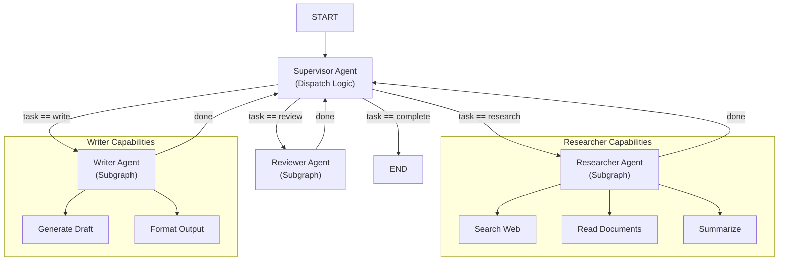
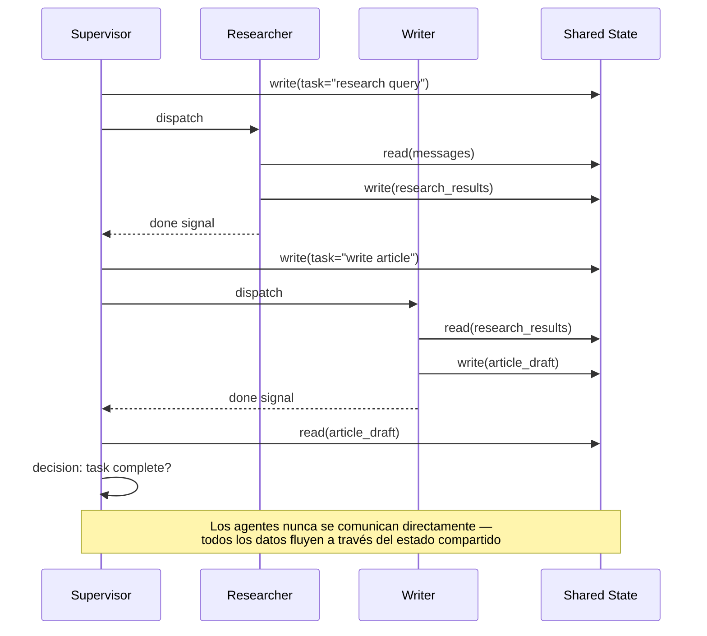
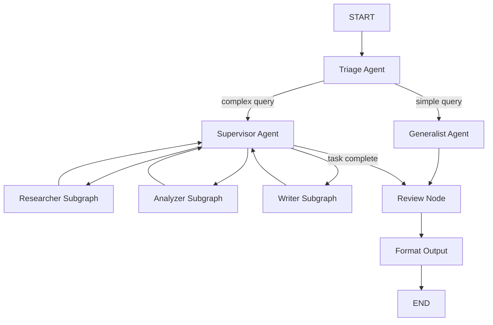

# Orquestración Multi-Agente y Subgrafos

Los sistemas de agentes del mundo real raramente usan un solo agente. LangGraph te permite componer **subgrafos** en grafos más grandes, orquestar múltiples agentes con un **supervisor** y permitir comunicación a través de estado compartido.

---

## Mermaid: Arquitectura de Agente Supervisor



El supervisor se sitúa en el centro, despachando tareas a subgrafos especializados. Cada subgrafo encapsula sus propias herramientas, nodos y gestión de estado.

---

## Componiendo Subgrafos en Grafos Padre

Un subgrafo es un `StateGraph` completamente compilado que puede añadirse como un nodo en un grafo padre. El grafo padre pasa estado al subgrafo y recibe estado actualizado al completarse.

```python
from langgraph.graph import StateGraph, START, END

# Define un subgrafo
sub_builder = StateGraph(AgentState)
sub_builder.add_node("sub_task", lambda s: {"messages": s["messages"] + ["Sub hecho"]})
sub_builder.add_edge(START, "sub_task")
sub_builder.add_edge("sub_task", END)
subgraph = sub_builder.compile()

# Define el grafo padre
parent_builder = StateGraph(AgentState)
parent_builder.add_node("preprocess", preprocess_node)
parent_builder.add_node("subgraph", subgraph)  # subgrafo como nodo
parent_builder.add_node("postprocess", postprocess_node)

parent_builder.add_edge(START, "preprocess")
parent_builder.add_edge("preprocess", "subgraph")
parent_builder.add_edge("subgraph", "postprocess")
parent_builder.add_edge("postprocess", END)

parent_app = parent_builder.compile()
```

[!WARNING]
Los subgrafos usan su **propio esquema de estado**. El padre debe pasar un diccionario de estado compatible. Si los esquemas difieren, mapea los campos explícitamente en el wrapper del nodo.

### Mapeo de Estado de Subgrafo

```python
def subgraph_wrapper(state: ParentState) -> dict:
    """Mapea estado padre al esquema del subgrafo y viceversa."""
    # Transforma estado padre a formato compatible con subgrafo
    sub_state = {
        "messages": state["conversation_history"],  # campo renombrado
        "config": state["settings"],
        "task": state["current_task"],
    }
    # El nodo subgrafo recibe y retorna sub_state
    return sub_state
```

---

## Mermaid: Comunicación Agente-a-Agente



Los agentes se comunican exclusivamente a través del estado compartido. Esto desacopla los agentes, haciendo el sistema más fácil de depurar, probar y extender.

---

## Comunicación entre Agentes via Estado Compartido

Múltiples agentes en el mismo grafo se comunican a través del estado compartido. Cada agente lee mensajes, los procesa y añade resultados para el siguiente agente.

```python
def researcher_agent(state: AgentState) -> dict:
    # Lee estado compartido, produce investigación
    query = state["messages"][-1]
    research = f"Hallazgos sobre: {query}"
    return {"messages": state["messages"] + [f"[Investigador]: {research}"]}

def writer_agent(state: AgentState) -> dict:
    # Lee investigación del estado, escribe salida
    last_msg = state["messages"][-1]
    article = f"Borrador basado en: {last_msg}"
    return {"messages": state["messages"] + [f"[Escritor]: {article}"]}

builder.add_node("researcher", researcher_agent)
builder.add_node("writer", writer_agent)
builder.add_edge(START, "researcher")
builder.add_edge("researcher", "writer")
builder.add_edge("writer", END)
```

[!TIP]
Diseña el estado compartido como un **bus de mensajes**. Cada agente añade a una lista `messages`, creando un rastro auditable de la salida de cada agente. Esto hace la depuración trivial — puedes reproducir la conversación y ver exactamente lo que cada agente produjo.

---

## Patrón de Agente Supervisor

Un **agente supervisor** es un nodo especial que decide qué agente subordinado debe ejecutar a continuación. Inspecciona el estado compartido y emite comandos de enrutamiento.

```python
def supervisor_agent(state: AgentState) -> dict:
    # Decide qué agente enrutar a continuación
    if state.get("task_complete"):
        return {"next_agent": "FINISH"}
    if "research" in state["task_type"]:
        return {"next_agent": "researcher"}
    return {"next_agent": "writer"}

# Enruta basado en la decisión del supervisor
builder.add_conditional_edges(
    "supervisor",
    lambda s: s["next_agent"],
    {
        "researcher": "researcher",
        "writer": "writer",
        "FINISH": END,
    }
)
```

### Enrutamiento Supervisor con LLM

```python
from langchain.chat_models import ChatOpenAI

llm = ChatOpenAI(model="gpt-4")

def llm_supervisor(state: AgentState) -> dict:
    """Usa un LLM para decidir el siguiente agente."""
    agents = ["researcher", "writer", "reviewer", "FINISH"]
    prompt = f"""
    Tarea actual: {state['task']}
    Progreso: {state['messages'][-3:]}
    Agentes disponibles: {', '.join(agents)}
    ¿Qué agente debería ejecutar a continuación?
    """
    response = llm.invoke(prompt)
    next_agent = response.content.strip()

    # Valida la elección del LLM
    if next_agent not in agents:
        next_agent = "FINISH"  # fallback seguro

    return {"next_agent": next_agent}
```

---

## Enrutamiento entre Agentes

El bucle impulsado por el supervisor continúa hasta que se selecciona `FINISH`. Cada subordinado reporta de vuelta al supervisor después de completar su trabajo.

```python
# Después de que el investigador termina, vuelve al supervisor
builder.add_edge("researcher", "supervisor")
# Después de que el escritor termina, vuelve al supervisor
builder.add_edge("writer", "supervisor")

# Comienza con supervisor
builder.add_edge(START, "supervisor")
```

Esto crea un **bucle re-entrante** donde el supervisor sigue despachando hasta que la tarea esté completa.

---

## Patrones de Transferencia de Agente

```python
def handoff_agent(state: AgentState) -> dict:
    """Transfiere a otro agente con contexto."""
    return {
        "messages": state["messages"] + [
            "[Transferencia]: Transfiriendo a agente especialista"
        ],
        "current_agent": "specialist",
        "handoff_context": {
            "original_query": state["messages"][0],
            "processing_summary": state.get("processing_summary", ""),
        }
    }

# Transferencia dispara una arista condicional
builder.add_conditional_edges(
    "triage_agent",
    lambda s: s["current_agent"],
    {
        "generalist": "generalist",
        "specialist": "specialist",
        "FINISH": END,
    }
)
```

---

## Composición de Subgrafos

```python
# Subgrafo especialista con sus propias herramientas
specialist_builder = StateGraph(AgentState)
specialist_builder.add_node("analyze", analyze_tool)
specialist_builder.add_node("recommend", recommend_tool)
specialist_builder.add_edge(START, "analyze")
specialist_builder.add_edge("analyze", "recommend")
specialist_builder.add_edge("recommend", END)
specialist_subgraph = specialist_builder.compile()

# Compone en el padre
parent = StateGraph(AgentState)
parent.add_node("triage", triage_agent)
parent.add_node("specialist", specialist_subgraph)
parent.add_edge(START, "triage")
parent.add_conditional_edges("triage", router, {
    "specialist": "specialist",
    "FINISH": END,
})
parent.add_edge("specialist", END)
```

### Comparación: Patrones de Subgrafo

| Patrón | Estructura | Compartición de Estado | Mejor Para |
| :--- | :--- | :--- | :--- |
| Composición plana | Todos nodos en un grafo | Estado compartido total | Agentes multi-paso simples |
| Subgrafo jerárquico | Padre + subgrafos anidados | Capa de mapeo de esquema | Capacidades encapsuladas |
| Bucle de supervisor | Enrutador central + workers | Cola de tareas en estado | Orquestración compleja |
| Subgrafo pipeline | Cadena secuencial de subgrafos | Estado pass-through | Procesamiento multi-etapa |
| Subgrafos paralelos | Múltiples subgrafos en paralelo | Estado específico de rama | Subtareas independientes |

---

## Agentes con Llamada a Herramientas

Los agentes pueden llamar herramientas externas. Las herramientas se registran como nodos o como funciones disponibles para un nodo de agente impulsado por LLM.

```python
from langchain.tools import tool

@tool
def search_web(query: str) -> str:
    """Buscar en la web por información."""
    return f"Resultados web para {query}"

@tool
def calculate(expression: str) -> str:
    """Evaluar una expresión matemática."""
    return str(eval(expression))

# Nodo de agente con llamada a herramienta
def tool_agent(state: AgentState) -> dict:
    # LLM decide qué herramienta llamar basado en el estado
    if "calcular" in state["messages"][-1]:
        result = calculate.invoke({"expression": "2 + 2"})
    else:
        result = search_web.invoke({"query": state["messages"][-1]})
    return {"messages": state["messages"] + [f"[Herramienta]: {result}"]}
```

### Agente con Herramienta Estructurada

```python
from typing import Any, Dict, List
from langchain.tools import StructuredTool

def database_query(table: str, filters: Dict[str, Any]) -> List[Dict]:
    """Consulta una tabla de base de datos con filtros."""
    # Consulta simulada
    return [{"id": 1, "name": "Muestra"}]

query_tool = StructuredTool.from_function(
    func=database_query,
    name="database_query",
    description="Consultar la base de datos con nombre de tabla y filtros"
)

def structured_tool_agent(state: AgentState) -> dict:
    """Agente que usa herramientas estructuradas con parámetros tipados."""
    result = query_tool.invoke({
        "table": "customers",
        "filters": {"status": "active", "limit": 10}
    })
    return {"messages": state["messages"] + [f"[DB Query]: {len(result)} registros"]}
```

---

## Diseño de Estado Compartido

[!TIP]
Diseña tu estado compartido para incluir un **campo de comunicación dedicado** (ej.: `messages` o `interactions`) que todos los agentes puedan leer y al que puedan añadir. Mantén datos específicos de agente en claves con namespace (ej.: `research_agent.output`, `writer_agent.draft`) para evitar colisiones de clave.

```python
class MultiAgentState(TypedDict):
    # Canal de comunicación compartido
    messages: List[str]

    # Enrutamiento del supervisor
    next_agent: str
    task_complete: bool

    # Salidas específicas de agente con namespace
    research_output: str
    writer_draft: str
    reviewer_feedback: str

    # Contexto compartido
    original_query: str
    task_type: str
    loop_count: int  # previene loops infinitos
```

---

## Límites de Permiso de Subgrafo

[!WARNING]
Los subgrafos no pueden acceder a los nodos o estado del padre directamente — solo ven el estado que se les pasa. Esta es una **frontera de seguridad**: un subgrafo no puede mutar el estado del padre arbitrariamente. Usa mapeo de estado explícito para controlar lo que cada subgrafo puede leer y escribir.

---

## Comparación: Estrategias de Comunicación

| Estrategia | Mecanismo | Acoplamiento | Depuración | Caso de Uso |
| :--- | :--- | :--- | :--- | :--- |
| Estado compartido | `state["messages"]` | Suelto (via esquema) | Fácil — reproducir estado | Mayoría de agentes |
| Claves con namespace | `state["agent_name.field"]` | Suelto | Fácil — trazas por agente | Multi-agente con salidas |
| Mapeo I/O subgrafo | Mapeo explícito de campos | Suelto | Moderado — verificar mapeo | Composición de subgrafos |
| Llamada directa función | Llamar otro nodo directamente | Apretado | Difícil — dependencia oculta | No recomendado |
| Patrón bus mensajes | Mensajes append-only | Muy suelto | Trivial — historial completo | Orquestraciones supervisor |

---

## Mermaid: Flujo de Orquestración Completo



---

```question
{
  "id": "lg-05-es-q1",
  "type": "multiple-choice",
  "question": "¿Cómo se añade un subgrafo como nodo en un grafo padre?",
  "options": ["parent.add_node(\"nombre\", subgraph)", "parent.attach(subgraph)", "parent.include(subgraph)", "parent.merge(subgraph)"],
  "correct": 0,
  "explanation": "Un StateGraph completamente compilado (subgrafo) puede añadirse como nodo usando add_node() como cualquier nodo regular."
}
```

```question
{
  "id": "lg-05-es-q2",
  "type": "multiple-choice",
  "question": "¿Cuál es el rol de un agente supervisor en LangGraph?",
  "options": ["Ejecutar todas las tareas él mismo", "Decidir qué agente subordinado debe ejecutar a continuación", "Compilar el grafo", "Gestionar conexiones de base de datos"],
  "correct": 1,
  "explanation": "Un agente supervisor inspecciona el estado compartido y decide qué agente subordinado ejecutar a continuación, enrutando dinámicamente."
}
```

```question
{
  "id": "lg-05-es-q3",
  "type": "multiple-choice",
  "question": "¿Cómo se comunican múltiples agentes en LangGraph?",
  "options": ["Via peticiones HTTP", "A través del estado compartido del grafo", "Escribiendo en archivos", "Usando sockets Unix"],
  "correct": 1,
  "explanation": "Múltiples agentes en el mismo grafo se comunican a través del estado tipado compartido entre nodos."
}
```

```question
{
  "id": "lg-05-es-q4",
  "type": "multiple-choice",
  "question": "¿Qué crea un bucle re-entrante en el patrón de supervisor?",
  "options": ["Agentes subordinados que vuelven al supervisor después del trabajo", "Añadiendo aristas paralelas", "Usando MemorySaver", "Llamando a interrupt()"],
  "correct": 0,
  "explanation": "Cada agente subordinado devuelve el control al supervisor después de completar su trabajo, creando un bucle hasta que la tarea esté completa."
}
```

```question
{
  "id": "lg-05-es-q5",
  "type": "multiple-choice",
  "question": "¿Cuál NO es un patrón típico de orquestración en LangGraph?",
  "options": ["Secuencial", "Bucle de supervisor", "Pub/sub orientado a eventos", "Llamada a herramientas"],
  "correct": 2,
  "explanation": "Pub/sub orientado a eventos no es un patrón típico de orquestración en LangGraph; los patrones soportados incluyen secuencial, supervisor, subgrafo y llamada a herramientas."
}
```

```question
{
  "id": "lg-05-es-q6",
  "type": "multiple-choice",
  "question": "Escenario: Tienes un agente de investigación que produce salida que el agente escritor necesita. ¿Cómo deberían fluir los datos?",
  "options": ["El agente de investigación llama al agente escritor directamente", "Investigación escribe en estado compartido, supervisor enruta al escritor", "Ambos agentes usan bases de datos separadas", "El agente escritor rehace la investigación"],
  "correct": 1,
  "explanation": "El investigador escribe hallazgos en el estado compartido, luego el supervisor enruta al escritor para leer del estado y producir salida."
}
```

```question
{
  "id": "lg-05-es-q7",
  "type": "multiple-choice",
  "question": "¿Cuál es la implicación de seguridad de los límites de estado de subgrafo?",
  "options": ["Los subgrafos pueden leer cualquier estado del padre", "Los subgrafos solo ven el estado explícitamente pasado a ellos", "Los subgrafos pueden modificar nodos del padre", "No hay límites"],
  "correct": 1,
  "explanation": "Los subgrafos solo ven y operan en el estado explícitamente pasado a ellos, proporcionando una frontera de permiso natural."
}
```

---

[!SUCCESS]
### Conclusiones Clave
- Los subgrafos son StateGraphs compilados añadidos como nodos en un grafo padre.
- Múltiples agentes se comunican a través del estado tipado compartido entre nodos.
- El patrón de supervisor usa un despachador central que enruta a agentes subordinados.
- Los agentes subordinados devuelven el control al supervisor, creando un bucle hasta completar.
- Los agentes con llamada a herramientas integran funciones externas (APIs, calculadoras, búsqueda).
- Los subgrafos encapsulan capacidades y pueden reutilizarse en diferentes grafos padre.
- LangGraph soporta orquestración secuencial, supervisor, subgrafo, llamada a herramientas y paralela.
- Diseña estado compartido con claves con namespace para evitar colisiones de salida de agente.
- Los límites de estado de subgrafo proporcionan aislamiento de seguridad natural.
- Usa el patrón de bus de mensajes (mensajes append-only) para auditabilidad completa.
