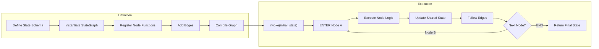
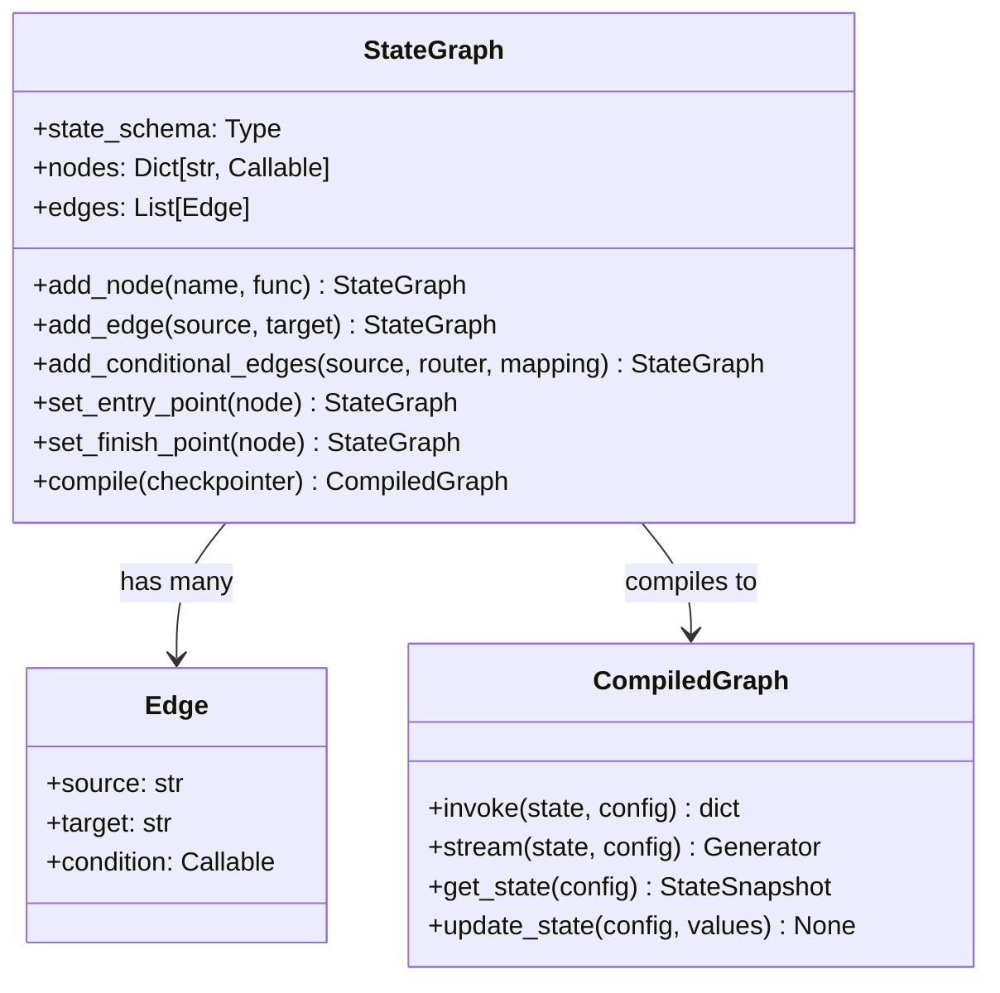
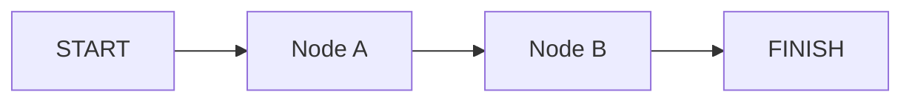
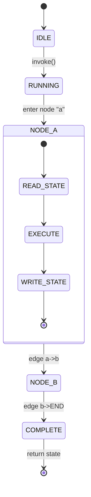

# Fundamentos do LangGraph e Grafos de Estado

LangGraph é um framework da LangChain para construir **aplicações stateful multi-ator** usando grafos como abstração central. Cada nó modifica um estado compartilhado e as arestas definem o fluxo.

---

## O que é LangGraph?

LangGraph estende LangChain modelando a lógica do agente como um **grafo direcionado**. O grafo carrega um **objeto de estado tipado** que persiste entre nós, permitindo loops complexos, ramificações e memória.

Conceitos principais:
- **StateGraph**: Classe recomendada para grafos com estado
- **Graph**: Alternativa mais simples e stateless
- **Nós**: Funções Python que recebem e modificam o estado
- **Arestas**: Conexões direcionadas entre nós

[!WARNING]
LangGraph **não** é uma ferramenta de DAG de workflow. Nós podem ser revisitados, loops podem se formar e o estado é preservado entre ciclos. É isso que o torna adequado para sistemas agenticos.

---

## Mermaid: Ciclo de Execução Completo



A fase de **Definição** constrói a topologia do grafo. A fase de **Execução** executa nós sequencialmente ou em paralelo, cada um lendo e escrevendo no estado compartilhado.

---

## StateGraph vs Graph

| Característica | StateGraph | Graph |
| :--- | :--- | :--- |
| Estado tipado | Sim (TypedDict) | Não (valores simples) |
| Arestas condicionais | Sim | Sim |
| Checkpointing | Integrado (MemorySaver) | Não suportado |
| Ramificação paralela | Sim | Limitada |
| Nós re-entrantes | Sim | Não |
| Pronto para produção | Alto (PostgresSaver) | Baixo |
| Suporte a loops | Sim | Não |
| Humano-no-loop | Via interrupt() | Não suportado |
| Composição de subgrafos | Sim | Não |

[!TIP]
Sempre prefira `StateGraph` a menos que você tenha um pipeline stateless muito simples. A sobrecarga é mínima e você ganha checkpointing, ramificação e recursos de produção gratuitamente.

---

## Mermaid: Diagrama de Classe da API StateGraph



O padrão builder `StateGraph` coleta nós e arestas, então `.compile()` produz um `CompiledGraph` que pode ser invocado com estado e configuração.

---

## Definindo Estado com TypedDict

```python
from typing import TypedDict, List
from langgraph.graph import StateGraph

# Define o esquema de estado compartilhado
class AgentState(TypedDict):
    messages: List[str]   # conversa até agora
    next_step: str        # qual nó executar em seguida
    metadata: dict        # metadados arbitrários

# Instancia um StateGraph com o esquema
builder = StateGraph(AgentState)
```

[!NOTE]
StateGraph suporta três abordagens de definição de esquema: `TypedDict` (leve, sem validação), `dataclass` (mutável, Pythonico) e `pydantic.BaseModel` (validação, serialização). Escolha `BaseModel` para produção quando precisar de verificação de tipos em tempo de execução.

### Comparação: Abordagens de Definição de Estado

| Abordagem | Validação | Serialização | Boilerplate | Caso de Uso |
| :--- | :--- | :--- | :--- | :--- |
| `TypedDict` | Nenhuma | Manual | Mínimo | Prototipagem, agentes simples |
| `dataclass` | Nenhuma | Via dataclasses.asdict() | Baixo | Ferramentas internas |
| `BaseModel` | Validação Pydantic completa | .dict()/.json() integrado | Moderado | Sistemas de produção |

---

## Nós e Arestas

```python
# Nó: uma função que recebe o estado e retorna atualizações
def node_a(state: AgentState) -> dict:
    print("--- Nó A ---")
    return {"messages": state["messages"] + ["Olá de A"]}

def node_b(state: AgentState) -> dict:
    print("--- Nó B ---")
    return {"messages": state["messages"] + ["Olá de B"]}

# Registra nós
builder.add_node("a", node_a)
builder.add_node("b", node_b)

# Adiciona arestas: a -> b
builder.add_edge("a", "b")

# Define pontos de entrada e saída
builder.set_entry_point("a")
builder.set_finish_point("b")
```

[!TIP]
Funções de nó **devem** retornar um dicionário (ou `None`). Os valores retornados são mesclados no estado compartilhado via uma atualização superficial. Chaves não retornadas mantêm seu valor anterior — é assim que o estado persiste entre nós.

### Execução Paralela de Nós

```python
def node_a(state: AgentState) -> dict:
    return {"messages": state["messages"] + ["A"]}

def node_b(state: AgentState) -> dict:
    return {"messages": state["messages"] + ["B"]}

def node_c(state: AgentState) -> dict:
    return {"messages": state["messages"] + ["C"]}

builder = StateGraph(AgentState)
builder.add_node("a", node_a)
builder.add_node("b", node_b)
builder.add_node("c", node_c)

# Fan-out: a dispara b e c simultaneamente
builder.add_edge(START, "a")
builder.add_edge("a", "b")
builder.add_edge("a", "c")
builder.add_edge("b", END)
builder.add_edge("c", END)
```

Quando duas arestas saem do mesmo nó, ambos os destinos executam **em paralelo** usando threads Python. Cada ramo recebe uma cópia do estado e as escritas são mescladas na conclusão.

### Tratamento de Erros em Nós

```python
import traceback

def safe_node(state: AgentState) -> dict:
    try:
        result = risky_operation(state["messages"][-1])
        return {"messages": state["messages"] + [result]}
    except Exception as e:
        # Registra o erro e continua com fallback
        return {
            "messages": state["messages"] + [f"[ERRO]: {str(e)}"],
            "errors": state.get("errors", []) + [traceback.format_exc()]
        }
```

Encapsule lógica de nó propensa a falhas em try/except para evitar que o grafo inteiro quebre. Armazene erros no estado para tratamento downstream ou revisão humana.

---

## Compilando e Executando

```python
# Compila o grafo em um objeto executável
app = builder.compile()

# Invoca com estado inicial
result = app.invoke({
    "messages": [],
    "next_step": "start",
    "metadata": {}
})

print(result["messages"])
# Saída: ['Olá de A', 'Olá de B']
```

[!IMPORTANT]
O método `.compile()` congela a definição do grafo. Após a compilação, você não pode adicionar nós ou arestas — você deve reconstruir o builder. Para topologias dinâmicas, veja a Lição 4 sobre atualizações dinâmicas de grafo.

### Streaming de Resultados

```python
# Stream de atualizações conforme cada nó completa
for event in app.stream({"messages": [], "next_step": "start", "metadata": {}}):
    for node_name, output in event.items():
        if node_name != "__end__":
            print(f"[{node_name}] -> {output}")
# Saída:
# [a] -> {'messages': ['Olá de A']}
# [b] -> {'messages': ['Olá de A', 'Olá de B']}
```

Use `.stream()` em vez de `.invoke()` quando quiser observar estados intermediários. Cada evento emitido é chaveado pelo nome do nó com a atualização parcial de estado.

---

## Mermaid: Grafo de Estado Básico



O estado flui pelas arestas; cada nó pode ler *e* escrever no `AgentState` compartilhado.

---

## Mermaid: Diagrama de Estado do Ciclo de Vida do Nó



Cada nó transita por ler → executar → escrever. O grafo orquestra a sequência, passando estado ao longo das arestas.

---

## Depurando Grafos com LangSmith

[!TIP]
Quando seu grafo se comportar inesperadamente, trace a execução com LangSmith. Defina `LANGCHAIN_TRACING_V2=true` e `LANGCHAIN_API_KEY=your_key` para obter logs de trace completos mostrando entrada, saída e tempo de cada nó.

```bash
# Habilita tracing LangSmith
export LANGCHAIN_TRACING_V2=true
export LANGCHAIN_PROJECT=meu-agente
```

---

```question
{
  "id": "lg-01-pt-q1",
  "type": "multiple-choice",
  "question": "Qual classe usar para um agente stateful com múltiplos passos?",
  "options": ["Graph", "StateGraph", "AgentGraph", "SimpleGraph"],
  "correct": 1,
  "explanation": "StateGraph é preferível sobre a classe Graph básica quando você precisa de estado tipado e com checkpoint para agentes multi-passo."
}
```

```question
{
  "id": "lg-01-pt-q2",
  "type": "multiple-choice",
  "question": "Como o estado é tipicamente tipado em um StateGraph?",
  "options": ["dataclass", "TypedDict do typing", "pydantic.BaseModel", "Todas as anteriores"],
  "correct": 3,
  "explanation": "StateGraph suporta esquemas TypedDict, dataclass e pydantic.BaseModel, então todas são válidas."
}
```

```question
{
  "id": "lg-01-pt-q3",
  "type": "multiple-choice",
  "question": "O que uma função de nó recebe e retorna?",
  "options": ["Apenas um dicionário", "O estado completo e retorna um dicionário de atualização parcial", "Uma lista de mensagens", "Nada, ela modifica uma variável global"],
  "correct": 1,
  "explanation": "Uma função de nó recebe o estado completo e retorna um dicionário parcial de atualizações para mesclar no estado."
}
```

```question
{
  "id": "lg-01-pt-q4",
  "type": "multiple-choice",
  "question": "Qual o propósito de compile()?",
  "options": ["Verificar tipos da definição do grafo", "Converter o grafo em um objeto executável", "Implantar no LangSmith", "Serializar o grafo para JSON"],
  "correct": 1,
  "explanation": "compile() transforma a definição do grafo em um objeto executável que pode ser invocado com estado."
}
```

```question
{
  "id": "lg-01-pt-q5",
  "type": "multiple-choice",
  "question": "Qual NÃO é suportado pela classe básica Graph?",
  "options": ["Arestas condicionais", "Estado tipado", "Múltiplos nós", "Arestas direcionadas"],
  "correct": 1,
  "explanation": "A classe Graph básica não suporta estado tipado; isso requer StateGraph."
}
```

```question
{
  "id": "lg-01-pt-q6",
  "type": "multiple-choice",
  "question": "Cenário: Você está construindo um agente de produção que precisa de checkpointing. Qual classe escolher?",
  "options": ["Graph", "StateGraph", "SimpleGraph", "AgentGraph"],
  "correct": 1,
  "explanation": "StateGraph oferece checkpointing integrado via MemorySaver/PostgresSaver, essencial para agentes de produção."
}
```

---

[!SUCCESS]
### Principais Conclusões
- LangGraph usa grafos direcionados para representar lógica de agente stateful.
- `StateGraph` é preferível a `Graph` quando você precisa de estado tipado e com checkpoint.
- Estado é definido com `TypedDict` e flui através dos nós.
- Nós são funções Python que retornam atualizações parciais de estado.
- O grafo é compilado via `.compile()` e invocado via `.invoke()`.
- Arestas definem a topologia; START e FINISH marcam pontos de entrada e saída.
- StateGraph suporta loops, ramificações condicionais e persistência.
- Use `.stream()` para observação em tempo real da saída de cada nó.
- Encapsule lógica de nó em try/except para tratar erros graciosamente.
- O tracing LangSmith ajuda a depurar execuções complexas de grafos.
