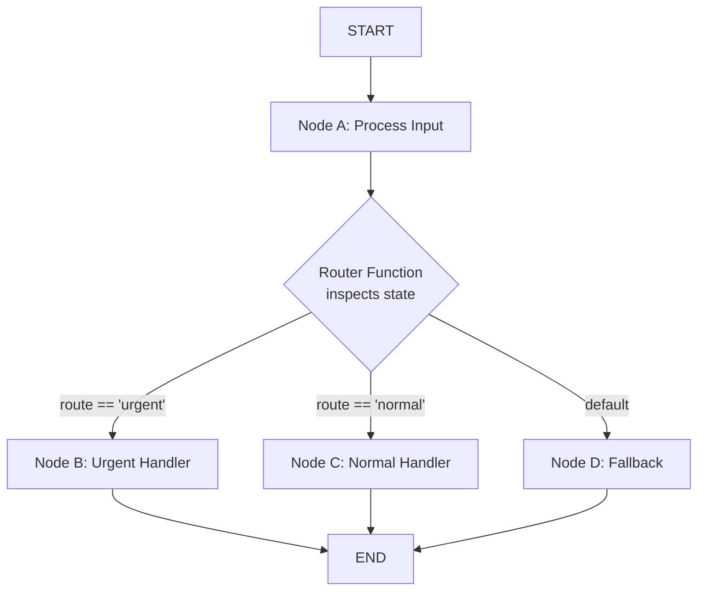
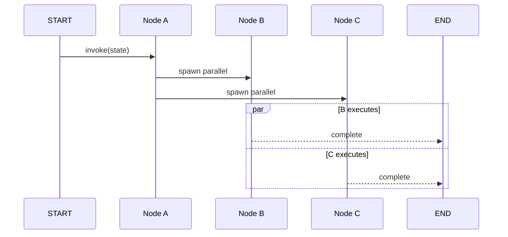
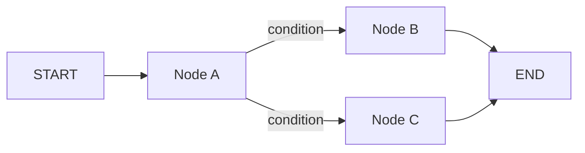

# Nós, Arestas e Fluxo Condicional

Após definir um StateGraph, o próximo passo é conectar os nós com arestas. LangGraph suporta **arestas normais** para pipelines lineares e **arestas condicionais** para roteamento dinâmico baseado no estado.

---

## Adicionando Nós

Cada nó é uma função Python (ou callable) que recebe o estado completo e retorna um dicionário de atualizações.

```python
from typing import TypedDict, List
from langgraph.graph import StateGraph

class State(TypedDict):
    messages: List[str]
    route: str

def process_a(state: State) -> dict:
    return {"messages": state["messages"] + ["A processado"]}

def process_b(state: State) -> dict:
    return {"messages": state["messages"] + ["B processado"]}

def process_c(state: State) -> dict:
    return {"messages": state["messages"] + ["C processado"]}

builder = StateGraph(State)
builder.add_node("a", process_a)
builder.add_node("b", process_b)
builder.add_node("c", process_c)
```

[!NOTE]
Nomes de nós devem ser únicos dentro de um grafo. Se você chamar `add_node()` duas vezes com o mesmo nome, a segunda chamada sobrescreve a primeira. Use nomes descritivos como `"validar_entrada"` em vez de `"no_1"` para legibilidade.

---

## Arestas Normais vs Arestas Condicionais

| Tipo de Aresta | Método | Comportamento |
| :--- | :--- | :--- |
| Normal | `add_edge(source, target)` | Sempre passa da origem ao destino |
| Condicional | `add_conditional_edges(source, router, mapping)` | Função roteadora escolhe o(s) próximo(s) nó(s) em tempo real |
| Entrada | `add_edge(START, target)` | Define o ponto de entrada do grafo |
| Saída | `add_edge(source, END)` | Marca um caminho de terminação |
| Auto-loop | `add_edge(source, source)` | Cria um auto-loop (nó re-entrante) |

[!WARNING]
Auto-loops (`add_edge("a", "a")`) criam nós re-entrantes que podem executar indefinidamente. Sempre combine-os com arestas condicionais e uma condição de término para evitar loops infinitos.

---

## Mermaid: Ramificação Condicional com Roteador



A função roteadora inspeciona campos do estado e retorna uma chave que determina qual aresta seguir. Cada chave mapeia para um nó de destino.

---

## Funções de Roteamento

Uma **função roteadora** inspeciona o estado atual e retorna o nome do próximo nó.

```python
def router(state: State) -> str:
    # Decide o próximo nó baseado no conteúdo do estado
    if "urgente" in state["route"]:
        return "b"
    return "c"

# Conecta o nó "a" a "b" ou "c"
builder.add_conditional_edges("a", router, {
    "b": "b",
    "c": "c",
})
```

[!TIP]
Sua função roteadora pode retornar uma única string (um destino) ou uma lista de strings (fan-out para múltiplos destinos). Ao retornar uma lista, todos os nós listados executam em paralelo.

### Roteamento Multi-Condicional

```python
def advanced_router(state: State) -> str:
    msg_count = len(state["messages"])
    if msg_count == 0:
        return "collect_input"
    elif msg_count < 5:
        return "process"
    elif msg_count < 10:
        return "summarize"
    else:
        return "archive"

builder.add_conditional_edges("entry", advanced_router, {
    "collect_input": "collect_input",
    "process": "process",
    "summarize": "summarize",
    "archive": "archive",
})
```

### Padrões de Função Roteadora

| Padrão | Tipo de Retorno | Comportamento |
| :--- | :--- | :--- |
| Destino único | `str` | Roteia para exatamente um nó |
| Múltiplos destinos | `List[str]` | Fan-out para múltiplos nós |
| Mapeamento dinâmico | `str` (chave dinâmica) | Chave consultada no dicionário de mapeamento |
| Fallback padrão | `str` com captura total | Mapeia uma chave padrão para casos não tratados |
| Baseado em estado | Usa campos do estado | Decisão depende do estado acumulado |

[!WARNING]
A função roteadora **deve** retornar uma chave que exista no dicionário de mapeamento. Se o mapeamento contém `"b": "b"` e o roteador retorna `"x"`, LangGraph lança um erro de tempo de execução. Sempre inclua uma rota de fallback para casos não tratados.

---

## Enviando para Nós Específicos com Send()

Para fan-out dinâmico avançado, LangGraph fornece `Send()` — uma API tipada que permite enviar estados diferentes para nós de destino diferentes.

```python
from langgraph.graph import Send

def dynamic_assigner(state: State) -> List[Send]:
    """Atribui dinamicamente tarefas a workers com estado personalizado."""
    tasks = []
    for i, item in enumerate(state.get("items", [])):
        # Cada worker recebe uma fatia personalizada de estado
        tasks.append(
            Send(
                "worker",
                {"messages": [f"Task {i}: {item}"], "route": state["route"]}
            )
        )
    return tasks

# Cada Send() cria um ramo de execução independente
builder.add_node("worker", worker_node)
builder.add_conditional_edges("dispatcher", dynamic_assigner, {
    "worker": "worker",
})
```

`Send()` é a forma canônica de implementar padrões map-reduce em LangGraph. Cada `Send` cria um contexto de execução independente com seu próprio estado.

---

## Padrão Fan-Out / Fan-In

```python
def reducer_node(state: State) -> dict:
    """Coleta resultados de ramos paralelos e mescla."""
    all_results = state.get("results", [])
    # Cada ramo anexou sua saída a 'results'
    merged = "\n".join(all_results)
    return {"messages": state["messages"] + [f"Mesclado: {merged}"]}

def branch_a(state: State) -> dict:
    return {"results": state.get("results", []) + ["Ramo A concluído"]}

def branch_b(state: State) -> dict:
    return {"results": state.get("results", []) + ["Ramo B concluído"]}

builder = StateGraph(State)
builder.add_node("dispatcher", dispatcher_node)
builder.add_node("branch_a", branch_a)
builder.add_node("branch_b", branch_b)
builder.add_node("reducer", reducer_node)

# Fan-out
builder.add_edge("dispatcher", "branch_a")
builder.add_edge("dispatcher", "branch_b")

# Fan-in: ambos convergem para o reducer
builder.add_edge("branch_a", "reducer")
builder.add_edge("branch_b", "reducer")

builder.add_edge(START, "dispatcher")
builder.add_edge("reducer", END)
```

O padrão fan-in requer que **todos** os ramos upstream completem antes que o nó downstream execute. LangGraph coordena isso automaticamente.

---

## Nós START e END

LangGraph fornece dois nós especiais: `START` (ponto de entrada) e `END` (terminação).

```python
from langgraph.graph import START, END

# Define o ponto de entrada do grafo
builder.add_edge(START, "a")

# Múltiplas arestas de terminação são permitidas
builder.add_edge("b", END)
builder.add_edge("c", END)
```

[!IMPORTANT]
`START` e `END` são **nomes de nós sentinela reservados**. Você não pode registrar nós chamados `"START"` ou `"END"` via `add_node()`. Eles são constantes integradas de `langgraph.graph`.

---

## Mermaid: Sequência de Execução Paralela



Ramos paralelos executam concorrentemente. O grafo aguarda todos os ramos completarem antes de prosseguir para um nó downstream compartilhado.

---

## Execução Paralela

Você pode distribuir de um nó para vários nós. Eles executam **em paralelo** e todos os caminhos devem convergir ou alcançar END.

```python
# Após "a", executa "b" e "c" simultaneamente
builder.add_edge("a", "b")
builder.add_edge("a", "c")

# Ambos os ramos terminam
builder.add_edge("b", END)
builder.add_edge("c", END)
```

[!TIP]
Execução paralela usa threads Python internamente. Para trabalho intensivo de CPU, considere usar nós baseados em `asyncio` e `.ainvoke()` para aproveitar concorrência `asyncio` em vez de threading.

---

## Enviando para Nós Específicos

Para uso avançado, um roteador condicional pode retornar **uma lista de nós** para distribuir dinamicamente.

```python
def multi_router(state: State) -> List[str]:
    targets = ["b"]
    if state["route"] == "broadcast":
        targets.append("c")
    return targets  # envia para "b" e talvez "c"
```

---

## Exemplo Completo de Fluxo Condicional

```python
def router(state: State) -> str:
    if len(state["messages"]) > 3:
        return "b"
    return "c"

builder.add_conditional_edges("a", router, {
    "b": "b",
    "c": "c",
})
builder.add_edge(START, "a")
builder.add_edge("b", END)
builder.add_edge("c", END)

app = builder.compile()
result = app.invoke({"messages": ["inicio"], "route": "normal"})
print(result["messages"])
```

---

## Mermaid: Fluxo Condicional



---

## Prevenção de Loop Infinito

[!WARNING]
Ao usar arestas condicionais que retornam a um nó anterior, sempre inclua um **contador de loop** ou **condição de término** em seu estado. Sem isso, o grafo pode ciclar para sempre, esgotando seu orçamento de computação.

```python
def router_with_guard(state: State) -> str:
    max_loops = 5
    current = state.get("loop_count", 0)
    if current >= max_loops:
        return "exit"
    return "process"

def increment_loop(state: State) -> dict:
    return {"loop_count": state.get("loop_count", 0) + 1}
```

---

## Atualizações de Estado Baseadas em Canal

[!TIP]
LangGraph usa "canais" internamente para gerenciar semântica de mesclagem de estado. Cada chave em seu esquema de estado é um canal separado. Quando dois ramos paralelos atualizam a mesma chave, o último escritor vence. Use chaves distintas por ramo para evitar conflitos.

```python
def branch_a(state: State) -> dict:
    return {"a_result": "saída de A"}

def branch_b(state: State) -> dict:
    return {"b_result": "saída de B"}
```

---

```question
{
  "id": "lg-02-pt-q1",
  "type": "multiple-choice",
  "question": "Qual método adiciona uma aresta normal no LangGraph?",
  "options": ["add_edge()", "add_conditional_edges()", "connect()", "link()"],
  "correct": 0,
  "explanation": "add_edge() é o método usado para adicionar uma aresta normal (incondicional) entre dois nós."
}
```

```question
{
  "id": "lg-02-pt-q2",
  "type": "multiple-choice",
  "question": "O que uma função roteadora condicional retorna?",
  "options": ["Um booleano", "Uma string correspondente a uma chave no dicionário de mapeamento", "Um objeto State", "Uma lista de mensagens"],
  "correct": 1,
  "explanation": "Uma função roteadora condicional retorna uma string que deve corresponder a uma chave no dicionário de mapeamento passado para add_conditional_edges()."
}
```

```question
{
  "id": "lg-02-pt-q3",
  "type": "multiple-choice",
  "question": "O que são START e END no LangGraph?",
  "options": ["Nomes de nós reservados para entrada e saída", "Palavras-chave Python", "Variáveis no escopo global", "Decoradores para funções de nó"],
  "correct": 0,
  "explanation": "START e END são nomes de nós sentinela reservados que marcam o ponto de entrada e o ponto de terminação de um grafo."
}
```

```question
{
  "id": "lg-02-pt-q4",
  "type": "multiple-choice",
  "question": "O que acontece quando você adiciona duas arestas do nó a para os nós b e c?",
  "options": ["Apenas b executa", "b e c executam em paralelo", "Erro de tempo de execução — múltiplas arestas de um nó não são permitidas", "c espera b terminar"],
  "correct": 1,
  "explanation": "Múltiplas arestas de saída de um nó executam seus destinos em paralelo."
}
```

```question
{
  "id": "lg-02-pt-q5",
  "type": "multiple-choice",
  "question": "O que ocorre se um roteador retornar uma chave que não existe no dicionário de mapeamento?",
  "options": ["O grafo usa a aresta padrão", "Um erro de tempo de execução é lançado", "O grafo pula o nó silenciosamente", "O estado é revertido"],
  "correct": 1,
  "explanation": "LangGraph lança um erro de tempo de execução se a função roteadora retornar uma chave que não existe no dicionário de mapeamento."
}
```

```question
{
  "id": "lg-02-pt-q6",
  "type": "multiple-choice",
  "question": "Cenário: Você tem um agente de suporte ao cliente. Se a mensagem do usuário contém 'reembolso', roteie para 'refund_handler'; caso contrário para 'general_handler'. Qual padrão usar?",
  "options": ["Apenas arestas normais", "Arestas condicionais com roteador verificando 'reembolso'", "Execução paralela", "Atualização dinâmica de grafo"],
  "correct": 1,
  "explanation": "Uma aresta condicional com roteador que inspeciona state['messages'] por 'reembolso' é o padrão correto para este cenário de roteamento dinâmico."
}
```

```question
{
  "id": "lg-02-pt-q7",
  "type": "multiple-choice",
  "question": "Qual o propósito de Send() no LangGraph?",
  "options": ["Enviar dados para uma API externa", "Atribuir dinamicamente diferentes fatias de estado a workers paralelos", "Enviar uma mensagem ao usuário", "Disparar um webhook"],
  "correct": 1,
  "explanation": "Send() permite atribuir dinamicamente estados diferentes a nós de destino diferentes, possibilitando padrões map-reduce com estado por worker."
}
```

---

[!SUCCESS]
### Principais Conclusões
- Nós são callables que recebem estado e retornam atualizações parciais.
- Arestas normais (`add_edge`) sempre disparam; condicionais (`add_conditional_edges`) usam um roteador.
- `START` e `END` são nós sentinela reservados.
- Múltiplas arestas de saída de um nó executam alvos em paralelo.
- Funções roteadoras inspecionam o estado e retornam uma chave de destino (ou lista).
- Sempre garanta que os valores de retorno do roteador correspondam ao dicionário de mapeamento.
- Fluxo condicional permite comportamento de agente dinâmico orientado a estado.
- Use `Send()` para padrões map-reduce com estado por worker.
- Implemente contadores de loop para prevenir loops re-entrantes infinitos.
- Mantenha chaves de estado de ramos paralelos distintas para evitar conflitos de último escritor.
