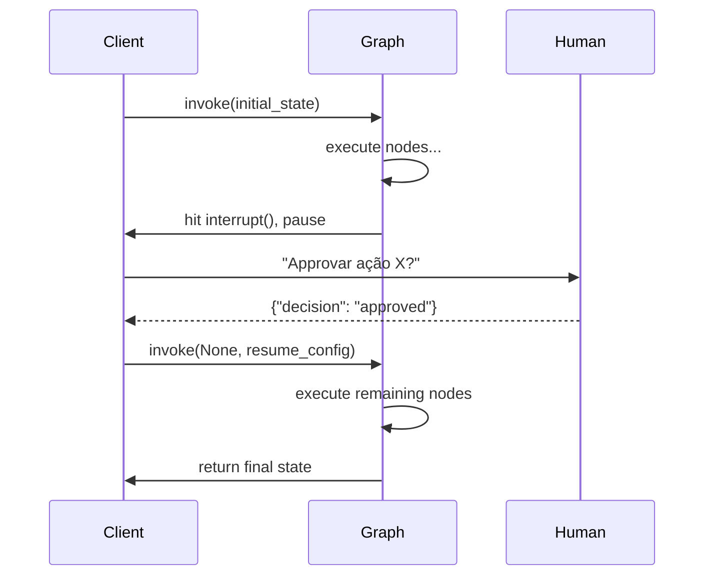
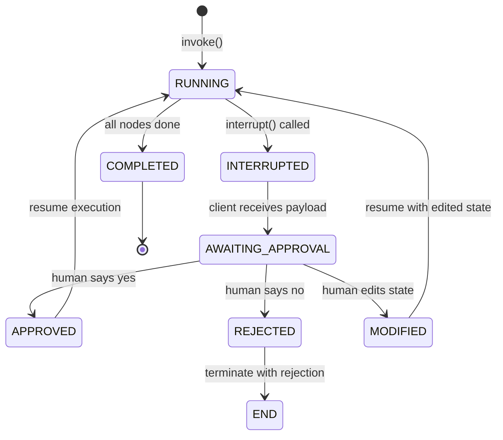
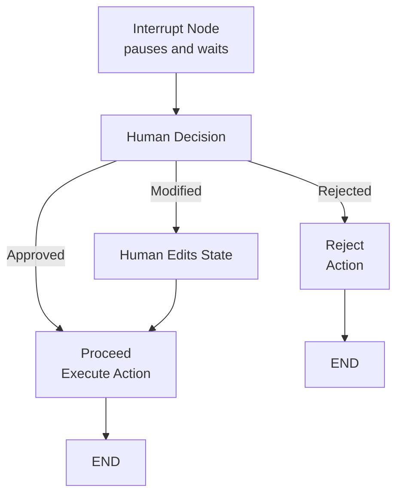

# Humano-no-Loop, Breakpoints e Controle Dinâmico

Agentes de produção frequentemente precisam de supervisão humana. LangGraph fornece **interrupções**, **breakpoints** e **atualizações dinâmicas de grafo** para pausar execução, aguardar entrada e modificar estado ou estrutura dinamicamente.

---

## Mermaid: Fluxo de Interrupção/Aprovação



O grafo executa até encontrar `interrupt()`, o cliente recebe o payload de interrupção e apresenta a um humano, então retoma com a decisão humana.

---

## Nós de Interrupção para Aprovação Humana

Um **nó de interrupção** pausa o grafo e cede o controle ao chamador. O grafo pode ser retomado depois, opcionalmente com estado modificado.

```python
from langgraph.graph import StateGraph, START, END
from langgraph.types import interrupt

def approval_node(state: AgentState) -> dict:
    # Pausa execução e pergunta pela decisão humana
    decision = interrupt({
        "question": "Aprovar esta ação?",
        "action": state["pending_action"]
    })
    if decision == "approved":
        return {"status": "approved"}
    else:
        return {"status": "rejected"}

builder.add_node("approve", approval_node)
```

[!WARNING]
A função `interrupt()` levanta uma exceção especial que pausa o grafo. O chamador **deve** capturá-la via API do cliente para ler o valor da interrupção e fornecer uma ação de retomada.

---

## Mermaid: Diagrama de Estado de Decisão HITL



A máquina de estado HITL tem múltiplos caminhos de saída da interrupção: aprovar, rejeitar ou modificar-e-continuar.

---

## Comparação: Tipos de Interrupção

| Tipo de Interrupção | Método | Escopo | Caso de Uso |
| :--- | :--- | :--- | :--- |
| Interrupção de nó | `interrupt()` dentro do nó | Pausa em ponto específico | Portão de aprovação, falhas de validação |
| `interrupt_before` | `app.invoke(interrupt_before=["node"])` | Pausa antes de um nó | Depuração, passo a passo |
| `interrupt_after` | `app.invoke(interrupt_after=["node"])` | Pausa após um nó | Verificar saída antes de prosseguir |
| Breakpoint todos nós | `app.invoke(interrupt_before=["__all__"])` | Pausa antes de cada nó | Depuração profunda, trace |

---

## Aguardando Entrada do Usuário no Meio do Grafo

Quando um grafo encontra uma interrupção, o cliente recebe os dados da interrupção e deve decidir como prosseguir.

```python
# Código do lado do cliente
from langgraph.graph import StateGraph

app = builder.compile(checkpointer=memory)

# Executa até a interrupção
config = {"configurable": {"thread_id": "t1"}}
for event in app.stream({"messages": ["Processar pagamento"]}, config):
    if "__interrupt__" in event:
        interrupt_data = event["__interrupt__"][0]
        print(interrupt_data["question"])  # "Aprovar esta ação?"

        # Retoma com decisão humana
        result = app.invoke(
            None,  # sem nova entrada, apenas retoma
            {"configurable": {"thread_id": "t1"}},
            interrupt_after={"approve": "approved"}
        )
```

[!TIP]
Você pode passar um **valor de retomada** para `interrupt()` passando-o como segundo argumento para `app.invoke()`. O valor se torna o valor de retorno de `interrupt()` dentro do nó. Por exemplo, passe `"approved"` para retomar com aprovação.

---

## Interrupção com Aprovação/Rejeição

```python
def payment_approval_node(state: AgentState) -> dict:
    """Interrupção para aprovação de pagamento com contexto completo."""
    approval_data = {
        "type": "payment_approval",
        "amount": state["payment"]["amount"],
        "recipient": state["payment"]["recipient"],
        "risk_score": state["risk_score"],
        "summary": f"Transferir ${state['payment']['amount']} para {state['payment']['recipient']}"
    }
    decision = interrupt(approval_data)

    if decision == "approved":
        return {"payment_status": "approved", "approved_by": "human"}
    elif decision == "rejected":
        return {"payment_status": "rejected", "rejection_reason": "human declined"}
    else:
        # Humano modificou o pagamento
        return {"payment": decision, "payment_status": "modified"}

# Lado do cliente: retomar com decisão
resumed = app.invoke(
    None,
    config,
    interrupt_after={"payment_approval": "approved"}
)
```

---

## Editando Estado Antes de Retomar

Você pode modificar o estado do grafo antes de retomar, efetivamente sobrescrevendo o que o agente estava prestes a fazer.

```python
# Obtém estado atual do checkpoint
state = app.get_state(config)

# Edita mensagens no estado
state.values["messages"] = state.values["messages"] + ["[Corrigido por humano]"]

# Atualiza estado e retoma
app.update_state(config, {"messages": state.values["messages"]})
result = app.invoke(None, config)
```

Este padrão é crítico para **correção humana** — o operador pode corrigir erros antes que o agente continue.

[!IMPORTANT]
Chamar `update_state()` cria um **novo checkpoint** com os valores modificados. O estado original é preservado no checkpoint anterior, então você pode sempre reverter se a correção humana introduziu novos erros.

### Segurança na Edição de Estado

```python
def safe_state_edit(app, config, edits: dict) -> dict:
    """Edita estado com segurança antes de retomar."""
    # 1. Captura estado atual
    current = app.get_state(config)
    print(f"Estado atual: {current.values}")

    # 2. Aplica edições
    for key, value in edits.items():
        if key in current.values:
            current.values[key] = value
        else:
            print(f"Aviso: chave '{key}' não está no esquema de estado")

    # 3. Atualiza e retoma
    app.update_state(config, edits)
    return app.invoke(None, config)

# Humano corrige um valor
result = safe_state_edit(app, config, {"amount": 150.00, "approved": True})
```

---

## Tratamento de Timeout com Aprovação Humana

[!WARNING]
Se um humano demorar muito para responder, a interrupção fica aberta indefinidamente. Implemente um **mecanismo de timeout** no lado do cliente para lidar com aprovações abandonadas.

```python
import asyncio

async def invoke_with_timeout(app, state, config, timeout_seconds=300):
    """Invoca grafo com timeout para humano-no-loop."""
    try:
        async for event in app.astream(state, config):
            if "__interrupt__" in event:
                print("Aguardando aprovação humana...")
                # Inicia tarefa de timeout
                try:
                    decision = await asyncio.wait_for(
                        get_human_decision(event["__interrupt__"]),
                        timeout=timeout_seconds
                    )
                    # Retoma com decisão
                    return app.invoke(None, {
                        **config,
                        "interrupt_after": decision
                    })
                except asyncio.TimeoutError:
                    # Auto-rejeita no timeout
                    print("Aprovação expirou — rejeitando")
                    return app.invoke(None, {
                        **config,
                        "interrupt_after": "rejected"
                    })
    except Exception as e:
        return {"error": str(e)}
```

---

## Atualizações Dinâmicas de Grafo

LangGraph permite adicionar ou remover nós e arestas **entre execuções** sem redefinir o grafo inteiro.

```python
# Após a primeira execução, adiciona dinamicamente um novo nó
builder.add_node("audit", lambda s: {"audit_log": s["messages"]})
builder.add_edge("process", "audit")
builder.add_edge("audit", END)

# Recompila e executa com a nova estrutura
app2 = builder.compile(checkpointer=memory)
```

Isso permite topologias de agente adaptativas onde a forma do grafo evolui com base em resultados de execuções anteriores.

[!TIP]
Atualizações dinâmicas são úteis para **divulgação progressiva** — comece com um grafo simples e adicione nós de capacidade conforme a conversa revela necessidades mais complexas.

---

## Nós de Validação

Um **nó de validação** é um guarda que verifica a integridade do estado antes que o grafo prossiga, frequentemente combinado com interrupções para correção humana.

```python
def validation_node(state: AgentState) -> dict:
    errors = []
    if not state.get("user_confirmed"):
        errors.append("Confirmação do usuário ausente")
    if state["amount"] < 0:
        errors.append("Valor negativo não permitido")

    if errors:
        # Interrompe com erros de validação
        interrupt({"errors": errors, "state": state})
    return {"validation_errors": errors}
```

### Padrão de Nó de Validação

```python
def comprehensive_validation(state: AgentState) -> dict:
    """Validação multi-campo com override humano."""
    validation_results = {"valid": True, "errors": [], "warnings": []}

    # Campos obrigatórios
    required_fields = ["user_id", "amount", "recipient"]
    for field in required_fields:
        if field not in state or state[field] is None:
            validation_results["errors"].append(f"Campo obrigatório ausente: {field}")
            validation_results["valid"] = False

    # Regras de negócio
    if state.get("amount", 0) > 10000:
        validation_results["warnings"].append(
            f"Transferência grande: ${state['amount']} — precisa de aprovação gerencial"
        )

    if not validation_results["valid"]:
        # Pausa para correção humana
        human_response = interrupt({
            "type": "validation_failure",
            "errors": validation_results["errors"],
            "warnings": validation_results["warnings"],
            "current_state": state,
        })
        return {"validation_result": human_response}

    return {"validation_result": validation_results}
```

---

## Comparação: Estratégias de Breakpoint

| Estratégia | Método | Caso de Uso |
| :--- | :--- | :--- |
| Nó de interrupção | `interrupt()` | Pausa interna para aprovação |
| Atualizar estado | `update_state()` | Corrigir ou alterar estado antes de retomar |
| Nó dinâmico | `add_node()` / `add_edge()` | Alterar topologia do grafo entre execuções |
| Validação | Nó customizado + interrupt | Validação pré-confirmação com supervisão humana |
| Tratamento de timeout | asyncio.wait_for | Auto-rejeitar aprovações abandonadas |
| Breakpoint passo a passo | `interrupt_before` / `interrupt_after` | Depuração por nó |

---

## Mermaid: Fluxo Humano-no-Loop



O grafo pausa no nó de interrupção, aguarda entrada humana e então roteia baseado na decisão.

---

```question
{
  "id": "lg-04-pt-q1",
  "type": "multiple-choice",
  "question": "Qual função o LangGraph fornece para pausar execução para entrada humana?",
  "options": ["pause()", "interrupt()", "wait()", "breakpoint()"],
  "correct": 1,
  "explanation": "A função interrupt() pausa o grafo e cede o controle ao chamador para entrada ou aprovação humana."
}
```

```question
{
  "id": "lg-04-pt-q2",
  "type": "multiple-choice",
  "question": "Como modificar o estado do grafo antes de retomar de uma interrupção?",
  "options": ["Passar um novo dicionário de estado para invoke()", "Chamar update_state() com as alterações desejadas", "Recompilar o grafo com novo estado inicial", "Definir variáveis de ambiente"],
  "correct": 1,
  "explanation": "update_state() permite alterar o estado do grafo antes de retomar a execução de uma interrupção."
}
```

```question
{
  "id": "lg-04-pt-q3",
  "type": "multiple-choice",
  "question": "O que é uma atualização dinâmica de grafo?",
  "options": ["Alterar a topologia do grafo entre execuções sem redefinir tudo", "Atualizar o esquema de estado em tempo de execução", "Substituir o manipulador de interrupção", "Modificar imports Python"],
  "correct": 0,
  "explanation": "Atualizações dinâmicas permitem adicionar ou remover nós e arestas entre execuções sem redefinir o grafo inteiro."
}
```

```question
{
  "id": "lg-04-pt-q4",
  "type": "multiple-choice",
  "question": "Qual o propósito de um nó de validação?",
  "options": ["Registrar métricas de execução", "Verificar integridade do estado antes de prosseguir, frequentemente acionando uma interrupção", "Compilar o grafo", "Executar testes unitários"],
  "correct": 1,
  "explanation": "Um nó de validação atua como guarda que verifica a integridade do estado antes do grafo prosseguir, frequentemente combinado com interrupções."
}
```

```question
{
  "id": "lg-04-pt-q5",
  "type": "multiple-choice",
  "question": "Qual chamada de API é usada para retomar um grafo após uma interrupção?",
  "options": ["app.resume()", "app.continue()", "app.invoke() com a mesma configuração", "app.restart()"],
  "correct": 2,
  "explanation": "Após uma interrupção, o grafo é retomado chamando app.invoke() com a mesma configuração de thread."
}
```

```question
{
  "id": "lg-04-pt-q6",
  "type": "multiple-choice",
  "question": "Cenário: Um agente de processamento de pagamento atinge interrupt() pedindo aprovação. O humano percebe que o valor está errado. Como proceder?",
  "options": ["Rejeitar e reiniciar a conversa inteira", "Usar update_state() para corrigir o valor, depois retomar com invoke()", "Ignorar a interrupção", "Matar o processo"],
  "correct": 1,
  "explanation": "O operador deve usar app.update_state() para corrigir o valor, depois app.invoke(None, config) para retomar com o estado corrigido."
}
```

```question
{
  "id": "lg-04-pt-q7",
  "type": "multiple-choice",
  "question": "O que acontece se um humano nunca responder a uma interrupção?",
  "options": ["O grafo retoma automaticamente após 30 segundos", "A interrupção permanece aberta indefinidamente a menos que o cliente trate timeout", "O grafo levanta uma exceção", "O estado é coletado como lixo"],
  "correct": 1,
  "explanation": "Interrupções persistem indefinidamente até que o cliente retome via invoke(). Implemente tratamento de timeout no lado do cliente para produção."
}
```

---

[!SUCCESS]
### Principais Conclusões
- `interrupt()` pausa o grafo e retorna o controle ao chamador.
- Após uma interrupção, o cliente pode inspecionar, modificar estado e retomar via `invoke()`.
- `update_state()` permite correções de estado antes de retomar a execução.
- Atualizações dinâmicas de grafo permitem adicionar nós/arestas entre execuções.
- Nós de validação combinados com interrupções criam salvaguardas para agentes de produção.
- O padrão humano-no-loop é essencial para sistemas de agente confiáveis e auditáveis.
- Breakpoints podem ser inseridos em nós específicos ou em todo nó para depuração.
- Implemente tratamento de timeout para HITL em produção para evitar interrupções abandonadas.
- Use `interrupt_before` e `interrupt_after` para depuração passo a passo.
- Edição de estado cria novos checkpoints — o estado original é sempre recuperável.
