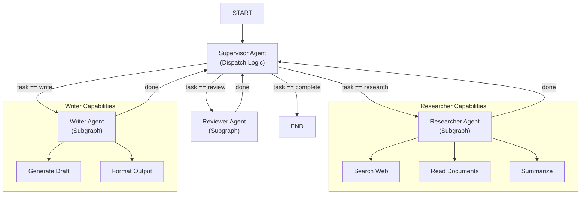
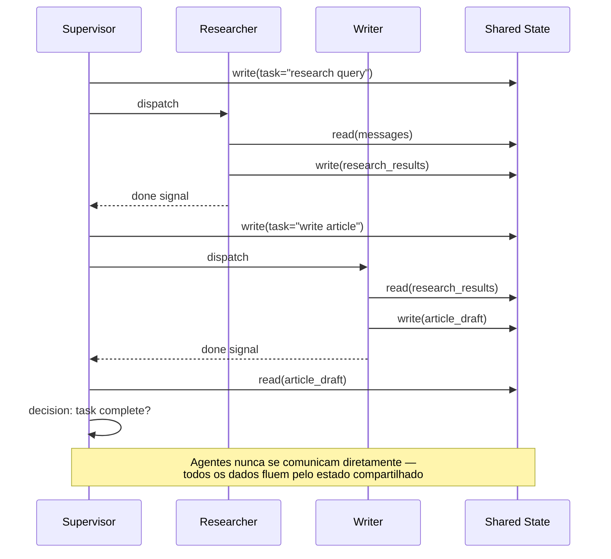
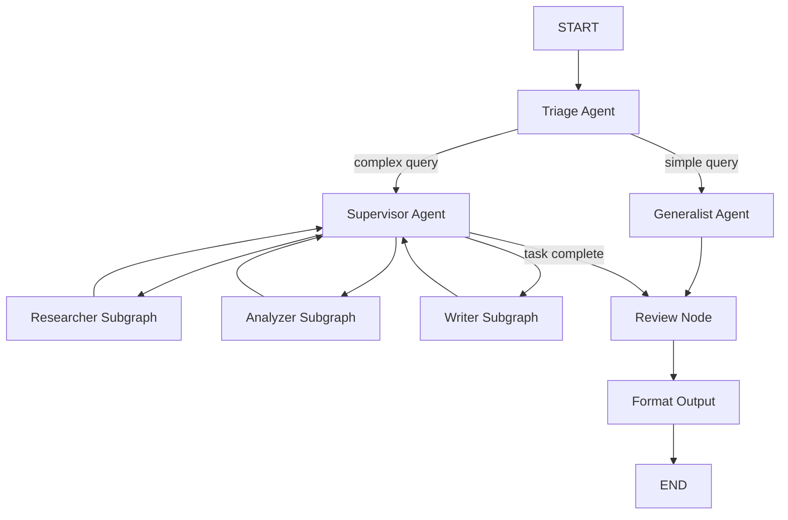

# Orquestração Multi-Agente e Subgrafos

Sistemas de agente do mundo real raramente usam um único agente. LangGraph permite compor **subgrafos** em grafos maiores, orquestrar múltiplos agentes com um **supervisor** e permitir comunicação através de estado compartilhado.

---

## Mermaid: Arquitetura de Agente Supervisor



O supervisor fica no centro, despachando tarefas para subgrafos especializados. Cada subgrafo encapsula suas próprias ferramentas, nós e gerenciamento de estado.

---

## Compondo Subgrafos em Grafos Pai

Um subgrafo é um `StateGraph` totalmente compilado que pode ser adicionado como um nó em um grafo pai. O grafo pai passa estado para o subgrafo e recebe estado atualizado após a conclusão.

```python
from langgraph.graph import StateGraph, START, END

# Define um subgrafo
sub_builder = StateGraph(AgentState)
sub_builder.add_node("sub_task", lambda s: {"messages": s["messages"] + ["Sub feito"]})
sub_builder.add_edge(START, "sub_task")
sub_builder.add_edge("sub_task", END)
subgraph = sub_builder.compile()

# Define o grafo pai
parent_builder = StateGraph(AgentState)
parent_builder.add_node("preprocess", preprocess_node)
parent_builder.add_node("subgraph", subgraph)  # subgrafo como nó
parent_builder.add_node("postprocess", postprocess_node)

parent_builder.add_edge(START, "preprocess")
parent_builder.add_edge("preprocess", "subgraph")
parent_builder.add_edge("subgraph", "postprocess")
parent_builder.add_edge("postprocess", END)

parent_app = parent_builder.compile()
```

[!WARNING]
Subgrafos usam seu **próprio esquema de estado**. O pai deve passar um dicionário de estado compatível. Se os esquemas diferirem, mapeie os campos explicitamente no wrapper do nó.

### Mapeamento de Estado de Subgrafo

```python
def subgraph_wrapper(state: ParentState) -> dict:
    """Mapeia estado pai para esquema do subgrafo e vice-versa."""
    # Transforma estado pai para formato compatível com subgrafo
    sub_state = {
        "messages": state["conversation_history"],  # campo renomeado
        "config": state["settings"],
        "task": state["current_task"],
    }
    # O nó subgrafo recebe e retorna sub_state
    return sub_state
```

---

## Mermaid: Comunicação Agente-para-Agente



Agentes se comunicam exclusivamente através do estado compartilhado. Isso desacopla os agentes, tornando o sistema mais fácil de depurar, testar e estender.

---

## Comunicação entre Agentes via Estado Compartilhado

Múltiplos agentes no mesmo grafo se comunicam através do estado compartilhado. Cada agente lê mensagens, processa e anexa resultados para o próximo agente.

```python
def researcher_agent(state: AgentState) -> dict:
    # Lê estado compartilhado, produz pesquisa
    query = state["messages"][-1]
    research = f"Descobertas sobre: {query}"
    return {"messages": state["messages"] + [f"[Pesquisador]: {research}"]}

def writer_agent(state: AgentState) -> dict:
    # Lê pesquisa do estado, escreve saída
    last_msg = state["messages"][-1]
    article = f"Rascunho baseado em: {last_msg}"
    return {"messages": state["messages"] + [f"[Escritor]: {article}"]}

builder.add_node("researcher", researcher_agent)
builder.add_node("writer", writer_agent)
builder.add_edge(START, "researcher")
builder.add_edge("researcher", "writer")
builder.add_edge("writer", END)
```

[!TIP]
Projete o estado compartilhado como um **barramento de mensagens**. Cada agente anexa a uma lista `messages`, criando um trace auditável da saída de cada agente. Isso torna a depuração trivial — você pode reproduzir a conversa e ver exatamente o que cada agente produziu.

---

## Padrão de Agente Supervisor

Um **agente supervisor** é um nó especial que decide qual agente subordinado deve executar em seguida. Ele inspeciona o estado compartilhado e emite comandos de roteamento.

```python
def supervisor_agent(state: AgentState) -> dict:
    # Decide qual agente rotear a seguir
    if state.get("task_complete"):
        return {"next_agent": "FINISH"}
    if "research" in state["task_type"]:
        return {"next_agent": "researcher"}
    return {"next_agent": "writer"}

# Roteia baseado na decisão do supervisor
builder.add_conditional_edges(
    "supervisor",
    lambda s: s["next_agent"],
    {
        "researcher": "researcher",
        "writer": "writer",
        "FINISH": END,
    }
)
```

### Roteamento Supervisor com LLM

```python
from langchain.chat_models import ChatOpenAI

llm = ChatOpenAI(model="gpt-4")

def llm_supervisor(state: AgentState) -> dict:
    """Usa um LLM para decidir o próximo agente."""
    agents = ["researcher", "writer", "reviewer", "FINISH"]
    prompt = f"""
    Tarefa atual: {state['task']}
    Progresso: {state['messages'][-3:]}
    Agentes disponíveis: {', '.join(agents)}
    Qual agente deve executar em seguida?
    """
    response = llm.invoke(prompt)
    next_agent = response.content.strip()

    # Valida a escolha do LLM
    if next_agent not in agents:
        next_agent = "FINISH"  # fallback seguro

    return {"next_agent": next_agent}
```

---

## Roteamento entre Agentes

O loop orientado pelo supervisor continua até que `FINISH` seja selecionado. Cada subordinado reporta de volta ao supervisor após completar seu trabalho.

```python
# Após pesquisador terminar, retorna ao supervisor
builder.add_edge("researcher", "supervisor")
# Após escritor terminar, retorna ao supervisor
builder.add_edge("writer", "supervisor")

# Começa com supervisor
builder.add_edge(START, "supervisor")
```

Isso cria um **loop re-entrante** onde o supervisor continua despachando até que a tarefa esteja concluída.

---

## Padrões de Transferência de Agente

```python
def handoff_agent(state: AgentState) -> dict:
    """Transfere para outro agente com contexto."""
    return {
        "messages": state["messages"] + [
            "[Transferência]: Transferindo para agente especialista"
        ],
        "current_agent": "specialist",
        "handoff_context": {
            "original_query": state["messages"][0],
            "processing_summary": state.get("processing_summary", ""),
        }
    }

# Transferência dispara uma aresta condicional
builder.add_conditional_edges(
    "triage_agent",
    lambda s: s["current_agent"],
    {
        "generalist": "generalist",
        "specialist": "specialist",
        "FINISH": END,
    }
)
```

---

## Composição de Subgrafos

```python
# Subgrafo especialista com suas próprias ferramentas
specialist_builder = StateGraph(AgentState)
specialist_builder.add_node("analyze", analyze_tool)
specialist_builder.add_node("recommend", recommend_tool)
specialist_builder.add_edge(START, "analyze")
specialist_builder.add_edge("analyze", "recommend")
specialist_builder.add_edge("recommend", END)
specialist_subgraph = specialist_builder.compile()

# Compõe no pai
parent = StateGraph(AgentState)
parent.add_node("triage", triage_agent)
parent.add_node("specialist", specialist_subgraph)
parent.add_edge(START, "triage")
parent.add_conditional_edges("triage", router, {
    "specialist": "specialist",
    "FINISH": END,
})
parent.add_edge("specialist", END)
```

### Comparação: Padrões de Subgrafo

| Padrão | Estrutura | Compartilhamento de Estado | Melhor Para |
| :--- | :--- | :--- | :--- |
| Composição plana | Todos nós em um grafo | Estado compartilhado total | Agentes multi-passo simples |
| Subgrafo hierárquico | Pai + subgrafos aninhados | Camada de mapeamento de esquema | Capacidades encapsuladas |
| Loop de supervisor | Roteador central + workers | Fila de tarefas no estado | Orquestração complexa |
| Subgrafo pipeline | Cadeia sequencial de subgrafos | Estado pass-through | Processamento multi-estágio |
| Subgrafos paralelos | Múltiplos subgrafos em paralelo | Estado específico de ramo | Subtarefas independentes |

---

## Agentes com Chamada de Ferramentas

Agentes podem chamar ferramentas externas. Ferramentas são registradas como nós ou como funções disponíveis para um nó de agente alimentado por LLM.

```python
from langchain.tools import tool

@tool
def search_web(query: str) -> str:
    """Pesquisar na web por informações."""
    return f"Resultados web para {query}"

@tool
def calculate(expression: str) -> str:
    """Avaliar uma expressão matemática."""
    return str(eval(expression))

# Nó de agente com chamada de ferramenta
def tool_agent(state: AgentState) -> dict:
    # LLM decide qual ferramenta chamar baseado no estado
    if "calcular" in state["messages"][-1]:
        result = calculate.invoke({"expression": "2 + 2"})
    else:
        result = search_web.invoke({"query": state["messages"][-1]})
    return {"messages": state["messages"] + [f"[Ferramenta]: {result}"]}
```

### Agente com Ferramenta Estruturada

```python
from typing import Any, Dict, List
from langchain.tools import StructuredTool

def database_query(table: str, filters: Dict[str, Any]) -> List[Dict]:
    """Consulta uma tabela de banco de dados com filtros."""
    # Consulta simulada
    return [{"id": 1, "name": "Amostra"}]

query_tool = StructuredTool.from_function(
    func=database_query,
    name="database_query",
    description="Consultar o banco de dados com nome da tabela e filtros"
)

def structured_tool_agent(state: AgentState) -> dict:
    """Agente que usa ferramentas estruturadas com parâmetros tipados."""
    result = query_tool.invoke({
        "table": "customers",
        "filters": {"status": "active", "limit": 10}
    })
    return {"messages": state["messages"] + [f"[DB Query]: {len(result)} registros"]}
```

---

## Design de Estado Compartilhado

[!TIP]
Projete seu estado compartilhado para incluir um **campo de comunicação dedicado** (ex.: `messages` ou `interactions`) que todos os agentes possam ler e anexar. Mantenha dados específicos de agente em chaves com namespace (ex.: `research_agent.output`, `writer_agent.draft`) para evitar colisões de chave.

```python
class MultiAgentState(TypedDict):
    # Canal de comunicação compartilhado
    messages: List[str]

    # Roteamento do supervisor
    next_agent: str
    task_complete: bool

    # Saídas específicas de agente com namespace
    research_output: str
    writer_draft: str
    reviewer_feedback: str

    # Contexto compartilhado
    original_query: str
    task_type: str
    loop_count: int  # previne loops infinitos
```

---

## Limites de Permissão de Subgrafo

[!WARNING]
Subgrafos não podem acessar os nós ou estado do pai diretamente — eles veem apenas o estado passado a eles. Esta é uma **fronteira de segurança**: um subgrafo não pode modificar o estado do pai arbitrariamente. Use mapeamento de estado explícito para controlar o que cada subgrafo pode ler e escrever.

---

## Comparação: Estratégias de Comunicação

| Estratégia | Mecanismo | Acoplamento | Depuração | Caso de Uso |
| :--- | :--- | :--- | :--- | :--- |
| Estado compartilhado | `state["messages"]` | Solto (via esquema) | Fácil — reproduzir estado | Maioria dos agentes |
| Chaves com namespace | `state["agent_name.field"]` | Solto | Fácil — traços por agente | Multi-agente com saídas |
| Mapeamento I/O subgrafo | Mapeamento explícito de campos | Solto | Moderado — verificar mapeamento | Composição de subgrafos |
| Chamada direta de função | Chamar outro nó diretamente | Apertado | Difícil — dependência oculta | Não recomendado |
| Padrão barramento mensagens | Mensagens append-only | Muito solto | Trivial — histórico completo | Orquestrações supervisor |

---

## Mermaid: Fluxo de Orquestração Completo



---

```question
{
  "id": "lg-05-pt-q1",
  "type": "multiple-choice",
  "question": "Como adicionar um subgrafo como nó em um grafo pai?",
  "options": ["parent.add_node(\"nome\", subgraph)", "parent.attach(subgraph)", "parent.include(subgraph)", "parent.merge(subgraph)"],
  "correct": 0,
  "explanation": "Um StateGraph totalmente compilado (subgrafo) pode ser adicionado como nó usando add_node() como qualquer nó regular."
}
```

```question
{
  "id": "lg-05-pt-q2",
  "type": "multiple-choice",
  "question": "Qual o papel de um agente supervisor no LangGraph?",
  "options": ["Executar todas as tarefas ele mesmo", "Decidir qual agente subordinado deve executar em seguida", "Compilar o grafo", "Gerenciar conexões de banco de dados"],
  "correct": 1,
  "explanation": "Um agente supervisor inspeciona o estado compartilhado e decide qual agente subordinado executar em seguida, roteando dinamicamente."
}
```

```question
{
  "id": "lg-05-pt-q3",
  "type": "multiple-choice",
  "question": "Como múltiplos agentes se comunicam no LangGraph?",
  "options": ["Via requisições HTTP", "Através do estado compartilhado do grafo", "Escrevendo em arquivos", "Usando sockets Unix"],
  "correct": 1,
  "explanation": "Múltiplos agentes no mesmo grafo se comunicam através do estado tipado compartilhado entre nós."
}
```

```question
{
  "id": "lg-05-pt-q4",
  "type": "multiple-choice",
  "question": "O que cria um loop re-entrante no padrão supervisor?",
  "options": ["Agentes subordinados retornando ao supervisor após o trabalho", "Adicionando arestas paralelas", "Usando MemorySaver", "Chamando interrupt()"],
  "correct": 0,
  "explanation": "Cada agente subordinado retorna o controle ao supervisor após completar seu trabalho, criando um loop até a tarefa estar concluída."
}
```

```question
{
  "id": "lg-05-pt-q5",
  "type": "multiple-choice",
  "question": "Qual NÃO é um padrão típico de orquestração no LangGraph?",
  "options": ["Sequencial", "Loop de supervisor", "Pub/sub orientado a eventos", "Chamada de ferramentas"],
  "correct": 2,
  "explanation": "Pub/sub orientado a eventos não é um padrão típico de orquestração no LangGraph; padrões suportados incluem sequencial, supervisor, subgrafo e chamada de ferramentas."
}
```

```question
{
  "id": "lg-05-pt-q6",
  "type": "multiple-choice",
  "question": "Cenário: Você tem um agente de pesquisa que produz saída que o agente escritor precisa. Como os dados devem fluir?",
  "options": ["Agente de pesquisa chama agente escritor diretamente", "Pesquisa escreve no estado compartilhado, supervisor roteia para escritor", "Ambos agentes usam bancos de dados separados", "Agente escritor refaz a pesquisa"],
  "correct": 1,
  "explanation": "O pesquisador escreve descobertas no estado compartilhado, então o supervisor roteia o escritor para ler do estado e produzir saída."
}
```

```question
{
  "id": "lg-05-pt-q7",
  "type": "multiple-choice",
  "question": "Qual é a implicação de segurança dos limites de estado de subgrafo?",
  "options": ["Subgrafos podem ler qualquer estado do pai", "Subgrafos veem apenas o estado explicitamente passado a eles", "Subgrafos podem modificar nós do pai", "Não há limites"],
  "correct": 1,
  "explanation": "Subgrafos veem e operam apenas no estado explicitamente passado a eles, fornecendo uma fronteira de permissão natural."
}
```

---

[!SUCCESS]
### Principais Conclusões
- Subgrafos são StateGraphs compilados adicionados como nós em um grafo pai.
- Múltiplos agentes se comunicam através do estado tipado compartilhado entre nós.
- O padrão de supervisor usa um despachante central que roteia para agentes subordinados.
- Agentes subordinados retornam o controle ao supervisor, criando um loop até a conclusão.
- Agentes com chamada de ferramentas integram funções externas (APIs, calculadoras, busca).
- Subgrafos encapsulam capacidades e podem ser reutilizados em diferentes grafos pai.
- LangGraph suporta orquestração sequencial, supervisor, subgrafo, chamada de ferramentas e paralela.
- Projete estado compartilhado com chaves com namespace para evitar colisões de saída de agente.
- Limites de estado de subgrafo fornecem isolamento de segurança natural.
- Use o padrão de barramento de mensagens (mensagens append-only) para auditabilidade completa.
