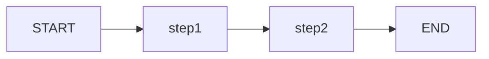

# State, Graphs, and StateGraph

LangGraph is built around the concept of a **stateful directed graph**. Understanding how StateGraph works is essential before writing any agent code.

---

## What is a StateGraph?

`StateGraph` is the primary class for building LangGraph applications. It manages:

- A **type schema** that defines the shape of state
- A collection of **nodes** that process and update state
- A set of **edges** that define the execution topology
- **Compilation** that validates and freezes the graph

```python
from langgraph.graph import StateGraph, START, END
from typing_extensions import TypedDict

class SearchState(TypedDict):
    query: str
    results: list[str]
    status: str

builder = StateGraph(SearchState)
```

[!IMPORTANT]
Always use `StateGraph` over the basic `Graph` class. `StateGraph` provides typed state, checkpointing, and all production features. The basic `Graph` class is deprecated for most use cases.

---

## State Schema

The **State** is a dictionary that flows through every node. It is defined using `TypedDict`, `dataclass`, or `pydantic.BaseModel`.

### TypedDict (Recommended for Beginners)

```python
from typing_extensions import TypedDict
from typing import List, Optional

class AgentState(TypedDict):
    messages: List[str]
    turn_count: int
    is_complete: bool
    final_answer: Optional[str]
```

Every node in the graph receives a dict matching this schema and returns a **partial dict** with only the keys it wants to update.

```python
def first_node(state: AgentState) -> dict:
    # Read from state
    current_turn = state["turn_count"]

    # Return only the updates
    return {
        "messages": state["messages"] + ["Hello from node 1"],
        "turn_count": current_turn + 1
        # is_complete and final_answer are unchanged
    }
```

### Dataclass State

```python
from dataclasses import dataclass, field
from typing import List

@dataclass
class AgentState:
    messages: List[str] = field(default_factory=list)
    turn_count: int = 0
    is_complete: bool = False
```

[!NOTE]
Dataclasses give you default values and mutable state. Use `field(default_factory=...)` for mutable defaults like lists.

### Pydantic BaseModel State

```python
from pydantic import BaseModel, Field
from typing import List

class AgentState(BaseModel):
    messages: List[str] = Field(default_factory=list)
    turn_count: int = 0
    is_complete: bool = False
```

[!TIP]
Use `TypedDict` for prototyping (minimal boilerplate). Use `BaseModel` for production (validation, serialization, JSON schema). All three approaches work identically at the graph level.

---

## How State Flows Through the Graph

```
Initial State → Node A → (updates state) → Node B → (updates state) → Final State
                    ↑                                               |
                    └─────────── (loop back to A) ──────────────────┘
```

Each node:
1. **Receives** the complete current state as a dict
2. **Processes** the data (calls LLM, runs tools, etc.)
3. **Returns** a partial dict of updates
4. LangGraph **merges** the updates into the shared state

### State Merging Rules

| Return Value | Behavior |
| :--- | :--- |
| `{"key": "value"}` | Updates `state["key"]` to `"value"` |
| `{"key": state["key"] + ["new"]}` | Replaces `state["key"]` with new list |
| `return None` | No changes to state |
| `return {}` | No changes to state |

[!WARNING]
State updates use a **shallow merge**. If state has nested dicts, returning `{"nested": {"inner": 1}}` replaces the entire `nested` key — it does not deep-merge. For deep merges, you need custom reducers (covered in the Intermediate course).

---

## Nodes

Nodes are the processing units of a graph. A node is simply a Python function that receives state and returns updates.

### Function Signature

```python
def node_function(state: StateType) -> dict:
    # Process state
    # Return updates
    return {"key": new_value}
```

### Node Registration

```python
builder = StateGraph(AgentState)

builder.add_node("process", node_function)
#                   ^name    ^function reference
```

[!TIP]
Node names must be unique. Use descriptive names like `"analyze_query"`, `"search_database"`, `"generate_response"` rather than `"node1"`, `"node2"`.

### Nodes with Config

```python
def node_with_config(state: StateType, config: dict) -> dict:
    # Access configurable parameters
    user_id = config.get("configurable", {}).get("user_id")
    return {"processed": True}

builder.add_node("configurable", node_with_config)
```

### Nodes with Extra Keyword Arguments

```python
from langgraph.graph import StateGraph

def node_with_kwargs(state: StateType, **kwargs) -> dict:
    # kwargs contains additional runtime parameters
    return {"received": kwargs.get("extra_param", "default")}
```

---

## Edges

Edges connect nodes and define the execution path.

### Basic Edge

```python
# After node A finishes, run node B
builder.add_edge("A", "B")
```

### Entry Point

```python
# Mark the starting node
builder.set_entry_point("A")

# Or using the START constant
from langgraph.graph import START
builder.add_edge(START, "A")
```

### Finish Point

```python
# Mark the ending node
builder.set_finish_point("C")

# Or using the END constant
from langgraph.graph import END
builder.add_edge("C", END)
```

[!NOTE]
Using `START` and `END` constants is the modern approach. They are available from `langgraph.graph` and make the graph definition more readable.

---

## Compilation

Compilation validates the graph structure and produces a runnable object.

```python
# Compile the graph
app = builder.compile()

# The graph is now frozen — no more nodes or edges can be added
```

### What Compilation Does

1. **Validates** that all referenced nodes exist
2. **Checks** for unreachable nodes (no incoming edge)
3. **Verifies** the graph is connected (every node reachable from START)
4. **Freezes** the topology so it can be invoked efficiently
5. **Prepares** checkpointers if configured

### Invocation

```python
# Invoke with initial state
result = app.invoke({
    "messages": [],
    "turn_count": 0,
    "is_complete": False,
    "final_answer": None
})

# Access the final state
print(result["messages"])
print(result["turn_count"])
```

### Streaming

```python
# Stream to see intermediate states
for event in app.stream({
    "messages": [],
    "turn_count": 0,
    "is_complete": False,
    "final_answer": None
}):
    for node_name, state_update in event.items():
        if node_name != "__end__":
            print(f"[{node_name}]: {state_update}")
```

---

## Complete Minimal Example

```python
from langgraph.graph import StateGraph, START, END
from typing_extensions import TypedDict

class MyState(TypedDict):
    value: str
    step_count: int

def step_one(state: MyState) -> dict:
    print("Step 1")
    return {
        "value": f"Processed: {state['value']}",
        "step_count": state["step_count"] + 1
    }

def step_two(state: MyState) -> dict:
    print("Step 2")
    return {
        "value": f"Final: {state['value']}",
        "step_count": state["step_count"] + 1
    }

# Build
builder = StateGraph(MyState)
builder.add_node("step1", step_one)
builder.add_node("step2", step_two)
builder.add_edge(START, "step1")
builder.add_edge("step1", "step2")
builder.add_edge("step2", END)

# Compile
app = builder.compile()

# Run
result = app.invoke({"value": "hello", "step_count": 0})
print(result["value"])       # Final: Processed: hello
print(result["step_count"])  # 2
```

[!SUCCESS]
This pattern — define state, add nodes, add edges, compile, invoke — is the foundation of every LangGraph application. Every agent you build will follow these five steps.

---

## Visualizing the Graph

LangGraph supports generating Mermaid diagrams from compiled graphs:

```python
# Get the Mermaid diagram as a string
mermaid_code = app.get_graph().draw_mermaid()
print(mermaid_code)

# Save to file
with open("graph.md", "w") as f:
    f.write(app.get_graph().draw_mermaid())
```

Output Mermaid:



[!TIP]
Use `app.get_graph().draw_mermaid()` during development to verify your graph topology matches your design.

---

## Error Handling at Graph Level

```python
from langgraph.errors import GraphRecursionError

try:
    result = app.invoke(initial_state, {"recursion_limit": 10})
except GraphRecursionError:
    print("Graph hit recursion limit — possible infinite loop")
except Exception as e:
    print(f"Graph execution failed: {e}")
```

[!WARNING]
Always set a `recursion_limit` for graphs with loops. The default is usually 25 steps. Without it, a buggy conditional edge can cause an infinite loop.

---

## Practice Questions

```question
{
  "id": "lg-beginner-03-q1",
  "type": "multiple-choice",
  "question": "What does a node function in LangGraph receive and return?",
  "options": [
    "Receives the full state dict, returns a partial update dict",
    "Receives a single value, returns a single value",
    "Receives nothing, returns the full state",
    "Receives the previous node's output, returns next node's input"
  ],
  "correct": 0,
  "explanation": "Each node receives the complete current state and returns a partial dict of updates that LangGraph merges into the shared state."
}
```

```question
{
  "id": "lg-beginner-03-q2",
  "type": "multiple-choice",
  "question": "What does the compile() method do?",
  "options": [
    "Validates and freezes the graph into a runnable object",
    "Deploys the graph to the cloud",
    "Generates Python code from the graph definition",
    "Optimizes the graph for faster execution"
  ],
  "correct": 0,
  "explanation": "compile() validates the graph structure, checks connectivity, freezes the topology, and returns a CompiledGraph ready for invocation."
}
```

```question
{
  "id": "lg-beginner-03-q3",
  "type": "multiple-choice",
  "question": "Which of the following is a valid way to define state in LangGraph?",
  "options": ["TypedDict", "dataclass", "pydantic.BaseModel", "All of the above"],
  "correct": 3,
  "explanation": "LangGraph supports TypedDict, dataclass, and pydantic.BaseModel for state definition."
}
```

```question
{
  "id": "lg-beginner-03-q4",
  "type": "multiple-choice",
  "question": "What does set_entry_point() do?",
  "options": [
    "Specifies which node runs last",
    "Specifies which node runs first",
    "Defines a conditional routing function",
    "Sets up logging for the graph"
  ],
  "correct": 1,
  "explanation": "set_entry_point() (or add_edge(START, node)) marks which node executes first when the graph is invoked."
}
```

```question
{
  "id": "lg-beginner-03-q5",
  "type": "multiple-choice",
  "question": "What happens if a node function returns None?",
  "options": [
    "The graph raises an error",
    "The node is skipped in the execution",
    "No changes are made to the state",
    "The state is reset to initial values"
  ],
  "correct": 2,
  "explanation": "If a node returns None, no state updates are applied. The state passes through unchanged to the next node."
}
```

```question
{
  "id": "lg-beginner-03-q6",
  "type": "multiple-choice",
  "question": "What is the purpose of the START constant?",
  "options": [
    "It marks the first node to execute",
    "It triggers debug mode",
    "It resets the state",
    "It defines the graph name"
  ],
  "correct": 0,
  "explanation": "START is a special node constant used with add_edge() to define where execution begins."
}
```

```question
{
  "id": "lg-beginner-03-q7",
  "type": "multiple-choice",
  "question": "How does LangGraph merge state updates from a node?",
  "options": [
    "Deep merges nested dictionaries",
    "Shallow merges — replaces top-level keys",
    "Appends to all list values",
    "Overwrites the entire state"
  ],
  "correct": 1,
  "explanation": "LangGraph performs a shallow merge. Returning {\"key\": value} replaces state[\"key\"]. Nested structures are replaced, not deep-merged."
}
```

```question
{
  "id": "lg-beginner-03-q8",
  "type": "multiple-choice",
  "question": "Can you add nodes to a compiled graph?",
  "options": [
    "Yes, any time",
    "No, compilation freezes the graph definition",
    "Only if you use the update_graph() method",
    "Yes, but only before the first invocation"
  ],
  "correct": 1,
  "explanation": "After compile(), the graph is frozen. You must rebuild the builder to add nodes or edges."
}
```

```question
{
  "id": "lg-beginner-03-q9",
  "type": "multiple-choice",
  "question": "What does recursion_limit control?",
  "options": [
    "The depth of nested dictionary state",
    "The maximum number of node executions before stopping",
    "The number of parallel threads",
    "The number of edges in the graph"
  ],
  "correct": 1,
  "explanation": "recursion_limit sets a cap on total node executions to prevent infinite loops. Default is typically 25."
}
```

```question
{
  "id": "lg-beginner-03-q10",
  "type": "multiple-choice",
  "question": "What tool does LangGraph provide for visualizing graph structure?",
  "options": [
    "graphviz",
    "draw_mermaid() on the compiled graph",
    "matplotlib",
    "networkx visualization"
  ],
  "correct": 1,
  "explanation": "compiled_graph.get_graph().draw_mermaid() generates a Mermaid diagram of the graph topology."
}
```

---

[!SUCCESS]
### Key Takeaways
- StateGraph is the core class; it manages typed state, nodes, edges, and compilation
- State is a dict defined with TypedDict, dataclass, or BaseModel
- Nodes are functions that receive the full state and return partial updates
- Edges (add_edge, START, END) define the execution topology
- compile() validates and freezes the graph into a runnable object
- invoke() runs the graph; stream() shows intermediate states
- State updates use shallow merge — top-level keys are replaced
- Always set recursion_limit for graphs with loops
- Use get_graph().draw_mermaid() to visualize your graph
